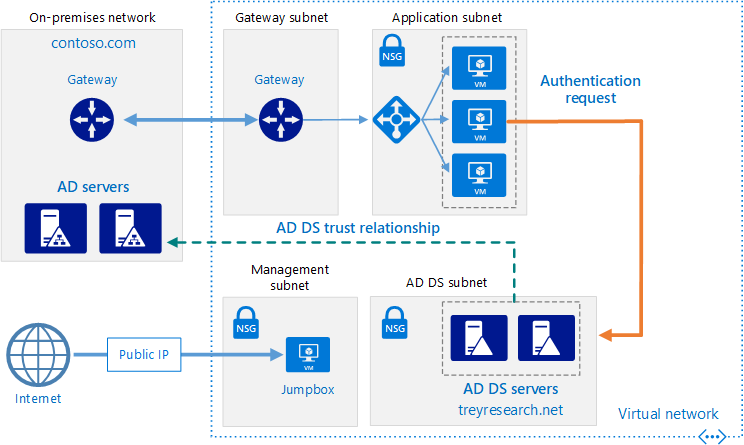
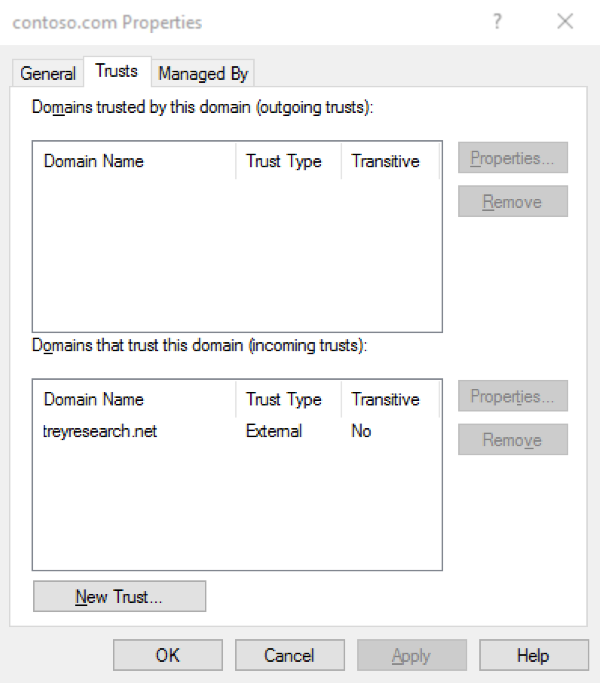

# Create an Active Directory Domain Services (AD DS) resource forest in Azure

This reference architecture shows how to create a separate Active Directory domain in Azure that is trusted by domains in your on-premises AD forest. [**Deploy this solution**](#deploy-the-solution).



*Download a [Visio file][visio-download] of this architecture.*

Active Directory Domain Services (AD DS) stores identity information in a hierarchical structure. The top node in the hierarchical structure is known as a forest. A forest contains domains, and domains contain other types of objects. This reference architecture creates an AD DS forest in Azure with a one-way outgoing trust relationship with an on-premises domain. The forest in Azure contains a domain that does not exist on-premises. Because of the trust relationship, logons made against on-premises domains can be trusted for access to resources in the separate Azure domain.

Typical uses for this architecture include maintaining security separation for objects and identities held in the cloud, and migrating individual domains from on-premises to the cloud.

For additional considerations, see [Choose a solution for integrating on-premises Active Directory with Azure][considerations].

## Architecture

The architecture has the following components.

- **On-premises network**. The on-premises network contains its own Active Directory forest and domains.
- **Active Directory servers**. These are domain controllers implementing domain services running as VMs in the cloud. These servers host a forest containing one or more domains, separate from those located on-premises.
- **One-way trust relationship**. The example in the diagram shows a one-way trust from the domain in Azure to the on-premises domain. This relationship enables on-premises users to access resources in the domain in Azure, but not the other way around. It is possible to create a two-way trust if cloud users also require access to on-premises resources.
- **Active Directory subnet**. The AD DS servers are hosted in a separate subnet. Network security group (NSG) rules protect the AD DS servers and provide a firewall against traffic from unexpected sources.
- **Azure gateway**. The Azure gateway provides a connection between the on-premises network and the Azure VNet. This can be a [VPN connection][azure-vpn-gateway] or [Azure ExpressRoute][azure-expressroute]. For more information, see [Connect an on-premises network to Azure using a VPN gateway](../hybrid-networking/vpn.md).

## Recommendations

For specific recommendations on implementing Active Directory in Azure, see [Extending Active Directory Domain Services (AD DS) to Azure][adds-extend-domain].

### Trust

The on-premises domains are contained within a different forest from the domains in the cloud. To enable authentication of on-premises users in the cloud, the domains in Azure must trust the logon domain in the on-premises forest. Similarly, if the cloud provides a logon domain for external users, it may be necessary for the on-premises forest to trust the cloud domain.

You can establish trusts at the forest level by [creating forest trusts][creating-forest-trusts], or at the domain level by [creating external trusts][creating-external-trusts]. A forest level trust creates a relationship between all domains in two forests. An external domain level trust only creates a relationship between two specified domains. You should only create external domain level trusts between domains in different forests.

Trusts can be unidirectional (one-way) or bidirectional (two-way):

- A one-way trust enables users in one domain or forest (known as the *incoming* domain or forest) to access the resources held in another (the *outgoing* domain or forest).
- A two-way trust enables users in either domain or forest to access resources held in the other.

The following table summarizes trust configurations for some simple scenarios:

| Scenario | On-premises trust | Cloud trust |
| --- | --- | --- |
| On-premises users require access to resources in the cloud, but not vice versa |One-way, incoming |One-way, outgoing |
| Users in the cloud require access to resources located on-premises, but not vice versa |One-way, outgoing |One-way, incoming |
| Users in the cloud and on-premises both requires access to resources held in the cloud and on-premises |Two-way, incoming and outgoing |Two-way, incoming and outgoing |

## Scalability considerations

Active Directory is automatically scalable for domain controllers that are part of the same domain. Requests are distributed across all controllers within a domain. You can add another domain controller, and it synchronizes automatically with the domain. Do not configure a separate load balancer to direct traffic to controllers within the domain. Ensure that all domain controllers have sufficient memory and storage resources to handle the domain database. Make all domain controller VMs the same size.

## Availability considerations

Provision at least two domain controllers for each domain. This enables automatic replication between servers. Create an availability set for the VMs acting as Active Directory servers handling each domain. Put at least two servers in this availability set.

Also, consider designating one or more servers in each domain as [standby operations masters][standby-operations-masters] in case connectivity to a server acting as a flexible single master operation (FSMO) role fails.

## Manageability considerations

For information about management and monitoring considerations, see [Extending Active Directory to Azure][adds-extend-domain].

For additional information, see [Monitoring Active Directory][monitoring_ad]. You can install tools such as [Microsoft Systems Center][microsoft_systems_center] on a monitoring server in the management subnet to help perform these tasks.

## Security considerations

Forest level trusts are transitive. If you establish a forest level trust between an on-premises forest and a forest in the cloud, this trust is extended to other new domains created in either forest. If you use domains to provide separation for security purposes, consider creating trusts at the domain level only. Domain level trusts are non-transitive.

For Active Directory-specific security considerations, see the security considerations section in [Extending Active Directory to Azure][adds-extend-domain].

## Deploy the solution

A deployment for this architecture is available on [GitHub][github]. Note that the entire deployment can take up to two hours, which includes creating the VPN gateway and running the scripts that configure AD DS.

### Prerequisites

1. Clone, fork, or download the zip file for the [GitHub repository](https://github.com/mspnp/identity-reference-architectures).

2. Install [Azure CLI 2.0](/cli/azure/install-azure-cli?view=azure-cli-latest).

3. Install the [Azure building blocks](https://github.com/mspnp/template-building-blocks/wiki/Install-Azure-Building-Blocks) npm package.

   ```bash
   npm install -g @mspnp/azure-building-blocks
   ```

4. From a command prompt, bash prompt, or PowerShell prompt, sign into your Azure account as follows:

   ```bash
   az login
   ```

### Deploy the simulated on-premises datacenter

1. Navigate to the `identity/adds-forest` folder of the GitHub repository.

2. Open the `onprem.json` file. Search for instances of `adminPassword` and `Password` and add values for the passwords.

3. Run the following command and wait for the deployment to finish:

    ```bash
    azbb -s <subscription_id> -g <resource group> -l <location> -p onprem.json --deploy
    ```

### Deploy the Azure VNet

1. Open the `azure.json` file. Search for instances of `adminPassword` and `Password` and add values for the passwords.

2. In the same file, search for instances of `sharedKey` and enter shared keys for the VPN connection.

    ```json
    "sharedKey": "",
    ```

3. Run the following command and wait for the deployment to finish.

    ```bash
    azbb -s <subscription_id> -g <resource group> -l <location> -p azure.json --deploy
    ```

   Deploy to the same resource group as the on-premises VNet.

### Test the AD trust relation

1. Use the Azure portal, navigate to the resource group that you created.

2. Use the Azure portal to find the VM named `ra-adt-mgmt-vm1`.

3. Click `Connect` to open a remote desktop session to the VM. The username is `contoso\testuser`, and the password is the one that you specified in the `onprem.json` parameter file.

4. From inside your remote desktop session, open another remote desktop session to 192.168.0.4, which is the IP address of the VM named `ra-adtrust-onpremise-ad-vm1`. The username is `contoso\testuser`, and the password is the one that you specified in the `azure.json` parameter file.

5. From inside the remote desktop session for `ra-adtrust-onpremise-ad-vm1`, go to **Server Manager** and click **Tools** > **Active Directory Domains and Trusts**.

6. In the left pane, right-click on the contoso.com and select **Properties**.

7. Click the **Trusts** tab. You should see treyresearch.net listed as an incoming trust.



## Next steps

- Learn the best practices for [extending your on-premises AD DS domain to Azure][adds-extend-domain]
- Learn the best practices for [creating an AD FS infrastructure][adfs] in Azure.

<!-- links -->
[adds-extend-domain]: adds-extend-domain.md
[adfs]: adfs.md
[azure-cli-2]: /azure/install-azure-cli
[azbb]: https://github.com/mspnp/template-building-blocks/wiki/Install-Azure-Building-Blocks

[running-VMs-for-an-N-tier-architecture-on-Azure]: ../virtual-machines-windows/n-tier.md

[ad-azure-guidelines]: https://msdn.microsoft.com/library/azure/jj156090.aspx
[azure-expressroute]: /azure/expressroute/expressroute-introduction
[azure-vpn-gateway]: /azure/vpn-gateway/vpn-gateway-about-vpngateways
[considerations]: ./considerations.md
[creating-external-trusts]: https://technet.microsoft.com/library/cc816837(v=ws.10).aspx
[creating-forest-trusts]: https://technet.microsoft.com/library/cc816810(v=ws.10).aspx
[github]: https://github.com/mspnp/identity-reference-architectures/tree/master/adds-forest
[incoming-trust]: https://raw.githubusercontent.com/mspnp/identity-reference-architectures/master/adds-forest/extensions/incoming-trust.ps1
[microsoft_systems_center]: https://microsoft.com/cloud-platform/system-center
[monitoring_ad]: https://msdn.microsoft.com/library/bb727046.aspx
[resource-manager-overview]: /azure/azure-resource-manager/resource-group-overview
[solution-script]: https://raw.githubusercontent.com/mspnp/identity-reference-architectures/master/adds-forest/Deploy-ReferenceArchitecture.ps1
[standby-operations-masters]: https://technet.microsoft.com/library/cc794737(v=ws.10).aspx
[outgoing-trust]: https://raw.githubusercontent.com/mspnp/identity-reference-architectures/master/adds-forest/extensions/outgoing-trust.ps1
[verify-a-trust]: https://technet.microsoft.com/library/cc753821.aspx
[visio-download]: https://archcenter.blob.core.windows.net/cdn/identity-architectures.vsdx
