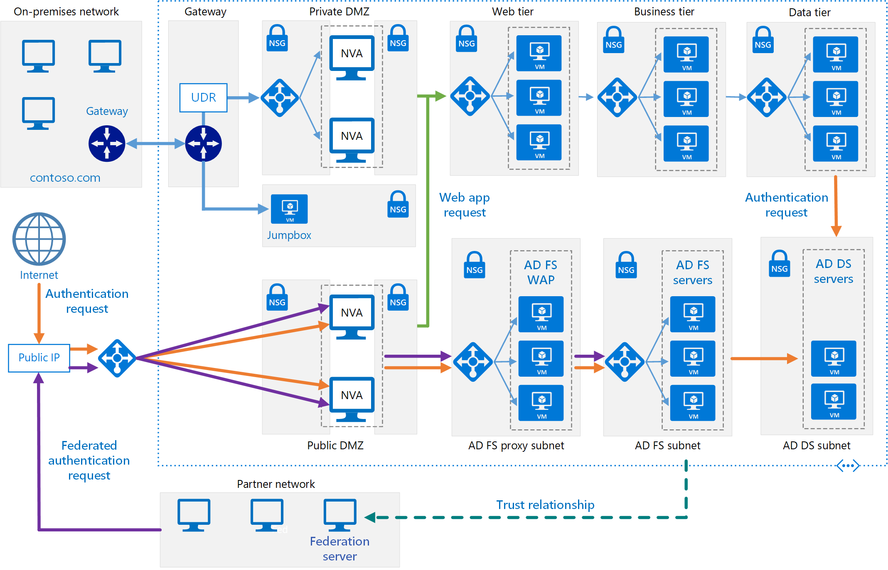

This reference architecture implements a secure hybrid network that extends your on-premises network to Azure and uses [Active Directory Federation Services (AD FS)][active-directory-federation-services] to perform federated authentication and authorization for components running in Azure.

## Architecture



*Download a [Visio file][visio-download] of this architecture.*

### Workflow

- **AD DS subnet**. The AD DS servers are contained in their own subnet with network security group (NSG) rules acting as a firewall.

- **AD DS servers**. Domain controllers running as VMs in Azure. These servers provide authentication of local identities within the domain.

- **AD FS subnet**. The AD FS servers are located within their own subnet with NSG rules acting as a firewall.

- **AD FS servers**. The AD FS servers provide federated authorization and authentication. In this architecture, they perform the following tasks:

  - Receiving security tokens containing claims made by a partner federation server on behalf of a partner user. AD FS verifies that the tokens are valid before passing the claims to the web application running in Azure to authorize requests.

    The application running in Azure is the *relying party*. The partner federation server must issue claims that are understood by the web application. The partner federation servers are referred to as *account partners*, because they submit access requests on behalf of authenticated accounts in the partner organization. The AD FS servers are called *resource partners* because they provide access to resources (the web application).

  - Authenticating and authorizing incoming requests from external users running a web browser or device that needs access to web applications, by using AD DS and the [Active Directory Device Registration Service][ADDRS].

  The AD FS servers are configured as a farm accessed through an Azure load balancer. This implementation improves availability and scalability. The AD FS servers aren't exposed directly to the Internet. All Internet traffic is filtered through AD FS web application proxy servers and a DMZ (also referred to as a perimeter network).

  For more information about how AD FS works, see [Active Directory Federation Services Overview][active-directory-federation-services-overview]. Also, the article [AD FS deployment in Azure][adfs-intro] contains a detailed step-by-step introduction to implementation.

- **AD FS proxy subnet**. The AD FS proxy servers can be contained within their own subnet, with NSG rules providing protection. The servers in this subnet are exposed to the Internet through a set of network virtual appliances that provide a firewall between your Azure virtual network and the Internet.

- **AD FS web application proxy (WAP) servers**. These VMs act as AD FS servers for incoming requests from partner organizations and external devices. The WAP servers act as a filter, shielding the AD FS servers from direct access from the Internet. As with the AD FS servers, deploying the WAP servers in a farm with load balancing gives you greater availability and scalability than deploying a collection of stand-alone servers.

  > [!NOTE]
  > For detailed information about installing WAP servers, see [Install and Configure the Web Application Proxy Server][install_and_configure_the_web_application_proxy_server]
  >

- **Partner organization**. A partner organization running a web application that requests access to a web application running in Azure. The federation server at the partner organization authenticates requests locally, and submits security tokens containing claims to AD FS running in Azure. AD FS in Azure validates the security tokens, and if valid can pass the claims to the web application running in Azure to authorize them.

  > [!NOTE]
  > You can also configure a VPN tunnel using Azure gateway to provide direct access to AD FS for trusted partners. Requests received from these partners do not pass through the WAP servers.
  >

### Components

This architecture extends the implementation described in [Extending AD DS to Azure][extending-ad-to-azure]. It contains the following components.

- [**AD DS subnet**](/azure/active-directory-domain-services/network-considerations#azure-virtual-network-design)
- [**AD DS servers**](/windows-server/identity/ad-ds/plan/ad-ds-design-and-planning)
- [**AD FS subnet**](/windows-server/identity/ad-fs/deployment/how-to-connect-fed-azure-adfs#steps-to-deploy-ad-fs-in-azure)
- [**AD FS servers**](/defender-for-identity/active-directory-federation-services#server-specifications)
- [**AD FS proxy subnet**](/windows-server/identity/ad-fs/overview/ad-fs-requirements#BKMK_3)
- [**AD FS web application proxy (WAP) servers**](/windows-server/identity/ad-fs/deployment/best-practices-securing-ad-fs)
- **Partner organization**

## Scenario details

AD FS can be hosted on-premises, but if your application is a hybrid in which some parts are implemented in Azure, it might be more efficient to replicate AD FS in the cloud.

The previous diagram shows the following scenarios:

- Application code from a partner organization accesses a web application hosted inside your Azure VNet.
- An external, registered user with credentials stored inside Active Directory Domain Services (DS) accesses a web application hosted inside your Azure VNet.
- A user connected to your VNet using an authorized device executes a web application hosted inside your Azure VNet.

This reference architecture focuses on *passive federation*, in which the federation servers decide how and when to authenticate a user. The user provides sign in information when the application is started. This mechanism is most commonly used by web browsers and involves a protocol that redirects the browser to a site where the user authenticates. AD FS also supports *active federation*, where an application takes on responsibility for supplying credentials without further user interaction, but that scenario is outside the scope of this architecture.

For other considerations, see [Choose a solution for integrating on-premises Active Directory with Azure][considerations].

### Potential use cases

Typical uses for this architecture include:

- Hybrid applications where workloads run partly on-premises and partly in Azure.
- Solutions that use federated authorization to expose web applications to partner organizations.
- Systems that support access from web browsers running outside of the organizational firewall.
- Systems that enable users to access to web applications by connecting from authorized external devices such as remote computers, notebooks, and other mobile devices.

## Recommendations

The following recommendations apply for most scenarios. Follow these recommendations unless you have a specific requirement that overrides them.

### Networking recommendations

Configure the network interface for each of the VMs hosting AD FS and WAP servers with static private IP addresses.

Don't give the AD FS VMs public IP addresses. For more information, see the [Security considerations](#security-considerations) section.

Set the IP address of the preferred and secondary domain name service (DNS) servers for the network interfaces for each AD FS and WAP VM to reference the Active Directory DS VMs. The Active Directory DS VMs should be running DNS. This step is necessary to enable each VM to join the domain.

### AD FS installation

The article [Deploying a Federation Server Farm][Deploying_a_federation_server_farm] provides detailed instructions for installing and configuring AD FS. Perform the following tasks before configuring the first AD FS server in the farm:

1. Obtain a publicly trusted certificate for performing server authentication. The *subject name* must contain the name clients use to access the federation service. This can be the DNS name registered for the load balancer, for example, *adfs.contoso.com* (avoid using wildcard names such as **.contoso.com*, for security reasons). Use the same certificate on all AD FS server VMs. You can purchase a certificate from a trusted certification authority, but if your organization uses Active Directory Certificate Services you can create your own.

    The *subject alternative name* is used by the device registration service (DRS) to enable access from external devices. This should be of the form *enterpriseregistration.contoso.com*.

    For more information, see [Obtain and Configure a Secure Sockets Layer (SSL) Certificate for AD FS][adfs_certificates].

2. On the domain controller, generate a new root key for the Key Distribution Service. Set the effective time to the current time minus 10 hours (this configuration reduces the delay that can occur in distributing and synchronizing keys across the domain). This step is necessary to support creating the group service account that is used to run the AD FS service. The following PowerShell command shows an example of how to do this:

    ```powershell
    Add-KdsRootKey -EffectiveTime (Get-Date).AddHours(-10)
    ```

3. Add each AD FS server VM to the domain.

> [!NOTE]
> To install AD FS, the domain controller running the primary domain controller (PDC) emulator flexible single master operation (FSMO) role for the domain must be running and accessible from the AD FS VMs.
>

### AD FS trust

Establish federation trust between your AD FS installation, and the federation servers of any partner organizations. Configure any claims filtering and mapping required.

- DevOps staff at each partner organization must add a relying party trust for the web applications accessible through your AD FS servers.
- DevOps staff in your organization must configure claims-provider trust to enable your AD FS servers to trust the claims that partner organizations provide.
- DevOps staff in your organization must also configure AD FS to pass claims on to your organization's web applications.

For more information, see [Establishing Federation Trust][establishing-federation-trust].

Publish your organization's web applications and make them available to external partners by using preauthentication through the WAP servers. For more information, see [Publish Applications using AD FS Preauthentication][publish_applications_using_AD_FS_preauthentication]

AD FS supports token transformation and augmentation. Azure Active Directory doesn't provide this feature. With AD FS, when you set up the trust relationships, you can:

- Configure claim transformations for authorization rules. For example, you can map group security from a representation used by a non-Microsoft partner organization to something that Active Directory DS can authorize in your organization.
- Transform claims from one format to another. For example, you can map from SAML 2.0 to SAML 1.1 if your application only supports SAML 1.1 claims.

### AD FS monitoring

The [Microsoft System Center Management Pack for Active Directory Federation Services 2012 R2][oms-adfs-pack] provides both proactive and reactive monitoring of your AD FS deployment for the federation server. This management pack monitors:

- Events that the AD FS service records in its event logs.
- The performance data that the AD FS performance counters collect.
- The overall health of the AD FS system and web applications (relying parties), and provides alerts for critical issues and warnings.

## Considerations

These considerations implement the pillars of the Azure Well-Architected Framework, which is a set of guiding tenets that can be used to improve the quality of a workload. For more information, see [Microsoft Azure Well-Architected Framework](/azure/architecture/framework).

DevOps staff should be prepared to perform the following tasks:

- Managing the federation servers, including managing the AD FS farm, managing trust policy on the federation servers, and managing the certificates used by the federation services.
- Managing the WAP servers including managing the WAP farm and certificates.
- Managing web applications including configuring relying parties, authentication methods, and claims mappings.
- Backing up AD FS components.

For other DevOps considerations, see [DevOps: Extending Active Directory Domain Services (AD DS) to Azure](adds-extend-domain.yml#devops-considerations).

### Performance efficiency

Performance efficiency is the ability of your workload to scale to meet the demands placed on it by users in an efficient manner. For more information, see [Performance efficiency pillar overview](/azure/architecture/framework/scalability/overview).

The following considerations, summarized from the article [Plan your AD FS deployment][plan-your-adfs-deployment], give a starting point for sizing AD FS farms:

- If you have fewer than 1000 users, don't create dedicated servers, but instead install AD FS on each of the Active Directory DS servers in the cloud. Make sure that you have at least two Active Directory DS servers to maintain availability. Create a single WAP server.
- If you have between 1000 and 15,000 users, create two dedicated AD FS servers and two dedicated WAP servers.
- If you have between 15,000 and 60,000 users, create between three and five dedicated AD FS servers and at least two dedicated WAP servers.

These considerations assume that you're using dual quad-core VM (Standard D4_v2, or better) sizes in Azure.

If you're using the Windows Internal Database to store AD FS configuration data, you're limited to eight AD FS servers in the farm. If you anticipate that you need more in the future, use SQL Server. For more information, see [The Role of the AD FS Configuration Database][adfs-configuration-database].

### Reliability

Reliability ensures your application can meet the commitments you make to your customers. For more information, see [Overview of the reliability pillar](/azure/architecture/framework/resiliency/overview).

Create an AD FS farm with at least two servers to increase availability of the service. Use different storage accounts for each AD FS VM in the farm. This approach helps to ensure that a failure in a single storage account doesn't make the entire farm inaccessible.

Create separate Azure availability sets for the AD FS and WAP VMs. Ensure that there are at least two VMs in each set. Each availability set must have at least two update domains and two fault domains.

Configure the load balancers for the AD FS VMs and WAP VMs as follows:

- Use an Azure load balancer to provide external access to the WAP VMs, and an internal load balancer to distribute the load across the AD FS servers in the farm.
- Only pass traffic appearing on port 443 (HTTPS) to the AD FS/WAP servers.
- Give the load balancer a static IP address.
- Create a health probe using HTTP against `/adfs/probe`. For more information, see [Hardware Load Balancer Health Checks and Web Application Proxy / AD FS 2012 R2](https://blogs.technet.microsoft.com/applicationproxyblog/2014/10/17/hardware-load-balancer-health-checks-and-web-application-proxy-ad-fs-2012-r2/).

  > [!NOTE]
  > AD FS servers use the Server Name Indication (SNI) protocol, so attempting to probe using an HTTPS endpoint from the load balancer fails.
  >

- Add a DNS *A* record to the domain for the AD FS load balancer. Specify the IP address of the load balancer, and give it a name in the domain (such as adfs.contoso.com). This is the name clients and the WAP servers use to access the AD FS server farm.

You can use either SQL Server or the Windows Internal Database to hold AD FS configuration information. The Windows Internal Database provides basic redundancy. Changes are written directly to only one of the AD FS databases in the AD FS cluster, while the other servers use pull replication to keep their databases up to date. Using SQL Server can provide full database redundancy and high availability using failover clustering or mirroring.

### Security

Security provides assurances against deliberate attacks and the abuse of your valuable data and systems. For more information, see [Overview of the security pillar](/azure/architecture/framework/security/overview).

AD FS uses HTTPS, so make sure that the NSG rules for the subnet containing the web tier VMs permit HTTPS requests. These requests can originate from the on-premises network, the subnets containing the web tier, business tier, data tier, private DMZ, public DMZ, and the subnet containing the AD FS servers.

Prevent direct exposure of the AD FS servers to the Internet. AD FS servers are domain-joined computers that have full authorization to grant security tokens. If a server is compromised, a malicious user can issue full access tokens to all web applications and to all federation servers that are protected by AD FS. If your system must handle requests from external users not connecting from trusted partner sites, use WAP servers to handle these requests. For more information, see [Where to Place a Federation Server Proxy][where-to-place-an-fs-proxy].

Place AD FS servers and WAP servers in separate subnets with their own firewalls. You can use NSG rules to define firewall rules. All firewalls should allow traffic on port 443 (HTTPS).

Restrict direct sign in access to the AD FS and WAP servers. Only DevOps staff should be able to connect. Don't join the WAP servers to the domain.

Consider using a set of network virtual appliances that logs detailed information on traffic traversing the edge of your virtual network for auditing purposes.

### Cost optimization

Cost optimization is about looking at ways to reduce unnecessary expenses and improve operational efficiencies. For more information, see [Overview of the cost optimization pillar](/azure/architecture/framework/cost/overview).

Here are cost considerations for the services used in this architecture.

#### AD Domain Services

Consider having Active Directory Domain Services as a shared service that is consumed by multiple workloads to lower costs. For more information, see [Active Directory Domain Services pricing][ADDS-pricing].

#### Azure AD Federation Services

For information about the editions offered by Azure Active Directory, see [Azure AD pricing][Azure-AD-pricing]. The AD Federation Services feature is available in all editions.

## Contributors

*This article is maintained by Microsoft. It was originally written by the following contributors.*

Principal author:

- [Sarah Parkes](https://www.linkedin.com/in/sarah-p-a06370/) | Senior Cloud Solution Architect

*To see non-public LinkedIn profiles, sign in to LinkedIn.*

## Next Steps

- [Azure Activity Directory Documentation](/azure/active-directory)
- [Manage Identity in multitenant applications](../../multitenant-identity/index.yml)
- [Identity Management Security](/azure/security/fundamentals/identity-management-overview)
- [Azure Firewall](/azure/firewall/overview)

<!-- links -->

[extending-ad-to-azure]: ./adds-extend-domain.yml
[Azure-AD-pricing]: https://azure.microsoft.com/pricing/details/active-directory
[where-to-place-an-fs-proxy]: /previous-versions/windows/it-pro/windows-server-2012-R2-and-2012/dd807048(v=ws.11)
[ADDS-pricing]: https://azure.microsoft.com/pricing/details/active-directory-ds
[ADDRS]: /previous-versions/windows/it-pro/windows-server-2012-R2-and-2012/dn486831(v=ws.11)
[plan-your-adfs-deployment]: /previous-versions/azure/azure-services/dn151324(v=azure.100)
[adfs_certificates]: /previous-versions/windows/it-pro/windows-server-2012-R2-and-2012/dn781428(v=ws.11)
[adfs-configuration-database]: /previous-versions/windows/it-pro/windows-server-2012-R2-and-2012/ee913581(v=ws.11)
[active-directory-federation-services]: /windows-server/identity/active-directory-federation-services
[active-directory-federation-services-overview]: /windows-server/identity/active-directory-federation-services
[establishing-federation-trust]: /archive/blogs/alextch/establishing-federation-trust
[Deploying_a_federation_server_farm]: /windows-server/identity/ad-fs/deployment/deploying-a-federation-server-farm
[install_and_configure_the_web_application_proxy_server]: /previous-versions/windows/it-pro/windows-server-2012-R2-and-2012/dn383662(v=ws.11)
[publish_applications_using_AD_FS_preauthentication]: /previous-versions/windows/it-pro/windows-server-2012-R2-and-2012/dn383640(v=ws.11)
[oms-adfs-pack]: https://www.microsoft.com/download/details.aspx?id=54526
[adfs-intro]: /azure/active-directory/hybrid/whatis-hybrid-identity
[considerations]: ./index.yml
[visio-download]: https://arch-center.azureedge.net/identity-architectures.vsdx
