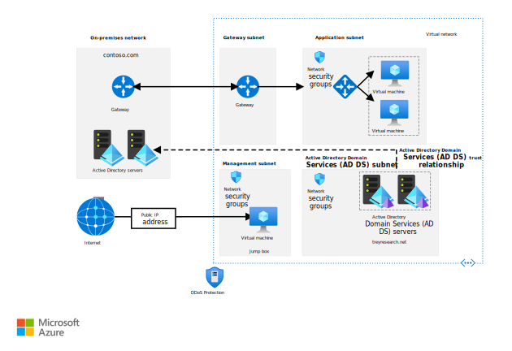

# Identity management

These reference architectures show options for integrating your on-premises Active Directory (AD) environment with an Azure network. [Which should I choose?](./considerations.md)

<ul class="panelContent">
    <li>
        <a href="./azure-ad.md">
            

                

                    

                        

                            

                            
                            

                        

                        

                            <h3>Integrate with Azure Active Directory</h3>
                            
Integrate on-premises Active Directory domains and forests with Azure AD.

                        

                    

                

            

        </a>
    </li>
    <li>
        <a href="./adds-extend-domain.md">
            

                

                    

                        

                            

                            
                            

                        

                        

                            <h3>Extend AD DS to Azure</h3>
                            
Extend your Active Directory environment to Azure using Active Directory Domain Services.

                        

                    

                

            

        </a>
    </li>
    <li>
        <a href="./adds-forest.md">
            

                

                    

                        

                            

                            
                            

                        

                        

                            <h3>Create an AD DS forest in Azure</h3>
                            
Create a separate AD domain in Azure that is trusted by domains in your on-premises forest.

                        

                    

                

            

        </a>
    </li>
    <li>
        <a href="./adfs.md">
            

                

                    

                        

                            

                            
                            

                        

                        

                            <h3>Extend AD FS to Azure</h3>
                            
Use Active Directory Federation Services for federated authentication and authorization in Azure.

                        

                    

                

            

        </a>
    </li>
</ul>

