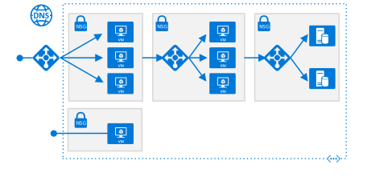

<!-- This file is generated! -->
<!-- See the templates in ./build/reference-architectures  -->
<!-- See data in index.json -->

# Azure Reference Architectures

Our reference architectures are arranged by scenario, with related architectures grouped together. Each architecture includes recommended practices, along with considerations for scalability, availability, manageability, and security. Most also include a deployable solution.

<section class="series">
    <ul class="panelContent">
    <!-- N-tier application -->
<li style="display: flex; flex-direction: column;">
    <a href="./n-tier/index.md" style="display: flex; flex-direction: column; flex: 1 0 auto;">
        

            

                

                    

                        

                            
                        

                    

                    

                        <h3>N-tier application</h3>
                        
Deploying an N-tier application to Azure, for Windows or Linux.

Configurations include single region, single region with Availability Zones, and active-passive in two regions, depending on your availability requirements.

                    

                

            

        

    </a>
</li>

    <!-- Hybrid network -->
<li style="display: flex; flex-direction: column;">
    <a href="./hybrid-networking/index.md" style="display: flex; flex-direction: column; flex: 1 0 auto;">
        

            

                

                    

                        

                            
                        

                    

                    

                        <h3>Hybrid network</h3>
                        
Create a hybrid network connection between an on-premises network and Azure.

Configurations include VPN Gateway and ExpressRoute, depending on your bandwidth and scalability requirements.

                    

                

            

        

    </a>
</li>
    <!-- Network DMZ -->
<li style="display: flex; flex-direction: column;">
    <a href="./dmz/index.md" style="display: flex; flex-direction: column; flex: 1 0 auto;">
        

            

                

                    

                        

                            
                        

                    

                    

                        <h3>Network DMZ</h3>
                        
Create a network DMZ to protect the boundary between an Azure virtual network and an on-premises network or the Internet.

                    

                

            

        

    </a>
</li>
    <!-- Identity management -->
<li style="display: flex; flex-direction: column;">
    <a href="./identity/index.md" style="display: flex; flex-direction: column; flex: 1 0 auto;">
        

            

                

                    

                        

                            
                        

                    

                    

                        <h3>Identity management</h3>
                        
Integrate your on-premises Active Directory (AD) environment with an Azure virtual network. Options include integrating with Azure Active Directory, extending AD DS to Azure, and extending AD FS to Azure.

                    

                

            

        

    </a>
</li>
    <!-- App Service web application -->
<li style="display: flex; flex-direction: column;">
    <a href="./app-service-web-app/index.md" style="display: flex; flex-direction: column; flex: 1 0 auto;">
        

            

                

                    

                        

                            
                        

                    

                    

                        <h3>App Service web application</h3>
                        
This series shows best practices for web applications that use Azure App Service.

                    

                

            

        

    </a>
</li>
    </ul>
</section>

<ul class="panelContent cardsI">
    <!-- Jenkins build server -->
<li style="display: flex; flex-direction: column;">
    <a href="./jenkins/index.md" style="display: flex; flex-direction: column; flex: 1 0 auto;">
        

            

                

                    

                        

                            
                        

                    

                    

                        <h3>Jenkins build server</h3>
                        
Deploy and operate a scalable, enterprise-grade Jenkins server on Azure.

                    

                

            

        

    </a>
</li>
    <!-- SharePoint Server 2016 farm -->
<li style="display: flex; flex-direction: column;">
    <a href="./sharepoint/index.md" style="display: flex; flex-direction: column; flex: 1 0 auto;">
        

            

                

                    

                        

                            
                        

                    

                    

                        <h3>SharePoint Server 2016 farm</h3>
                        
Deploy and run a high availability SharePoint Server 2016 farm on Azure with SQL Server Always On Availability Groups.

                    

                

            

        

    </a>
</li>
    <!-- SAP NetWeaver and SAP HANA -->
<li style="display: flex; flex-direction: column;">
    <a href="./sap/index.md" style="display: flex; flex-direction: column; flex: 1 0 auto;">
        

            

                

                    

                        

                            
                        

                    

                    

                        <h3>SAP NetWeaver and SAP HANA</h3>
                        
Deploy and run SAP NetWeaver and SAP HANA in a high availability environment on Azure.

                    

                

            

        

    </a>
</li>
</ul>