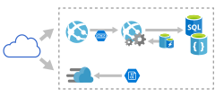

# Azure Reference Architectures

Our reference architectures are arranged by scenario, with related architectures grouped together. Each architecture includes recommended practices, along with considerations for scalability, availability, manageability, and security. Most also include a deployable solution.

<section class="series">
    <ul class="panelContent">
    <!--Windows VM -->
    <li>
        <a href="./virtual-machines-windows/index.md">
            

                

                    

                        

                            

                                
                            

                        

                        

                            <h3>Windows VM workloads</h3>
                            
This series starts with best practices for running a single Windows VM, then multiple load-balanced VMs, and finally a multi-region N-tier application.

                        

                    

                

            

        </a>
    </li>
    <!-- Linux VM -->
    <li>
        <a href="./virtual-machines-linux/index.md">
            

                

                    

                        

                            

                                
                            

                        

                        

                            <h3>Linux VM workloads</h3>
                            
This series starts with best practices for running a single Linux VM, then multiple load-balanced VMs, and finally a multi-region N-tier application.

                        

                    

                

            

        </a>
    </li>
    <!-- Hybrid network -->
    <li>
        <a href="./hybrid-networking/index.md">
            

                

                    

                        

                            

                                
                            

                        

                        

                            <h3>Hybrid network</h3>
                            
This series shows options for creating a network connection between an on-premises network and Azure.

                        

                    

                

            

        </a>
    </li>
    <!-- DMZ -->
    <li>
        <a href="./dmz/index.md">
            

                

                    

                        

                            

                                
                            

                        

                        

                            <h3>Network DMZ</h3>
                            
This series shows how to create a network DMZ to protect the boundary between an Azure virtual network and an on-premises network or the Internet.

                        

                    

                

            

        </a>
    </li>
    <!-- Identity -->
    <li>
        <a href="./identity/index.md">
            

                

                    

                        

                            

                                
                            

                        

                        

                            <h3>Identity management</h3>
                            
This series show options for integrating your on-premises Active Directory (AD) environment with an Azure network.

                        

                    

                

            

        </a>
    </li>
    <!-- Managed web app -->
    <li>
        <a href="./managed-web-app/index.md">
            

                

                    

                        

                            

                                
                            

                        

                        

                            <h3>Managed web application</h3>
                            
This series shows best practices for web applications that use Azure App Service.

                        

                    

                

            

        </a>
    </li>
    </ul>

<ul class="panelContent cardsI">
<li>
    <a href="./sharepoint/index.md">
    

        

            

                

                    

                        
                    

                

                

                    <h3>SharePoint Server 2016 farm</h3>
                    
Deploy and run a high availability SharePoint Server 2016 farm on Azure with SQL Server Always On Availability Groups.

                

            

        

    

    </a>
</li>

<li>
    <a href="./sap/index.md">
    

        

            

                

                    

                        
                    

                

                

                    <h3>SAP NetWeaver and SAP HANA</h3>
                    
Deploy and run SAP NetWeaver and SAP HANA in a high availability environment on Azure.

                

            

        

    

    </a>
</li>
</ul>

</section>

