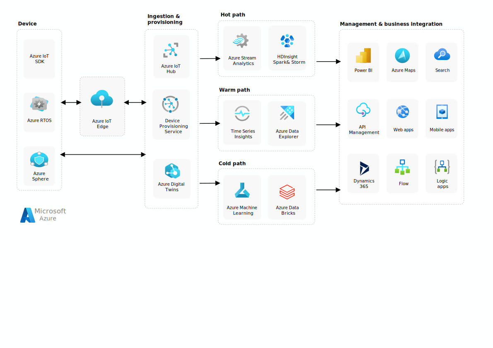

This article discusses a recommended architecture for IoT applications using Azure PaaS (platform-as-a-service) components. The following diagram reflects different Aure components that can be used to architect a connected environment IoT solution.

This reference architecture uses Azure PaaS (platform-as-a-service) components.  However, Microsoft recommends using [Azure IoT Central](/azure/iot-central/), which is a fully managed SaaS (software-as-a-service) solution. Azure IoT Central abstracts the technical choices and lets you focus on your solution. This simplicity comes with a tradeoff. IoT Central is less customizable than a PaaS-based solution.

Azure IoT solutions involve **devices** that generate data, **insights** that you form about the data, and **actions** that you take based on the insights. The data events generated by devices are used to formulate **insights** about the device or its environment. **Actions** are then taken to execute workflows in the solution. Consider a motor that sends temperature data. This data is used to evaluate whether the motor is performing as expected. The insight about its performance is used to prioritize a maintenance schedule for the motor.

## Devices

Azure IoT supports a large range of devices, from microcontrollers running Azure RTOS and Azure Sphere to developer boards like MX Chip and Raspberry Pi. Azure IoT also supports smart server gateways capable of running custom code. Devices collect environmental data and are capable of sending signals to the cloud. Devices might perform some local processing through a service such as **Azure IoT Edge**, or just connect directly to Azure so that they can send data to and receive data from the IoT solution.

When devices are connected to the cloud, there are several services that assist with ingesting data. **Azure IoT Hub** is a cloud gateway service that can securely connect and manage devices. **IoT Hub Device Provisioning Service (DPS)** enables zero-touch, just-in-time provisioning help to register a large number of devices in a secure and scalable manner. **Azure Digital Twins** enables virtual models of real world systems.

## Insights

Once devices have been connected in the cloud, their data can be processed and explored to gain custom insights about their environment. At a high level, there are three ways to process data &mdash; hot path, warm path, and cold path. The difference between them has to do with requirements for latency and data access.

- The **hot path** analyzes data in near-real-time as it arrives. In the hot path, telemetry must be processed with very low latency. The hot path is typically implemented using a stream processing engine. Consider using services such as **Azure Stream Analytics** or **HDInsight**. The output may trigger an alert, or be written to a structured format that can be queried using analytical tools.
- The **warm path** analyzes data that can accommodate longer delays for more detailed processing. Consider **Azure Data Explorer** or **Azure Time Series Insights** for storing and analyzing large volumes of data.
- The **cold path** performs batch processing at longer intervals (hourly or daily). The cold path typically operates over large volumes of data, but the results don't need to be as timely as the hot or warm paths. Consider using **Azure Machine Learning** or **Azure Databricks** to analyze cold data.

## Actions

You can use the insights gathered about your data to manage and control your environment. Business integration actions might include storing informational messages, raising alarms, sending email or SMS messages, or integrating with CRM. The following services are available for management and business integration:

- **Power BI** connects to, models, and visualizes your data. Power BI enables you to collaborate on data and use artificial intelligence to make data-driven decisions.
- **Azure Maps** allows you to create location aware web and mobile applications using geospatial services (search, maps, routing, tracking, and traffic), APIs, and SDKs.
- **Azure Cognitive Search** provides a search service over varied types of content. This includes indexing, AI enrichment, and querying capabilities.
- **Azure API Management** provides a single place to manage all of your APIs.
- **Azure Web Apps** enables you to deploy web applications that scale with your organization.
- **Mobile Apps** allows you to build cross platform and native apps for iOs, Android, Windows, or Mac.
- **Dynamics 365** combines CRM (customer relationship management) and ERP (enterprise resource planning) in the cloud.
- **Microsoft Flow** is an SaaS offering for automating workflows across applications and other SaaS services.
- **Azure Logic Apps** is a cloud-based PaaS offering used to create and automate workflows that integrate your apps, data, services, and systems.

There are also several services provided by Azure to help you monitor your entire IoT solution and keep it secure. Diagnostic services include **Azure Monitor** and **Log Analytics**, while security services such as **Azure Active Directory** and **Azure Defender for IoT** help you control, view, and manage your security settings, threat detection and response.

## Deployment at scale

Build your solution to deploy at global scale. For optimal scalability, build your IoT application as discrete services that can scale independently. This section contains scalability considerations for various Azure services.

**Digital Twins**. Azure Digital Twins is dedicated to supporting your deployment as it grows, with pay-as-you-go pricing and published service limits to help you account for growing scale. Some limits can also be adjusted with a support request, in order to better meet the needs of your solution.

**Functions**. When reading from the Event Hubs endpoint, there is a maximum of function instance per event hub partition. The maximum processing rate is determined by how fast one function instance can process the events from a single partition. The function should process messages in batches.

**IoT Hub**. For IoT Hub, consider the following scale factors:

- The maximum [daily quota](/azure/iot-hub/iot-hub-devguide-quotas-throttling) of messages into IoT Hub.
- The quota of connected devices in an IoT Hub instance.
- Ingestion throughput &mdash; how quickly IoT Hub can ingest messages.
- Processing throughput &mdash; how quickly the incoming messages are processed.

Each IoT hub is provisioned with a certain number of units in a specific pricing and scale tier. The tier and number of units determine the maximum daily quota of messages that devices can send to the hub. For more information, see [IoT Hub quotas and throttling](/azure/iot-hub/iot-hub-devguide-quotas-throttling). You can scale up a hub without interrupting existing operations.

**Stream Analytics**. Stream Analytics jobs scale best if they are parallel at all points in the Stream Analytics pipeline, from input to query to output. A fully parallel job allows Stream Analytics to split the work across multiple compute nodes. For more information, see [Leverage query parallelization in Azure Stream Analytics](/azure/stream-analytics/stream-analytics-parallelization).

IoT Hub automatically partitions device messages based on the device ID. All of the messages from a particular device will always arrive on the same partition, but a single partition will have messages from multiple devices. Therefore, the unit of parallelization is the partition ID.

**Azure Time Series Insights (TSI)** is an analytics, storage and visualization service for time-series data. It provides capabilities including SQL-like filtering and aggregation and  alleviates the need for user-defined functions. [Time Series Insights](/azure/time-series-insights/overview-what-is-tsi) provides a data explorer to visualize and query data as well as REST Query APIs. In addition to time series data, TSI is also well-suited for solutions that need to query aggregates over large sets of data. TSI is our recommendation for time series data storage and analytics.

## Security

This section contains considerations for building secure solutions.

### Trustworthy and secure communication

All information received from and sent to a device must be trustworthy. Unless a device can support the following cryptographic capabilities, it should be constrained to local networks and all internetwork communication should go through a field gateway:

- Data encryption and digital signatures with a provably secure, publicly analyzed, and broadly implemented symmetric-key encryption algorithm.
- Support for either TLS 1.2 for TCP or other stream-based communication paths or DTLS 1.2 for datagram-based communication paths. Support of X.509 certificate handling is optional and can be replaced by the more compute-efficient and wire-efficient pre-shared key mode for TLS, which can be implemented with support for the AES and SHA-2 algorithms.
- Updateable key-store and per-device keys. Each device must have unique key material or tokens that identify it to the system. The devices should store the key securely on the device (for example, using a secure key-store). The device should be able to update the keys or tokens periodically, or reactively in emergency situations such as a system breach.
- The firmware and application software on the device must allow for updates to enable the repair of discovered security vulnerabilities.

Many devices are too constrained to support these requirements. In that case, a field gateway should be used. Devices connect securely to the field gateway through a local area network, and the gateway enables secure communication to the cloud.

### Physical tamper-proofing

It is strongly recommended that device design incorporates features that defend against physical manipulation attempts, to help ensure the security integrity and trustworthiness of the overall system.

For example:

- Choose microcontrollers/microprocessors or auxiliary hardware that provides secure storage and use of cryptographic key material, such as trusted platform module (TPM) integration.
- Secure boot loader and secure software loading anchored in the TPM.
- Use sensors to detect intrusion attempts and attempts to manipulate the device environment with alerting and potential "digital self-destruction" of the device.

For additional security considerations, see [Internet of Things (IoT) security architecture](/azure/iot-fundamentals/iot-security-architecture).

## Reliability and performance

A key area of consideration for resilient IoT solutions is business continuity and disaster recovery. Designing for High Availability (HA) and Disaster Recovery (DR) can help you define and achieve required uptime goals for your solution.

Different Azure services offer different options for redundancy and failover to help you achieve the uptime goals that best suit your business objectives. Incorporating any of these HA/DR alternatives into your IoT solution requires a careful evaluation of the trade-offs between the:

- Level of resiliency you require
- Implementation and maintenance complexity
- Cost of Goods Sold (COGS) impact

The article [Azure Business Continuity Technical Guidance](/azure/architecture/resiliency) describes a general framework to help you think about business continuity and disaster recovery. The [Disaster recovery and high availability for Azure applications](/azure/architecture/reliability/disaster-recovery) paper provides architecture design guidance on strategies for Azure applications to achieve High Availability (HA) and Disaster Recovery (DR).

You can also find service-specific performance information in the documentation for each Azure IoT service.

## Cost considerations

In general, use the [Azure pricing calculator](https://azure.microsoft.com/pricing/calculator/) to estimate costs. Other considerations are described in the Cost section in [Microsoft Azure Well-Architected Framework](/azure/architecture/framework/cost/overview).

## For more information

For more information about the individual pieces of a solution architecture, see the following topics:

- [Azure IoT Edge](/azure/iot-edge/)
- [Azure IoT Hub](/azure/iot-hub/)
- [Azure IoT Hub Device Provisioning Service (DPS)](/azure/iot-dps/)
- [Azure Digital Twins](/azure/digital-twins/)
- [Azure Stream Analytics](/azure/stream-analytics/)
- [Azure HDInsight](/azure/hdinsight/)
- [Azure Time Series Insights](/azure/time-series-insights/)
- [Azure Data Explorer](/azure/data-explorer/)
- [Azure Mahine Learning](/azure/machine-learning/)
- [Azure Databricks](/azure/databricks/)
- [Power BI](/power-bi/connect-data/)
- [Azure Maps](/azure/azure-maps/)
- [Azure Cognitive Search](/azure/search/)
- [API Management](/azure/api-management/)
- [Azure App Service](/azure/app-service/)
- [Azure Mobile Apps](/azure/developer/mobile-apps/azure-mobile-apps/overview)
- [Dynamics 365](/dynamics365/)
- [Microsoft Power Automate (Microsoft Flow)](/power-automate/getting-started)
- [Azure Logic Apps](/azure/logic-apps/)

## Next steps

[Condition Monitoring for Industrial IoT - Azure Solution Ideas](/azure/architecture/solution-ideas/articles/condition-monitoring)

This example demonstrates how manufacturers can connect their assets to the cloud using OPC UA and Industrial Components.

[IoT solution architecture - Azure Example Scenarios](/azure/architecture/example-scenario/iot/devices-platform-application)

Understand the topological relationship between IoT devices, the platform, and applications and learn about IoT gateways, communications protocols, and provisioning.

[Predictive maintenance with the intelligent IoT Edge - Azure Architecture Center](/azure/architecture/example-scenario/predictive-maintenance/iot-predictive-maintenance)

Learn how a railway company implemented predictive safety maintenance using machine learning on the Azure intelligent IoT Edge platform.

[Azure Industrial IoT guidance - Azure Application Architecture Guide](/azure/architecture/guide/iiot-guidance/iiot-architecture)

Architectural guidance on Azure Industrial IoT Analytics.
