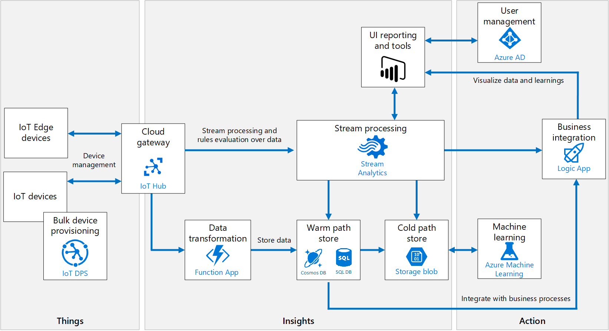

# Azure IoT reference architecture

This reference architecture shows a recommended architecture for IoT applications on Azure using PaaS (platform-as-a-service) components.

IoT applications can be described as **things** (devices) sending data that generates **insights**. These insights generate **actions** to improve a business or process. An example is an engine (the thing) sending temperature data. This data is used to evaluate whether the engine is performing as expected (the insight). The insight is used to proactively prioritize the maintenance schedule for the engine (the action).

This reference architecture uses Azure PaaS (platform-as-a-service) components. Other options for building IoT solutions on Azure include:

- [Azure IoT Central](https://docs.microsoft.com/azure/iot-central/). IoT Central is a fully managed SaaS (software-as-a-service) solution. It abstracts the technical choices and lets you focus on your solution exclusively. This simplicity comes with a tradeoff in being less customizable than a PaaS-based solution.
- Using OSS components such as the SMACK stack (Spark, Mesos, Akka, Cassandra, Kafka) deployed on Azure VMs. This approach offers a great deal of control but is more complex.

At a high level, there are two ways to process telemetry data, hot path and cold path. The difference has to do with requirements for latency and data access.

- The **hot path** analyzes data in near-real-time, as it arrives. In the hot path, telemetry must be processed with very low latency. The hot path is typically implemented using a stream processing engine. The output may trigger an alert, or be written to a structured format that can be queried using analytical tools.
- The **cold path** performs batch processing at longer intervals (hourly or daily). The cold path typically operates over large volumes of data, but the results don't need to be as timely as the hot path. In the cold path, raw telemetry is captured and then fed into a batch process.

## Architecture

This architecture consists of the following components. Some applications may not require every component listed here.

**IoT devices**. Devices can securely register with the cloud, and can connect to the cloud to send and receive data. Some devices may be **edge devices** that perform some data processing on the device itself or in a field gateway. We recommend [Azure IoT Edge](https://docs.microsoft.com/azure/iot-edge/) for edge processing.

**Cloud gateway**. A cloud gateway provides a cloud hub for devices to connect securely to the cloud and send data. It also provides device management, capabilities, including command and control of devices. For the cloud gateway, we recommend [IoT Hub](https://docs.microsoft.com/azure/iot-hub/). IoT Hub is a hosted cloud service that ingests events from devices, acting as a message broker between devices and backend services. IoT Hub provides secure connectivity, event ingestion, bidirectional communication, and device management.

**Device provisioning.** For registering and connecting large sets of devices, we recommend using the [IoT Hub Device Provisioning Service](https://docs.microsoft.com/azure/iot-dps/) (DPS). DPS lets you assign and register devices to specific Azure IoT Hub endpoints at scale.

**Stream processing**. Stream processing analyzes large streams of data records and evaluates rules for those streams. For stream processing, we recommend [Azure Stream Analytics](https://docs.microsoft.com/azure/stream-analytics/). Stream Analytics can execute complex analysis at scale, using time windowing functions, stream aggregations, and external data source joins. Another option is Apache Spark on [Azure Databricks](https://docs.microsoft.com/azure/azure-databricks/).

**Machine learning** allows predictive algorithms to be executed over historical telemetry data, enabling scenarios such as predictive maintenance. For machine learning, we recommend [Azure Machine Learning](https://docs.microsoft.com/azure/machine-learning/service/).

**Warm path storage** holds data that must be available immediately from device for reporting and visualization. For warm path storage, we recommend [Cosmos DB](https://docs.microsoft.com/azure/cosmos-db/introduction). Cosmos DB is a globally distributed, multi-model database.

**Cold path storage** holds data that is kept longer-term and is used for batch processing. For cold path storage, we recommend [Azure Blob Storage](https://docs.microsoft.com/azure/storage/blobs/storage-blobs-introduction). Data can be archived in Blob storage indefinitely at low cost, and is easily accessible for batch processing.

**Data transformation** manipulates or aggregates the telemetry stream. Examples include protocol transformation, such as converting binary data to JSON, or combining data points. If the data must be transformed before reaching IoT Hub, we recommend using a [protocol gateway](https://docs.microsoft.com/azure/iot-hub/iot-hub-protocol-gateway) (not shown). Otherwise, data can be transformed after it reaches IoT Hub. In that case, we recommend using [Azure Functions](https://docs.microsoft.com/azure/azure-functions/), which has built-in integration with IoT Hub, Cosmos DB, and Blob Storage.

**Business process integration** performs actions based on insights from the device data. This could include storing informational messages, raising alarms, sending email or SMS messages, or integrating with CRM. We recommend using [Azure Logic Apps](https://docs.microsoft.com/azure/logic-apps/logic-apps-overview) for business process integration.

**User management** restricts which users or groups can perform actions on devices, such as upgrading firmware. It also defines capabilities for users in applications. We recommend using [Azure Active Directory](https://docs.microsoft.com/azure/active-directory/) to authenticate and authorize users.

## Scalability considerations

An IoT application should be built as discrete services that can scale independently. Consider the following scalability points:

**IoTHub**. For IoT Hub, consider the following scale factors:

- The maximum [daily quota](https://docs.microsoft.com/azure/iot-hub/iot-hub-devguide-quotas-throttling) of messages into IoT Hub.
- The quota of connected devices in an IoT Hub instance.
- Ingestion throughput &mdash; how quickly IoT Hub can ingest messages.
- Processing throughput &mdash; how quickly the incoming messages are processed.

Each IoT hub is provisioned with a certain number of units in a specific tier. The tier and number of units determine the maximum daily quota of messages that devices can send to the hub. For more information, see IoT Hub quotas and throttling. You can scale up a hub without interrupting existing operations.

**Stream Analytics**. Stream Analytics jobs scale best if they are parallel at all points in the Stream Analytics pipeline, from input to query to output. A fully parallel job allows Stream Analytics to split the work across multiple compute nodes. Otherwise, Stream Analytics has to combine the stream data into one place. For more information, see [Leverage query parallelization in Azure Stream Analytics](https://docs.microsoft.com/azure/stream-analytics/stream-analytics-parallelization).

IoT Hub automatically partitions device messages based on the device ID. All of the messages from a particular device will always arrive on the same partition, but a single partition will have messages from multiple devices. Therefore, the unit of parallelization is the partition ID.

**Functions**. When reading from the Event Hubs endpoint, there is a maximum of function instance per event hub partition. The maximum processing rate is determined by how fast one function instance can process the events from a single partition. The function should process messages in batches.

**Cosmos DB**. To scale out a Cosmos DB collection, create the collection with a partition key and include the partition key in each document that you write. For more information, see [Best practices when choosing a partition key](https://docs.microsoft.com/azure/cosmos-db/partitioning-overview#choose-partitionkey).

- If you store and update a single document per device, the device ID is a good partition key. Writes are evenly distributed across the keys. The size of each partition is strictly bounded, because there is a single document for each key value.
- If you store a separate document for every device message, using the device ID as a partition key would quickly exceed the 10-GB limit per partition. Message ID is a better partition key in that case. Typically you would still include device ID in the document for indexing and querying.

## Security considerations

### Trustworthy and secure communication

All information received from and sent to a device must be trustworthy. Unless a device can support the following cryptographic capabilities, it should be constrained to local networks and all internetwork communication should go through a field gateway:

- Data encryption with a provably secure, publicly analyzed, and broadly implemented symmetric-key encryption algorithm.
- Digital signature with a provably secure, publicly analyzed, and broadly implemented symmetric-key signature algorithm.
- Support for either TLS 1.2 for TCP or other stream-based communication paths or DTLS 1.2 for datagram-based communication paths. Support of X.509 certificate handling is optional and can be replaced by the more compute-efficient and wire-efficient pre-shared key mode for TLS, which can be implemented with support for the AES and SHA-2 algorithms.
- Updateable key-store and per-device keys. Each device must have unique key material or tokens that identify it toward the system. The devices should store the key securely on the device (for example, using a secure key-store). The device should be able to update the keys or tokens periodically, or reactively in emergency situations such as a system breach.
- The firmware and application software on the device must allow for updates to enable the repair of discovered security vulnerabilities.

However, many devices are too constrained to support these requirements. In that case, a field gateway should be used. Devices connect securely to the field gateway through a local area network, and the gateway enables secure communication to the cloud.

### Physical tamper-proofing

It is strongly recommended that device design incorporates features that defend against physical manipulation attempts, to help ensure the security integrity and trustworthiness of the overall system.

For example:

- Choose microcontrollers/microprocessors or auxiliary hardware that provides secure storage and use of cryptographic key material, such as trusted platform module (TPM) integration.
- Secure boot loader and secure software loading, anchored in the TPM.
- Use sensors to detect intrusion attempts and attempts to manipulate the device environment with alerting and potentially "digital self-destruction" of the device.

For additional security considerations, see [Internet of Things (IoT) security architecture](https://docs.microsoft.com/azure/iot-fundamentals/iot-security-architecture).

### Monitoring and logging

Logging and monitoring systems are used to determine whether the solution is functioning and to help troubleshoot problems. Monitoring and logging systems help answer the following operational questions:

- Are devices or systems in an error condition?
- Are devices or systems correctly configured?
- Are devices or systems generating accurate data?
- Are systems meeting the expectations of both the business and end customers?

Logging and monitoring tools are typically comprised of the following four components:

- System performance and timeline visualization tools to monitor the system and for basic troubleshooting.
- Buffered data ingestion, to buffer log data.
- Persistence store to store log data.
- Search and query capabilities, to view log data for use in detailed troubleshooting.

Monitoring systems provide insights into the health, security, and stability, and performance of an IoT solution. These systems can also provide a more detailed view, recording component configuration changes and providing extracted logging data that can surface potential security vulnerabilities, enhance the incident management process, and help the owner of the system troubleshoot problems. Comprehensive monitoring solutions include the ability to query information for specific subsystems or aggregating across multiple subsystems.

Monitoring system development should begin by defining healthy operation, regulatory compliance, and audit requirements. Metrics collected may include:

- Physical devices, edge devices, and infrastructure components reporting configuration changes.
- Applications reporting configuration changes, security audit logs, request rates, response times, error rates, and garbage collection statistics for managed languages.
- Databases, persistence stores, and caches reporting query and write performance, schema changes, security audit log, locks or deadlocks, index performance, CPU, memory, and disk usage.
- Managed services (IaaS, PaaS, SaaS, and FaaS) reporting health metrics and configuration changes that impact dependent system health and performance.

Visualization of monitoring metrics alert operators to system instabilities and facilitate incident response.

### Tracing telemetry

Tracing telemetry allows an operator to follow the journey of a piece of telemetry from creation through the system. Tracing is important for debugging and troubleshooting. For IoT solutions that use Azure IoT Hub and the [IoT Hub Device SDKs](https://docs.microsoft.com/azure/iot-hub/iot-hub-devguide-sdks), tracing datagrams can be originated as Cloud-to-Device messages and included in the telemetry stream.

### Logging

Logging systems are integral in understanding what actions or activities a solution has performed, failures that have occurred, and can provide help in fixing those failures. Logs can be analyzed to help understand and remedy error conditions, enhance performance characteristics, and ensure compliance with governing rule and regulations.

Though plain-text logging is lower impact on upfront development costs, it is more challenging for a machine to parse/read. We recommend structured logging be used, as collected information is both machine parsable and human readable. Structured logging adds situational context and metadata to the log information. In structured logging, properties are first class citizens formatted as key/value pairs, or with a fixed schema, to enhance search and query capabilities.

## Cost considerations
In general, use the [Azure pricing calculator][azure-pricing-calculator] to estimate costs. Other considerations are described in the Cost section in [Azure Architecture Framework][aaf-cost].

There are ways to optimize costs associated the services used in this reference architecture. 

### Azure IoT Hub

In this architecture, IoT Hub is the cloud gateway that ingests events from devices. IoT Hub billing varies depending on the type of operation. Create, update, insert, delete are free. Successful operations such as device-to-cloud and cloud-to-device messages are charged. 

Device-to-cloud messages sent successfully are charged in 4-KB chunks on ingress into IoT Hub. For example, a 6-KB message is charged as two messages.

IoT Hub maintains state information about each connected device in a device twin JSON document. Read operations from a device twin document are charged. 

IoT Hub offers two tiers: **Basic** and **Standard**. 

Consider using the **Standard** tier if your IoT architecture uses bi-directional communication capabilities. This tier also offers a free edition that is most suited for testing purposes.

If you only need uni-directional communication from devices to the cloud, use the **Basic** tier, which is cheaper.

For more information, see [IoT Hub Pricing](https://docs.microsoft.com/azure/iot-hub/iot-hub-devguide-pricing). 

### Azure Stream Analytics

Azure Stream Analytics is used for stream processing and rules evaluation. Azure Stream Analytics is priced by the number of Streaming Units (SU) per hour, which takes into compute, memory, and throughput required to process the data. Azure Stream Analytics on IoT Edge is billed per job. Billing starts when a Stream Analytics job is deployed to devices regardless of the job status, running, failed, or stopped.

For more information about pricing, see [Stream Analytics pricing](https://azure.microsoft.com/pricing/details/stream-analytics/).

### Azure Functions

Azure Functions is used to transform data after it reaches the IoT Hub. From a cost perspective, the recommendation is to use **consumption plan** because you pay only for the compute resources you use. You are charged based on per-second resource consumption each time an event triggers the execution of the function. Processing several events in a single execution or batches can reduce cost.

### Azure Logic Apps

In this architecture, Logic Apps is used for business process integration.

Logic apps pricing works on the pay-as-you-go model. Triggers, actions, and connector executions are metered each time a logic app runs. All successful and unsuccessful actions, including triggers, are considered as executions.

For instance, your logic app processes 1000 messages a day. A workflow of five actions will cost less than $6. 

For more information, see [Logic Apps pricing](https://azure.microsoft.com/pricing/details/logic-apps/).

### Data Storage

For cold path storage, Azure Blob Storage is the most cost-effective option.

For warm path storage, consider using Azure Cosmos DB. For more information, see [Cosmos DB pricing](https://azure.microsoft.com/pricing/details/cosmos-db/).

## Next steps

- For a more detailed discussion of the recommended architecture and implementation choices, see [Microsoft Azure IoT Reference Architecture](https://aka.ms/iotrefarchitecture) (PDF).

- For detailed documentation of the various Azure IoT services, see [Azure IoT Fundamentals](https://docs.microsoft.com/azure/iot-fundamentals/).

- A sample IoT implementation is available on [GitHub](https://github.com/mspnp/iot-guidance).

[aaf-cost]: ../framework/cost/overview.md
[azure-pricing-calculator]: https://azure.microsoft.com/pricing/calculator