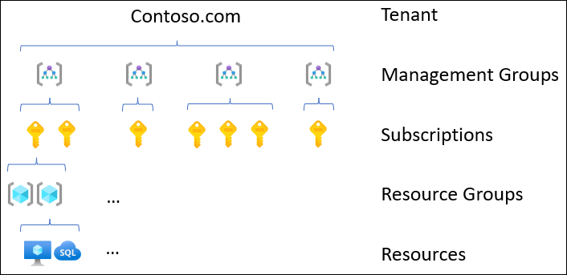

This article describes the role of management groups in Azure landing zones.

> This article is part of a series. Read the [introduction](landing-zone-bicep-intro.yml).

 The [Module: Management Groups](https://github.com/Azure/ALZ-Bicep/tree/main/infra-as-code/bicep/modules/managementGroups) bicep module is an implementation of management groups in this architecture. You can use it as a starting point and configure it as per your needs.

## Management groups

Management groups are the highest level resources in an Azure tenant. You can use them to create a flexible hierarchy of resources in your Azure tenant to more easily manage them. This architecture has a default management group hierarchy for landing zones that follows [Cloud Adoption Framework recommendations for management groups](https://docs.microsoft.com/en-us/azure/cloud-adoption-framework/ready/landing-zone/design-area/resource-org-management-groups#management-group-recommendations).

### Hierarchy of resources

All subscriptions in Azure have exactly one parent management group. Every Azure tenant has a root management group. You can create a hierarchy of management groups under the root and assign subscriptions to different management groups.

### Management of resources

Management groups allow you more easily manage your resources. You can apply policy at the management group level and lower level resources will inherit that policy. Specifically, you can apply the following at the management group level that will be inherited by subscriptions under the management group:

- Azure Policies
- Azure RBAC role assignments
- Cost controls

You can also create an Azure Blueprint and assign it to a management group. Any subscription created under the management group will be stamped with that blueprint.

## Default hierarchy

This architecture recommends starting with the management group structure outlined under [Management groups in the CAF documentation](https://docs.microsoft.com/en-us/azure/cloud-adoption-framework/ready/landing-zone/design-area/resource-org-management-groups#management-groups-in-the-azure-landing-zone-accelerator). Below is the hierarchy:

- Top level management group
  - Platform
    - Management
    - Connectivity
    - Identity
  - Landing zones
    - Corp
    - Online
  - Sandbox
  - Decommissioned

The above structure supports the following [Management group recommendations outlined in the CAF documentation](https://docs.microsoft.com/en-us/azure/cloud-adoption-framework/ready/landing-zone/design-area/resource-org-management-groups#management-group-recommendations):

- The hierarchy is structured so workloads running under each management group will have similar security and compliance requirements. 
- The hierarchy is only 3 layers deep. This flat hierarchy is simple and easy to maintain.
- The top-level sandbox management group allows users to experiment with resources not yet allowed in production environments.
- The platform management group supports common policy and role assignments for platform-level resources.
- The corp landing zone is used for all new subscriptions that require hybrid connectivity. The online landing zone is used for all new subscriptions that do not.
- The hierarchy does not follow the antipattern of management groups for production, testing and development environments.