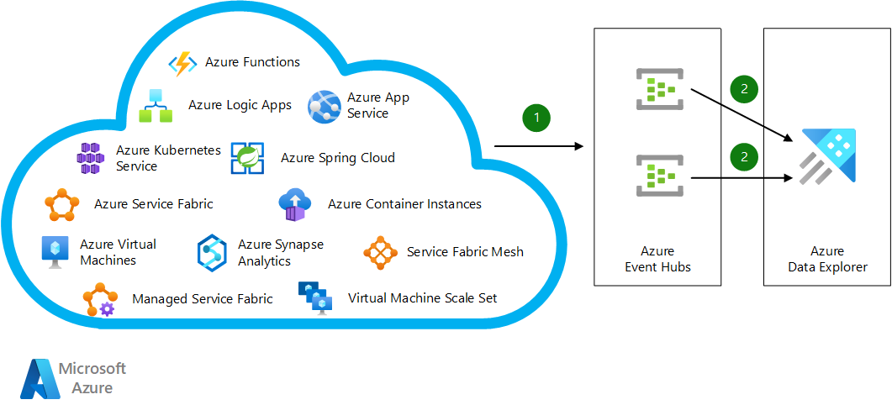

This reference architecture describes how to achieve enterprise-grade logging on Azure with a common logging method that enables end-to-end traceability across different applications. You can use these logs for troubleshooting and for finding insights in usage metrics and business events. This reference architecture is not a replacement for Azure Monitor. This architecture is mainly targeted for application logs. Infrastructure logs can be achieved with the Log Analytics component of Azure Monitor. Application performance monitoring can be achieved with the Application Insights component for Azure Monitor. [Deploy this scenario](#deploy-this-scenario).

## Architecture



*Download a [Visio file](https://arch-center.azureedge.net/Enterprise-grade-logging.vsdx) that contains this architecture diagram.*

### Workflow

1. Regardless of underlying technology or programming language, applications running on Azure compute services send their logs to shared or dedicated Azure Event Hubs instances by using built-in integration capabilities or the Event Hubs SDK.

1. Azure Data Explorer clusters subscribe to these event hubs and ingest data directly to the relevant databases. For high availability, you can define another consumer group in Event Hubs and create a new Azure Data Explorer cluster in another Azure region for dual ingestion.

### Components

- [Event Hubs](https://azure.microsoft.com/products/event-hubs)
- [Azure Data Explorer](https://azure.microsoft.com/products/data-explorer)
- [Azure Event Hubs data connection to Azure Data Explorer](/azure/data-explorer/ingest-data-event-hub-overview)

### Alternatives

- The Application Insights and Log Analytics features of [Azure Monitor](/azure/azure-monitor) can do end-to-end tracing and troubleshooting. These features use Azure Data Explorer behind the scenes. Azure Monitor has capabilities and benefits that are similar to the current architecture, but it's a challenge for Azure Monitor to consolidate multiple applications into a single workspace. [Workspace-based Application Insights](/azure/azure-monitor/app/create-workspace-resource) provides a capability to centralize logs from Application Insights into a common Log Analytics workspace. Azure Monitor allows you to ingest custom logs and extend the data format for these custom logs. There are two different tradeoffs with this alternative:
  - Custom logs will be ingested to different tables than the original tables. `trackEvent()` for custom logs will be stored in the `customEvents` table, whereas the original events will be stored in the `Events` table. 
  - Developers can extend table schema for custom tables as needed, which is a feature of Azure Monitor. Without a strict governance model, the table schema can become complicated over time. With the guidance from this architecture, you can introduce your own governance model and still benefit from [Workspace-based Application Insights](/azure/azure-monitor/app/create-workspace-resource) capabilities by running cross-cluster queries.
- [Microsoft Sentinel](/azure/sentinel) can provide similar capabilities from a security standpoint, but it isn't suitable for application troubleshooting or end-to-end application traceability.

## Scenario details

Applications use different tools and technologies that have their own formats and user interfaces to record errors, events, and traces. Merging this log data from different applications is a programming challenge. The challenge becomes more complicated with distributed systems in the cloud and in high-scale environments. Logs from different systems cause similar problems for big data solutions.

For end-to-end traceability, it's important to design tables that share certain columns. Common columns and their data types include:

- `Timestamp` (datetime):  The exact time the log is generated. Always set the time at origin, because there could be an ingestion delay, and ingestion order isn't guaranteed. Always log with UTC time to prevent any impact from time changes and time zone differences.

- `ActivityId` (string):  A single unique activity identifier that can pass across different solution components. For example, a microservices single execution can include multiple calls to different services. Every table includes this identifier.

- `Tag` (string):  An identifier for types of logs in a table. You can use GUIDs as tags. This tag should appear in source code to make it easier to distinguish records for the same activity.

- `Level` (int):  Identifies the logging level of the record. The logging level for a particular component can change during a troubleshooting session. You can use this column to filter records to be ingested or aged differently. A common practice is using `0` for Trace, `1` for Debug, `2` for Information, `3` for Warning, `4` for Error, and `5` for Critical.

- `Properties` (dynamic):  A bag that contains JSON-formatted key-value pairs. You can add computer name, IP address, process ID, operating system version, and so on.

- `DataVersion` (string): Identifies data formatting changes in the log entries. If you build your own dashboard that relies on logging data, you can use this field to handle breaking changes.

You can also add columns like `BinaryVersion` to identify your application version. Use this field to catch whether any of your running application instances are still using older versions.

You can include the following recommended reference tables in your logging design:

### Events

This table contains events that occur during an execution flow. These events can be business events such as users signing in, or system events like processes starting.

|Column|Datatype|Remarks|
|---|---|---|
|`Timestamp`|datetime|Time the event happened
|`ActivityId`|string|Unique identifier for end-to-end traceability
|`Tag`|string|Type of event
|`Level`|int|Logging level, such as Information or Warning
|`Properties`|dynamic|Bag that contains relevant event properties
|`DataVersion`|string|Data format version to identify formatting changes
|`Name`|string|Human-readable description
|`Metrics`|dynamic|Bag that contains metrics for the event in key-value pairs format

### Metrics

This table contains aggregated performance metrics or other numeric data to describe aspects of a system at a particular time. These metrics can contain the duration of a call to an external system, or the data received or processed in a particular time window.

|Column|Datatype|Remarks|
|---|---|---|
|`Timestamp`|datetime|Metric collection time
|`ActivityId`|string|Unique identifier for end-to-end traceability
|`Tag`|string|Type of metric
|`Level`|int|Logging level, such as Information or Warning
|`Properties`|dynamic|Bag that contains relevant event properties
|`DataVersion`|string|Data format version to identify formatting changes
|`Name`|string|Human-readable description
|`Count`|int|Number of measurements captured over the aggregation interval
|`Sum`|real|Sum of all values captured over the aggregation interval
|`Min`|real|Smallest value captured over the aggregation interval
|`Max`|real|Largest value captured over the aggregation interval

### Traces

This table contains logs that increase traceability. The table can contain any logs that you don't need to associate with an event or metric. This table can grow enormously over time if you don't use it carefully. The table design is the same as the `Events` table.

|Column|Datatype|Remarks|
|---|---|---|
|`Timestamp`|datetime|Time the event happened
|`ActivityId`|string|Unique identifier for end-to-end traceability
|`Tag`|string|Type of event
|`Level`|int|Logging level, such as Information or Warning
|`Properties`|dynamic|Bag that contains relevant event properties
|`DataVersion`|string|Data format version to identify formatting changes
|`Name`|string|Human-readable description
|`Metrics`|dynamic|Bag that contains metrics for the event in key-value pairs format

### Exceptions

This table contains first-chance exceptions that the application catches. This table can also log second-chance exceptions if the underlying platform supports them.

|Column|Datatype|Remarks|
|---|---|---|
|`Timestamp`|datetime|Time the exception was caught
|`ActivityId`|string|Unique identifier for end-to-end traceability
|`Tag`|string|Type of event for the log
|`Level`|int|Logging level, usually Error
|`Properties`|dynamic|Bag that contains relevant information
|`DataVersion`|string|Data format version to identify formatting changes
|`Name`|string|Human-readable description
|`UserMessage`|string|Exception message
|`StackTrace`|dynamic|Bag containing stack traces, including inner exceptions if any

### Potential use cases

Typical uses for this architecture include:

- Enterprise-grade or large-scale applications.
- Telemetry monitoring for internet of things (IoT)-based applications.
- Business activity monitoring for applications with high numbers of transactions.

## Recommendations

Include the preceding recommended reference tables in your logging design as starting points to customize as needed. Depending on your business requirements and application model, you might need different tables and columns. You can introduce tables such as `Audits`, `Requests`, or `Dependencies`.

- For a web-based application, log `Requests` details, such as URL, request size, response size, response code, and timing.
- For a microservices-based application, a `Dependencies` table can log interactions among different components and services, such as caller, callee, time taken, and request and response details.
- For a transaction-based application, add an `Audit` table to log transaction details like when, what, who, and how.

## Considerations

These considerations implement the pillars of the Azure Well-Architected Framework, which is a set of guiding tenets that can be used to improve the quality of a workload. For more information, see [Microsoft Azure Well-Architected Framework](/azure/architecture/framework).

### Reliability

Reliability ensures your application can meet the commitments you make to your customers. For more information, see [Overview of the reliability pillar](/azure/architecture/framework/resiliency/overview).

This scenario relies on the availability of the Event Hubs and Azure Data Explorer services. If there's an Azure Data Explorer outage, Event Hubs retains its data for the number of days configured in its retention period, which depends on your [chosen tier](/azure/event-hubs/event-hubs-quotas#basic-vs-standard-vs-premium-vs-dedicated-tiers).

If there's an Event Hubs outage, you could lose data. To avoid data loss, choose the right Event Hubs tier for your needs. As a backup mechanism, you could insert collected log data into blob storage and ingest the blob storage data to a Kusto cluster. For more information, see [Ingest multi-lined JSON records](/azure/data-explorer/ingest-json-formats?tabs=kusto-query-language#ingest-multi-lined-json-records).

[Azure availability zones](/azure/availability-zones/az-overview#availability-zones) are unique physical locations within an Azure region that can help protect Azure Data Explorer compute clusters and data from partial region failure.

### Security

Security provides assurances against deliberate attacks and the abuse of your valuable data and systems. For more information, see [Overview of the security pillar](/azure/architecture/framework/security/overview).

It's important not to log any sensitive data. This solution doesn't offer any explicit capability to prevent sensitive data from being logged. Azure Data Explorer can implement row level security based on your business requirements. For more information, see [Row level security](/azure/data-explorer/kusto/management/rowlevelsecuritypolicy) and [Security in Azure Data Explorer](/azure/data-explorer/security).

### Cost optimization

Cost optimization is about looking at ways to reduce unnecessary expenses and improve operational efficiencies. For more information, see [Overview of the cost optimization pillar](/azure/architecture/framework/cost/overview).

The cost of running this scenario depends on the number of logs or records generated, data retention policies defined, and queries executed on Azure Data Explorer. This calculation excludes the cost of running your applications.

- Event Hubs pricing is based on the number of records generated, pricing tier, and the number of Event Hubs instances. See [Event Hubs pricing](https://azure.microsoft.com/pricing/details/event-hubs).

  Event Hubs Standard tier allows automatic scaling of throughput units. For more information, see [Automatically scale up Azure Event Hubs throughput units](/azure/event-hubs/event-hubs-auto-inflate).

  Auto-inflate doesn't automatically scale down the number of throughput units when ingress or egress rates drop below the limits, but you can use a simple script to scale down.

- For Azure Data Explorer, use the [Azure Data Explorer Cost Estimator](https://dataexplorer.azure.com/AzureDataExplorerCostEstimator.html) to estimate costs. Azure Data Explorer supports autoscaling to help you control compute charges. For more information, see [Manage cluster horizontal scaling (scale out) in Azure Data Explorer](/azure/data-explorer/manage-cluster-horizontal-scaling).

  Setting retention and caching policies affects storage costs. See [Create a table's retention and cache policies](/azure/data-explorer/one-click-table-retention-policy).

  You can size two Azure Data Explorer clusters differently to achieve [active-active](/azure/data-explorer/business-continuity-overview#active-active-configuration) architecture. You can use one cluster only for ingestion but not querying, and use the larger cluster for both ingestion and querying.

### Operational excellence

Operational excellence covers the operations processes that deploy an application and keep it running in production. For more information, see [Overview of the operational excellence pillar](/azure/architecture/framework/devops/overview).

Azure Data Explorer provides built-in mechanisms for business continuity and disaster recovery. You can choose different solutions based on Recovery Point Objective (RPO), Recovery Time Objective (RTO), effort, and cost. For more information, see [Azure Data Explorer business continuity and disaster recovery](/azure/data-explorer/business-continuity-overview).

You can easily achieve active-active configurations with this architecture by using the dual ingestion approach.

### Performance efficiency

Performance efficiency is the ability of your workload to scale in an efficient manner to meet the demands placed on it by users. For more information, see [Performance efficiency pillar overview](/azure/architecture/framework/scalability/overview).

Ingesting individual records into an Azure Data Explorer cluster can be expensive. With Event Hubs integration, Azure Data Explorer ingests data in bulk to optimize performance. Bulk operations are processed faster than batch operations.

Bulk ingestion could introduce ingestion latency in a low-use application scenario. Batching policies can control ingestion latency. For more information, see [IngestionBatching policy](/azure/data-explorer/kusto/management/batchingpolicy). You can trigger ingestion by number of items, data size, or timespan to ensure an acceptable latency. It's important to balance latency and performance. Lowering latency results in higher Azure Data Explorer resource consumption.

The Event Hubs SDK uses [AMQP protocol](/azure/service-bus-messaging/service-bus-amqp-protocol-guide#what-is-amqp) to deliver events to Event Hubs. Reusing existing Event Hubs client connections reduces latency and promotes performance efficiency.

You can scale Event Hubs based on the number of throughput units and partitions set at creation time. Choosing the appropriate partition numbers is important for performance and scalability. You can use as many event hubs as you need, and group applications or sources into multiple event hubs. For prescriptive guidance on Event Hubs scalability, see [Scaling with Event Hubs](/azure/event-hubs/event-hubs-scalability).

You can scale Azure Data Explorer both [horizontally](/azure/data-explorer/manage-cluster-horizontal-scaling) and [vertically](/azure/data-explorer/manage-cluster-vertical-scaling).

## Deploy this scenario

To deploy this scenario, create strongly typed class definitions for table columns that you can use to collect and store metrics from multiple applications. Send the data to Event Hubs, and connect Azure Data Explorer to ingest the Event Hubs data. Use Kusto Query Language in Azure Data Explorer to query the data.

### Prerequisites

- You need an active Azure account. If you don't have one, [create a free account](https://azure.microsoft.com/free).

- In the Azure portal, create an Azure Data Explorer cluster and database by following the steps in [Quickstart: Create an Azure Data Explorer cluster and database](/azure/data-explorer/create-cluster-database-portal).

### Create a table with common columns

In the **Query** window for your Azure Data Explorer database, run the following script to create an `Events` table with recommended columns:

```kusto
.create-merge table Events (Timestamp:datetime, Tag:string, ActivityId:string, Level:int, Name:string, Metrics:dynamic, Properties:dynamic, DataVersion:string)`
```

For more information about creating tables, see [Create a table in Azure Data Explorer](/azure/data-explorer/one-click-table).

### Send logs to Event Hubs

Create strongly typed class definitions for each table to ensure that different teams within your organization use the same format. The following C# code shows a sample definition for the `Events` table. You can create similar typed objects in any programming language. Data ingests to Azure Data Explorer in JSON format.

```csharp
public class LoggingEvent {
        public DateTime Timestamp { get; set; }
        public string ActivityId { get; set; }
        public string Tag { get; set; }
        public int Level { get; set; } // Logging level
        public string Name { get; set; }
        public Dictionary<string,double> Metrics { get; set; }
        public Dictionary<string, string> Properties { get; set; }
        public string DataVersion { get; set; }
    }
```

You can introduce a library to make usage easier for developers. You just need to create one instance of the class and populate the necessary data. For example, you can use the following code snippet to populate data for code running on an Azure Functions app.

```csharp
LoggingEvent loggingEvent = new LoggingEvent()
{
      Timestamp = DateTime.UtcNow,
      ActivityId =activityId,
      Tag= "B1C01FCF-BA48-4923-B312-C45E5EA30506",
      Level = 2,
      Name = "An important business event happened",
      Metrics = new Dictionary<string, double>(),
      Properties = new Dictionary<string, string>(),
      DataVersion = "1.0"
};

loggingEvent.Metrics.Add("DBExecution", random.NextDouble()*1000.0);
loggingEvent.Metrics.Add("OverallExecution", 1000.0+random.NextDouble()*100.0);
loggingEvent.Properties.Add("MachineName", System.Environment.MachineName);
loggingEvent.Properties.Add("ProcessId", System.Environment.ProcessId.ToString());
loggingEvent.Properties.Add("ProcessPath", System.Environment.ProcessPath);
loggingEvent.Properties.Add("FunctionName", context.FunctionName);
loggingEvent.Properties.Add("OSVersion", System.Environment.OSVersion.ToString());
```

This record stores multiple metrics in a single record. The record contains database execution time and overall execution time. Execution times are set to random values for demonstration purposes.

You can send captured data to an event hub. For detailed .NET examples, see [Send events to Azure Event Hubs in .NET](/azure/event-hubs/event-hubs-dotnet-standard-getstarted-send#send-events). The same documentation section contains articles about using other code languages to send events.

### Ingest data from Event Hubs to Azure Data Explorer

Azure Data Explorer can ingest data from Event Hubs. To create the necessary data connection, see [Connect to the event hub](/azure/data-explorer/ingest-data-event-hub#connect-to-the-event-hub). You can then use Kusto Query Language to query the data your application sends, and create dashboards to visualize the captured data.

By following a similar approach, you can collect your infrastructure logs into the same Azure Data Explorer cluster. For more information, see [Query exported data from Azure Monitor using Azure Data Explorer](/azure/azure-monitor/logs/azure-data-explorer-query-storage).

You can also query data directly from Azure Monitor by using cross clusters. For more information, see [Query data in Azure Monitor using Azure Data Explorer](/azure/data-explorer/query-monitor-data).

## Contributors

*This article is maintained by Microsoft. It was originally written by the following contributors.*

Principal author:

- [Yunus Emre Alpozen](https://www.linkedin.com/in/yemre) | Program Architect

*To see non-public LinkedIn profiles, sign in to LinkedIn.*

## Next steps

- [What is Event Hubs?](/azure/event-hubs/event-hubs-about)
- [What is Azure Data Explorer?](/azure/data-explorer/data-explorer-overview)
- [Application profiling considerations for performance monitoring](/azure/architecture/framework/scalability/monitor-application)
- [Kusto Query Language](/azure/data-explorer/kusto/query)
- [Visualize data with Azure Data Explorer](/azure/data-explorer/azure-data-explorer-dashboards)

## Related resources

- [Unified logging for microservices apps](../../example-scenario/logging/unified-logging.yml)
- [Big data analytics with Azure Data Explorer](../../solution-ideas/articles/big-data-azure-data-explorer.yml)
- [Azure Data Explorer monitoring](../../solution-ideas/articles/monitor-azure-data-explorer.yml)
- [Long term security log retention with Azure Data Explorer](../../example-scenario/security/security-log-retention-azure-data-explorer.yml)
- [Real time analytics on big data architecture](../../solution-ideas/articles/real-time-analytics.yml)
