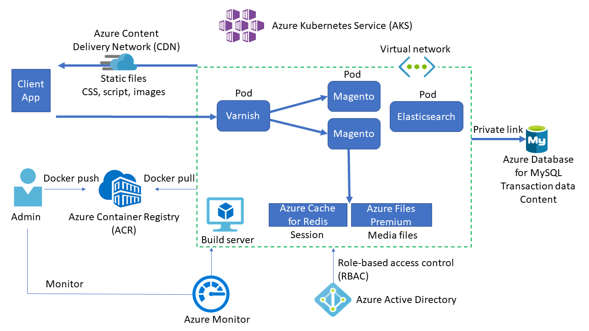
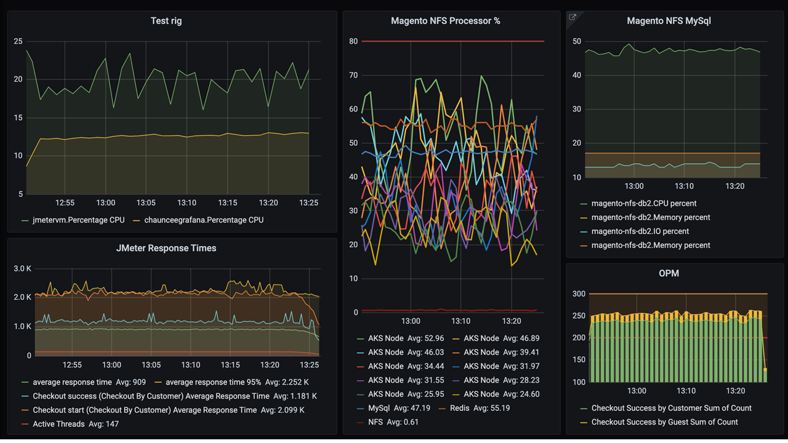

# Magento in Azure

Magento is an open-source e-commerce platform written in PHP. This reference architecture shows Magento deployed to Azure Kubernetes Service (AKS), and describes common best practices for hosting Magento on Azure.

## Architecture

- [Azure Kubernetes Service (AKS)](https://azure.microsoft.com/services/kubernetes-service/) deploys the Kubernetes cluster of Varnish, Magento, and [Elasticsearch](https://www.elastic.co/elasticsearch/) in different pods.
- AKS creates a [virtual network](https://azure.microsoft.com/services/virtual-network/) to deploy the agent nodes. Create the virtual network in advance to set up subnet configuration, private link, and egress restriction.
- [Varnish HTTP Cache](https://varnish-cache.org/intro/index.html#intro) installs in front of the HTTP server to act as a full-page cache.
- [Azure Database for MySQL](https://azure.microsoft.com/services/mysql/) stores transaction data like orders and catalogs. Version 8.0 is recommended.
- [Azure Files Premium](https://azure.microsoft.com/services/storage/files/) or an equivalent *network-attached storage (NAS)* system stores media files like product images, Magento needs a Kubernetes-compatible file system that can mount a volume in *ReadWriteMany* mode, like Azure Files Premium, SoftNAS, [Azure NetApp Files](https://azure.microsoft.com/services/netapp/), or GlusterFS. The current solution uses SoftNAS.
- A [content delivery network (CDN)](https://azure.microsoft.com/services/cdn/) serves static content like CSS, JavaScript, and images. Serving content through a CDN minimizes network latency between users and the datacenter. A CDN can remove significant load from NAS by caching and serving static content.
- [Azure Cache for Redis](https://azure.microsoft.com/services/cache/) stores session data. Premium SKU allows placing caches into the same virtual network with other components, to improve performance and restrict access through topology and access policies.
- AKS uses [Azure Active Directory (Azure AD)](https://azure.microsoft.com/services/active-directory/) identity to create and manage other Azure resources like Azure load balancers, user authentication, role-based access control, and managed identity.
- [Azure Container Registry (ACR)](https://azure.microsoft.com/services/container-registry/) stores the private [Docker](https://www.docker.com/) images that are deployed to the AKS cluster. You can use other container registries like Docker Hub. Note that the default Magento install writes some secrets to the image.
- [Azure Monitor](https://azure.microsoft.com/services/monitor/) collects and stores metrics and logs, including platform metrics for Azure services and application telemetry. Azure Monitor integrates with AKS to collect controller, node, and container metrics, container logs, and master node logs.

## Security considerations

Here are some security considerations for this architecture:

- Configure a [private link](https://azure.microsoft.com/services/private-link/) for MySQL so that the traffic between clients and MySQL isn't exposed to the public internet. For more information, see [What is Azure Private Link](/azure/private-link/private-link-overview).

- You could add [Azure Application Gateway](https://azure.microsoft.com/services/application-gateway/) ingress to support secure socket layer (SSL) termination.

### Role-based access control (RBAC)

Kubernetes and Azure both have mechanisms for *role-based access control (RBAC)*.

- Azure RBAC controls access to resources in Azure, including the ability to create new Azure resources. RBAC can assign permissions to users, groups, or *service principals*. A service principal is a security identity used by applications.

- Kubernetes RBAC controls permissions to the Kubernetes API. For example, creating pods and listing pods are actions that RBAC can authorize to users.

AKS integrates the Azure and Kubernetes RBAC mechanisms. When you create an AKS cluster, you can configure it to use Azure AD for user authentication. For details on how to set up Azure AD integration, see [Integrate Azure Active Directory with Azure Kubernetes Service](/azure/aks/aad-integration).

To assign Kubernetes permissions to users, create *roles* and *role bindings*:

- A *Role* is a set of permissions that apply within a namespace. Permissions are defined as verbs like get, update, create, or delete, on resources like pods or deployments.
- *RoleBinding* assigns users or groups to a role.
- A *ClusterRole* object is like a role but applies to the entire cluster, across all namespaces. To assign users or groups to a ClusterRole, create a *ClusterRoleBinding*.
  
## Scalability considerations

Here are some ways to optimize scalability for this architecture:

### Media and static files

- Adequately provision Azure Files or another NAS system. Magento can store thousands of media files such as product images. Be sure to provision the Azure Files or other NAS product with sufficient *input/output operations per second (IOPS)* capacity to handle the load.

- Minimize the size of static content such as HTML, CSS, and JavaScript. [Minification](https://devdocs.magento.com/cloud/deploy/static-content-deployment.html#minify-content) can reduce bandwidth costs and provide a more responsive experience for users.

### Database connection

- Turn on *persistent connection* to the MySQL database, so Magento keeps reusing the existing connection instead of creating a new one for every request. To turn on persistent connection, add the following line to the `db` section of the Magento *env.php* file:
  
  `'persistent' => '1'`

- If MySQL consumes too much CPU, reduce the utilization by turning off *product count* from layered navigation in Magento [configuration](https://devdocs.magento.com/guides/v2.4/config-guide/cli/config-cli-subcommands.html#config-cli-summary):
  
  `magento config:set -vvv catalog/layered_navigation/display_product_count 0`

### Caching

- Configure [OPcache](https://www.php.net/manual/opcache.configuration.php) for PHP code caching and optimization.
  
  Make sure the following directives are set and uncommented in *php.ini*:
  
  `opcache.enable=1`
  `opcache.save_comments=1`
  `opcache.validate_timestamps=0`
  
- To avoid unnecessary performance degradation, disable the Azure Cache for Redis option to persist stored data. For more information, see [How to configure data persistence for a Premium Azure Cache for Redis](/azure/azure-cache-for-redis/cache-how-to-premium-persistence).

- Load balance the Varnish cache by running multiple instances on pods so that it can scale.

### Logging

Limit access logging, to avoid performance issues and prevent exposing sensitive data like client IP addresses.

- Use the following command to limit Varnish logging to error-level:
  
  `varnishd -s malloc,1G -a :80 -f /etc/varnish/magento.vcl && varnishlog -q "RespStatus >= 400 or BerespStatus >= 400"`

- If you use Apache web server for ingress, limit Apache logging to error-level by adding the following line to the Magento `VirtualHost` entry in Apache server configuration:
  
  `CustomLog /dev/null common`

- Turn off PHP-FPM access logs by commenting out the `access.log` setting in all PHP-FPM configurations.

## Availability considerations

Consider these ways to optimize availability for this architecture:

### Health probes

Kubernetes defines two types of health probe:
- The *readiness probe* tells Kubernetes whether the pod is ready to accept requests.
- The *liveness probe* tells Kubernetes whether a pod should be removed and a new instance started.

Customize the Kubernetes health probes and use them to tell if a pod is in good health.

### Zones or regions

Consider deploying the app to multiple regions or zones for higher availability. To avoid unnecessary latency between services, make sure all services and deployed components such as the AKS cluster and the Redis cache are colocated in the same region.

### Resource constraints

Resource contention can affect service availability. Define container resource constraints so that no single container can overwhelm the cluster memory and CPU resources. For non-container resources like threads or network connections, consider using the [Bulkhead pattern](/azure/architecture/patterns/bulkhead) to isolate resources.

Use resource quotas to limit the total resources allowed for a namespace, so the front end can't starve the backend services for resources or vice-versa.

## Cost considerations

- Do capacity planning based on performance testing.
- Make sure to over-provision services to avoid unnecessary cost.
- Use the [Azure pricing calculator](https://azure.microsoft.com/pricing/calculator) to estimate costs.
- See other cost considerations in [Principles of cost optimization](/azure/architecture/framework/cost/overview) in the Microsoft Azure Well-Architected Framework.

## DevOps considerations

Here are some operational considerations for this architecture:

- In this architecture, MySQL doesn't expose a public endpoint. If the build server stores configuration settings to the backend MySQL database, deploy that server into the same virtual network subnet that MySQL connects to via service endpoint.

- Use ACR or another container registry like Docker Hub to store the private Docker images that are deployed to the cluster. AKS can authenticate with ACR by using its Azure AD identity.

### Monitoring

Azure Monitor provides key metrics for all Azure services, including container metrics from AKS. Create a dashboard to show all metrics in one place.

Another monitoring option is to use [Grafana](https://grafana.com/) dashboard:

### Performance testing

Use [Magento Performance Toolkit](https://github.com/magento/magento2/tree/2.4/setup/performance-toolkit) for performance testing. The toolkit uses [Apache JMeter](https://jmeter.apache.org/) to simulate customer behaviors like signing in, browsing products, and checking out.

## Deploy the solution

To deploy the reference implementation for this architecture, follow the steps in the GitHub repo.

## Related resources
- [Magento 2 code repo](https://github.com/magento/magento2)
- [Magento Developer Documentation](https://devdocs.magento.com/)
- [Varnish HTTP Cache](https://varnish-cache.org/)
