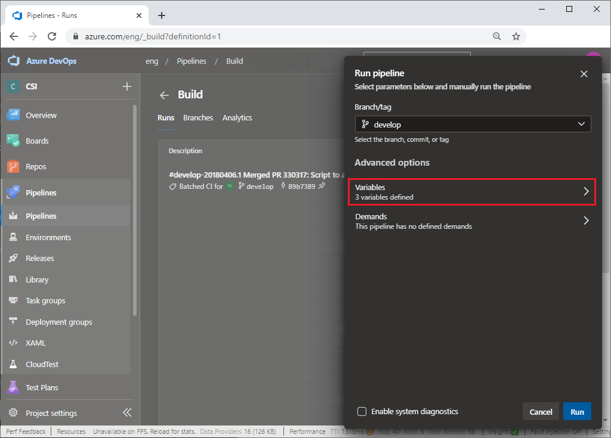
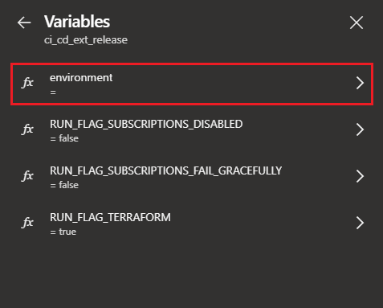

An environment is a collection of resources that can be targeted by deployment jobs in a pipeline. By leveraging an environment to deploy the resources, Azure DevOps is able to keep a history of all of the deployments, and quickly access the commits related to a deployment.

This article describes how to use the `ci_cd_ext_release` or `tf_destroy_env` pipeline to create or delete a new cloud development or testing environment. The `ci_cd_ext_release` pipeline uses the **gridwich-cicd-variables.single_env** variable group.

To create the Azure DevOps project, pipelines, and variable groups, see [Gridwich Azure DevOps setup](set-up-azure-devops.yml).

The following procedures use placeholder project name `gridwich-clone`, app name `cl1grw`, and environment name `f233`. Replace these placeholders with your own values as appropriate.

## Create an environment in Azure DevOps

1. In your organization's Azure DevOps `gridwich-clone` project, select **Pipelines** in the left navigation, and then select the **ci_cd_ext_release** pipeline.

1. Select **Run pipeline**.

1. In the **Run pipeline** dialog, select the branch that you want to deploy to Azure, and then select **Variables**.

   

1. In the **Variables** dialog, select the **environment** variable.

   

1. In the **Update variable** dialog, enter a value with a four-character maximum length, and then select **Update**. The four-character limitation ensures that your full Gridwich Storage Account name won't exceed the [24-character maximum](/azure/storage/common/storage-account-overview#naming-storage-accounts) for Azure Storage Accounts.

   

1. Update the **RUN_FLAG_SUBSCRIPTIONS_DISABLED** variable to `true` if you want subscriptions to be skipped.

1. Update the **RUN_FLAG_SUBSCRIPTIONS_FAIL_GRACEFULLY** to `true` if you want subscriptions to fail gracefully.

1. In the **Run pipeline** dialog, select **Run**.

   

The pipeline steps deploy the application into Azure, but they don't set up any of the identity principals or their access rights to Azure resources. An admin must follow the instructions in [Pipeline-generated admin scripts](run-admin-scripts.yml) to complete the setup.

To verify that your environment is up and running, in the Azure portal, confirm that resource groups exist with your environment name.

You should now be able to reach the Event Grid Viewer endpoint and see the web app. Use the endpoint without the `api/eventgrid` URI segment in a web browser to open a URL like: `https://cl1grw-grw-wa-viewer-f233.azurewebsites.net`.

Follow [Test Azure Media Services V3 encoding](test-encoding.yml) to fully test your environment.

## Azure resources

Gridwich deploys the following resources to Azure for an application named `gridwich` and environment named `sb`:

## Delete an environment

To delete an environment:

1. In the `gridwich-clone` project left navigation, select **Pipelines**, and then select and run the **tf_destroy_env** pipeline with the environment name you want to delete.

   Make sure to set the **RUN_FLAG_SUBSCRIPTIONS_DISABLED** variable to the same value used when creating the environment.

1. Under **Pipelines** > **Environments**, delete the environment.

1. In the Azure portal, go to the Azure Storage Account that stores your **.tfstate**, and delete the environment file, for example **f233.tfstate**. The Gridwich Storage Account is **gridwichtfstate** in the **gridwich-terraform-rg** resource group.

## Next steps

Product documentation:

- [Gridwich cloud media system](gridwich-architecture.yml)
- [What is Azure Blob storage?](/azure/storage/blobs/storage-blobs-overview)
- [What is Azure DevOps?](/azure/devops/user-guide/what-is-azure-devops)
- [What is Azure Pipelines?](/azure/devops/pipelines/get-started/what-is-azure-pipelines)

Microsoft Learn modules:

- [Configure blob storage](/learn/modules/configure-blob-storage)
- [Explore Azure Storage services](/learn/modules/azure-storage-fundamentals)
- [Introduction to Azure DevOps](/learn/modules/get-started-with-devops)

## Related resources

- [Gridwich keys and secrets management](maintain-keys.yml)
- [Gridwich operations for Azure Storage](gridwich-storage-service.yml)
- [Gridwich project naming and namespaces](gridwich-project-names.yml)
- [Test Media Services V3 encoding](test-encoding.yml)
