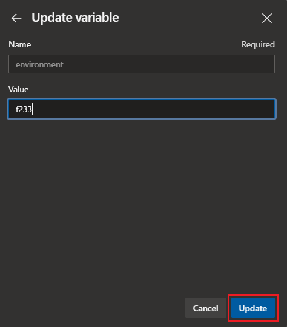

# Create or delete an environment

This article describes how to use the `ci_cd_ext_release` or `tf_destroy_env` pipeline to create or delete a cloud development or testing environment. The `ci_cd_ext_release` pipeline uses the `gridwich-cicd-variables.single_env` variable group.

To create the Azure DevOps project, pipelines, and variable groups, see [Gridwich Azure DevOps setup](set-up-azure-devops.md).

The following procedures use placeholder project name `gridwich-clone`, app name `cl1grw`, and environment name `f233`. Replace these placeholders with your own values as appropriate.

## Create an environment

1. In the `gridwich-clone` project left navigation, select **Pipelines** and then select the **ci_cd_ext_release** pipeline.
   
1. Select **Run**.
   
   
   
1. In the **Run pipeline** dialog, select the branch that you want to deploy to Azure, and then select **Variables**.
   
   
   
1. Update the `environment` variable to a four-character maximum environment name.
   
   Due to Gridwich naming conventions and character restrictions on Azure Storage Account names, make sure your environment name won't exceed the [24-character maximum](/azure/storage/common/storage-account-overview#naming-storage-accounts) for the Gridwich Azure Storage Account name.
   
   
   
1. Update the `RUN_FLAG_SUBSCRIPTIONS_DISABLED` variable to `true` if you want subscriptions to be skipped.
   
1. Update the `RUN_FLAG_SUBSCRIPTIONS_FAIL_GRACEFULLY` to `true` if you want subscriptions to fail gracefully.
   
1. Select **Update**, and in the **Run pipeline** dialog, select **Run**.

The pipeline steps deploy the application into Azure, but they don't set up any of the identity principals or their access rights to Azure resources. An admin must follow the instructions in [Pipeline-generated admin scripts](admin-scripts.md) to complete the setup.

To verify that your environment is up, in the Azure portal, confirm that resource groups with your environment name exist.

You should now be able to reach the Event Grid Viewer endpoint and see the web app. Use the endpoint without the `api/eventgrid` URI segment in a web browser to open a URL like the following in a web browser: `https://cl1grw-grw-wa-viewer-f233.azurewebsites.net`.

Follow the [walk through Testing AMS V3 Encoding](test-encoding.md) to fully test your environment.

## Delete an environment

1. In the `gridwich-clone` project left navigation, select **Pipelines**, and then select and run the **tf_destroy_env** pipeline with the environment name you want to delete.
   
   Make sure to set the `RUN_FLAG_SUBSCRIPTIONS_DISABLED` variable to the same value used when creating the environment.
   
1. Under **Pipelines** > **Environments**, delete the environment.
   
1. In the Azure portal, go to the Azure Storage Account that is storing your `.tfstate`, and delete the environment file, for example `f233.tfstate`. The Gridwich Storage Account is `gridwichtfstate` in the `gridwich-terraform-rg` resource group.

