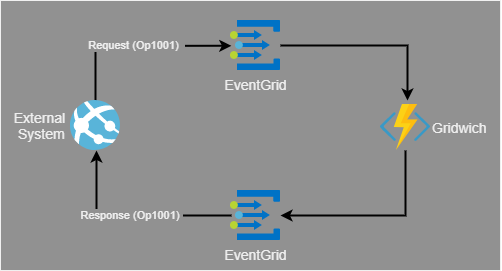
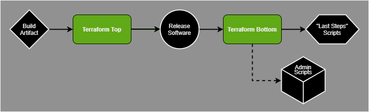
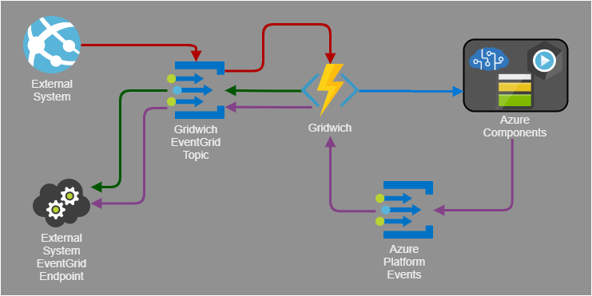
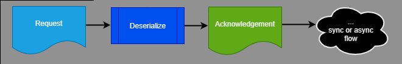
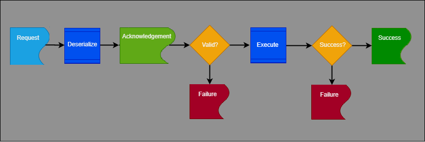
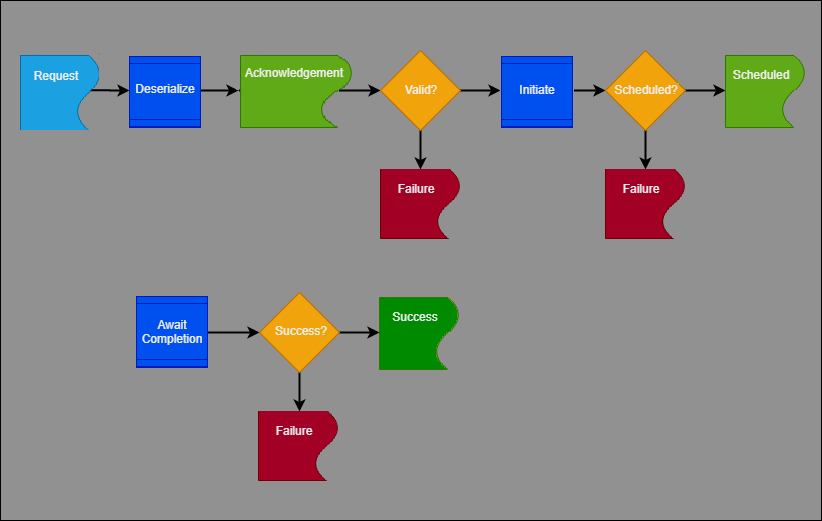

The Gridwich pipelines ingest, process, store, and deliver media assets with the help of two new methods, the *Azure Event Grid Sandwich* and the *Terraform Sandwich*.

## Architecture

The Gridwich architecture features two *sandwiches* that address the requirements of asynchronous event processing and infrastructure as code:

- The *Event Grid sandwich* abstracts away remote and long-running processes like media encoding from the external saga workflow system by sandwiching them between two Event Grid handlers. This sandwich lets the external system send a request event, monitor scheduled events, and wait for an eventual success or failure response that might arrive minutes or hours later.

  

  *Download a [Visio file](https://arch-center.azureedge.net/gridwich-architecture.vsdx) of this architecture.*

- The *Terraform Sandwich* is a multi-stage [Terraform](https://www.terraform.io/) pattern updated to support [infrastructure as code](/devops/deliver/what-is-infrastructure-as-code). Separating infrastructure and software releases means the Azure Functions app must be released and running before Terraform can deploy the Event Grid subscription. To address this requirement, there are two Terraform jobs in the CI/CD pipeline:

  

  - Terraform 1 creates all the resources except for the Azure Event Grid subscriptions.
  - Terraform 2 creates the Event Grid subscriptions after the software is up and running.

  This way, Terraform can wholly manage and deploy the solution infrastructure, even when not all the [Azure resources](https://terraform.io/docs/providers/azurerm/) can be created before the software artifacts are deployed.

### Workflow

The Gridwich request and response process covers the following requests:

- Creation
- Transport
- Reception
- Dispatch to Gridwich components
- Acknowledgment and actions
- Responses

The following steps describe the request and response process between an external system and Gridwich. In Gridwich, the external system is a MAM and saga workflow orchestration system. For the exact formats of Gridwich operations message events, see [Gridwich message formats](gridwich-message-formats.yml).

  

1. The external system creates a request and sends it to the request broker.

1. The request broker is responsible for dispatching requests to Gridwich request listeners in a traditional publication-subscription model. In this solution, the request broker is Azure Event Grid. All requests are encapsulated using the [Event Grid event schema](/azure/event-grid/event-schema).

1. The Gridwich Azure Functions app consumes events from Event Grid. For better throughput, Gridwich defines an [HTTP endpoint](/azure/azure-functions/functions-bindings-http-webhook) as a push model that Event Grid initiates, rather than the [Event Grid binding](/azure/azure-functions/functions-bindings-event-grid) polling model that Azure Functions provides.

1. The Azure Functions App reads the event properties and dispatches events to parts of the Gridwich code that handle that event type and version.

1. Any handler that will work with the current request uses the common [EventGridHandlerBase](https://github.com/mspnp/gridwich/blob/main/src/Gridwich.Core/src/Bases/EventGridHandlerBase.cs) class to immediately send an Acknowledgment message when it receives the request. The handler then dispatches the work to the derived class.

   Gridwich request workflows can be synchronous or asynchronous in nature. For requests that are easy to perform and fast to complete, a [synchronous handler](#synchronous-event-processing) does the work and returns the Success or Failure event almost immediately after the Acknowledgment is sent.

   For requests that are long-running, an [asynchronous handler](#asynchronous-event-processing) evaluates the request, validates arguments, and initiates the long-running operation. The handler then returns a Scheduled response to confirm that it requested the work activity. On completing the work activity, the request handler is responsible for providing a Success or Failure completed event for the work.

   The event publication service communicates the Acknowledgment, Failure, Scheduled, or Success messages to the Event Grid request broker.

1. The event publisher in the Azure Function sends the response event to an Event Grid topic, which acts as a reliable message broker. The external system subscribes to the topic and consumes the messages. The Event Grid platform provides its normal retry logic for publication to the external system.

#### Message order

While an Acknowledgment precedes both the Success and Scheduled responses, Gridwich doesn't guarantee that a Scheduled response will always precede the corresponding Success response. A valid response sequence could be either **Acknowledged > Scheduled > Success** or **Acknowledged > Success > Scheduled**.

#### Request failures

Request failures can be caused by bad requests, missing pre-conditions, processing failures, security exceptions, or unhandled exceptions. Almost all failures have the same message form, and include the original [operation context](#operation-context) value. The common [EventGridHandlerBase](https://github.com/mspnp/gridwich/blob/main/src/Gridwich.Core/src/Bases/EventGridHandlerBase.cs) class typically sends Failure responses to Event Grid via the Azure Function event publisher interface. [Application Insights](/azure/azure-monitor/app/app-insights-overview) also logs failures via [structured logging](gridwich-logging.yml).

### Operation context

The external system might generate thousands of requests per day, per hour, or per second. Each [request event](https://github.com/mspnp/gridwich/blob/main//src/Gridwich.Core/src/DTO/Requests/RequestBaseDTO.cs) to Gridwich must include a JSON object property named `operationContext`.

If a request contains an operation context, like `{"id"="Op1001"}`, each Gridwich [response](https://github.com/mspnp/gridwich/blob/main//src/Gridwich.Core/src/DTO/Responses/ResponseBaseDTO.cs) must include a corresponding opaque *operation context*, whether the request is short-running or long-running. This operation context persists through the lifetime of even very long-running requests.

The response requirement is for a "corresponding" rather than the "same" JSON object. Gridwich features like [context muting](gridwich-storage-service.yml#context-muting) take advantage of the fact that the external system processes the returned JSON object in a top-down fashion.

Specifically, the external system has:

- No dependency on property ordering, so Gridwich can send back an object with the same properties, possibly in a different order. For example, `{"a":1,"b":2}` vs. `{"b":2,"a":1}`.

- No issue with extra properties being present, so Gridwich, having received `{"b":2,"a":1}`, could validly return `{"a":1,"b":2,"~somethingExtra":"yes"}`. To minimize the possibility of collisions, Gridwich prefixes the names of added properties with a tilde (~), for example `~muted`.

- No JSON-formatting dependencies. For example, there are no assumptions about where whitespace padding may fall within the string representation of the JSON. Gridwich capitalizes on this lack of formatting dependency by compressing out unneeded whitespace in string representations of the JSON objects. See [JSONHelpers.SerializeOperationContext](https://github.com/mspnp/gridwich/blob/main/src/Gridwich.Core/src/Helpers/JSONHelpers.cs).

#### Saga participants and operation context

In the Gridwich saga orchestration system, each [saga participant](gridwich-saga-orchestration.yml#saga-participants) contributes one or more work activities to the system. Each saga participant works independently of the other participants, and more than one saga participant might act on a single request.

Each of the saga participants must retain the operation context, but may implement it differently. For example:

- Short-running synchronous operations retain the operation context.
- Azure Storage provides an opaque string property called `ClientRequestId` for most operations.
- Azure Media Services v3 has a `Job.CorrelationData` property.
- Other cloud APIs offer similar concepts to an opaque operation context that they can return when signaling progress, completion, or failure.

For more information about sagas and saga participants, see [Saga orchestration](gridwich-saga-orchestration.yml).

### Synchronous and asynchronous handlers

Every event handler in the system uses a common [EventGridHandlerBase](https://github.com/mspnp/gridwich/blob/main/src/Gridwich.Core/src/Bases/EventGridHandlerBase.cs) class to provide generic services such as request acknowledgment, failure handling, and publication of response events. The event publication service communicates the Acknowledgment, Failure, Scheduled, or Success messages to the Event Grid request broker.

Any handler that plans to work with the current request must provide an acknowledgment when it receives the request. The base class immediately sends an Acknowledgment message, and then dispatches the work to the derived class.

#### Synchronous event processing

For requests that are easy to perform and fast to complete, the handler does the work synchronously and returns the Success event, with its operation context, almost immediately after the Acknowledgment is sent.

.

For example, the [ChangeBlobTierHandler](https://github.com/mspnp/gridwich/blob/main/src/Gridwich.SagaParticipants.Storage.AzureStorage/src/EventGridHandlers/ChangeBlobTierHandler.cs) is a simple synchronous flow. The handler gets a Request data transfer object (DTO), calls and awaits a single service to do the work, and returns a Success or Failure response.

:::image type="content" border="false" source="media/sync-example.png" alt-text="Diagram showing the ChangeBlobTierHandler synchronous flow example." lightbox="media/sync-example.png":::

#### Asynchronous event processing

Some requests are long-running. For example, encoding media files can take hours. In these cases, an *asynchronous request handler* evaluates the request, validates arguments, and initiates the long-running operation. The handler then returns a Scheduled response to confirm that it requested the work activity.

On completing the work activity, the request handler is responsible for providing a Success or Failure completed event for the work. While remaining stateless, the handler must retrieve the original [operation context](#operation-context) and place it in the Completed event message payload.

For example, the [BlobCopyHandler](https://github.com/mspnp/gridwich/blob/main/src/Gridwich.SagaParticipants.Storage.AzureStorage/src/EventGridHandlers/BlobCopyHandler.cs) shows a simple asynchronous flow. The handler gets a Request DTO, calls and awaits a single service to initiate the work, and publishes a Scheduled or Failure response.

:::image type="content" border="false" source="media/async-example-scheduled.png" alt-text="Diagram showing the BlobCopyHandler asynchronous flow example with event scheduled." lightbox="media/async-example-scheduled.png":::

To complete the long-running request flow, the [BlobCreatedHandler](https://github.com/mspnp/gridwich/blob/main/src/Gridwich.SagaParticipants.Storage.AzureStorage/src/EventGridHandlers/BlobCreatedHandler.cs) consumes the platform event `Microsoft.Storage.BlobCreated`, extracts the original operation context, and publishes a Success or Failure completion response.

:::image type="content" border="false" source="media/async-example-success.png" alt-text="Diagram showing the BlobCopyHandler asynchronous flow example with event successful." lightbox="media/async-example-success.png":::

### Long-running functions

When Gridwich deploys a new Functions App, it may drop current long-running processes. If these processes end abruptly, there's no status and no report back to the caller. Gridwich must deploy new Functions Apps while gracefully handling the transition for long-running functions and not missing any messages.

The solution must:
- Not keep the state of running instances of the Gridwich app.
- Not kill processes just because something new is deploying or a new message is requesting the same activity.
- Not invoke any additional Azure workloads, like Durable Functions, Functions Apps, Logic Apps, or Azure Container Instances.

Gridwich uses Azure Functions *slot deployment* and *cancellation tokens* to meet these requirements for reliable, long-running functions.

The following diagram shows how most Gridwich jobs work. The green box represents a job that Gridwich passes to an external service. Gridwich then reacts in an event-driven way to the status. The red box shows a  function that is long-running on Gridwich itself.

:::image type="content" border="false" source="media/long-running-functions.png" alt-text="Diagram showing short-running and long-running functions." lightbox="media/long-running-functions.png":::

The Functions runtime adds the cancellation token when the application is shutting down. Gridwich detects the token and returns error codes for all requests and currently running processes.

Slot deployment deploys new software versions. The production slot has the running application, and the staging slot has the new version. Azure does a series of deployment steps and then swaps the slot instances. The old instance restarts as the last step of the process.

Gridwich waits 30 seconds after remapping the host names, so for HTTP-triggered functions, Gridwich guarantees at least 30 seconds before the restart for the old production slot. Other triggers might be controlled by app settings that don't have a mechanism to wait on app setting updates. Those functions risk interruption if execution starts right before the old production slot restarts.

For more information, see [What happens during a slot swap for Azure Functions](/azure/azure-functions/functions-deployment-slots#swap-operations) and [Azure Functions deployment slots](/azure/azure-functions/functions-deployment-slots).

### Components

The Gridwich media processing solution uses Azure Event Grid, Azure Functions, Azure Media Services, Azure Blob Storage, Azure Logic Apps, and Azure Key Vault. The CI/CD and saga orchestration processes use Azure Repos, Azure Pipelines, and Terraform.

- [Azure Event Grid](https://azure.microsoft.com/services/event-grid/) manages the routing of Gridwich events, with two sandwiched Event Grid jobs that allow for asynchronous media event processing. Event Grid is a highly reliable request delivery endpoint. The Azure platform provides necessary request delivery endpoint uptime and stability.

  Gridwich encapsulates events within the [Event Grid schema](/azure/event-grid/event-schema) `Event.Data` property object, which is opaque to the Event Grid broker and transport layer. Gridwich also uses the `eventType` and `dataVersion` object fields to route events. So that the Event Grid request broker can be substituted with other publication-subscription event brokers, Gridwich depends on the fewest event fields possible, and doesn't use the `topic` or `subject` fields.

- [Azure Functions](https://azure.microsoft.com/services/functions/) lets you run event-triggered code without having to explicitly provision or manage infrastructure. Gridwich is an Azure Functions App that hosts execution of various functions.

- [Azure Media Services](https://azure.microsoft.com/services/media-services/) is a cloud-based workflow platform for indexing, packaging, protecting, and streaming media. Media Services uses [Digital Rights Management (DRM)](https://en.wikipedia.org/wiki/Digital_rights_management) to protect content, and supports [Microsoft PlayReady](https://www.microsoft.com/playready/overview/), [Google Widevine](https://www.widevine.com/solutions/widevine-drm), and [Apple FairPlay](https://developer.apple.com/streaming/fps/). Gridwich lets you [scale Media Services resources](media-services-setup-scale.yml#scale-media-services-resources) to your expected workload.

- [Azure Blob Storage](https://azure.microsoft.com/services/storage/blobs/) provides scalable, cost-efficient cloud storage and access for unstructured data like media assets. Gridwich uses both Azure Storage block blobs and containers.

- [Azure Logic Apps](https://azure.microsoft.com/services/logic-apps/) lets you create automated cloud workflow solutions. Gridwich uses Logic Apps to [manage Key Vault keys and secrets](maintain-keys.yml).
- [Azure Key Vault](https://azure.microsoft.com/services/key-vault/) safeguards cryptographic keys, passwords, and other secrets that Azure and third-party apps and services use.

- [Azure DevOps](https://azure.microsoft.com/services/devops/) is a set of developer and operations services, including Git-based code repositories and automated build and release pipelines, that integrate with Azure. Gridwich uses [Azure Repos](https://azure.microsoft.com/services/devops/repos/) to store and update the code projects, and [Azure Pipelines](https://azure.microsoft.com/services/devops/pipelines/) for CI/CD and other workflows.

- [Terraform](https://www.terraform.io/) is an open-source tool that uses Infrastructure as Code to provision and manage infrastructures and services.

### Alternatives

- [Durable Functions](/azure/azure-functions/durable/durable-functions-overview), which have a built-in state store for long-running operations, could also provide an opaque operation context. Durable Functions could create a series of tasks within an operation, and save the operation context as an input or output for the operation. In fact, Gridwich could use Durable Functions for all work activities, but this approach would increase code complexity.

- You could achieve better decoupling from the Event Grid infrastructure by refactoring the [EventGridHandlerBase](https://github.com/mspnp/gridwich/blob/main/src/Gridwich.Core/src/Bases/EventGridHandlerBase.cs) into a `RequestHandlerBase`, and removing any linkage to Event Grid objects or types. This refactored class would deal only in base DTOs, and not in transport-specific object types. Similarly, the [IEventGridDispatcher](https://github.com/mspnp/gridwich/blob/main/src/Gridwich.Core/src/Interfaces/IEventGridDispatcher.cs) could become an `IResponseDispatcher` with a specific `EventGridDispatcher` implementation.

- The [Gridwich.SagaParticipants.Storage.AzureStorage](https://github.com/mspnp/gridwich/blob/main/src/Gridwich.SagaParticipants.Storage.AzureStorage/) library also contains storage services that other saga participants use. Having the interfaces in a core project avoids Inversion of Control (IoC) issues, but you could extract the interfaces into a separate core storage infrastructure gateway library.

- The Gridwich Functions App uses [dependency injection](/azure/azure-functions/functions-dotnet-dependency-injection) to register one or more request handlers for specific event types and data versions. The app injects the [EventGridDispatcher](https://github.com/mspnp/gridwich/blob/main/src/Gridwich.Core.EventGrid/src/EventGridDispatcher.cs) with the collection of Event Grid event handlers, and the dispatcher queries the handlers to determine which ones will process the event.

  Alternatively, you could use the event subscription and filtering mechanism that the Event Grid platform provides. This mechanism imposes a 1:1 deployment model, where one Azure Function hosts only one event handler. Although Gridwich uses a 1:many model, its [clean architecture](gridwich-clean-monolith.yml) means that refactoring the solution for 1:1 wouldn't be difficult.

- For an alternative microservices rather than monolithic Gridwich architecture, see [Microservices alternative](gridwich-clean-monolith.yml#microservices-alternative).

## Scenario details

A well-known mass media and entertainment conglomerate replaced their on-premises video streaming service with a cloud-based solution for ingesting, processing, and publishing video assets. The company's main goals were to take advantage of Azure cloud capacity, cost, and flexibility to:

- Ingest raw video files, process and publish them, and fulfill media requests.
- Improve both encoding and new intake and distribution capabilities at scale, and with a cleanly architected approach.
- Implement continuous integration and delivery (CI/CD) for the media asset management (MAM) pipeline.

To meet these goals, the Microsoft engineering team developed Gridwich, a stateless event-processing framework driven by an external [saga workflow orchestration system](gridwich-saga-orchestration.yml).

### Potential use cases

The engineering team developed Gridwich to align with principles and industry standards for:

- [Clean monolith architecture](gridwich-clean-monolith.yml)
- [Project structure and naming](gridwich-project-names.yml)
- [CI/CD](gridwich-cicd.yml)
- [Content protection and digital rights management (DRM)](gridwich-content-protection-drm.yml)
- [Azure Storage usage and scaling](gridwich-storage-service.yml)
- [Logging](gridwich-logging.yml)

The Gridwich system embodies best practices for processing and delivering media assets on Azure. Although the Gridwich system is media-specific, the message processing and eventing framework can apply to any stateless event processing workflow.

## Deploy this scenario

- [Set up Azure DevOps](set-up-azure-devops.yml) Gridwich project, repo, pipelines, and variable groups.
- [Run the admin scripts](run-admin-scripts.yml) for Azure permissions.
- [Set up a local development environment](set-up-local-environment.yml).

## Next steps

- [Terraform starter project for Azure Pipelines](https://github.com/microsoft/terraform-azure-devops-starter)
- [Azure Function with Event Grid and Terraform Sandwich sample](https://github.com/Azure-Samples/azure-functions-event-grid-terraform). Subscribe an Azure Function to Event Grid Events via Terraform, using a Terraform Sandwich.
- [MediaInfoLib with Azure Storage](https://github.com/Azure-Samples/functions-dotnet-core-mediainfo). Azure Functions and console samples that use cross-platform .NET Core to retrieve a report on a media file stored in Azure Storage.
- [Event Grid Viewer Blazor](https://github.com/Azure-Samples/eventgrid-viewer-blazor). An EventGrid Viewer application, using Blazor and SignalR, with Azure Active Directory authorization support.
- [Azure Function with Managed Service Identity for Azure Storage](https://github.com/Azure-Samples/functions-storage-managed-identity). Use Managed Service Identity between Azure Functions and Azure Storage.
- [Handling serverless Key Vault rotation](https://github.com/Azure-Samples/serverless-keyvault-secret-rotation-handling). Use Event Grid and Logic Apps to handle Azure Key Vault secret rotation changes that an Azure Function uses.
- [Updates to existing media-services-v3-dotnet-core-functions-integration sample](https://github.com/Azure-Samples/media-services-v3-dotnet-core-functions-integration/tree/master/Encoding)
- [Updates to vscode-dev-containers repo](https://github.com/microsoft/vscode-dev-containers/tree/master/containers/azure-functions-dotnetcore-3.1). Updates to the vscode-dev-containers repo, adding the Azure Functions v3 and .NET Core 3.1 devcontainer.

## Related resources

- [Understand Azure Pipelines to Terraform variable flow](variable-group-terraform-flow.yml)
- [Set up content protection and DRM](gridwich-content-protection-drm.yml)
- [Create a new sandbox or test cloud environment](create-delete-cloud-environment.yml)
- [Maintain and manage Key Vault keys](maintain-keys.yml)
- [Scale Media Services resources](media-services-setup-scale.yml#scale-media-services-resources)
