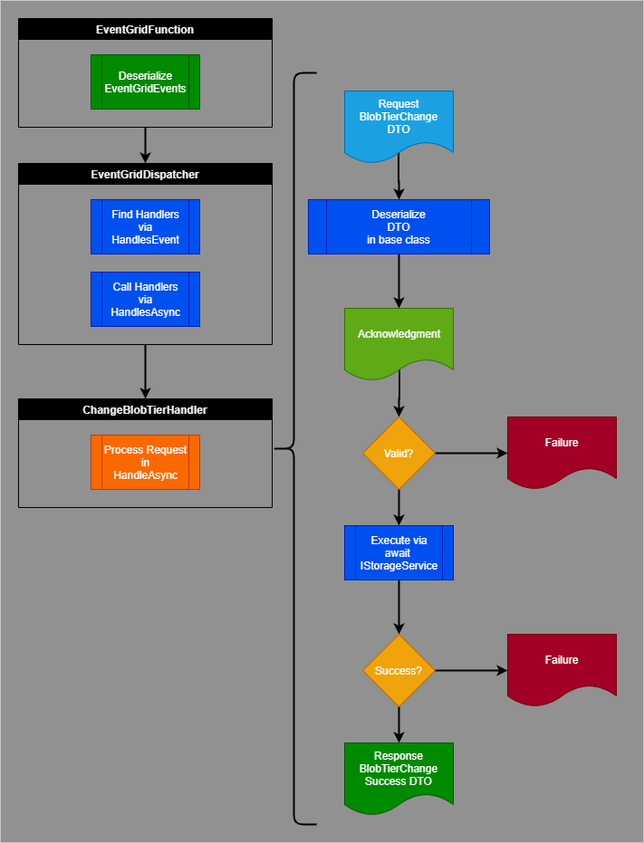
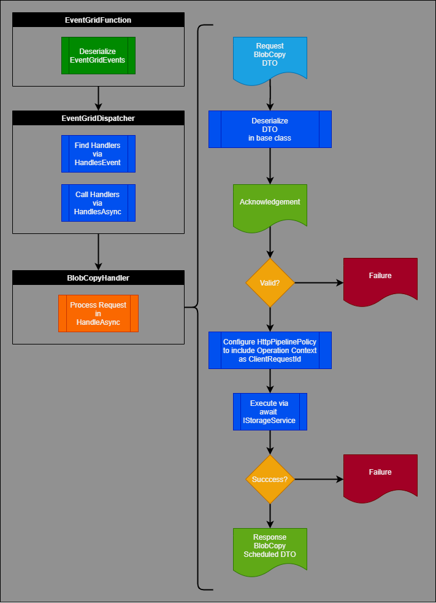
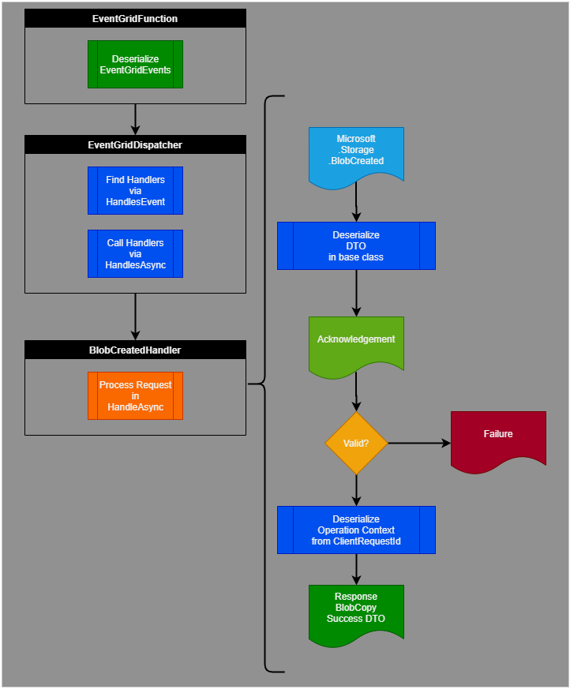
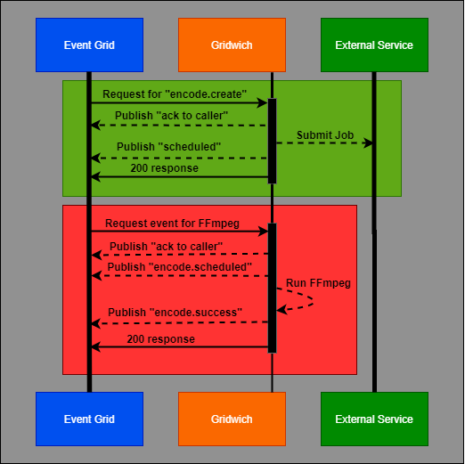

# Gridwich media processing system

A mass media and entertainment conglomerate replaced their on-premises video streaming service with a cloud-based solution for ingesting, processing, and publishing video assets. Gridwich is a stateless event-processing framework driven by an external saga workflow orchestration system. Gridwich pipelines ingest, process, store, and deliver media assets with the help of two new methods, Event Grid Sandwiches and Terraform Sandwiches.

The Microsoft engineering team developed Gridwich to align with best principles and practices for:
- [Clean monolith architecture]
- [Project structure and naming]
- [Continuous integration and delivery (CI/CD)](gridwich-cicd.md)
- [Content protection and digital rights management (DRM)]
- [Azure Storage usage and scaling]
- [Logging]

The company's main goals, in addition to taking advantage of Azure cloud capacity, cost, and flexibility, were to:

- Ingest raw video files, process and publish them, and fulfill media requests.
- Significantly enhance both encoding and new intake and distribution capabilities at scale, and with a cleanly-architected approach.
- Implement CI/CD for the media asset management (MAM) pipeline.

In developing Gridwich, the team formulated and followed best practices for processing and delivering media assets on Azure. Although the Gridwich solution is media-specific, the message processing and eventing framework can apply to any stateless event processing.

## Sandwiches

Gridwich architecture features two *sandwiches* that address the requirements of asynchronous media event processing and [infrastructure as code](/azure/devops/learn/what-is-infrastructure-as-code).

- The *Event Grid Sandwich* abstracts away remote and long-running processes like media encoding from the external saga workflow system by sandwiching them between two [Event Grid handlers](gridwich-request-response-flow.md). This sandwich lets the external system send a request event, monitor scheduled events, and wait for an eventual success or failure response that might arrive minutes or hours later.
  
  
  
- The *Terraform Sandwich* is a multi-stage [Terraform](https://www.terraform.io/) pattern updated to support infrastructure as code. Separating infrastructure and software release means the Azure Functions app must be released and running before Terraform can deploy the Event Grid subscription. To address this requirement, there are two Terraform jobs in the CI/CD pipeline:
  
  
  
  - Terraform Top creates all the resources except for the Azure Event Grid subscriptions.
  - Terraform Bottom creates the Event Grid subscriptions after the software is up and running.
  
  This way, Terraform can wholly manage and deploy the solution infrastructure, even when not all the [Azure resources](https://terraform.io/docs/providers/azurerm/) can be created before the software artifacts are deployed.

## Request flow

The Gridwich request and response process covers request:

- Creation
- Transport
- Reception
- Dispatch to Gridwich components
- Acknowledgement and actions
- Responses

The following steps describe the request and response process between an external system and Gridwich. In Gridwich, the external system is a media asset management (MAM) and saga workflow orchestration system. For the exact formats of Gridwich operations message events, see [Gridwich message formats](gridwich-message-formats.md).

1. The external system authors a request and sends it to the request broker.
   
1. The request broker is responsible for dispatching requests to Gridwich request listeners in a traditional publication-subscription model. In this solution, the request broker is [Azure Event Grid](/azure/event-grid/). All requests are encapsulated using the [Event Grid event schema](/azure/event-grid/event-schema).
   
   Event Grid is a highly reliable request delivery endpoint. The Azure platform provides necessary request delivery endpoint uptime and stability.
   
   Requests are encapsulated within the object `Event.Data` property, which is opaque to the Event Grid broker and transport layer. Gridwich also uses the `Event.EventType` and `Event.DataVersion` object fields to route events. So the Event Grid request broker can be substituted with other publication-subscription event brokers, Gridwich depends on the fewest event fields possible, and doesn't use the `Event.Topic` nor `Event.Subject` fields.
   
1. [Azure Functions](/azure/azure-functions/) consumes events from Event Grid. For better throughput, Gridwich defines an [HTTP endpoint](/azure/azure-functions/functions-bindings-http-webhook) as a push model that Event Grid initiates, rather than the [Event Grid binding](/azure/azure-functions/functions-bindings-event-grid) polling model that Azure Functions provides.
   
1. The Azure Function reads the event properties and dispatches events to parts of the Gridwich code that handle that event type and version.
   
   Specifically, the Azure Function uses [dependency injection](/azure/azure-functions/functions-dotnet-dependency-injection) to register one or more request handlers for specific event types and data versions. The [event dispatcher](https://github.com/mspnp/gridwich/src/GridWich.Core.EventGrid/src/EventGridDispatcher.cs) is injected with the collection of Event Grid event handlers. When processing an event, the event dispatcher queries the event handlers to determine which handlers will process this event.
   
   An alternative approach is to use the event subscription and filtering mechanism the Event Grid platform provides. This mechanism would impose a 1:1 deployment model, where one Azure Function hosts only one event handler. Although Gridwich uses a 1:many model, the [clean architecture](gridwich-clean-monolith.md) means that refactoring the solution for 1:1 isn't difficult.
   
1. Any handler that plans to do further work with the current request must provide an acknowledgement. Specifically, each handler in the system uses a common [EventGridHandlerBase](https://github.com/mspnp/gridwich/src/Gridwich.Core/src/Bases/EventGridHandlerBase.cs) class to provide generic services such as request acknowledgement, failure handling, and publication of response events. The event publication service communicates the Acknowledgement, Failure, Scheduled, or Success messages to the Event Grid request broker.
   
   When it receives a request by a handler, the base class immediately sends an Acknowledgement message, and then dispatches the work to the derived class.
   
   
   
1. Gridwich request messages may be synchronous or asynchronous in nature.

   - For requests that are easy to perform and fast to complete, the handler does the work synchronously and returns the success event, with its [operation context], almost immediately after the acknowledgement is sent.
     
     .
     
     For example, the [ChangeBlobTierHandler](https://github.com/mspnp/gridwich/src/GridWich.SagaParticipants.Storage.AzureStorage/src/EventGridHandlers/ChangeBlobTierHandler.cs) is a simple synchronous flow. The handler gets a Request data transfer object (DTO), calls and awaits a single service to do the work, and returns a Success or Failure response.
     
     
   
   - Some requests are long-running. For example, encoding media files can take hours. In these cases, an asynchronous request handler evaluates the request, validates arguments, and initiates the long-running operation. The handler then returns a Scheduled response to confirm that it requested the work activity.
     
     
     
     On completing the work activity, the request handler is responsible for providing a Success or Failure completed event for the work. While remaining stateless, the handler must retrieve the original [operation context] and place it in the Completed event message payload.
     
     For example, the [BlobCopyHandler](https://github.com/mspnp/gridwich/src/GridWich.SagaParticipants.Storage.AzureStorage/src/EventGridHandlers/BlobCopyHandler.cs) shows a simple asynchronous flow. The handler gets a Request DTO, calls and awaits a single service to initiate the work, and publishes a Scheduled or Failure response.
     
     
     
     To complete the long-running request flow, the [BlobCreatedHandler](https://github.com/mspnp/gridwich/src/GridWich.SagaParticipants.Storage.AzureStorage/src/EventGridHandlers/BlobCreatedHandler.cs) consumes the platform event `Microsoft.Storage.BlobCreated`, extracts the original operation context, and publishes a Success or Failure completion response.
     
     
   
1. The event publisher in the Azure Function sends the response event to an Event Grid topic, which acts as a reliable message broker. The external system subscribes to the topic and consumes the messages. The Event Grid platform provides its normal retry logic for publication to the external system.

### Message order

The external system shouldn't depend on message order. While an Acknowledgement would precede both the Success and Scheduled responses, Gridwich doesn't guarantee that a Scheduled response will always precede the corresponding Success response. A valid response sequence could be either Acknowledged/Scheduled/Success or Acknowledged/Success/Scheduled.

### Request failures

Request failures can be due to bad requests, missing pre-conditions, processing failures, security exceptions, or unhandled exceptions. Failures all have the same message form, and should include the original operation context. Failure responses are typically sent by the common [EventGridHandlerBase](https://github.com/mspnp/gridwich/src/Gridwich.Core/src/Bases/EventGridHandlerBase.cs) class to Event Grid via the Azure Function event publisher interface. [Application Insights](/azure/azure-monitor/app/app-insights-overview) also logs failures via the [structured logging](gridwich-logging.md) used throughout the project.

## Operation context

The external system might generate thousands of requests per day, per hour, or per second. With each request, the external system must provide an operation context, which persists through the lifetime of even very long-running requests.

As part of each external system request to Gridwich, the event payload object includes a JSON object property named [operationContext](https://github.com/mspnp/gridwich/src/Gridwich.Core/src/DTO/Requests/RequestBaseDTO.cs). 

Gridwich is a stateless request processing and work activity solution that responds with an opaque operation context, whether the activity is short- or long-running. If a request contains an operation context, like `{"id"="Op1001"}`, Gridwich must return a corresponding JSON object as part of each response payload to the external system. See [ResponseBaseDTO](https://github.com/mspnp/gridwich/src/Gridwich.Core/src/DTO/Responses/ResponseBaseDTO.cs).

The requirement is for a "corresponding" rather than the "same" JSON object on the response. For reasons that include Newtonsoft JSON parsing eccentricities and storage operation muting, Gridwich takes advantage of the fact that the external system processes the JSON object sent by Gridwich in a top-down fashion.

Specifically, the external system has:

- No dependency on property ordering, so Gridwich can send back an object with the same properties, possibly in a different order. For example, `{"a":1,"b":2}` vs. `{"b":2,"a":1}`.
  
- No issue with extra properties being present, so Gridwich, having received `{"b":2,"a":1}`, could validly return `{"a":1,"b":2,"~somethingExtra":"yes"}`. To minimize the possibility of collisions, Gridwich prefixes the names of added properties with a tilde (~), for example `~muted`.
  
- No JSON-formatting dependencies. For example, there are no assumptions about where whitespace padding may fall within the string representation of the JSON. Gridwich capitalizes on this lack of formatting dependency by compressing out unneeded whitespace in string representations of the JSON objects. For more information, see [JSONHelpers.SerializeOperationContext][JsonHelpers].

### Saga participants and operation context

Each of a set of saga participants contributes one or more work activities to the ecosystem. Each saga participant works independently of the other participants, and more than one saga participant might act on a single request.

Each of the saga participants must retain the operation context, but may implement it differently. For example:

- Short-running synchronous operations retain the operation context.
- Azure Storage provides an opaque string property called `ClientRequestId` for most operations.
- Azure Media Services V3 has a `Job.CorrelationData` property, or Azure Media Services V2 allows the `Task.Name` to be any string.
- Other cloud APIs offer similar concepts to an opaque operation context that they can return when signaling progress, completion, or failure.

For more information about sagas and saga participants, see [Saga orchestration].

### Alternatives

To call a new, asynchronous API that provides a opaque operation context, you could use a Durable Function to create a series of tasks within an operation, which would allow the operation context to be saved as a input or output to the operation. Durable functions have a built-in state store for long-running operations. Alternatively, the whole solution could use Durable Functions, regardless of the work activities, but this increases code complexity.

## Long-running Functions

Some Gridwich functionality requires a relatively long processing time, but deploying the Azure Functions Application drops the long-running process. If these processes end abruptly, there's no status and no report back to the caller. Gridwich must deploy new Functions Apps while gracefully handling the transition for long-running functions and not missing any messages.

The solution had to:
- Not invoke any additional Azure workloads, like Durable Functions, Functions Apps, Logic Apps, or Azure Container Instances.
- Not keep the state of running instances of the Gridwich app.
- Not kill processes just because something new is deploying or a new message is requesting the same activity.

The following diagram shows how most Gridwich jobs work. The green box is a job that Gridwich passes to an external service and then reacts in an event-driven way to the status. The red box shows a  long-running, asynchronous Gridwich function.

Gridwich uses Azure Functions *slot deployment* and *cancellation tokens* to meet the requirements for reliable, long-running Functions.

The Functions runtime adds the cancellation token when the application is shutting down. Gridwich detects the token and returns error codes for all requests and currently running processes.

Slot deployment deploys new software versions. The production slot has the running application, and the staging slot has the new version. Azure does a series of deployment steps and then swaps the slot instances. The old instance restarts as the last step of the process.

Gridwich waits 30 seconds after remapping the hostnames, so for http-triggered functions, Gridwich guarantees at least 30 seconds before the restart for the old production slot. Other triggers are controlled by app settings and don't have a mechanism to wait on app setting updates, so those functions risk being interrupted if execution starts right before the old production slot is restarted.

For more information, see [What happens during a slot swap for Azure Functions](/azure/azure-functions/functions-deployment-slots#swap-operations) and [Azure Functions deployment slots](/azure/azure-functions/functions-deployment-slots).

## Components

The Gridwich solution uses Azure Media Services, Azure Functions, Azure Event Grid, Azure Blob Storage, and Azure Logic Apps. The code project includes Terraform deployment.

- Azure Media Services
- Azure Functions
- Azure Event Grid
- Azure Blob Storage
- Azure Logic Apps
- Terraform

## Next steps

[Set up Azure DevOps](set-up-azure-devops.md) Gridwich project, repo, pipelines, and variable groups.
[Run the admin scripts](admin-scripts.md) for Azure permissions.
[Set up a local development environment](set-up-local-environment.md).
[Set up content protection and DRM](gridwich-content-protection-drm.md).
[Set up and scale Azure Media Services](media-services-setup-scale.md).
[Create a new sandbox or test cloud environment](create-delete-cloud-environment.md).

## Related resources

- [Terraform starter project for Azure Pipelines](https://github.com/microsoft/terraform-azure-devops-starter).
- Public [Terraform Sandwich sample](https://github.com/Azure-Samples/azure-functions-event-grid-terraform).
- [MediaInfoLib with Azure Storage](https://github.com/Azure-Samples/functions-dotnet-core-mediainfo). Azure Functions and console samples that use cross-platform .NET Core to retrieve a report on a media file stored in Azure Storage.
- [AMS V2 REST API samples](https://github.com/Azure-Samples/media-services-v2-dotnet-core-restsharp-sample). A variety of Azure Media Services V2 REST API samples using RestSharp in .NET Core 3.1.
- [Event Grid Viewer Blazor](https://github.com/Azure-Samples/eventgrid-viewer-blazor). An EventGrid Viewer application, using Blazor and SignalR, with Azure Active Directory authorization support.
- [Azure Function with Managed Service Identity for Azure Storage](https://github.com/Azure-Samples/functions-storage-managed-identity). Use Managed Service Identity between Azure Functions and Azure Storage.
- [Azure Function with Event Grid and Terraform](https://github.com/Azure-Samples/azure-functions-event-grid-terraform). Subscribe an Azure Function to Event Grid Events via Terraform, using a Terraform Sandwich.
- [Handling serverless Key Vault rotation](https://github.com/Azure-Samples/serverless-keyvault-secret-rotation-handling). Handle Azure Key Vault secret rotation changes utilized by an Azure Function, using Event Grid and Logic Apps.
- [Updates to existing media-services-v3-dotnet-core-functions-integration sample](https://github.com/Azure-Samples/media-services-v3-dotnet-core-functions-integration/tree/master/Encoding).
- [Updates to existing terraform-azure-pipelines-starter sample](https://github.com/NickDrouin/terraform-azure-pipelines-starter).
- [Updates to vscode-dev-containers repo](https://github.com/microsoft/vscode-dev-containers/tree/master/containers/azure-functions-dotnetcore-3.1). Updates to vscode-dev-containers repo, adding Azure Functions v3 and .NET Core 3.1 devcontainer.

