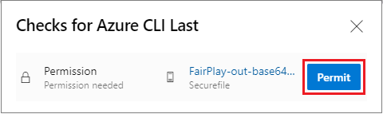

Azure Media Services uses [Digital Rights Management (DRM)](https://en.wikipedia.org/wiki/Digital_rights_management) to protect content, and supports [Microsoft PlayReady](https://www.microsoft.com/playready/overview/), [Google Widevine](https://www.widevine.com/solutions/widevine-drm), and [Apple FairPlay](https://developer.apple.com/streaming/fps/). This article discusses Gridwich content protection, and explains how to set up and update content protection and DRM policies.

## Asset streaming locators

When Gridwich first publishes an asset, it creates a *streaming locator* by calling the Azure Media Services v3 API. The streaming locator references two Azure Media Services policies:

- The *streaming policy* describes which protocols are enabled for a secured adaptive streaming output.

- The *content key policy* describes how to deliver the key or DRM license to a player. For DRM, the policy describes properties like duration, offline mode, minimum device security level, and digital output protection. Gridwich configures these DRM settings and secrets, and uses them to create and update the policy.

Gridwich creates these policies in the Media Services account at first publication, and reuses them for future publications.

The following diagram shows the Azure Media Services policies and their relationship to Gridwich assets and streaming locators:


## Gridwich publication messages

A Gridwich publication message must specify the streaming policy and content key policy. The following example shows a Gridwich publication message:

```json
{
    "id": "string",
    "topic": "string",
    "subject": "string",
    "data": {
        "containerUri": "https://azurestorageaccount.blob.core.windows.net/00000000-0000-0000-0000-000000000000",
        "generateAudioFilters": true,
        "operationContext": {}

        "streamingPolicyName": "clearStreamingOnly",
        "contentKeyPolicyName": null,
    },
    "eventType": "request.mediaservices.locator.create",
    "dataVersion": "1.0"
}
```

To enable Microsoft PlayReady and Google Widevine on MPEG-DASH output, use

```json
        "streamingPolicyName": "cencDrmStreaming",
        "contentKeyPolicyName": "cencDrmKey",
```

The `cencDRMKey` policy code is in [MediaServicesV3CustomContentKeyPolicyCencDrmKey](https://github.com/mspnp/gridwich/blob/main/src/Gridwich.SagaParticipants.Publication.MediaServicesV3/src/ContentKeyPolicies/MediaServicesV3CustomContentKeyPolicyCencDrmKey.cs).

To enable Microsoft PlayReady and Google Widevine on MPEG-DASH output, and Apple FairPlay on HLS (TS and CMAF), use

```json
        "streamingPolicyName": "multiDrmStreaming",
        "contentKeyPolicyName": "multiDrmKey",
```

The `multiDRMKey` policy code is in [MediaServicesV3CustomContentKeyPolicyMultiDrmKey](https://github.com/mspnp/gridwich/blob/main/src/Gridwich.SagaParticipants.Publication.MediaServicesV3/src/ContentKeyPolicies/MediaServicesV3CustomContentKeyPolicyMultiDrmKey.cs).

The `cencDRMKey` policy includes options 1 through 6, and the `multiDRMKey` policy includes options 1 through 9:

1. Microsoft PlayReady / non-persistent license
1. Microsoft PlayReady / two-hour persistent license
1. Microsoft PlayReady / 14-day persistent license
1. Google Widevine / non-persistent license
1. Google Widevine / two-hour persistent license
1. Google Widevine / 14-day persistent license
1. Apple FairPlay / non-persistent license
1. Apple FairPlay / two-hour persistent license
1. Apple FairPlay / 14-day persistent license

The JSON token that the player provides to Media Services should look similar to one of the following examples. These token examples are case-sensitive.

A secured token service (STS), not provided in Gridwich, should deliver tokens with correct and expected claims. The `persistent` claim specifies the option that Media Services should use when generating the license. The `iss` and `aud` claims should match the definitions in [ContentKeyPolicyClaims](https://github.com/mspnp/gridwich/blob/main/src/Gridwich.SagaParticipants.Publication.MediaServicesV3/src/Constants/ContentKeyPolicyClaims.cs).

### JSON token examples

```json
{
  "urn:microsoft:azure:mediaservices:contentkeyidentifier": "insert the content key id here",
  "persistent": "none",
  "nbf": 1586946219,
  "exp": 1586947419,
  "iss": "gridwich",
  "aud": "urn:drm"
}
```

```json
{
  "urn:microsoft:azure:mediaservices:contentkeyidentifier": "insert the content key id here",
  "persistent": "14Days",
  "nbf": 1586946219,
  "exp": 1586947419,
  "iss": "gridwich",
  "aud": "urn:drm"
}
```

```json
{
  "urn:microsoft:azure:mediaservices:contentkeyidentifier": "insert the content key id here",
  "persistent": "2Hours",
  "nbf": 1586946219,
  "exp": 1586947419,
  "iss": "gridwich",
  "aud": "urn:drm"
}
```

## Update policies

To change the authorized protocols or DRM license properties for content protection, update the streaming policy or content key policy. The update mechanism differs depending on the policy.

- The Media Services *streaming policy* can't change. Gridwich uses an external Gridwich publication message name that doesn't change, and uses an internal Media Services name to assign a version to the updated policy. Old locators will still use the old streaming policy, and new locators will use the updated streaming policy.

- The Media Services *content key policy* can change, so Gridwich uses the same name in Media Services and in the Gridwich publication message. Updating the content key policy affects all old and new locators.

  You can extend Gridwich to have two or more content key policies with different names side by side. You can use different policies for completely different asset classes with different rights.

The following diagram shows the process of updating the streaming policy and content key policies:


### Streaming policy update

The streaming policy uses an internal Media Services name to assign a version to the policy, and an external request name that doesn't change. In the preceding example, the `multiDRMStreaming` policy in the request has the name `multiDRMStreaming-Version-1-0` in Media Services. If the code in the [MediaServicesV3CustomStreamingPolicyMultiDrmStreaming.cs](https://github.com/mspnp/gridwich/blob/main/src/Gridwich.SagaParticipants.Publication.MediaServicesV3/src/StreamingPolicies/MediaServicesV3CustomStreamingPolicyMultiDrmStreaming.cs) file changes, update the streaming policy name in the file to increment the version number:

```csharp
private readonly string nameInAmsAccount = CustomStreamingPolicies.MultiDrmStreaming + "-Version-1-0";
```

### Content key policy update

The updated content key policy uses the same name in Media Services and in the publication message, and affects all old and new locators.

Content key policy updates can occur only if the Azure Pipelines pipeline variable **AmsDrmEnableContentKeyPolicyUpdate** is set to `true`. The variable is in the Gridwich Azure DevOps project under **Pipelines** > **Library** > **Variable groups** > **gridwich-cicd-variables.global**.

This variable specifies whether Azure Functions should automatically update the content key policy at startup, which lets you decide when to force the update after a code change. Force the update to occur after the Azure Function instance restarts and when the next publication process runs.

Run the pipeline to update the Azure deployment with new settings, secrets, or code. See [Azure Pipelines variable group to Terraform variables flow](variable-group-terraform-flow.yml) for more information about the variable flow.

After the update, make sure to delete and purge any copies of source certificates and intermediate files.

## DRM settings

The following sections describe how to configure the DRM settings that Gridwich uses to create and update the content key policy. The variables to update are in the Gridwich Azure Pipelines **Library** > **Variable groups** > **gridwich-cicd-variables.global** variable group.

For instructions on setting up the Azure DevOps project, pipelines, and variable groups, see [Gridwich Azure DevOps setup](set-up-azure-devops.yml).

### OpenID Connect Discovery Document endpoint

Azure Media Services uses the OpenID Connect Discovery Document endpoint URL that exposes the public signature keys to verify the JSON tokens.

To store the OpenID Connect Discovery Document endpoint:

1. In the Gridwich Azure DevOps project, go to **Pipelines** > **Library** > **Variable groups** > **gridwich-cicd-variables.global**.

1. Edit the variable name **amsDrmOpenIdConnectDiscoveryDocumentEndpoint**, setting it to the value of the endpoint URL, for example `https://domain.com/.well-known/OpenIdConfiguration`.

### Apple FairPlay settings

Gridwich processes and ingests the FairPlay package from Apple as settings. Handle the secrets with care, and delete and purge any copies of source certificates or intermediate files from devices that create or update the content key policy.

#### FairPlay certificate

1. Follow the [Azure Media Services documentation](/azure/media-services/latest/fairplay-license-overview#requirements) to create a PFX certificate with a private key from the files that Apple delivers.
   1. Install OpenSSL.
   1. Convert the *FairPlay.cer* file to a *.pem* file.
   1. Convert the *.pem* file to a *.pfx* file with a password-protected private key.
   1. Convert the *.pfx* file to a base 64 text file called *FairPlay-out-base64.txt*.

1. Copy the *FairPlay-out-base64.txt* file to **Pipelines** > **Library** > **Secure files**, replacing any existing same-named file.

1. Store the OpenSSL password in **Pipelines** > **Library** > **Variable groups > gridwich-cicd-variables.global** under the variable **amsDrmFairPlayPfxPassword**, in Secured mode.

1. Store the hexadecimal ASK Key that Apple provides in *AppleASK.txt* in **Pipelines** > **Library** > **Variable groups > gridwich-cicd-variables.global** under the variable **amsDrmFairPlayAskHex**, in Secured mode.

#### Update approval

When the *FairPlay-out-base64.txt* file changes, the next pipeline run waits for a one-time approval.


Select **Permit** to approve the pipeline by using the FairPlay Secure File you uploaded.



## Next steps

Product documentation:

- [Gridwich cloud media system](gridwich-architecture.yml)
- [Azure Media Services v3 overview](/azure/media-services/latest/media-services-overview)
- [Introduction to Azure Functions](/azure/azure-functions/functions-overview)
- [What is Azure DevOps?](/azure/devops/user-guide/what-is-azure-devops)
- [What is Azure Pipelines?](/azure/devops/pipelines/get-started/what-is-azure-pipelines)

Microsoft Learn modules:

- [Create a build pipeline with Azure Pipelines](/learn/modules/create-a-build-pipeline)
- [Explore Azure Functions](/learn/modules/explore-azure-functions)
- [Introduction to Azure DevOps](/learn/modules/get-started-with-devops)

## Related resources

- [Gridwich request-response messages](gridwich-message-formats.yml)
- [Gridwich variable flow](variable-group-terraform-flow.yml)

For more information about Media Services content protection, see [Content protection overview](/azure/media-services/latest/content-protection-overview).
