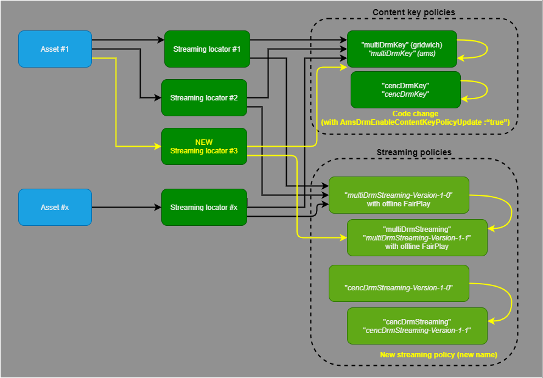

# Content protection and DRM

This article explains the concepts Gridwich uses for audio and video content protection when it publishes a container or asset with Azure Media Services. Media Services uses [Digital Rights Management (DRM)](https://en.wikipedia.org/wiki/Digital_rights_management) to protect content, and supports [Microsoft PlayReady](https://www.microsoft.com/playready/overview/), [Google Widevine](https://www.widevine.com/solutions/widevine-drm) and [Apple FairPlay](https://developer.apple.com/streaming/fps/).

## Asset streaming locators and policies

When Gridwich first publishes an asset, it creates a *streaming locator* by calling the Azure Media Services v3 API. The streaming locator references two Azure Media Services policies:

- The *streaming policy* describes which protocols are enabled for a secured adaptive streaming output.
  
- The *content key policy* describes how to deliver the key or DRM license to a player. For DRM, the policy describes properties like duration, offline mode, minimum device security level, and digital output protection. Gridwich configures these DRM settings and secrets, and uses them to create and update the policy.

Gridwich creates these policies in the Media Services account at first publication, and reuses them for future publications. A Gridwich publication message must specify the streaming policy and content key policy.

The following diagram shows the Azure Media Services policies and their relationship to Gridwich assets and streaming locators.


## Gridwich publication messages

The following example shows a Gridwich publication message:

```json
{
    "id": "string",
    "topic": "string",
    "subject": "string",
    "data": {
        "containerUri": "https://azurestorageaccount.blob.core.windows.net/fd7b4d3a-8f20-4744-b7a0-c26252580677",
        "generateAudioFilters": true,
        "operationContext": {}

        "streamingPolicyName": "clearStreamingOnly",
        "contentKeyPolicyName": null,
    },
    "eventType": "request.mediaservices.locator.create",
    "dataVersion": "1.0"
}
```

To enable Microsoft PlayReady and Google Widevine on MPEG-DASH output, use `"streamingPolicyName": "cencDrmStreaming"` and `"contentKeyPolicyName": "cencDrmKey"`. The `cencDRMKey` policy code is in [MediaServicesV3CustomContentKeyPolicyCencDrmKey](https://github.com/mspnp/gridwich/src/Gridwich.SagaParticipants.Publication.MediaServicesV3/src/ContentKeyPolicies/MediaServicesV3CustomContentKeyPolicyCencDrmKey.cs).

To enable Microsoft PlayReady and Google Widevine on MPEG-DASH output, and Apple FairPlay on HLS (TS and CMAF), use `"streamingPolicyName": "multiDrmStreaming"` and `"contentKeyPolicyName": "multiDrmKey"`. The `multiDRMKey` policy code is in [MediaServicesV3CustomContentKeyPolicyMultiDrmKey](https://github.com/mspnp/gridwich/src/Gridwich.SagaParticipants.Publication.MediaServicesV3/src/ContentKeyPolicies/MediaServicesV3CustomContentKeyPolicyMultiDrmKey.cs).

The `cencDRMKey` policy includes options 1 through 6, and the `multiDRMKey` policy includes options 1 through 9:

1. Microsoft PlayReady / non persistent license
1. Microsoft PlayReady / 2 hours persistent license
1. Microsoft PlayReady / 14 days persistent license
1. Google Widevine / non persistent license
1. Google Widevine / 2 hours persistent license
1. Google Widevine / 14 days persistent license
1. Apple FairPlay / non persistent license
1. Apple FairPlay / 2 hours persistent license
1. Apple FairPlay / 14 days persistent license

The JSON token the player provides to Media Services should look similar to one of the following examples. These token examples are case-sensitive.

A secured token service (STS), not provided in Gridwich, should deliver tokens with correct and expected claims. The `persistent` claim specifies the option Media Services should use when generating the license. The issuer `iss`, and audience `aud` claims should match the definitions in [ContentKeyPolicyClaims](https://github.com/mspnp/gridwich/src/Gridwich.SagaParticipants.Publication.MediaServicesV3/src/Constants/ContentKeyPolicyClaims.cs).

```json
{
  "urn:microsoft:azure:mediaservices:contentkeyidentifier": "insert the content key id here",
  "persistent": "none",
  "nbf": 1586946219,
  "exp": 1586947419,
  "iss": "gridwich",
  "aud": "urn:drm"
}
```

```json
{
  "urn:microsoft:azure:mediaservices:contentkeyidentifier": "insert the content key id here",
  "persistent": "14Days",
  "nbf": 1586946219,
  "exp": 1586947419,
  "iss": "gridwich",
  "aud": "urn:drm"
}
```


```json
{
  "urn:microsoft:azure:mediaservices:contentkeyidentifier": "insert the content key id here",
  "persistent": "2Hours",
  "nbf": 1586946219,
  "exp": 1586947419,
  "iss": "gridwich",
  "aud": "urn:drm"
}
```

## Update policies

To change the authorized protocols or DRM license properties for content protection, you must update the streaming policy or content key policy. The update mechanism differs depending on the policy.

- The Media Services *streaming policy* can't be changed. So Gridwich uses an internal Media Services name to version the policy, and an external Gridwich publication message name that doesn't change. Old locators will still use the old streaming policy, and new locators will use the updated streaming policy.

- The Media Services *content key policy* can be updated, so Gridwich uses the same name in Media Services and in the Gridwich publication message. Updating the content key policy affects all old and new locators.
  
  Gridwich can be extended to have two or more content key policies with different names side-by-side. You can use different policies for completely different asset classes with different rights.
  
  

### Streaming policy update

The streaming policy uses an internal Media Services name to version the policy, and an external request name that doesn't change. For example, the `multiDRMStreaming` policy in the request has a matching name like `multiDRMStreaming-Version-1-0` in Media Services. If the code in the [MediaServicesV3CustomStreamingPolicyMultiDrmStreaming.cs](https://github.com/mspnp/gridwich/src/Gridwich.SagaParticipants.Publication.MediaServicesV3/src/StreamingPolicies/MediaServicesV3CustomStreamingPolicyMultiDrmStreaming.cs) file changes, update the streaming policy name in the file to increment the version number.

```csharp
private readonly string nameInAmsAccount = CustomStreamingPolicies.MultiDrmStreaming + "-Version-1-0";
```

### Content key policy update

To update the content key policy, use the same name in Media Services and in the publication message.

The policy updates affect all old and new locators, and occur only if the variable `AmsDrmEnableContentKeyPolicyUpdate` is set to `true`. This variable is in **Azure Pipelines** > **Library** > **Variable groups** > **gridwich-cicd-variables.global**.


The variable specifies whether Azure Functions should automatically update the content key policy at startup. Setting this variable lets you decide when to force the update after a code change. Force the update to occur after the Azure Function instance is restarted and when the next publication process is run.

Run the pipeline to update the Azure deployment with new settings, secrets, or code. See [Azure Pipelines Variable Group to Terraform variables flow](variable-group-terraform-flow.md) for more information about the variable flow.

After the update, make sure to delete and purge any copies of source certificates and intermediate files.

## DRM settings

The following sections describe how to configure the DRM settings Gridwich uses to create and update the content key policy.

### OpenID Connect Discovery Document endpoint

Azure Media Services uses the OpenID Connect Discovery Document endpoint URL that exposes the public signature keys to verify the JSON tokens.

To store the OpenID Connect Discovery Document endpoint:

1. Go to **Azure Pipelines** > **Library** > **Variable groups** > **gridwich-cicd-variables.global**.
   
1. Edit variable name `amsDrmOpenIdConnectDiscoveryDocumentEndpoint` to the value of the endpoint URL, for example `https://domain.com/.well-known/OpenIdConfiguration`.
   
   

### Apple FairPlay settings

Gridwich must process and ingest the FairPlay package from Apple as settings. Handle the secrets with care, and delete and purge any copies of source certificates or intermediate files from devices that create or update the content key policy.

#### FairPlay certificate

1. Follow the [Azure Media Services documentation](/azure/media-services/latest/fairplay-license-overview#requirements) to create a PFX certificate with a private key from the files Apple delivers.
   1. Install OpenSSL.
   1. Convert the *FairPlay.cer* file to a *.pem* file.
   1. Convert *.pem* to *.pfx* with password-protected private key.
   1. Convert the pfx to a base 64 text file called *FairPlay-out-base64.txt*.
   
1. Copy the *FairPlay-out-base64.txt* file to **Azure Pipelines** > **Library** > **Secure files**, replacing any existing file with the same name.
   
   
   
1. Store the OpenSSL password in **Azure Pipelines** > **Library** > **Variable groups > gridwich-cicd-variables.global** under variable `amsDrmFairPlayPfxPassword`, in Secured mode.
   
1. Store the hexadecimal ASK Key that Apple provided in *AppleASK.txt* in **Azure Pipelines** > **Library** > **Variable groups > gridwich-cicd-variables.global** under variable `amsDrmFairPlayAskHex`, in Secured mode.
   
   

#### Update approval

When the *FairPlay-out-base64.txt* file changes, the next pipeline waits for a one-time approval.


## Related resources
- For more information about Media Services content protection, see [Content protection overview](/azure/media-services/latest/content-protection-overview).
- For more details about the Azure Pipelines variable group settings flow, see [Azure Pipelines variable group variables flow](variable-group-terraform-flow.md).

