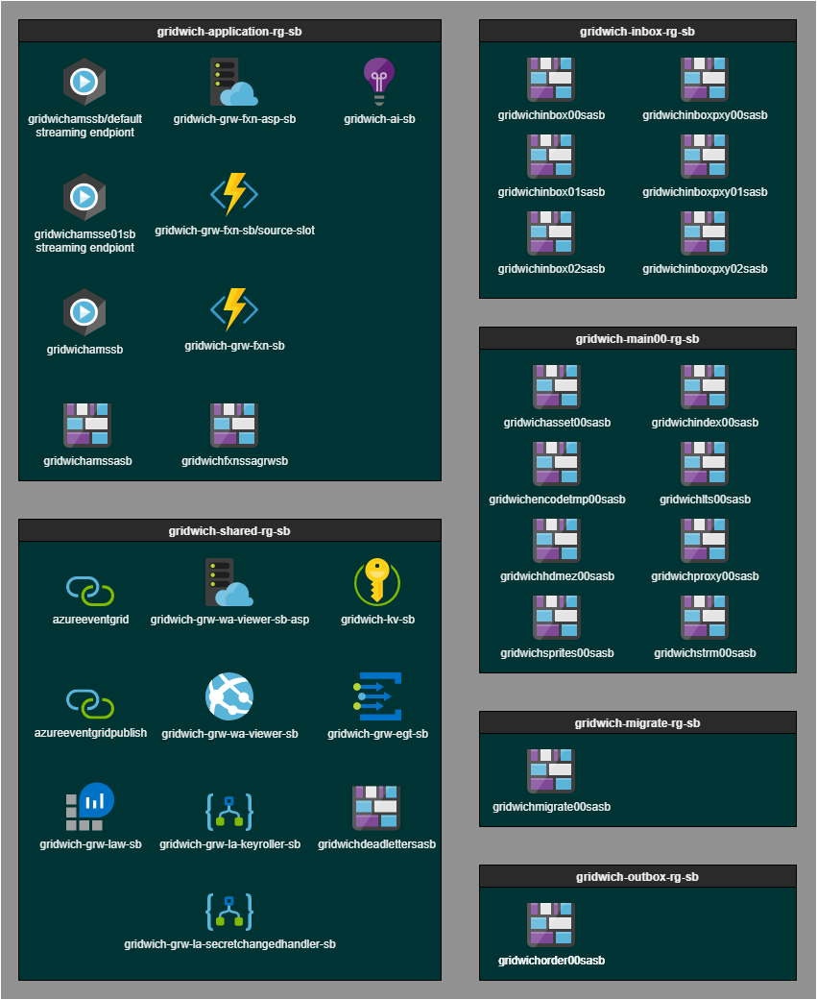

# The Gridwich project

A mass media and entertainment conglomerate wanted to replace their on-premises video streaming system with a cloud-based solution for ingesting, processing, and publishing video assets to partners. In producing the cloud-based solution, the Microsoft engineering team developed general best practices for processing and delivering media assets on Azure.

The Gridwich solution builds a stateless Azure action execution environment driven by an external saga workflow orchestration system. The Gridwich pipeline ingests, processes, and delivers media assets using two new methods: Terraform Sandwiches and Event Grid Sandwiches.

The Gridwich media asset pipeline is sanitized and generalized for reusability in future media projects. This generic example is media-specific, although the eventing framework is not. Gridwich uses Azure Media Services, Terraform, Azure Functions, Azure Event Grid, Azure Blob Storage, and Azure Logic Apps. The project includes Terraform deployment.

The company's main goals, aside from being able to take advantage of Azure Cloud capacity, cost, and flexibility, were to:
- Ingest raw video files, process and publish them, and fulfill media requests.
- Significantly enhance both encoding and new intake and distribution capabilities at scale, and with a cleanly-architected approach.
- Implement [continuous integration and continuous delivery (CI/CD)](gridwich-cicd.md) for the media asset management (MAM) pipeline.

## Architecture

- The *Terraform Sandwich* starts from a multi-stage [Terraform](https://www.terraform.io/) pattern updated to support [infrastructure as code](/azure/devops/learn/what-is-infrastructure-as-code). Terraform can wholly manage and deploy the infrastructure, even when not all the [Azure resources](https://terraform.io/docs/providers/azurerm/) can be created before the software artifacts are deployed.

- The *Event Grid Sandwich* abstracts away remote and long-running processes from the external saga workflow system, by sandwiching those operations between two [Event Grid handlers](gridwich-request-response-flow.md). This sandwich allows the external system to send a request event, monitor scheduled events, and wait for an eventual success or failure response that may arrive minutes or hours later.

## Components

- Azure Media Services
- Azure Functions
- Azure Event Grid
- Azure Blob Storage
- Azure Logic Apps
- Terraform

# Azure deployment

Gridwich deploys the following resources to Azure for an application named `gridwich` and environment named `sb`:

## Related resources

- [Terraform starter project for Azure Pipelines](https://github.com/microsoft/terraform-azure-devops-starter).
- Public [Terraform Sandwich sample](https://github.com/Azure-Samples/azure-functions-event-grid-terraform).
- [MediaInfoLib with Azure Storage](https://github.com/Azure-Samples/functions-dotnet-core-mediainfo). Azure Functions and console samples using cross-platform .NET Core, to retrieve a report on a media file stored in Azure Storage.
- [AMS V2 REST API samples](https://github.com/Azure-Samples/media-services-v2-dotnet-core-restsharp-sample). A variety of Azure Media Services V2 REST API samples using RestSharp in .NET Core 3.1.
- [EGViewer Blazor](https://github.com/Azure-Samples/eventgrid-viewer-blazor). An EventGrid Viewer application, using Blazor and SignalR, with Azure Active Directory Authorization support.
- [Azure Function with MSI for Azure Storage](https://github.com/Azure-Samples/functions-storage-managed-identity). Use Managed Identity between Azure Functions and Azure Storage.
- [Azure Function with Event Grid and Terraform](https://github.com/Azure-Samples/azure-functions-event-grid-terraform). Subscribe an Azure Function to Event Grid Events via Terraform, using a Terraform Sandwich.
- [Handling serverless Key Vault rotation](https://github.com/Azure-Samples/serverless-keyvault-secret-rotation-handling). Handle Key Vault secret rotation changes utilized by an Azure Function, using Event Grid and Logic Apps.
- [Updates to existing sample](https://github.com/Azure-Samples/media-services-v3-dotnet-core-functions-integration/tree/master/Encoding). Updates to media-services-v3-dotnet-core-functions-integration repo.
- [Updates to existing sample](https://github.com/NickDrouin/terraform-azure-pipelines-starter). Updates to terraform-azure-pipelines-starter repo.
- [Updates to existing repo](https://github.com/microsoft/vscode-dev-containers/tree/master/containers/azure-functions-dotnetcore-3.1). Updates to vscode-dev-containers repo, adding Azure Functions v3 and .NET Core 3.1 devcontainer.

