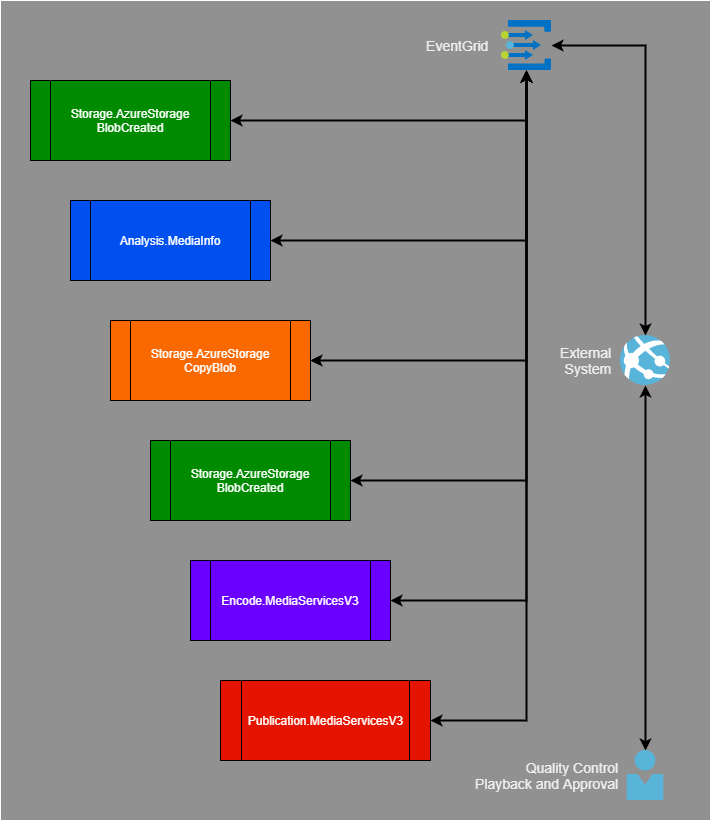
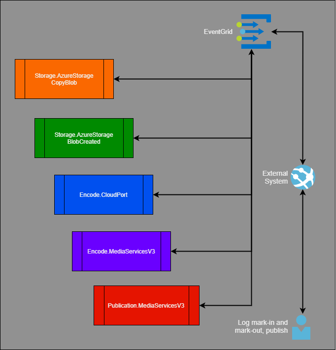

In the example implementation, the external system is a large media company's media asset management (MAM) and workflow orchestration system. The external system operates as a [saga orchestrator](https://microservices.io/patterns/data/saga.html) that chains a series of activities to build Gridwich workflows.

Saga activities might or might not include user interactions or approvals. Gridwich assumes that the external system tracks the failure or success of each operation it initiates.

## Saga participants

Each saga participant contributes one or more work activities to the ecosystem. Each participant works independently, and more than one saga participant might act on a single request.

For Gridwich, the available saga participants are:

- [Analysis.MediaInfo](https://github.com/mspnp/gridwich/blob/main/src/Gridwich.SagaParticipants.Analysis.MediaInfo/)
- [Encode.CloudPort](https://github.com/mspnp/gridwich/blob/main/src/Gridwich.SagaParticipants.Encode.CloudPort/)
- [Encode.Flip](https://github.com/mspnp/gridwich/blob/main/src/Gridwich.SagaParticipants.Encode.Flip/)
- [Storage.AzureStorage](https://github.com/mspnp/gridwich/blob/main/src/Gridwich.SagaParticipants.Storage.AzureStorage/)

## Example saga workflow

The external system might run a quality control check saga that does the following steps:

1. Gets a notification of a new blob in the inbox storage account.
1. Requests an analysis using MediaInfo.
1. Reviews the MediaInfo response, auto-approves the file, and starts a copy into an intermediate account.
1. Gets notified that the copy is complete.

The operator reviews the asset, identifies the various audio track layouts, and then starts a saga that:

 1. Starts a copy into the long-term storage account.
 1. Gets notified that the copy is complete.
 1. Begins encoding with TeleStream CloudPort to Mux the left and right stereo tracks, along with the video, into a new asset.

The operator reviews the asset contents and extracts metadata for the MAM system.

## Components

- [Azure Event Grid](https://azure.microsoft.com/products/event-grid) allows a developer to easily build applications with event-based architectures.
- [Azure Blob storage](https://azure.microsoft.com/products/storage/blobs) is a service for storing any type of text or binary data, such as a document, media file, or application installer.

## Next steps

- [Azure Blob storage](/azure/storage/common/storage-quickstart-create-account)
- [Azure Event Grid](/azure/event-grid/overview)
- [Saga](/azure/architecture/reference-architectures/saga/saga): Learn more about the Saga distributed transactions pattern.
- [Cloud-native data patterns](/dotnet/architecture/cloud-native/distributed-data): Explore cloud-native data patterns.

## Related resources

- [Understand Gridwich cloud media system](gridwich-architecture.yml)
- [Explore Gridwich project naming](gridwich-project-names.yml)
- [Set up Gridwich CI/CD pipeline](gridwich-cicd.yml)
