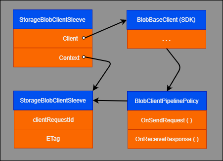

The Gridwich Azure Storage Service, [Gridwich.SagaParticipants.Storage.AzureStorage][StorageService], provides blob and container operations for Azure Storage Accounts that are configured for Gridwich. Example storage operations are **Create blob**, **Delete container**, **Copy blob**, or **Change storage tier**.

Gridwich requires its storage mechanisms to work for both Azure Storage block blobs and containers. With distinct classes and Storage Service operations for blobs and containers, there's no ambiguity about whether a given storage operation relates to a blob or to a container. This article applies to both blobs and containers, except where noted.

Gridwich exposes most storage operations to external systems within the `Storage.AzureStorage` [saga participant](gridwich-saga-orchestration.yml#saga-participants). Other saga participants use the storage service for tasks like copying blobs between different containers or accounts when they set up encoding workflows.

This article describes how the Gridwich Azure Storage Service meets solution requirements and integrates with mechanisms like event handlers. Links point to the corresponding source code, which contains more extensive commentary on the containers, classes, and mechanisms.

## Azure Storage SDK

Gridwich uses classes from the Azure Storage SDK to interact with Azure Storage, rather than handcrafting REST requests. Within the storage provider, the SDK [BlobBaseClient][SDK_BlobClient] and [BlobContainerClient][SDK_ContainerClient] classes manage storage requests.

These SDK client classes currently allow only indirect access to the two HTTP headers Gridwich needs to manipulate, `x-ms-client-request-id` for operation context and `ETag` for object version.

In Gridwich, a pair of provider classes dispense [BlobBaseClientProvider][ProvB] and [BlobContainerClientProvider][ProvC] functionality in units called *sleeves*. For details about sleeves, see [Storage sleeves](#storage-sleeves).

The following diagram illustrates the structure of the SDK and Gridwich classes, and how instances relate to each other. The arrows indicate "has a reference to."



## Pipeline policy

You set the hook to manipulate the HTTP headers as a pipeline policy instance when you create the client instance. You can set this policy only at client instance creation time, and you can't change the policy. The storage provider code using the client must be able to manipulate the header values during execution. The challenge is to make the storage provider and pipeline interact cleanly.

For the Gridwich pipeline policy, see the [BlobClientPipelinePolicy][Pipeline] class.

## Storage Service caching

TCP connection establishment and authentication create overhead when an SDK client object instance sends its first request to Azure Storage. Multiple calls to the same blob in an external system request, for example **Get Metadata**, then **Delete blob**, compound the overhead.

To mitigate overhead, Gridwich maintains a cache of one client instance for each storage blob or container, depending on the SDK classes the operation context uses. Gridwich retains this client instance and can use the instance for multiple Azure Storage operations against the same blob or container for the duration of an external system request.

The Azure SDK-provided client classes require SDK client object instances to be specific to a single blob or container at creation time. The instances also aren't guaranteed safe for simultaneous use on different threads. Since an [operation context](gridwich-architecture.yml#operation-context) represents a single request, Gridwich bases caching on the combination of blob or container name with operation context.

This instance reuse, combined with the Azure Storage SDK client structure, requires additional support code to balance efficiency and code clarity.

## Context argument

Almost all the Gridwich Storage Service operations require a special context argument of type [StorageClientProviderContext][SCPC]. This context argument fulfills the following requirements:

- Provides the external system with responses, which include the per-request unique JSON-based *operation context* value that the external system specified on the Gridwich request. For more information, see [Operation context](gridwich-architecture.yml#operation-context).

- Allows Storage Service callers like Gridwich event handlers to control which responses are visible to the external system. This control prevents the service from flooding the external system with irrelevant notification events. For more information, see [Context muting](#context-muting).

- Complies with Azure Storage conventions to ensure coherent requests and responses in an environment that allows a mix of parallel readers and writers. For example, supports [ETag tracking][ETag]. For more information, see [ETags](#etags-for-target-consistency).

### Storage context

The context for both the blob and container [storage types](#storage-sleeves) is the [StorageClientProviderContext][SCPC], which looks like:

```csharp
    string  ClientRequestID { get; }
    JObject ClientRequestIdAsJObject { get; }
    bool    IsMuted { get; set; }
    string  ETag { get; set; }
    bool    TrackingETag { get; set; }
```

The first two properties are different representations of the operation context that was used to initialize the [StorageClientProviderContext][SCPC] instance. The class has a variety of constructors, including a copy constructor. Additional methods include `ResetTo`, to allow in-place state duplication, and a static `CreateSafe` method to ensure that problematic initializations don't throw exceptions.

The class also contains special handling for creating contexts based on GUIDs and empty strings. The Azure Storage Notification handlers for blob [Created][NotifyC] and [Deleted][NotifyD], which also process notifications arising from external agents, require the GUID form.

### Context muting

The `IsMuted` property controls whether the application expects the service to publish resulting notifications back to the caller, for example to the external system. In a muted operation, the service doesn't publish resulting events.

An example is blob copies that an encoder executes to arrange blobs in Azure Storage as input to an encoding task. The external system isn't concerned about these details, but only about the status of the encoding job and where it can retrieve the encoded outputs. To reflect these concerns, the encoder:

1. Creates a non-muted storage context based on the request operation context, for example `ctxNotMuted`.

1. Creates a muted storage context, for example `ctxMuted`, by either using the [context class][SCPC] copy constructor or making a new instance. Either option will have the same operation context value.

1. Specifies `ctxMuted` for storage operations involved in the setup for encoding. The external system doesn't see any indication of these operations occurring.

1. Specifies the `ctxNotMuted` context for storage operations that reflect encoding completion, for example copying an output file to a target container. Gridwich handlers publish the resulting Azure Storage notification events to the external system.

The caller controls the ultimate visibility of operations. Both muted and non-muted operations are based on an equivalent `operationContext` value. The intent of context muting is to make it easier to perform issue diagnosis from event tracing logs, because it's possible to see the storage operations related to a request, regardless of operation muting status.

The [ResponseBaseDTO][ResponseBaseDTO] has a boolean property `DoNotPublish`, which event dispatching uses to dictate the final decision about whether to publish. Event dispatching, in turn, sets the `DoNotPublish` property based on the `IsMuted` property of the context.

The service transmits the muting setting to Azure Storage, which then sets the `clientRequestId` in the storage notification events it presents to the two Gridwich handlers, [Created][NotifyC] and [Deleted][NotifyD]. Those two handlers set `DoNotPublish` to reflect the caller-requested muting.

## ETags for target consistency

Azure Storage uses the HTTP `ETag` header for request sequences that should have target consistency. An example is to ensure a blob hasn't changed between **Retrieve Metadata** and **Update Metadata** storage operations.

To align with standard HTTP usage, this header has an opaque value whose interpretation is that if the header value changes, then the underlying object has also changed. If a request sends its current `ETag` value for the object, and it doesn't match the current Storage Service `ETag` value, the request immediately fails. If the request doesn't include an `ETag` value, Azure Storage skips that check and doesn't block the request.

### ETags in the Storage Service

For Gridwich, the `ETag` is an internal detail between the Gridwich Storage Service and Azure Storage. No other code needs to be aware of the `ETag`. The Storage Service uses the `ETag` for sequences like the **Get Blob Metadata**, **Delete Blob** operations for processing a `BlobDelete Event` request. Using the `ETag` ensures that the **Delete Blob** operation targets exactly the same version of the blob as the **Get Metadata** operation.

To use the `ETag` for the preceding example:

1. Send the **Get Metadata** request with a blank `ETag`.
1. Save the `ETag` value from the response.
1. Add the saved `ETag` value to the **Delete Blob** request.

If the two `ETag` values are different, the delete operation fails. The failure implies that some other operation changed the blob between steps 2 and 3. Repeat the process from step 1.

`ETag` is a parameter of constructors and a string property of the [StorageClientProviderContext class][SCPC]. Only the Gridwich-specific [BlobClientPipelinePolicy][Pipeline] manipulates the `ETag` value.
### Control ETag use

The `TrackingETag` property controls whether to send the `ETag` value on the next request. The value `true` means that the service sends an `ETag` if one is available.

An Azure Storage request with an `ETag` value that doesn't match the subject blob or container results in the operation failing. This failure is by design, because `ETag` is the standard HTTP way of expressing "the exact version that the request is targeting." Requests can include the `TrackingETag` property to state that the `ETags` must match, or not include the `TrackingETag` property to indicate that the `ETag` values don't matter.

The pipeline always retrieves an `ETag` value from an Azure Storage operation if one is present in that REST response. The pipeline always updates the context `ETag` property, if possible, as of the last operation. The `TrackingETag` flag controls only whether the next request from the same client instance sends the value of the `ETag` property. If the `ETag` value is null or empty, the current request sets no HTTP `ETag` value, regardless of the value of `TrackingETag`.

## Storage sleeves

Gridwich requires that its storage mechanisms work for both Azure Storage block blobs and containers. There are distinct classes and Storage Service operations for blobs and containers, so there's no ambiguity about whether a given storage operation relates to a blob or to a container.

A pair of provider classes, one for [blobs][ProvB] and one for [containers][ProvC], dispense the two sets of functionality in units called *sleeves*. Sleeves contain instances of storage helper classes that are part of the Azure SDK. Initializing the Storage Service creates the providers and makes them directly available to Storage Service methods.

### Sleeve structure

The *sleeve* is a container for the SDK Client object instance and a storage context. Storage provider functions reference the sleeve via the two properties `Client` and `Context`. There is a sleeve type for [blobs][SleeveB] and another for [containers][SleeveC], which have have `Client` properties of type [`BlobBaseClient`][SDK_BlobClient] and [`BlobContainerClient`][SDK_ContainerClient], respectively.

The general sleeve structure for blobs looks like:

```csharp
    BlobBaseClient Client { get; }
    BlobServiceClient Service { get; }
    StorageClientProviderContext Context { get; }
```

The `Service` property on the sleeve is a convenience. Some of the final encoder-related operations that use the [SDK BlobServiceClient class][SDK_ServiceClient] require Storage Account keys. This requirement led to adding a Service client instance to the two existing sleeve types, rather than producing a separate provider.

### Sleeve usage

The client storage providers dispense sleeve instances. The storage service code looks similar to the following annotated code sequence, with types spelled out for clarity:

```csharp
    public bool DeleteBlob(Uri sourceUri, StorageClientProviderContext context)
    {
        . . .
        StorageBlobClientSleeve sleeve = _blobBaseClientProvider.GetBlobBaseClientForUri(sourceUri, context); // Line A
        BlobProperties propsIncludingMetadata = sleeve.Client.GetProperties(); // Line B
        sleeve.Context.TrackingETag = true;   // Send ETag from GetProperties()
        var wasDeleted = sleeve.Client.DeleteBlob(); // Line C
        sleeve.Context.TrackingETag = false;
        var someResult = sleeve.Client.AnotherOperation(); // Line D
        . . .
    }
```

1. Gridwich auto-populates the operation context into the sleeve context at line A. `TrackingETag` defaults to false.
1. After Line B, `sleeve.Context` contains the `ETag` from line A and retains the same `ClientRequestID` value.
1. Line C sends both the `ETag` value from Line B and the `ClientRequestId`.
1. After Line C, the context has a new `ETag` value, as returned in the `Delete()` response.
1. Line D doesn't send an `ETag` value on the request for `AnotherOperation()`.
1. After Line D, the context has a new `ETag` value, as returned in the `AnotherOperation()` response.

The Storage Service is currently set as `Transient` in the [dependency injection configuration][DIConfig], which implies that the sleeve-based caching is on a per-request basis. See [Storage Service and dependency injection](#storage-service-and-dependency-injection) for more information.

## Storage Service alternatives

The following sections describe alternative approaches that aren't part of the current Gridwich storage solution.

### Gridwich AzureStorageManagement class

In conjunction with the sleeve `Service` member, which is an instance of the [Azure SDK BlobServiceClient class][SDK_ServiceClient], Gridwich also has the [AzureStorageManagement][StorMgmt] class. The Storage Service `GetConnectionStringForAccount` method and the Telerek encoding's `GetStoreByNameAsync` method use that class to get storage account keys. The class is currently based on the Fluent framework. Additions to the SDK `BlobServiceClient` class should eventually supersede this class, allowing for a more focused information retrieval than the wide variety in the [Fluent IAzure interface][IAzure].

### Hide the pipeline policy via subclassing

Subclassing the SDK client types adds two simple properties to the client, one for each HTTP header value, to completely hide the interaction with the pipeline policy. But because of a deep [Moq](https://github.com/moq/moq4) bug, it's not possible to create unit tests via `mock` for these derived types. Gridwich uses Moq, so didn't use this subclassing approach.

The Moq bug relates to its mishandling of cross-assembly subclassing in the presence of internal-scope virtual functions. The SDK client classes make use of internal-scope virtual functions involving internal-scope types that are invisible to normal outside users. When Moq tries to create a `mock` of the subclass, which is in one of the Gridwich assemblies, it fails at test execution time as it can't find the internal-scope virtuals in the SDK client classes from which the Gridwich classes are derived. There is no workaround without changes in the Moq Castle proxy generation.

### Storage Service and dependency injection

Gridwich currently registers the Storage Service as a `Transient` dependency injection service. That is, each time dependency injection is asked for the service, it creates a new instance. The current code should also work correctly if the registration changes to `Scoped`, implying one instance per request, for example the external system's request.

However, there will be issues if the registration changes to `Singleton`, one instance across the Gridwich Function app. The Gridwich caching mechanism for sleeves and data byte ranges then won't distinguish between different requests. Also, the cache model isn't a check-out one, so Gridwich doesn't remove the instance from the cache while it's in use. Since the SDK client classes aren't guaranteed to be thread-safe, coordination would require a number of changes.

For these reasons, don't change the Gridwich Storage Service, as is, to `Singleton` dependency injection registration. Gridwich follows this rule in [dependency injection registration][StorageServiceDI] and includes a unit test, [CheckThatStorageServiceIsNotASingleton][SSTest], to enforce it.

## Next steps

Product documentation:

- [Gridwich cloud media system](gridwich-architecture.yml)
- [What is Azure Blob storage?](/azure/storage/blobs/storage-blobs-overview)
- [What is Azure Pipelines?](/azure/devops/pipelines/get-started/what-is-azure-pipelines)

Microsoft Learn modules:

- [Configure blob storage](/learn/modules/configure-blob-storage)
- [Explore Azure Storage services](/learn/modules/azure-storage-fundamentals)

## Related resources

- [Gridwich content protection and DRM](gridwich-content-protection-drm.yml)
- [Gridwich project naming and namespaces](gridwich-project-names.yml)
- [Logging in Gridwich](gridwich-logging.yml)


[StorageService]: https://github.com/mspnp/gridwich/blob/main/src/Gridwich.SagaParticipants.Storage.AzureStorage
[SCPC]: https://github.com/mspnp/gridwich/blob/main/src/Gridwich.Core/src/Models/StorageClientProviderContext.cs "StorageClientProviderContext.cs"
[ResponseBaseDTO]: https://github.com/mspnp/gridwich/blob/main/src/Gridwich.Core/src/DTO/Responses/ResponseBaseDTO.cs "ResponseBaseDTO.cs"
[Pipeline]: https://github.com/mspnp/gridwich/blob/main/src/Gridwich.SagaParticipants.Storage.AzureStorage/src/Services/BlobClientPipelinePolicy.cs "BlobClientPipelinePolicy.cs"
[SleeveB]: https://github.com/mspnp/gridwich/blob/main/src/Gridwich.SagaParticipants.Storage.AzureStorage/src/Services/StorageBlobClientSleeve.cs "StorageBlobClientSleeve.cs"
[SleeveC]: https://github.com/mspnp/gridwich/blob/main/src/Gridwich.SagaParticipants.Storage.AzureStorage/src/Services/StorageContainerClientSleeve.cs "StorageContainerClientSleeve.cs"
[ProvB]: https://github.com/mspnp/gridwich/blob/main/src/Gridwich.SagaParticipants.Storage.AzureStorage/src/Services/BlobBaseClientProvider.cs "BlobBaseClientProvider.cs"
[ProvC]: https://github.com/mspnp/gridwich/blob/main/src/Gridwich.SagaParticipants.Storage.AzureStorage/src/Services/BlobContainerClientProvider.cs "BlobContainerClientProvider.cs"
[NotifyD]: https://github.com/mspnp/gridwich/blob/main/src/Gridwich.SagaParticipants.Storage.AzureStorage/src/EventGridHandlers/BlobDeletedHandler.cs "BlobDeletedHandler.cs"
[NotifyC]: https://github.com/mspnp/gridwich/blob/main/src/Gridwich.SagaParticipants.Storage.AzureStorage/src/EventGridHandlers/BlobCreatedHandler.cs "BlobCreatedHandler.cs"
[JSONHelpers]: https://github.com/mspnp/gridwich/blob/main/src/Gridwich.Core/src/Helpers/JSONHelpers.cs "JSONHelpers.cs"
[StorageServiceDI]: https://github.com/mspnp/gridwich/blob/main/src/Gridwich.SagaParticipants.Storage.AzureStorage/src/StorageExtensions.cs "StorageExtension.cs"
[SSTest]: https://github.com/mspnp/gridwich/blob/main/src/Gridwich.Host.FunctionApp/tests/Services/ServiceConfigurationTests.cs "ServiceConfigurationTests.cs"
[StorMgmt]: https://github.com/mspnp/gridwich/blob/main/src/Gridwich.SagaParticipants.Storage.AzureStorage/src/Services/AzureStorageManagement.cs "AzureStorageManagement.cs"
[DIConfig]: https://github.com/mspnp/gridwich/blob/main/src/Gridwich.SagaParticipants.Storage.AzureStorage/src/StorageExtensions.cs "Dependency Injection configuration"
[SDK_BlobClient]: /dotnet/api/azure.storage.blobs.specialized.blobbaseclient "Azure SDK - BlobBaseClient class"
[SDK_ContainerClient]: /dotnet/api/azure.storage.blobs.blobcontainerclient "Azure SDK - BlobContainerClient class"
[SDK_ServiceClient]: /dotnet/api/azure.storage.blobs.blobserviceclient "Azure SDK - BlobServiceClient class"
[IAzure]: /dotnet/api/microsoft.azure.management.fluent.iazure "Microsoft.Azure.Management.Fluent.IAzure"
[ETag]: /azure/storage/common/storage-concurrency#managing-concurrency-in-blob-storage "ETags and Blob Storage"
