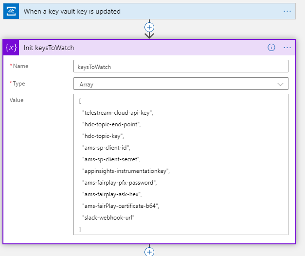
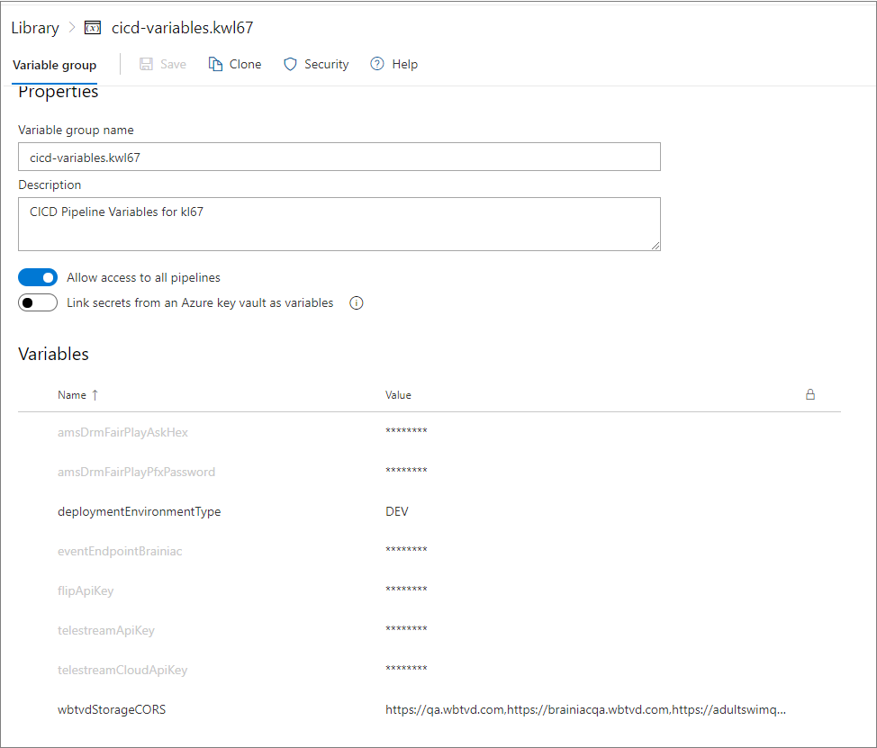

Gridwich uses two types of Azure Key Vault keys, storage keys and third-party keys, which are controlled by two Azure Logic Apps. The Key Roller Logic App rotates the Azure Storage Account keys, and the Secret Changed Handler Logic App rotates or adds third-party keys.

## Run admin scripts

To give the Azure Functions App and the two Logic Apps permissions to take Azure Storage Account and Key Vault actions, run the pipeline-generated admin scripts. For instructions, see [Pipeline-generated admin scripts](run-admin-scripts.yml).

## Key Roller Logic App for storage keys

To stay in compliance with security policies, rotate Storage Account keys on a regular cadence.

Storage keys aren't configured in the Azure Functions App settings, but the Functions App runs under a service principal that has access to the Storage Accounts. Because the Functions App isn't configured with storage keys, rotating these keys doesn't require a Functions App restart.

External system security operations personnel submit a request to rotate storage keys. The request is published to Azure Event Grid as a Key Roll Request. The Key Roller Logic App subscribes to that Event Grid topic and responds to the request by rotating the key in the requested Storage Account.

The request from the external system looks like this:

```json
{
    "id": "<GUID-string>",
    "topic": "<Topic-string>",
    "subject": "<Subject-string>",
    "dataVersion": "<DataVersion-string>",
    "data": {
        "operationContext": <OperationContextObject>,
        "account": "<storageAccountName>",
        "keyName": "<keyName>"
    },
    "eventType": "request.rollkey.storage"
}
```

Where \<keyName> corresponds to the name of the key, as Azure Storage defines it in its [Get Keys operation](/rest/api/storagerp/srp_json_get_storage_account_keys).

On success, the Logic App sends the following response back through Event Grid:

```json
{
    "id": "<GUID-string>",
    "topic": "<Topic-string>",
    "subject": "<Subject-string>",
    "dataVersion": "<DataVersion-string>",
    "data": {
        "account": "<storageAccountName>",
        "keyName": "<keyName>"
    },
    "eventType": "request.rollkey.storage"
}
```

While the request message accepts an `operationContext` value, the response doesn't include it. See [Roll key message format](gridwich-message-formats.yml#requester-asks-gridwich-to-rotate-to-a-new-storage-key) for details about this message and response.

## Secret Changed Handler Logic App for third-party keys

The Secret Changed Handler Logic App doesn't use Event Grid. The events are handled purely by configuring the workloads. Terraform sets up the Functions App and Key Vault configuration.

The Gridwich Azure Functions App has many keys that are backed by Key Vault. You can see the keys in the Functions App app settings.

The Azure Key Vault itself is configured to send events to a Logic App web hook:


### SecretChangedHandler flow

1. Third-party security personnel update a key in Key Vault.
1. Key Vault sends off a key changed event.
1. The Logic App picks up the key changed event.
1. The Logic App checks to see if the key is in its `keysToWatch`.

   

1. If the changed key is in `keysToWatch`, the Logic App triggers a soft restart of the function app.

   

### Add a key

To add or change a key:

1. Add the key to the [Gridwich.Host.FunctionApp/sample.local.settings.json](https://github.com/mspnp/gridwich/blob/main/src/Gridwich.Host.FunctionApp/src/sample.local.settings.json) file.

1. Add the key to [infrastructure/terraform/shared/main.tf](https://github.com/mspnp/gridwich/blob/main/infrastructure/terraform/shared/main.tf):

   ```terraform
   #############################
   # Secrets
   #############################

   resource "azurerm_key_vault_secret" "grw_topic_key_secret" {
     name         = "grw-topic-key"
     value        = azurerm_eventgrid_topic.grw_topic.primary_access_key
     key_vault_id = azurerm_key_vault.shared_key_vault.id
   }

   # These are the values watched by the Secret Changed Handler; keep these up to date with what is put in Key Vault,
   # so if one of the values for these secrets changes, the Function App using them will be updated to
   # use the new value
   output "secrets_in_shared_keyvault" {
     value = ["telestream-cloud-api-key", "grw-topic-end-point", "grw-topic-key", "appinsights-connectionstring", "ams-fairplay-pfx-password", "ams-fairplay-ask-hex", "ams-fairPlay-certificate-b64"]
   }
   ##################################################################################
   # Functions KeyVault References Terraform file
   ##################################################################################

   locals {
     functions_appsetting_keyvault_refs = [
       {
         name        = "GRW_TOPIC_KEY"
         value       = format("@Microsoft.KeyVault(SecretUri=%ssecrets/%s/)", azurerm_key_vault.shared_key_vault.vault_uri, azurerm_key_vault_secret.grw_topic_key_secret.name)
         slotSetting = false
       },
   ```

1. Add the secret to the environment library at **Pipelines** > **Library** > **Variable groups**> **gridwich-cicd-variables.\<environment>**, in Secured mode.

   

## Next steps

Product documentation:

- [Gridwich cloud media system](gridwich-architecture.yml)
- [About Azure Key Vault](/azure/key-vault/general/overview)
- [Introduction to Azure Functions](/azure/azure-functions/functions-overview)
- [What is Azure Blob storage?](/azure/storage/blobs/storage-blobs-overview)
- [What is Azure Event Grid?](/azure/event-grid/overview)
- [What is Azure Logic Apps?](/azure/logic-apps/logic-apps-overview)

Microsoft Learn modules:

- [Configure and manage secrets in Azure Key Vault](/training/modules/configure-and-manage-azure-key-vault)
- [Create a long-running serverless workflow with Durable Functions](/training/modules/create-long-running-serverless-workflow-with-durable-functions)
- [Explore Azure Event Grid](/training/modules/azure-event-grid)
- [Explore Azure Functions](/training/modules/explore-azure-functions)
- [Explore Azure Storage services](/training/modules/azure-storage-fundamentals)
- [Introduction to Azure Logic Apps](/training/modules/intro-to-logic-apps)

## Related resources

- [Gridwich content protection and DRM](gridwich-content-protection-drm.yml)
- [Gridwich operations for Azure Storage](gridwich-storage-service.yml)
- [Test Media Services v3 encoding](test-encoding.yml)
