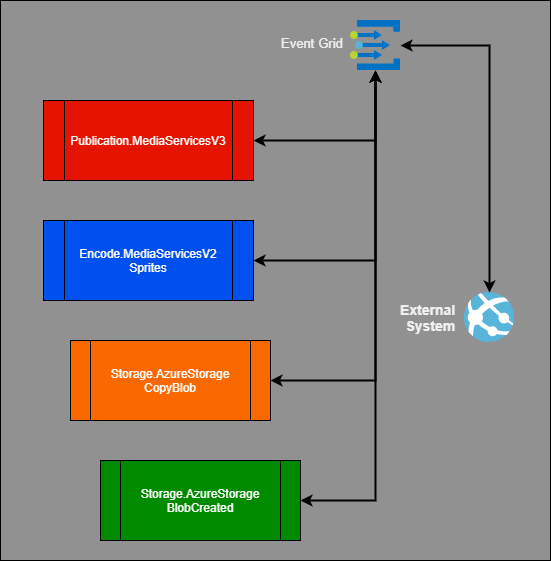

# Gridwich sagas

In the example implementation, the external system is both a media asset management (MAM) and workflow orchestration system provided by a large media company. The external system operates as a [saga orchestrator](https://microservices.io/patterns/data/saga.html) that chains a series of activities to build Gridwich workflows.

Saga activities might or might not include user interactions or approvals. Gridwich assumes that the external system tracks failure or success for each operation it initiates.

## Saga participants

Each of a set of saga participants contributes one or more work activities to the ecosystem. Each saga participant works independently of the other participants, and more than one saga participant might act on a single request.

For Gridwich, the available saga participants are:

- Analysis.MediaInfo
- Encode.CloudPort
- Encode.Flip
- Encode.MediaServicesV2
- Encode.MediaServicesV3
- Publication.MediaServicesV3
- Storage.AzureStorage

## Sagas

The external system might run a quality control check saga that performs the following steps:

1. Get a notification of a new blob in the inbox storage account.
1. Request an analysis using MediaInfo.
1. Review the MediaInfo response, auto-approve the file, and start a copy into an intermediate account.
1. Get notified that the copy is complete.
1. Start a multi-bitrate encode using Azure Media Services V3 API encoder, request AAC audio for all tracks, and copy the video codec.
1. Publish the completed encode using DRM, and notify an operator that an asset is ready for review.

The operator reviews the asset and identifies the various audio track layouts, then starts the following saga:

 1. Start a copy into the longterm storage account.
 1. Get notified that the copy is complete.
 1. Begin an encode with TeleStream CloudPort to Mux the left and right stereo tracks, along with the video, into a new asset.
 1. Create a multi-bitrate asset using Azure Media Services V3 API encoder.
 1. Publish the asset with DRM, and notify an operator that an asset is ready for logging.

The operator reviews the contents, extracts metadata for the media asset management (MAM) system, and sets mark-in and mark-out points for one or more features, text-less sequences, or featurettes. The operator then begins the publication saga:

 1. Create a time-based filter for each sub-asset, and create a locator with that filter and DRM, using Azure Media Services Publishing V3 API.
 1. Simultaneously begin to create sprites for each sub-asset.
 1. After receiving successful responses from both processes, and begin a copy of the sprite files into the published asset.
 1. Receive the blob created for the copy, and complete the publication flow by updating the MAM system.

