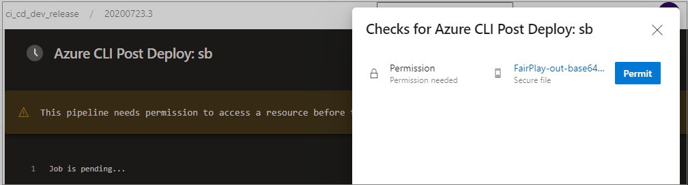

Follow the procedures in this article to set up an Azure DevOps project, repo, and pipelines for Gridwich. These DevOps procedures and settings use a placeholder Azure DevOps organization called `myorganization`, a new Azure DevOps project called `gridwich-clone`, service connection name `gridwich-connection`, and application name `cl1grw`. Replace these placeholders with your own values as appropriate.

## How to set up the Azure DevOps project and repo

Perform the following procedures in your [Azure DevOps](https://azure.microsoft.com/services/devops/) organization.

### Create an Azure DevOps project and clone the repo

This process clones the Gridwich Git repo into a new Azure DevOps project and repo.

To clone the Gridwich repo to your computer:

1. In a bash window on your computer, change to the directory where you want the cloned repo, and enter `git clone https://github.com/mspnp/gridwich.git`.

1. Enter `cd gridwich` to change to the cloned Gridwich directory.

To create the project in your Azure DevOps organization:

1. Sign in to your Azure DevOps organization, and at upper right, select **New project**.

1. In the **Create new project** window:
   1. Under **Project name**, enter `gridwich-clone`.
   1. Under **Visibility**, select **Private**.
   1. Select **Advanced**, then under **Version control** select **Git**, and under **Work item process** select **Agile**.
   1. Select **Create**.

To clone the Gridwich repo into your Azure DevOps project:

1. In the left navigation of your Azure DevOps project, select **Repos** > **Files**.

1. On the **Add some code** screen, select **Push an existing repository from command line**, and select the copy icon to copy the commands.

1. On your computer, from the location of your cloned Gridwich repo, run the following commands:

   ```bash
   git checkout main
   git pull
   git remote rm origin
   ```

1. Then run the commands you just copied from Azure DevOps:

   ```bash
   git remote add origin https://myorganization@dev.azure.com/myorganization/gridwich-clone/_git/gridwich-clone
   git push -u origin --all
   ```

The Gridwich repo is now cloned into your organization's `gridwich-clone` project repo.

### Connect the project to Azure

Connect your Azure DevOps project to an Azure subscription.

1. From your Azure DevOps `gridwich-clone` project, select **Project settings** at the bottom of the left navigation.

1. In the **Project settings** left navigation, under **Pipelines**, select **Service connections**, and then select **Create service connection**.

1. In the **New service connection** window, select **Azure Resource Manager**, and then select **Next**.

1. For **Authentication method**, select **Service Principal (automatic)**, and then select **Next**.

1. On the next screen:
   - Under **Scope level**, select **Subscription**.
   - Under **Subscription**, select the Azure subscription you want to use. Don't select a resource group.
   - Under **Details**, enter `gridwich-connection` as a name for the connection.
   - Select **Grant access permission to all pipelines**.

   Select **Save**.

### Install extensions for Gridwich

Install the necessary extensions for Azure DevOps to work with Gridwich.

1. From your Azure DevOps `gridwich-clone` project, select the shopping bag icon at upper right.

1. Select **Manage extensions** to see which extensions are already installed for your organization.

1. If the following extensions aren't installed, select **Browse Marketplace** or use the following links to install them.

   - **Build Quality Checks**, [mspremier.BuildQualityChecks](https://marketplace.visualstudio.com/items?itemName=mspremier.BuildQualityChecks)
   - **ReportGenerator**, [Palmmedia.reportgenerator](https://marketplace.visualstudio.com/items?itemName=Palmmedia.reportgenerator)
   - **Terraform**, [ms-devlabs.custom-terraform-tasks](https://marketplace.visualstudio.com/items?itemName=ms-devlabs.custom-terraform-tasks)

### Update files

Update some of the installed files.

1. In [build-test-report-steps-template.yml](https://github.com/mspnp/gridwich/blob/main/infrastructure/azure-pipelines/templates/steps/build-test-report-steps-template.yml), comment out GitHub tasks if your repo doesn't use GitHub.

   ```yaml
   #- task: GitHubComment@0
   #  displayName: 'Write alerts as GitHub comment'
   #  inputs:
   #    gitHubConnection: {<github-connection>}
   #    comment: '$(comment)'
   ```

1. Update names in several other YAML files:

   - In [ci-cd-release-stages.yml](https://github.com/mspnp/gridwich/blob/main/infrastructure/azure-pipelines/templates/stages/ci-cd-release-stages.yml), update `serviceConnection: gridwich-*` to `serviceConnection: gridwich-connection` or your service connection name.

   - In [terraform-destroy-stages-template.yml](https://github.com/mspnp/gridwich/blob/main/infrastructure/azure-pipelines/templates/stages/terraform-destroy-stages-template.yml), update two instances of `serviceConnection: gridwich-*` to `serviceConnection: gridwich-connection` or your service connection name.

   - In [terraform-init-steps-template.yml](https://github.com/mspnp/gridwich/blob/main/infrastructure/azure-pipelines/templates/steps/terraform-init-steps-template.yml), update `TerraformBackendStorageAccount: gridwichtfstate` to `TerraformBackendStorageAccount: <your unique Gridwich storage account name>`. You can also update  `TerraformBackendLocation` to change the Azure region for Terraform.

1. In [terraform/variables.tf](https://github.com/mspnp/gridwich/blob/main/infrastructure/terraform/variables.tf), to avoid name collisions with `gridwich`, update the default application name from `gridwich` to `cl1grw` or your application name.

   ```terraform
   variable "appname" {
     type        = string
     description = "Application name. Use only lowercase letters and numbers"
     default     = "cl1grw"
   }
   ```

   You can also update the default Azure region by changing this variable:

   ```terraform
   variable "location" {
     type        = string
     description = "Azure region where to create resources."
     default     = "West US"
   }
   ```

1. Commit the changes and push the commit to the project repo.

## Add pipeline variable groups

Add Azure Pipelines *variable groups* to store secrets and values to pass into the pipelines.

1. In the `gridwich-clone` project left navigation, select **Pipelines** > **Library**, and then select **+ Variable group**.

1. Under **Properties**, for **Name**, enter **gridwich-cicd-variables.global**.

1. Under **Variables**, select **Add**, and add the following **Name** and **Value** pairs.

   ```text
   amsDrmEnableContentKeyPolicyUpdate = false
   amsDrmFairPlayAskHex = 8D49FD8E59E19F69A52F0E9E0D5742F8
   amsDrmFairPlayPfxPassword = Password!2020
   amsDrmOpenIdConnectDiscoveryDocumentEndpoint = <https://qa.api.something.com/asset/video/.well-known/OpenIdConfiguration>
   applicationName = cl1grw
   deploymentEnvironmentType = DEV
   inboxCORS = <localhost:9002;extsysqa.something.com;extsysuat.something.com;extsys.something.com>
   telestreamCloudApiKey = tcs_000000000000000000000000
   ```

   - The **amsDrmEnableContentKeyPolicyUpdate** variable controls whether to push content policy updates. The variable must be set to `true` for updates to occur. For more information, see [Content key policy update](gridwich-content-protection-drm.yml#content-key-policy-update).

   - For Apple FairPlay **amsDrmFairPlayAskHex** and **amsDrmFairPlayPfxPassword**, use the values from the *FairPlay-out-base64.txt* certificate file that you create and upload. For instructions, see [Apple FairPlay settings](gridwich-content-protection-drm.yml#apple-fairplay-settings).

     Or, for development purposes, you can use the FairPlay values in the preceding example, which are from the fake FairPlay certificate file [FairPlay-out-base64.txt](https://github.com/mspnp/gridwich/blob/main/src/Gridwich.SagaParticipants.Publication.MediaServicesV3/tests/FakeFairPlayCert/FairPlay-out-base64.txt). Upload this fake file to **Library** > **+ Secure file**.

   - For **amsDrmOpenIdConnectDiscoveryDocumentEndpoint**, use the OpenID Connect Discovery Document endpoint URL that exposes the public signature keys in Azure Media Services.

   - The **inboxCORS** entry should match the `allowed_origins` list in [terraform/main.tf](https://github.com/mspnp/gridwich/blob/main/infrastructure/terraform/main.tf).

1. After adding all the name/value pairs, select **Save**,

1. Select **+ Variable group** and add a new variable group named **gridwich-cicd-variables.sb**.

1. Add variable name **eventEndpointExtSys** with value `https://cl1grw-grw-wa-viewer-sb.azurewebsites.net/api/eventgrid`.

1. Select **Save**.

1. Under **Variable groups**, select **gridwich-cicd-variables.sb**.

1. Select **Clone**, and name the cloned variable group **gridwich-cicd-variables.single_env**.

1. Select **Save**.

## Add pipelines

Add the Azure Pipelines build and deployment pipelines.

### Add the functions_pr_main.yml pipeline

This pipeline runs when you make a code pull request from a feature branch to the main branch.

1. In the `gridwich-clone` project left navigation, select **Pipelines** and then select **Create pipeline**.

1. For source, select **Azure Repos Git**.

1. Select the **gridwich-clone** repo.

1. Select **Existing Azure Pipelines YAML file**.

1. Under **Path**, select **/infrastructure/azure-pipelines/functions_pr_main.yml**, and then select **Continue**.

1. Select **Run** to run the pipeline.

### Add the ci_cd_dev_release.yml pipeline

This pipeline creates the sandbox (SB) developer environment.

1. In the `gridwich-clone` project left navigation, select **Pipelines** and then select **Create pipeline** or **New pipeline**.

1. For source, select **Azure Repos Git**.

1. Select the **gridwich-clone** repo.

1. Select **Existing Azure Pipelines YAML file**.

1. Under **Path**, select **/infrastructure/azure-pipelines/ci_cd_dev_release.yml**, and then select **Continue**.

1. Select **Run** to run the pipeline.

   - On first run, you must select **Permit** to approve the pipeline using the FairPlay Secure File you uploaded.

     

   - For the first run, an admin must [run the bash scripts](run-admin-scripts.yml) to set up authorization.

### Add the ci_cd_ext_release.yml pipeline

Use this pipeline to create a new single cloud developer environment with a custom name.

1. In the `gridwich-clone` project left navigation, select **Pipelines** and then select **Create pipeline** or **New pipeline**.

1. For source, select **Azure Repos Git**.

1. Select the **gridwich-clone** repo.

1. Select **Existing Azure Pipelines YAML file**.

1. Under **Path**, select **/infrastructure/azure-pipelines/ci_cd_ext_release.yml**, and then select **Continue**.

1. Select **Save** from the dropdown next to the **Run** button.

1. Under **Pipelines**, select the pipeline and then select **Edit**. In the editor, add the following variables to the pipeline. For each variable, select **Let users override this value when running this pipeline**.

   ```text
   environment
   RUN_FLAG_SUBSCRIPTIONS_FAIL_GRACEFULLY = false
   RUN_FLAG_SUBSCRIPTIONS_DISABLED = false
   RUN_FLAG_TERRAFORM = true
   ```

   You can also use Azure CLI to add the variables. Run the following command for each variable respectively, after signing in to the Azure subscription and installing the [Pipelines extension](/azure/devops/pipelines/create-first-pipeline):

   ```azurecli
   az pipelines variable create \
       --organization https://dev.azure.com/myorganization \
       --project "gridwich-clone" --pipeline-id <pipeline ID> \
       --name <variable name> --value <default value> --allow-override true
   ```

1. Select **Run** to run the pipeline anytime you want to create a replica of the system.

   - On first run, you must select **Permit** to approve the pipeline using the FairPlay Secure File you uploaded.

   - For the first run, an admin must [run the bash scripts](run-admin-scripts.yml) to set up authorization.

For more information about how to run this pipeline and set up a new environment, see [Create or delete an environment](create-delete-cloud-environment.yml).

### Add the tf_destroy_env.yml pipeline

Use this pipeline to delete an environment, like one that the `ci_cd_ext_release` pipeline created.

1. In the `gridwich-clone` project left navigation, select **Pipelines** and then select **Create pipeline** or **New pipeline**.

1. For source, select **Azure Repos Git**.

1. Select the **gridwich-clone** repo.

1. Select **Existing Azure Pipelines YAML file**.

1. Under **Path**, select **/infrastructure/azure-pipelines/tf_destroy_env.yml**, and then select **Continue**.

1. Select **Save** from the dropdown next to the **Run** button.

1. Under **Pipelines**, select the pipeline and then select **Edit**. In the editor, add the following variables to the pipeline. For each variable, select **Let users override this value when running this pipeline**.

   ```text
   environment
   RUN_FLAG_SUBSCRIPTIONS_FAIL_GRACEFULLY = false
   RUN_FLAG_SUBSCRIPTIONS_DISABLED = false
   RUN_FLAG_TERRAFORM = true
   serviceConnectionName = gridwich-connection <or your service connection name>
   applicationName = cl1grw <or your app name>
   ```

   You can also use Azure CLI to add the variables. Run the following command for each variable respectively, after signing in to the Azure subscription and installing the [Pipelines extension](/azure/devops/pipelines/create-first-pipeline):

   ```azurecli
   az pipelines variable create \
       --organization https://dev.azure.com/myorganization \
       --project "gridwich-clone" --pipeline-id <pipeline ID> \
       --name <variable name> --value <default value> --allow-override true
   ```

1. Select **Run** to run the pipeline anytime you need to destroy an environment.

## Set PR build policies

Adjust the following suggested settings as you see fit.

1. In your Azure DevOps project under **Repos** > **Branches**, select the three dots to the right of the **main** branch and then select **Branch policies**.

1. Under **Branch Policies**:

   - Set **Require a minimum number of reviewers** to **On**, then set **Minimum number of reviewers** to **1**.

   - If you're the only one working in this branch, select **Allow requestors to approve their own changes**.

   - Select **When new changes are pushed**, and then select **Reset all code reviewer votes**.

   - Optionally, set **Check for linked work items** to **On**.

   - Optionally, set **Check for comment resolution** to **On**.

   - Set **Limit merge types** to **On**, and select only **Squash merge**.

1. Select the **+** to the right of **Build Validation**,

   Add a **Build validation** build policy with the following settings:

   - Build pipeline: `functions_pr_main`
   - Path filter: `/src/*`
   - Display name: `PR Policy`

1. Select **Save**.

## Azure portal procedures

For non-development environments, the pipeline doesn't autopopulate most secrets on deployment. Instead the pipeline creates the key vault secrets for the environment with placeholder values. For Gridwich to work, a secrets manager must replace these placeholders with actual values in Azure Key Vault. For more information, see [Manage and rotate keys](maintain-keys.yml).

The pipeline steps deploy the application into Azure, but they don't set up any of the identity principals or their access rights to Azure resources. A user with elevated privileges must follow the instructions in [Pipeline-generated admin scripts](run-admin-scripts.yml) to complete the setup.

### Grant admin and user role permissions

A user with elevated privileges must run the pipeline-generated admin scripts. To grant users elevated privileges:

1. In Azure Active Directory (Azure AD), create a named group such as *Gridwich Admins*, and add the authorized admins to it.

1. In the Azure Subscription, select **Access Control (IAM)** in the left navigation, select **Add role assignments**, and then assign the **User Access Administrator** role for **Gridwich Admins**.

Local debugging uses user impersonation, and developers sign in with their browsers. To ensure that the application has the correct rights:

1. In Azure AD, create a named group such as *Gridwich Devs*, and add the authorized developers to it.

1. In the Azure Subscription, select **Access Control (IAM)** in the left navigation, select **Add role assignments**, and then assign the following roles for **Gridwich Devs**:

   - **Reader and Data Access**
   - **Storage Blob Data Contributor**

## Next steps

- Configure [content protection policies and DRM settings](gridwich-content-protection-drm.yml).
- Run the [admin scripts](run-admin-scripts.yml).
- Manage [Key Vault keys](maintain-keys.yml).
- Set up a [local development environment](set-up-local-environment.yml).
- Create or delete a [cloud sandbox or test environment](create-delete-cloud-environment.yml).
- Follow [Test Azure Media Services v3 encoding](test-encoding.yml) to fully test the setup.
- Scale [Media Services resources](media-services-setup-scale.yml#scale-media-services-resources).
