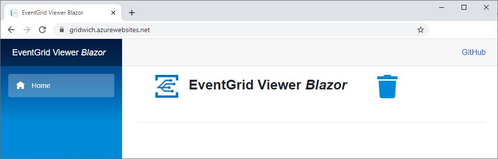
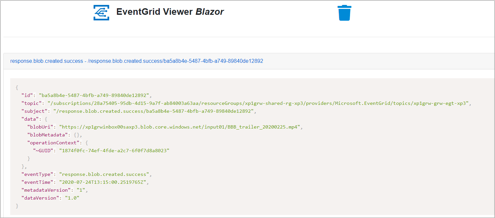
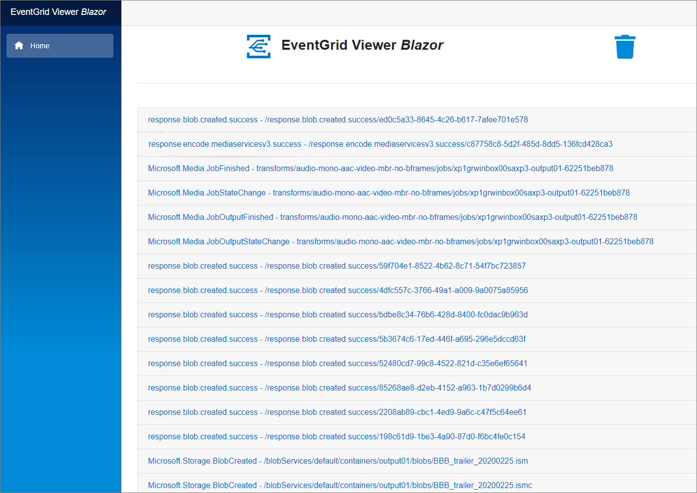
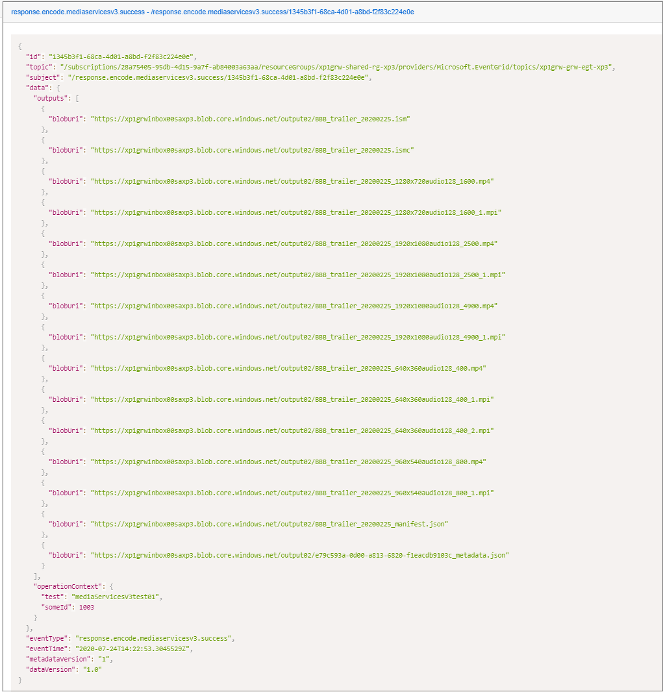
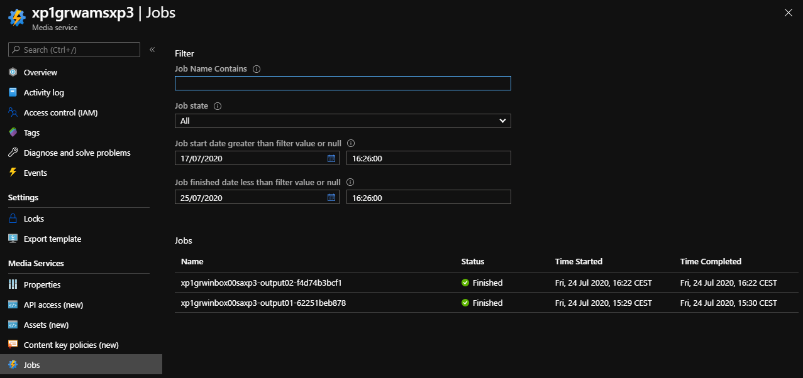
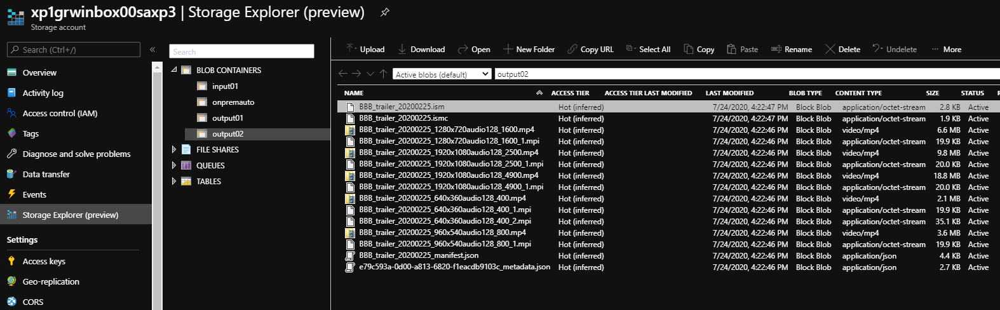

Testing an application is an integral part of the application development life cycle. Testing ensures that your application or service will perform as expected when published.

You can test your deployed application in Azure or locally, and in both cases, you can monitor the events sent to the topic.

## How to test Gridwich projects in Azure

1. Use the following URL to open the Event Grid Viewer app:

   `https://<your app name>-<your environment name>.azurewebsites.net`

   The Event Grid Viewer Blazor should load, with no event in the list.

   

1. Prepare the input content.

   In an Azure Storage Account attached to Azure Media Services, for example `cl1grwinbox00sa<your-environment-name>`, create a container, for example `input01`, and upload a video file in it, for example `BBB_trailer_20200225.mp4`.

   

1. Send a message to the deployed Function App.

   Find the Gridwich Azure Function App in the portal, select the Event Grid function, and then select **Testing**.

   POST the following payload:

   ```json
   [
       {
           "eventType": "request.encode.mediaservicesv3.create",
           "topic": "/NotUsed",
           "id": "d5ffca18-29f8-4529-ae74-ac88ec5a7ed1",
           "subject": "/NotUsed",
           "data": {
               "inputs": [ {
                   "bloburi": "https://cl1grwinbox00saxp3.blob.core.windows.net/input01/BBB_trailer_20200225.mp4"
               }],
               "outputContainer": "https://cl1grwinbox00sasb.blob.core.windows.net/output01/",
               "transformName": "audio-mono-aac-video-mbr-no-bframes",
               "operationContext": {
                   "test": "mediaServicesV3test01",
                   "someId": 1003
               }
           },
           "eventTime": "2020-01-01T16:20:00.0000000-05:00",
           "metadataVersion": null,
           "dataVersion": "1.0"
       }
   ]
   ```

   You should see a `response.encode.mediaservicesv3.success` event.

   

## How to test Gridwich projects locally

Make sure your Gridwich project and pipelines are in place, and developer permissions are set up. For more information, see [Gridwich Azure DevOps setup](set-up-azure-devops.yml).

To create a new cloud development environment, see [Create a new environment](create-delete-cloud-environment.yml). Verify that you have the correct settings for the environment you're targeting.

To set up your local environment, see [Gridwich local development environment](set-up-local-environment.yml).

1. Run the Function App. In the command window, you should see the Event Grid function listening locally.

   ```text
   Now listening on: http://0.0.0.0:7071
   Application started. Press Ctrl+C to shut down.

   Http Functions:

           EventGrid: [POST] http://localhost:7071/api/EventGrid
   ```

   Note: the port number could be different.

1. Send the payload to the local function to trigger the encoding.

   In a bash shell, or any tool that can POST payloads, run the command:

   ```bash
   curl -X POST \
           'http://localhost:7071/api/EventGrid' \
           -H 'Content-Type: application/json' \
           -H 'aeg-event-type: Notification' \
           -H 'cache-control: no-cache' \
           -d '[
               {
                   "eventType": "request.encode.mediaservicesv3.create",
                   "topic": "/NotUsed",
                   "id": "d5ffca18-29f8-4529-ae74-ac88ec5a7ed1",
                   "subject": "/NotUsed",
                   "data": {
                       "inputs": [ {
                           "bloburi": "https://cl1grwinbox00saxp3.blob.core.windows.net/input01/BBB_trailer_20200225.mp4"
                       }],
                       "outputContainer": "https://cl1grwinbox00saxp3.blob.core.windows.net/output02/",
                       "transformName": "audio-mono-aac-video-mbr-no-bframes",
                       "operationContext": {
                           "test": "mediaServicesV3test01",
                           "someId": 1003
                       }
                   },
                   "eventTime": "2020-01-01T16:20:00.0000000-05:00",
                   "metadataVersion": null,
                   "dataVersion": "1.0"
               }
               ]'
   ```

   If needed, change the port number from 7071 to the one seen in the command window.

1. Check the Event Grid messages, job status, and blobs created.

   In the Function console, you should see a message like:

   ```text
   [12/03/2020 14:03:24] Executing HTTP request: {
   [12/03/2020 14:03:24]   "requestId": "b2422cf7-7e90-4f06-8e37-136fb1e8301e",
   [12/03/2020 14:03:24]   "method": "POST",
   [12/03/2020 14:03:24]   "uri": "/api/EventGrid"
   [12/03/2020 14:03:24] }
   [12/03/2020 14:03:24] Request successfully matched the route with name 'EventGrid' and template 'api/EventGrid'
   [12/03/2020 14:03:25] Executing 'EventGrid' (Reason='This function was programmatically called via the host APIs.', Id=60bd93da-eb76-400d-8aa6-b58099af5f52)
   [12/03/2020 14:03:25] Received event message.
   [12/03/2020 14:03:25] About to loop through all handlers for event.
   [12/03/2020 14:03:25] Going to publish event with event Id.
   [12/03/2020 14:03:26] Publish event to topic.
   [12/03/2020 14:03:26] Starting to handle event
   [12/03/2020 14:03:26] Encode request received.
   [12/03/2020 14:03:26] Calling all encoders.
   [12/03/2020 14:03:27] FUNCTIONS_WORKER_RUNTIME=dotnet. Will shutdown all the worker channels that started in placeholder mode
   [12/03/2020 14:03:27] Host lock lease acquired by instance ID '0000000000000000000000001B26047C'.
   [12/03/2020 14:03:31] Calling the specified encoder.
   [12/03/2020 14:03:31] Encode request received.
   [12/03/2020 14:03:31] Going to publish event with event Id.
   [12/03/2020 14:03:32] Publish event to topic.
   [12/03/2020 14:03:32] Finished handling event
   [12/03/2020 14:03:32] Called Event Handler for event.
   [12/03/2020 14:03:32] All handlers called for event message.
   [12/03/2020 14:03:32] Executed 'EventGrid' (Succeeded, Id=60bd93da-eb76-400d-8aa6-b58099af5f52)
   [12/03/2020 14:03:32] Executing HttpStatusCodeResult, setting HTTP status code 200
   [12/03/2020 14:03:32] Executed HTTP request: {
   [12/03/2020 14:03:32]   "requestId": "b2422cf7-7e90-4f06-8e37-136fb1e8301e",
   [12/03/2020 14:03:32]   "method": "POST",
   [12/03/2020 14:03:32]   "uri": "/api/EventGrid",
   [12/03/2020 14:03:32]   "identities": [
   [12/03/2020 14:03:32]     {
   [12/03/2020 14:03:32]       "type": "WebJobsAuthLevel",
   [12/03/2020 14:03:32]       "level": "Admin"
   [12/03/2020 14:03:32]     }
   [12/03/2020 14:03:32]   ],
   [12/03/2020 14:03:32]   "status": 200,
   [12/03/2020 14:03:32]   "duration": 7486
   [12/03/2020 14:03:32] }
   ```

   In the Azure Event Grid Viewer, you should see the job messages.

   

   You can also go to the Azure Media Services account to see the job running or completed.

   

   Check that the encoded files are in the Azure Storage Account output container.

   

## Next steps

Product documentation:

- [Gridwich cloud media system](gridwich-architecture.yml)
- [Azure Media Services v3 overview](/azure/media-services/latest/media-services-overview)
- [Introduction to Azure Functions](/azure/azure-functions/functions-overview)
- [What is Azure Blob storage?](/azure/storage/blobs/storage-blobs-overview)
- [What is Azure Event Grid?](/azure/event-grid/overview)

Microsoft Learn modules:

- [Explore Azure Event Grid](/training/modules/azure-event-grid)
- [Explore Azure Functions](/training/modules/explore-azure-functions)
- [Explore Azure Storage services](/training/modules/azure-storage-fundamentals)

## Related resources

- [Gridwich content protection and DRM](gridwich-content-protection-drm.yml)
- [Gridwich Media Services setup and scaling](media-services-setup-scale.yml)
- [Gridwich operations for Azure Storage](gridwich-storage-service.yml)
- [How to create a Gridwich environment](create-delete-cloud-environment.yml)
