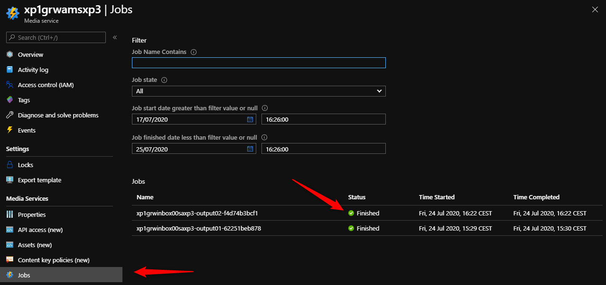

# Walkthrough: Testing AMS V3 Encoding

There are two options, you can test a deployed application in Azure, or you can test locally. In both cases, you will want to monitor the events sent to the topic.

## 1. Open event grid viewer

Open the Event Grid Viewer app, which might be:

`https://cl1grw-grw-wa-viewer-sb.azurewebsites.net`

or

`https://cl1grw-grw-wa-viewer-{your-environment-name}.azurewebsites.net`

Note: update `cl1grw` by your application name if needed.

Expected: EventGrid Viewer Blazor is loaded, and no event in list.

## 2. Prepare the input content

In a storage account attached to Media Services (for example in `cl1grwinbox00sa{your-environment-name}`), create a container (for example `input01`) and upload a video file in it (for example `BBB_trailer_20200225.mp4`).


## 3. Sending a message to a deployed function app

Find the function app in the portal, click the EventGrid function and then Testing.

POST the following payload:

```json
[
    {
        "eventType": "request.encode.mediaservicesv3.create",
        "topic": "/NotUsed",
        "id": "d5ffca18-29f8-4529-ae74-ac88ec5a7ed1",
        "subject": "/NotUsed",
        "data": {
            "inputs": [ {
                "bloburi": "https://cl1grwinbox00saxp3.blob.core.windows.net/input01/BBB_trailer_20200225.mp4"
            }],
            "outputContainer": "https://cl1grwinbox00sasb.blob.core.windows.net/output01/",
            "transformName": "audio-mono-aac-video-mbr-no-bframes",
            "operationContext": {
                "test": "mediaServicesV3test01",
                "someId": 1003
            }
        },
        "eventTime": "2020-01-01T16:20:00.0000000-05:00",
        "metadataVersion": null,
        "dataVersion": "1.0"
    }
]
```


You should see a ```response.encode.mediaservicesv3.success``` event.


## 4.0 Running locally

Verify that you have the correct local settings for the environment you are targeting.

To set up your own environment use:
[Creating a new environment](create-delete-cloud-environment.md)


To get the setting for an environment use:
[Set up local settings](create-delete-cloud-environment.md)

Setup permissions for the developers:
[Setup your AAD for Devs Section](set-up-azure-devops.md)

Run the Function app.
In the command window, you should see the EventGrid function listening locally.

```text
Now listening on: http://0.0.0.0:7071
Application started. Press Ctrl+C to shut down.

Http Functions:

        EventGrid: [POST] http://localhost:7071/api/EventGrid
```

## 4.1 Send the payload to the local function to trigger the encoding

In a bash shell, or via any tooling that can POST payloads, run the command:

```bash
curl -X POST \
        'http://localhost:7071/api/EventGrid' \
        -H 'Content-Type: application/json' \
        -H 'aeg-event-type: Notification' \
        -H 'cache-control: no-cache' \
        -d '[
            {
                "eventType": "request.encode.mediaservicesv3.create",
                "topic": "/NotUsed",
                "id": "d5ffca18-29f8-4529-ae74-ac88ec5a7ed1",
                "subject": "/NotUsed",
                "data": {
                    "inputs": [ {
                        "bloburi": "https://cl1grwinbox00saxp3.blob.core.windows.net/input01/BBB_trailer_20200225.mp4"
                    }],
                    "outputContainer": "https://cl1grwinbox00saxp3.blob.core.windows.net/output02/",
                    "transformName": "audio-mono-aac-video-mbr-no-bframes",
                    "operationContext": {
                        "test": "mediaServicesV3test01",
                        "someId": 1003
                    }
                },
                "eventTime": "2020-01-01T16:20:00.0000000-05:00",
                "metadataVersion": null,
                "dataVersion": "1.0"
            }
            ]'
```

## 5. Check the event grid messages, job status and blobs created

You should see in the Function console, a message like

```text
[12/03/2020 14:03:24] Executing HTTP request: {
[12/03/2020 14:03:24]   "requestId": "b2422cf7-7e90-4f06-8e37-136fb1e8301e",
[12/03/2020 14:03:24]   "method": "POST",
[12/03/2020 14:03:24]   "uri": "/api/EventGrid"
[12/03/2020 14:03:24] }
[12/03/2020 14:03:24] Request successfully matched the route with name 'EventGrid' and template 'api/EventGrid'
[12/03/2020 14:03:25] Executing 'EventGrid' (Reason='This function was programmatically called via the host APIs.', Id=60bd93da-eb76-400d-8aa6-b58099af5f52)
[12/03/2020 14:03:25] Received event message.
[12/03/2020 14:03:25] About to loop through all handlers for event.
[12/03/2020 14:03:25] Going to publish event with event Id.
[12/03/2020 14:03:26] Publish event to topic.
[12/03/2020 14:03:26] Starting to handle event
[12/03/2020 14:03:26] Encode request received.
[12/03/2020 14:03:26] Calling all encoders.
[12/03/2020 14:03:27] FUNCTIONS_WORKER_RUNTIME=dotnet. Will shutdown all the worker channels that started in placeholder mode
[12/03/2020 14:03:27] Host lock lease acquired by instance ID '0000000000000000000000001B26047C'.
[12/03/2020 14:03:31] Calling the specified encoder.
[12/03/2020 14:03:31] Encode request received.
[12/03/2020 14:03:31] Going to publish event with event Id.
[12/03/2020 14:03:32] Publish event to topic.
[12/03/2020 14:03:32] Finished handling event
[12/03/2020 14:03:32] Called Event Handler for event.
[12/03/2020 14:03:32] All handlers called for event message.
[12/03/2020 14:03:32] Executed 'EventGrid' (Succeeded, Id=60bd93da-eb76-400d-8aa6-b58099af5f52)
[12/03/2020 14:03:32] Executing HttpStatusCodeResult, setting HTTP status code 200
[12/03/2020 14:03:32] Executed HTTP request: {
[12/03/2020 14:03:32]   "requestId": "b2422cf7-7e90-4f06-8e37-136fb1e8301e",
[12/03/2020 14:03:32]   "method": "POST",
[12/03/2020 14:03:32]   "uri": "/api/EventGrid",
[12/03/2020 14:03:32]   "identities": [
[12/03/2020 14:03:32]     {
[12/03/2020 14:03:32]       "type": "WebJobsAuthLevel",
[12/03/2020 14:03:32]       "level": "Admin"
[12/03/2020 14:03:32]     }
[12/03/2020 14:03:32]   ],
[12/03/2020 14:03:32]   "status": 200,
[12/03/2020 14:03:32]   "duration": 7486
[12/03/2020 14:03:32] }
```

Expected: in the Azure Event Grid Viewer, you should see the job messages.


You can also go the Media Services account to see the job running or completed.


And you can check that in the output container, encoded file are there.

