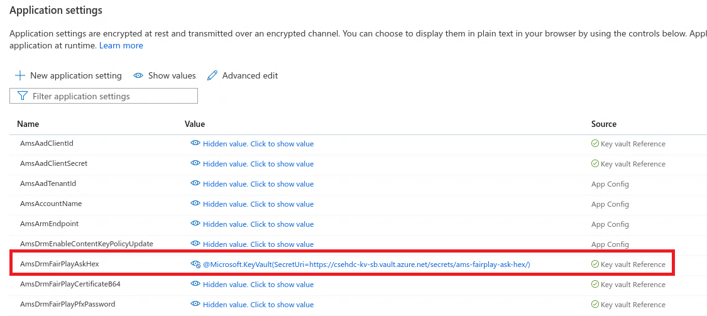

# Pipelines to Terraform variable flow

This article describes how Azure Pipelines *variable group* variables flow into various Terraform modules, which deploy them to Azure Key Vault and finally to the Azure Functions App app settings as Key Vault secret references.

The example is a deep dive into how the **amsDrmFairPlayAskHex** variable, located in the **gridwich-cicd-variables.global** variable group, flows througout the continuous integration and continuous delivery (CI/CD) process.

## Prerequisites

- Basic knowledge of [Terraform](/azure/developer/terraform/overview) and [Azure Pipelines](/services/devops/pipelines) operations.

- An Azure DevOps Gridwich project, pipelines, and variable groups, set up by following the instructions at [Gridwich Azure DevOps setup](set-up-azure-devops.md), and the [admin scripts](admin-scripts.md) run to give Gridwich permission to Azure components.

- The **amsDrmFairPlayAskHex** variable set in the **gridwich-cicd-variables.global** variable group. The value is the FairPlay hexadecimal ASK Key that Apple provides in *AppleASK.txt*. Or, for development purposes, you can use the dummy value and file described in [Add pipeline variable groups](set-up-azure-devops.md#add-pipeline-variable-groups). Save the value in Secured mode.
  
  

## The amsDrmFairPlayAskHex flow

The **amsDrmFairPlayAskHex** Azure Pipelines variable interacts with Azure Media Services FairPlay DRM. The pipeline passes the variable value to Terraform to set in the shared Azure Key Vault and ultimately referenced as a Key Vault reference secret in the Azure Function App settings.

The variable is automatically stored as a CI/CD server environment variable because it's referenced in [variables.yml](https://github.com/mspnp/gridwich/infrastructure/azure-pipelines/variables.yml), which is used as a template in each *ci_cd_<environment>_release.yml* pipeline.

1. The [deploy-to-env-stages-template.yml](https://github.com/mspnp/gridwich/infrastructure/azure-pipelines/templates/stages/deploy-to-env-stages-template.yml) template passes the CI/CD server environment variable to Terraform as a variable, using the `TerraformArguments` property. This action happens for both the first and second Terraform sandwich jobs.
   
   ```yaml
   stages:
   - template: terraform-stages-template.yml
       parameters:
       applyDependsOn:
       - BuildFunctionsArtifact
       environmentName: ${{ parameters.environmentName }}
       environmentValue: ${{ parameters.environmentValue }}
       applicationName: ${{ parameters.applicationName }}
       serviceConnection: ${{ parameters.serviceConnection }}
       stageSuffix: top
       stageSuffixDisplayName: Top
       TerraformArguments: >-
           -var amsDrm_FairPlay_Ask_Hex="$(amsDrmFairPlayAskHex)"
            . . .
   ```
   
   The **amsDrm_FairPlay_Ask_Hex** variable in the main module [variables.tf](https://github.com/mspnp/gridwich/infrastructure/terraform/variables.tf) file will contain the value of the `amsDrmFairPlayAskHex` CI/CD environment variable:
   
   ```yaml
   variable "amsDrm_FairPlay_Ask_Hex" {
   type        = string
   description = "The FairPlay Ask key in Hex format."
   }
   ```
   
1. Terraform passes the value to the `shared` Terraform module:
   
   ```terraform
   module "shared" {
       source = "./shared"
       amsDrm_FairPlay_Ask_Hex = var.amsDrm_FairPlay_Ask_Hex
       . . .
   }
   ```
   
1. The shared Terraform module [main.tf](https://github.com/mspnp/gridwich/infrastructure/terraform/shared/main.tf) sets the **amsDrm_FairPlay_Ask_Hex** variable as a secret in the shared Azure Key Vault:
   
   ```terraform
   resource "azurerm_key_vault_secret" "ams_fairplay_ask_hex" {
       name         = "ams-fairplay-ask-hex"
       value        = var.amsDrm_FairPlay_Ask_Hex
       key_vault_id = azurerm_key_vault.shared_key_vault.id
   
       lifecycle {
           ignore_changes = [
           value,
           tags
           ]
       }
   }
   ```
   
1. The `mediaservices` module in the [main.tf](https://github.com/mspnp/gridwich/infrastructure/terraform/main.tf) file generates a *media_services_app_settings.json* file artifact that the CI/CD process uses to set the Function App app settings for Azure Media Services:
   
   - In the [main](https://github.com/mspnp/gridwich/infrastructure/terraform/main.tf) module:
     
     ```terraform
         module "mediaservices" {
           source = "./mediaservices"
           . . .
         }
     ```
     
   - In the [mediaservices/main](https://github.com/mspnp/gridwich/infrastructure/terraform/mediaservices/main.tf) module:
     
     ```terraform
         locals {
         media_services_app_settings = [
             . . .,
             {
             name        = "AmsDrmFairPlayAskHex"
             value       = format("@Microsoft.KeyVault(SecretUri=https://%s.vault.azure.net/secrets/%s/)", var.key_vault_name, "ams-fairplay-ask-hex")
             slotSetting = false
             },
             . . .
         ]
         }
     
         resource "local_file" "media_services_app_settings_json" {
         sensitive_content = jsonencode(local.media_services_app_settings)
         filename          = "./app_settings/media_services_app_settings.json"
         }
     ```
     
   - Sample entry in the *media_services_app_settings.json* file:
     
     ```json
         [
             . . .,
             {"name":"AmsDrmFairPlayAskHex","slotSetting":false,"value":"@Microsoft.KeyVault(SecretUri=https://gridwich-kv-sb.vault.azure.net/secrets/ams-fairplay-ask-hex/)"},
             . . .
         ]
     ```
     
1. The [functions-deploy-steps-template.yml](https://github.com/mspnp/gridwich/infrastructure/azure-pipelines/templates/steps/functions-deploy-steps-template.yml) template loops through each generated *media_services_app_settings.json* and other similar JSON files, and uses the Azure CLI to set the Function App app settings:
   
   ```yaml
       - task: AzureCLI@1
       displayName: 'Update app settings with terraform values'
       inputs:
           azureSubscription: ${{ parameters.serviceConnection }}
           scriptLocation: inlineScript
           inlineScript: |
           set -eu
           for filename in $(Pipeline.Workspace)/variables_${{ parameters.environment }}_top/app_settings/*.json ; do
               echo "Applying settings from $(basename ${filename}) into ${{parameters.functionAppName}}/source-slot with rg ${{parameters.functionAppResourceGroup}}"
               az functionapp config appsettings set -g "${{parameters.functionAppResourceGroup}}" -s "source-slot" -n "${{parameters.functionAppName}}" --settings @"$(echo ${filename})" > /dev/null
               echo "Settings applied for $(basename ${filename})"
           done
           addSpnToEnvironment: true
   ```
   
The following screenshots show:

- A published *media_services_app_settings.json* artifact in an Azure Pipeline:
  
  
  
- Output from the `Deploy Functions` pipeline job:
  
  
  
- The `amsDrmFairPlayAskHex` Key Vault secret reference set in the Function App appsettings:
  
  
