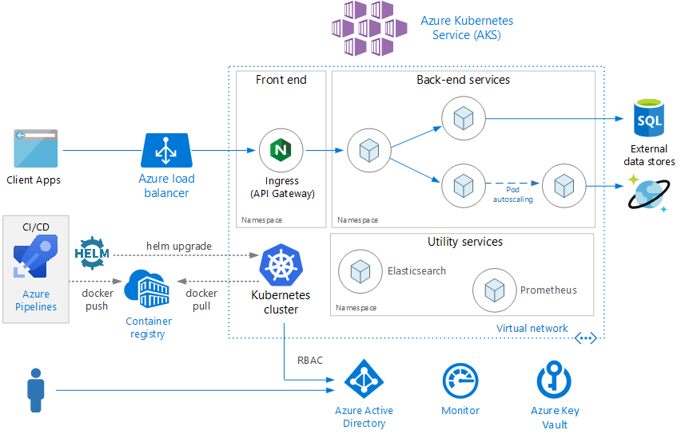
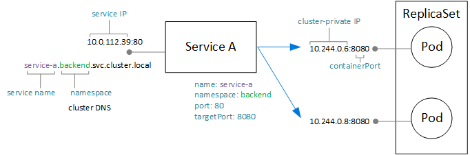

# Microservices architecture on Azure Kubernetes Service (AKS)

This reference architecture shows a microservices application deployed to Azure Kubernetes Service (AKS). It describes a basic AKS configuration that can be the starting point for most deployments. This article assumes basic knowledge of Kubernetes. The article focuses mainly on the infrastructure and DevOps considerations of running a microservices architecture on AKS. For guidance on how to design microservices, see [Building microservices on Azure](../../microservices/index.md).

 A reference implementation of this architecture is available on [GitHub][ri].

*Download a [Visio file][visio-download] of this architecture.*

## Architecture

The architecture consists of the following components.

**Azure Kubernetes Service** (AKS). AKS is an Azure service that deploys a managed Kubernetes cluster.

**Kubernetes cluster**. AKS is responsible for deploying the Kubernetes cluster and for managing the Kubernetes masters. You only manage the agent nodes.

**Virtual network**. By default, AKS creates a virtual network to deploy the agent nodes into. For more advanced scenarios, you can create the virtual network first, which lets you control things like how the subnets are configured, on-premises connectivity, and IP addressing. For more information, see [Configure advanced networking in Azure Kubernetes Service (AKS)](/azure/aks/configure-advanced-networking).

**Ingress**. An ingress exposes HTTP(S) routes to services inside the cluster. For more information, see the section [API Gateway](#api-gateway) below.

**Azure Load Balancer**. An Azure Load Balancer is created when the NGINX ingress controller is deployed. The load balancer routes internet traffic to the ingress.

**External data stores**. Microservices are typically stateless and write state to external data stores, such as Azure SQL Database or Cosmos DB.

**Azure Active Directory**. AKS uses an Azure Active Directory (Azure AD) identity to create and manage other Azure resources such as Azure load balancers. Azure AD is also recommended for user authentication in client applications.

**Azure Container Registry**. Use Container Registry to store private Docker images, which are deployed to the cluster. AKS can authenticate with Container Registry using its Azure AD identity. Note that AKS does not require Azure Container Registry. You can use other container registries, such as Docker Hub.

**Azure Pipelines**. Pipelines is part of Azure DevOps Services and runs automated builds, tests, and deployments. You can also use third-party CI/CD solutions such as Jenkins.

**Helm**. Helm is as a package manager for Kubernetes &mdash; a way to bundle Kubernetes objects into a single unit that you can publish, deploy, version, and update.

**Azure Monitor**. Azure Monitor collects and stores metrics and logs, including platform metrics for the Azure services in the solution and application telemetry. Use this data to monitor the application, set up alerts and dashboards, and perform root cause analysis of failures. Azure Monitor integrates with AKS to collect metrics from controllers, nodes, and containers, as well as container logs and master node logs.

## Design considerations

This reference architecture is focused on microservices architectures, although many of the recommended practices will apply to other workloads running on AKS.

### Microservices

The Kubernetes Service object is a natural way to model microservices in Kubernetes. A microservice is a loosely coupled, independently deployable unit of code. Microservices typically communicate through well-defined APIs, and are discoverable through some form of service discovery. The Kubernetes Service object provides a set of capabilities that match these requirements:

- IP address. The Service object provides a static internal IP address for a group of pods (ReplicaSet). As pods are created or moved around, the service is always reachable at this internal IP address.

- Load balancing. Traffic sent to the service's IP address is load balanced to the pods.

- Service discovery. Services are assigned internal DNS entries by the Kubernetes DNS service. That means the API gateway can call a backend service using the DNS name. The same mechanism can be used for service-to-service communication. The DNS entries are organized by namespace, so if your namespaces correspond to bounded contexts, then the DNS name for a service will map naturally to the application domain.

The following diagram show the conceptual relation between services and pods. The actual mapping to endpoint IP addresses and ports is done by kube-proxy, the Kubernetes network proxy.

### API Gateway

An *API gateway* is a gateway that sits between external clients and the microservices. It acts as a reverse proxy, routing requests from clients to microservices. It may also perform various cross-cutting tasks such as authentication, SSL termination, and rate limiting.

Functionality provided by a gateway can be grouped as follows:

- [Gateway Routing](../../patterns/gateway-routing.md): Routing client requests to the right backend services. This provides a single endpoint for clients, and helps to decouple clients from services.

- [Gateway Aggregation](../../patterns/gateway-aggregation.md): Aggregation of multiple requests into a single request, to reduce chattiness between the client and the backend.

- [Gateway Offloading](../../patterns/gateway-offloading.md). A gateway can offload functionality from the backend services, such as SSL termination, authentication, IP whitelisting, or client rate limiting (throttling).

API gateways are a general [microservices design pattern](https://microservices.io/patterns/apigateway.html). They can be implemented using a number of different technologies. Probably the most common implementation is to deploy an edge router or reverse proxy, such as Nginx, HAProxy, or Traefik, inside the cluster. A reverse proxy server is a potential bottleneck or single point of failure, so always deploy at least two replicas for high availability.

For AKS, you can also use Azure Application Gateway, using the [Application Gateway Ingress Controller](https://azure.github.io/application-gateway-kubernetes-ingress/). This option requires [CNI networking](/azure/aks/configure-azure-cni) to be enabled when you configure the ASK cluster, because Application Gateway is deployed into a subnet of the AKS virtual network. For more information about load-balancing services in Azure, see [Overview of load-balancing options in Azure](../../guide/technology-choices/load-balancing-overview.md).

The Kubernetes **Ingress** resource type abstracts the configuration settings for a proxy server. It works in conjunction with an ingress controller, which provides the underlying implementation of the Ingress. There are ingress controllers for Nginx, HAProxy, Traefik, and Application Gateway, among others.

The ingress controller handles configuring the proxy server. Often these require complex configuration files, which can be hard to tune if you aren't an expert, so the ingress controller is a nice abstraction. In addition, the Ingress Controller has access to the Kubernetes API, so it can make intelligent decisions about routing and load balancing. For example, the Nginx ingress controller bypasses the kube-proxy network proxy.

On the other hand, if you need complete control over the settings, you may want to bypass this abstraction and configure the proxy server manually.

### Data storage

In a microservices architecture, services should not share data storage. Each service should own its own private data in a separate logical storage, to avoid hidden dependencies among services. The reason is to avoid unintentional coupling between services, which can happen when services share the same underlying data schemas. Also, when services manage their own data stores, they can use the right data store for their particular requirements. For more information, see [Designing microservices: Data considerations](/azure/architecture/microservices/data-considerations).

Avoid storing persistent data in local cluster storage, because that ties the data to the node. Instead,

- Use an external service such as Azure SQL Database or Cosmos DB, *or*

- Mount a persistent volume using Azure Disks or Azure Files. Use Azure Files if the same volume needs to be shared by multiple pods.

### Namespaces

Use namespaces to organize services within the cluster. Every object in a Kubernetes cluster belongs to a namespace. By default, when you create a new object, it goes into the `default` namespace. But it's a good practice to create namespaces that are more descriptive to help organize the resources in the cluster.

First, namespaces help prevent naming collisions. When multiple teams deploy microservices into the same cluster, with possibly hundreds of microservices, it gets hard to manage if they all go into the same namespace. In addition, namespaces allow you to:

- Apply resource constraints to a namespace, so that the total set of pods assigned to that namespace cannot exceed the resource quota of the namespace.

- Apply policies at the namespace level, including RBAC and security policies.

For a microservices architecture, considering organizing the microservices into bounded contexts, and creating namespaces for each bounded context. For example, all microservices related to the "Order Fulfillment" bounded context could go into the same namespace. Alternatively, create a namespace for each development team.

Place utility services into their own separate namespace. For example, you might deploy Elasticsearch or Prometheus for cluster monitoring, or Tiller for Helm.

## Scalability considerations

Kubernetes supports scale-out at two levels:

- Scale the number of pods allocated to a deployment.
- Scale the nodes in the cluster, to increase the total compute resources available to the cluster.

Although you can scale out pods and nodes manually, we recommend using autoscaling, to minimize the chance that services will become resource starved under high load. An autoscaling strategy must take both pods and nodes into account. If you just scale out the pods, eventually you will reach the resource limits of the nodes.

### Pod autoscaling

The Horizontal Pod Autoscaler (HPA) scales pods based on observed CPU, memory, or custom metrics. To configure horizontal pod scaling, you specify a target metric (for example, 70% of CPU), and the minimum and maximum number of replicas. You should load test your services to derive these numbers.

A side-effect of autoscaling is that pods may be created or evicted more frequently, as scale-out and scale-in events happen. To mitigate the effects of this:

- Use readiness probes to let Kubernetes know when a new pod is ready to accept traffic.
- Use pod disruption budgets to limit how many pods can be evicted from a service at a time.

### Cluster autoscaling

The cluster autoscaler scales the number of nodes. If pods can't be scheduled because of resource constraints, the cluster autoscaler will provision more nodes.

Whereas HPA looks at actual resources consumed or other metrics from running pods, the cluster autoscaler is provisioning nodes for pods that aren't scheduled yet. Therefore, it looks at the requested resources, as specified in the Kubernetes pod spec for a deployment. Use load testing to fine-tune these values.

You can't change the VM size after you create the cluster, so you should do some initial capacity planning to choose an appropriate VM size for the agent nodes when you create the cluster.

## Availability considerations

### Health probes

Kubernetes defines two types of health probe that a pod can expose:

- Readiness probe: Tells Kubernetes whether the pod is ready to accept requests.

- Liveness probe: Tells Kubernetes whether a pod should be removed and a new instance started.

When thinking about probes, it's useful to recall how a service works in Kubernetes. A service has a label selector that matches a set of (zero or more) pods. Kubernetes load balances traffic to the pods that match the selector. Only pods that started successfully and are healthy receive traffic. If a container crashes, Kubernetes kills the pod and schedules a replacement.

Sometimes, a pod may not be ready to receive traffic, even though the pod started successfully. For example, there may be initialization tasks, where the application running in the container loads things into memory or reads configuration data. To indicate that a pod is healthy but not ready to receive traffic, define a readiness probe.

Liveness probes handle the case where a pod is still running, but is unhealthy and should be recycled. For example, suppose that a container is serving HTTP requests but hangs for some reason. The container doesn't crash, but it has stopped serving any requests. If you define an HTTP liveness probe, the probe will stop responding and that informs Kubernetes to restart the pod.

Here are some considerations when designing probes:

- If your code has a long startup time, there is a danger that a liveness probe will report failure before the startup completes. To prevent this, use the initialDelaySeconds setting, which delays the probe from starting.

- A liveness probe doesn't help unless restarting the pod is likely to restore it to a healthy state. You can use a liveness probe to mitigate against memory leaks or unexpected deadlocks, but there's no point in restarting a pod that's going to immediately fail again.

- Sometimes readiness probes are used to check dependent services. For example, if a pod has a dependency on a database, the probe might check the database connection. However, this approach can create unexpected problems. An external service might be temporarily unavailable for some reason. That will cause the readiness probe to fail for all the pods in your service, causing all of them to be removed from load balancing, and thus creating cascading failures upstream. A better approach is to implement retry handling within your service, so that your service can recover correctly from transient failures.

### Resource constraints

Resource contention can affect the availability of a service. Define resource constraints for containers, so that a single container cannot overwhelm the cluster resources (memory and CPU). For non-container resources, such as threads or network connections, consider using the [Bulkhead Pattern](/azure/architecture/patterns/bulkhead) to isolate resources.

Use resource quotas to limit the total resources allowed for a namespace. That way, the front end can't starve the backend services for resources or vice-versa.

## Security considerations

### Role based access control (RBAC)

Kubernetes and Azure both have mechanisms for role-based access control (RBAC):

- Azure RBAC controls access to resources in Azure, including the ability to create new Azure resources. Permissions can be assigned to users, groups, or service principals. (A service principal is a security identity used by applications.)

- Kubernetes RBAC controls permissions to the Kubernetes API. For example, creating pods and listing pods are actions that can be authorized (or denied) to a user through RBAC. To assign Kubernetes permissions to users, you create *roles* and *role bindings*:

  - A Role is a set of permissions that apply within a namespace. Permissions are defined as verbs (get, update, create, delete) on resources (pods, deployments, etc.).

  - A RoleBinding assigns users or groups to a Role.

  - There is also a ClusterRole object, which is like a Role but applies to the entire cluster, across all namespaces. To assign users or groups to a ClusterRole, create a ClusterRoleBinding.

AKS integrates these two RBAC mechanisms. When you create an AKS cluster, you can configure it to use Azure AD for user authentication. For details on how to set this up, see [Integrate Azure Active Directory with Azure Kubernetes Service](/azure/aks/aad-integration).

Once this is configured, a user who wants to access the Kubernetes API (for example, through kubectl) must sign in using their Azure AD credentials.

By default, an Azure AD user has no access to the cluster. To grant access, the cluster administrator creates RoleBindings that refer to Azure AD users or groups. If a user doesn't have permissions for a particular operation, it will fail.

If users have no access by default, how does the cluster admin have permission to create the role bindings in the first place? An AKS cluster actually has two types of credentials for calling the Kubernetes API server: cluster user and cluster admin. The cluster admin credentials grant full access to the cluster. The Azure CLI command `az aks get-credentials --admin` downloads the cluster admin credentials and saves them into your kubeconfig file. The cluster administrator can use this kubeconfig to create roles and role bindings.

Because the cluster admin credentials are so powerful, use Azure RBAC to restrict access to them:

- The "Azure Kubernetes Service Cluster Admin Role" has permission to download the cluster admin credentials. Only cluster administrators should be assigned to this role.

- The "Azure Kubernetes Service Cluster User Role" has permission to download the cluster user credentials. Non-admin users can be assigned to this role. This role does not give any particular permissions on Kubernetes resources inside the cluster &mdash; it just allows a user to connect to the API server.

When you define your RBAC policies (both Kubernetes and Azure), think about the roles in your organization:

- Who can create or delete an AKS cluster and download the admin credentials?
- Who can administer a cluster?
- Who can create or update resources within a namespace?

It's a good practice to scope Kubernetes RBAC permissions by namespace, using Roles and RoleBindings, rather than ClusterRoles and ClusterRoleBindings.

Finally, there is the question of what permissions the AKS cluster has to create and manage Azure resources, such as load balancers, networking, or storage. To authenticate itself with Azure APIs, the cluster uses an Azure AD service principal. If you don't specify a service principal when you create the cluster, one is created automatically. However, it's a good security practice to create the service principal first and assign the minimal RBAC permissions to it. For more information, see [Service principals with Azure Kubernetes Service](/azure/aks/kubernetes-service-principal).

### Secrets management and application credentials

Applications and services often need credentials that allow them to connect to external services such as Azure Storage or SQL Database. The challenge is to keep these credentials safe and not leak them.

For Azure resources, one option is to use managed identities. The idea of a managed identity is that an application or service has an identity stored in Azure AD, and uses this identity to authenticate with an Azure service. The application or service has a Service Principal created for it in Azure AD, and authenticates using OAuth 2.0 tokens. The executing process calls a localhost address to get the token. That way, you don't need to store any passwords or connection strings. You can use managed identities in AKS by assigning identities to individual pods, using the [aad-pod-identity](https://github.com/Azure/aad-pod-identity) project.

Currently, not all Azure services support authentication using managed identities. For a list, see [Azure services that support Azure AD authentication](/azure/active-directory/managed-identities-azure-resources/services-support-msi).

Even with managed identities, you'll probably need to store some credentials or other application secrets, whether for Azure services that don't support managed identities, third-party services, API keys, and so on. Here are some options for storing secrets securely:

- Azure Key Vault. In AKS, you can mount one or more secrets from Key Vault as a volume. The volume reads the secrets from Key Vault. The pod can then read the secrets just like a regular volume. For more information, see the [Kubernetes-KeyVault-FlexVolume](https://github.com/Azure/kubernetes-keyvault-flexvol) project on GitHub.

    The pod authenticates itself by using either a pod identity (described above) or by using an Azure AD Service Principal along with a client secret. Using pod identities is recommended because the client secret isn't needed in that case.

- HashiCorp Vault. Kubernetes applications can authenticate with HashiCorp Vault using Azure AD managed identities. See [HashiCorp Vault speaks Azure Active Directory](https://open.microsoft.com/2018/04/10/scaling-tips-hashicorp-vault-azure-active-directory/). You can deploy Vault itself to Kubernetes, but it's recommend to run it in a separate dedicated cluster from your application cluster.

- Kubernetes secrets. Another option is simply to use Kubernetes secrets. This option is the easiest to configure but has some challenges. Secrets are stored in etcd, which is a distributed key-value store. AKS [encrypts etcd at rest](https://github.com/Azure/kubernetes-kms#azure-kubernetes-service-aks). Microsoft manages the encryption keys.

Using a system like HashiCorp Vault or Azure Key Vault provides several advantages, such as:

- Centralized control of secrets.
- Ensuring that all secrets are encrypted at rest.
- Centralized key management.
- Access control of secrets.
- Auditing

### Pod and container security

This list is certainly not exhaustive, but here are some recommended practices for securing your pods and containers:

Don't run containers in privileged mode. Privileged mode gives a container access to all devices on the host. You can set Pod Security Policy to disallow containers from running in privileged mode.

When possible, avoid running processes as root inside containers. Containers do not provide complete isolation from a security standpoint, so it's better to run a container process as a non-privileged user.

Store images in a trusted private registry, such as Azure Container Registry or Docker Trusted Registry. Use a validating admission webhook in Kubernetes to ensure that pods can only pull images from the trusted registry.

Scan images and running containers for known vulnerabilities, using a scanning solution such as Twistlock and Aqua, which are available through the Azure Marketplace.

Automate image patching using ACR Tasks, a feature of Azure Container Registry. A container image is built up from layers. The base layers include the OS image and application framework images, such as ASP.NET Core or Node.js. The base images are typically created upstream from the application developers, and are maintained by other project maintainers. When these images are patched upstream, it's important to update, test, and redeploy your own images, so that you don't leave any known security vulnerabilities. ACR Tasks can help to automate this process.

## Deployment (CI/CD) considerations

Here are some goals of a robust CI/CD process for a microservices architecture:

- Each team can build and deploy the services that it owns independently, without affecting or disrupting other teams.
- Before a new version of a service is deployed to production, it gets deployed to dev/test/QA environments for validation. Quality gates are enforced at each stage.
- A new version of a service can be deployed side by side with the previous version.
- Sufficient access control policies are in place.
- For containerized workloads, you can trust the container images that are deployed to production.

To learn more about the challenges, see [CI/CD for microservices architectures](../../microservices/ci-cd.md).

For specific recommendations and best practices, see [CI/CD for microservices on Kubernetes](../../microservices/ci-cd-kubernetes.md).

## Deploy the solution

To deploy the reference implementation for this architecture, follow the steps in the [GitHub repo][ri-deploy].

[ri]: https://github.com/mspnp/microservices-reference-implementation
[ri-deploy]: https://github.com/mspnp/microservices-reference-implementation/blob/master/deployment.md
[visio-download]: https://archcenter.blob.core.windows.net/cdn/aks-reference-architecture.vsdx
