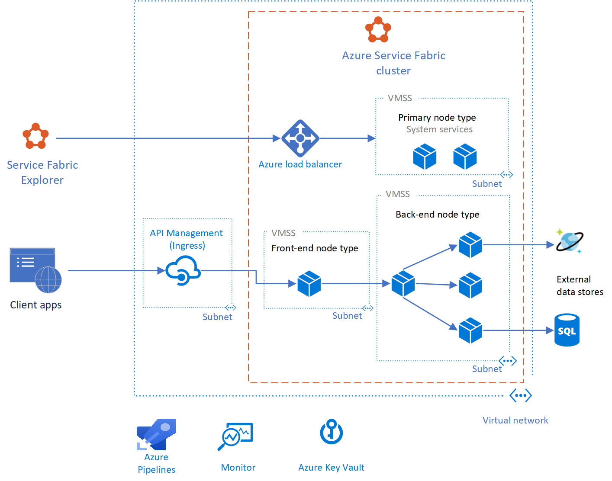
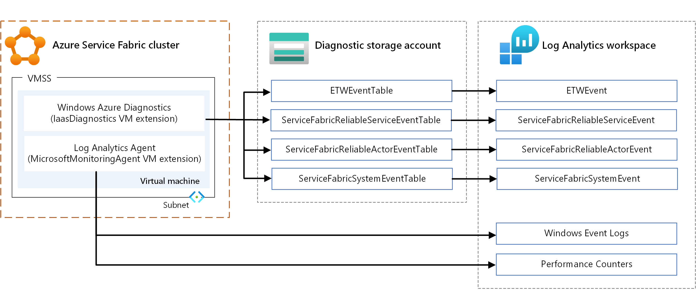

<!-- cSpell:ignore CosmosDB Kusto APIM executable's Serilog Traefik SPOF NSGs appsettings Dynatrace -->

This reference architecture shows a microservices architecture deployed to Azure Service Fabric. It shows a basic cluster configuration that can be the starting point for most deployments.

 A reference implementation of this architecture is available on [GitHub][ri].

## Architecture



*Download a [Visio file](https://arch-center.azureedge.net/microservices-service-fabric.vsdx) of this architecture.*

> [!NOTE]
> This article focuses on the [Reliable Services](/azure/service-fabric/service-fabric-reliable-services-introduction) programming model for Service Fabric. Using Service Fabric to deploy and manage [containers](/azure/service-fabric/service-fabric-containers-overview) is beyond the scope of this article.

### Workflow

The architecture consists of the following components. For other terms, see [Service Fabric terminology overview](/azure/service-fabric/service-fabric-technical-overview).

- **Service Fabric cluster**. A cluster is a network-connected set of virtual machines (VMs) into which you deploy and manage your microservices.

- **Virtual machine scale sets**. Virtual machine scale sets allow you to create and manage a group of identical, load-balanced, and autoscaling VMs. These compute resources also provide the fault and upgrade domains.

- **Nodes**. The nodes are the VMs that belong to the Service Fabric cluster.

- **Node types**. A node type represents a virtual machine scale set that deploys a collection of nodes. A Service Fabric cluster has at least one node type. 

  In a cluster that has multiple node types, one must be declared the [primary node type](/azure/service-fabric/service-fabric-cluster-capacity#primary-node-type). The primary node type in the cluster runs the [Service Fabric system services](/azure/service-fabric/service-fabric-technical-overview#system-services). These services provide the platform capabilities of Service Fabric. The primary node type also acts as the [seed nodes](/azure/service-fabric/service-fabric-disaster-recovery#random-failures-that-lead-to-cluster-failures), which are the nodes that maintain the availability of the underlying cluster. 
  
  Configure [additional node types](/azure/service-fabric/service-fabric-cluster-capacity#non-primary-node-type) to run your services.

- **Services**. A service performs a standalone function that can start and run independently of other services. Instances of services get deployed to nodes in the cluster. There are two varieties of services in Service Fabric:

  - **Stateless service**. A stateless service does not maintain state within the service. If state persistence is required, then state is written to and retrieved from an external store, such as Azure Cosmos DB.
  - **Stateful service**. The [service state](/azure/service-fabric/service-fabric-concepts-state) is kept within the service itself. Most stateful services implement this through [Reliable Collections](/azure/service-fabric/service-fabric-reliable-services-reliable-collections) in Service Fabric.

- **Service Fabric Explorer**. [Service Fabric Explorer][sfx] is an open-source tool for inspecting and managing Service Fabric clusters.

- **Azure Pipelines**. [Azure Pipelines](/azure/devops/pipelines/) is part of [Azure DevOps Services](/azure/devops/index) and runs automated builds, tests, and deployments. You can also use third-party continuous integration and continuous delivery (CI/CD) solutions such as Jenkins.

- **Azure Monitor**. [Azure Monitor](/azure/azure-monitor) collects and stores metrics and logs, including platform metrics for the Azure services in the solution and application telemetry. Use this data to monitor the application, set up alerts and dashboards, and perform root cause analysis of failures. Azure Monitor integrates with Service Fabric to collect metrics from controllers, nodes, and containers, along with container and node logs.

- **Azure Key Vault**. Use [Key Vault](/azure/key-vault) to store any application secrets that the microservices use, such as connection strings.

- **Azure API Management**. In this architecture, [API Management](/azure/api-management/api-management-key-concepts) acts as an API gateway that accepts requests from clients and routes them to your services.

## Considerations

These considerations implement the pillars of the [Azure Well-Architected Framework](/azure/architecture/framework), which is a set of guiding tenets for improving the quality of a workload.

### Design considerations

This reference architecture is focused on [microservices architectures](../../guide/architecture-styles/microservices.yml). A microservice is a small, independently versioned unit of code. It's discoverable through service discovery mechanisms and can communicate with other services over APIs. Each service is self-contained and should implement a single business capability. For more information about how to decompose your application domain into microservices, see [Using domain analysis to model microservices](../../microservices/model/domain-analysis.md).

Service Fabric provides an infrastructure to build, deploy, and upgrade microservices efficiently. It also provides options for autoscaling, managing state, monitoring health, and restarting services in case of failure.

Service Fabric follows an application model where an application is a collection of microservices. The application is described in an [application manifest](/azure/service-fabric/service-fabric-application-and-service-manifests) file. This file defines the types of services that the application contains, along with pointers to the independent service packages. 

The application package also usually contains parameters that serve as overrides for certain settings that the services use. Each service package has a manifest file that describes the physical files and folders that are necessary to run that service, including binaries, configuration files, and read-only data. Services and applications are independently versioned and upgradable.

Optionally, the application manifest can describe services that are automatically provisioned when an instance of the application is created. These are called *default services*. In this case, the application manifest also describes how these services should be created. That information includes the service's name, instance count, security or isolation policy, and placement constraints.

> [!NOTE]
> Avoid using default services if you want to control the lifetime of your services. Default services are created when the application is created, and they run as long as the application is running.

For more information, see [So you want to learn about Service Fabric?](/azure/service-fabric/service-fabric-content-roadmap).

#### Application-to-service packaging model

A tenet of microservices is that each service can be independently deployed. In Service Fabric, if you group all of your services into a single application package, and one service fails to be upgraded, the entire application upgrade gets rolled back. That rollback prevents other service from being upgraded.

For that reason, in a microservices architecture, we recommend using multiple application packages. Put one or more closely related service types into a single application type. For example, put service types in the same application type if your team is responsible for a set of services that have one of these attributes:

- They run for the same duration and need to be updated at the same time.
- They have the same lifecycle.
- They share resources such as dependencies or configuration.

#### Service Fabric programming models

When you add a microservice to a Service Fabric application, decide whether it has state or data that needs to be made highly available and reliable. If so, can it store data externally or is the data contained as part of the service? Choose a stateless service if you don't need to store data or you want to store data in external storage. Consider choosing a stateful service if one of these statements applies:

- You want to maintain state or data as part of the service. For example, you need that data to reside in memory close to the code.
- You can't tolerate a dependency on an external store.

If you have existing code that you want to run on Service Fabric, you can run it as a *guest executable*: an arbitrary executable that runs as a service. Alternatively, you can package the executable in a container that has all the dependencies that you need for deployment. 

Service Fabric models both containers and guest executables as stateless services. For guidance on choosing a model, see [Service Fabric programming model overview](/azure/service-fabric/service-fabric-choose-framework).

You're responsible for maintaining the environment in which a guest executable runs. For example, suppose that a guest executable requires Python. If the executable is not self-contained, you need to make sure that the required version of Python is pre-installed in the environment. Service Fabric doesn't manage the environment. Azure offers multiple mechanisms to set up the environment, including custom virtual machine images and extensions.

To access a guest executable through a reverse proxy, make sure that you've added the `UriScheme` attribute to the `Endpoint` element in the guest executable's service manifest.

```xml
    <Endpoints>
      <Endpoint Name="MyGuestExeTypeEndpoint" Port="8090" Protocol="http" UriScheme="http" PathSuffix="api" Type="Input"/>
    </Endpoints>
```

If the service has additional routes, specify the routes in the `PathSuffix` value. The value should not be prefixed or suffixed with a slash (`/`). Another way is to add the route in the service name.

```xml
    <Endpoints>
      <Endpoint Name="MyGuestExeTypeEndpoint" Port="8090" Protocol="http" PathSuffix="api" Type="Input"/>
    </Endpoints>
```

For more information, see:

- [Package an application](/azure/service-fabric/service-fabric-package-apps)
- [Package and deploy an existing executable to Service Fabric](/azure/service-fabric/service-fabric-deploy-existing-app)

#### API gateway

An [API gateway](../../microservices/design/gateway.yml) (ingress) sits between external clients and the microservices. It acts as a reverse proxy, routing requests from clients to microservices. It might also perform cross-cutting tasks such as authentication, SSL termination, and rate limiting.

We recommend Azure API Management for most scenarios, but [Traefik](https://docs.traefik.io) is a popular open-source alternative. Both technology options are integrated with Service Fabric.

- **API Management**. Exposes a public IP address and routes traffic to your services. It runs in a dedicated subnet in the same virtual network as the Service Fabric cluster. 

  API Management can access services in a node type that's exposed through a load balancer with a private IP address. This option is available only in the Premium and Developer tiers of API Management. For production workloads, use the Premium tier. Pricing information is described in [API Management pricing](https://azure.microsoft.com/pricing/details/api-management). 
  
  For more information, see [Service Fabric with Azure API Management overview](/azure/service-fabric/service-fabric-api-management-overview).
- **Traefik**. Supports features such as routing, tracing, logs, and metrics. Traefik runs as a stateless service in the Service Fabric cluster. Service versioning can be supported through routing. 

  For information on how to set up Traefik for service ingress and as the reverse proxy within the cluster, see [Azure Service Fabric Provider](https://docs.traefik.io/v1.7/configuration/backends/servicefabric) on the Traefik website. For more information about using Traefik with Service Fabric, see the blog post [Intelligent routing on Service Fabric with Traefik](https://blogs.msdn.microsoft.com/azureservicefabric/2018/04/05/intelligent-routing-on-service-fabric-with-traefik).

Traefik, unlike Azure API Management, does not have functionality to resolve the partition of a stateful service (with more than one partition) to which a request is routed. For more information, see [Add a matcher for partitioning services](https://github.com/containous/traefik/issues/3224).

Other API management options include [Azure Application Gateway](/azure/application-gateway) and [Azure Front Door](/azure/frontdoor). You can use these services in conjunction with API Management to perform tasks such as routing, SSL termination, and firewall.

#### Interservice communication

To facilitate service-to-service communication, consider the following recommendations: 

- **Communication protocol**. In a microservices architecture, services need to communicate with each other with minimum coupling at runtime. To enable language-agnostic communication, HTTP is an industry standard with a wide range of tools and HTTP servers that are available in different languages. Service Fabric supports all of those tools and servers. 

  For most workloads, we recommend that you use HTTP instead of the service remoting that's built in to Service Fabric.
- **Service discovery**. To communicate with other services within a cluster, a client service needs to resolve the target service's current location. In Service Fabric, services can move between nodes and cause the service endpoints to change dynamically. 

  To avoid connections to stale endpoints, you can use the naming service in Service Fabric to retrieve updated endpoint information. However, Service Fabric also provides a built-in [reverse proxy service](/azure/service-fabric/service-fabric-reverseproxy) that abstracts the naming service. We recommend this option for service discovery as a baseline for most scenarios, because it's easier to use and results in simpler code.

Other options for interservice communication include:

- [Traefik](https://docs.traefik.io) for advanced routing.
- [DNS](/azure/dns) for compatibility scenarios where a service expects to use DNS.
- The [ServicePartitionClient<TCommunicationClient>](/dotnet/api/microsoft.servicefabric.services.communication.client.servicepartitionclient-1?view=azure-dotnet) class, which caches service endpoints. It can enable better performance, because calls go directly between services without intermediaries or custom protocols.

### Scalability

Service Fabric supports scaling these cluster entities:

- Scaling the number of nodes for each node type
- Scaling services

This section is focused on autoscaling. You can choose to manually scale in situations where it's appropriate. For example, manual intervention might be required to set the number of instances.

#### Initial cluster configuration for scalability

When you create a Service Fabric cluster, provision the node types based on your security and scalability needs. Each node type is mapped to a virtual machine scale set and can be scaled independently.

- Create a node type for each group of services that have different scalability or resource requirements. Start by provisioning a node type (which becomes the [primary node type](/azure/service-fabric/service-fabric-cluster-capacity#primary-node-type)) for the Service Fabric system services. Create separate node types to run your public or front-end services. Create other node types as necessary for your back end and private or isolated services. Specify [placement constraints](/azure/service-fabric/service-fabric-cluster-resource-manager-advanced-placement-rules-placement-policies) so that the services are deployed only to the intended node types.
- Specify the *durability tier* for each node type. The durability tier represents the ability of Service Fabric to influence updates and maintenance operations in virtual machine scale sets. For production workloads, choose a Silver or higher durability tier. For information about each tier, see [Durability characteristics of the cluster](/azure/service-fabric/service-fabric-cluster-capacity#Durability-characteristics-of-the-cluster).
- If you're using the Bronze durability tier, certain operations require manual steps. Node types with the Bronze durability tier require additional steps during scale-in. For more information on scaling operations, see [this guide](/azure/service-fabric/service-fabric-cluster-resource-manager-autoscaling).

#### Scaling nodes

Service Fabric supports autoscaling for scale-in and scale-out. You can configure each node type for autoscaling independently.

Each node type can have a maximum of 100 nodes. Start with a smaller set of nodes, and add more nodes depending on your load. If you require more than 100 nodes in a node type, you'll need to add more node types. For details, see [Service Fabric cluster capacity planning considerations](/azure/service-fabric/service-fabric-cluster-capacity). A virtual machine scale set does not scale instantaneously, so consider that factor when you set up autoscale rules.

To support automatic scale-in, configure the node type to have the Silver or Gold durability tier. This configuration makes sure that scaling in is delayed until Service Fabric finishes relocating services. It also makes sure that the virtual machine scale sets inform Service Fabric that the VMs are removed, not just down temporarily.

For more information about scaling at the node or cluster level, see [Scaling Azure Service Fabric clusters](/azure/service-fabric/service-fabric-cluster-scaling).

#### Scaling services

Stateless and stateful services apply different approaches to scaling.

For a stateless service (autoscaling):

- Use the average partition load trigger. This trigger determines when the service is scaled in or out, based on a load threshold value that's specified in the scaling policy. You can also set how often the trigger is checked. See [Average partition load trigger with instance-based scaling](/azure/service-fabric/service-fabric-cluster-resource-manager-autoscaling#average-partition-load-trigger-with-instance-based-scaling). This approach allows you to scale up to the number of available nodes.
- Set `InstanceCount` to -1 in the service manifest, which tells Service Fabric to run an instance of the service on every node. This approach enables the service to scale dynamically as the cluster scales. As the number of nodes in the cluster changes, Service Fabric automatically creates and deletes service instances to match.

> [!NOTE]
> In some cases, you might want to manually scale your service. For example, if you have a service that reads from Azure Event Hubs, you might want a dedicated instance to read from each event hub partition. That way, you can avoid concurrent access to the partition.

For a stateful service, scaling is controlled by the number of partitions, the size of each partition, and the number of partitions or replicas running on a machine:

- If you're creating partitioned services, make sure that each node gets adequate replicas for even distribution of the workload without causing resource contentions. If you add more nodes, Service Fabric distributes the workloads onto the new machines by default. For example, if there are 5 nodes and 10 partitions, Service Fabric will place two primary replicas on each node by default. If you scale out the nodes, you can achieve greater performance because the work is evenly distributed across more resources. 

  For information about scenarios that take advantage of this strategy, see [Scaling in Service Fabric](/azure/service-fabric/service-fabric-concepts-scalability).
- Adding or removing partitions is not well supported. Another option that's commonly used to scale is to dynamically create or delete services or whole application instances. An example of that pattern is described in [Scaling by creating or removing new named services](/azure/service-fabric/service-fabric-concepts-scalability#scaling-by-creating-or-removing-new-named-services).

For more information, see:

- [Scale a Service Fabric cluster in or out by using autoscale rules or manually](/azure/service-fabric/service-fabric-cluster-resource-manager-autoscaling)
- [Scale a Service Fabric cluster programmatically](/azure/service-fabric/service-fabric-cluster-programmatic-scaling)
- [Scale out a Service Fabric cluster by adding a virtual machine scale set](/azure/service-fabric/virtual-machine-scale-set-scale-node-type-scale-out)

#### Using metrics to balance load

Depending on how you design the partition, you might have nodes with replicas that get more traffic than others. To avoid this situation, partition the service state so that it's distributed across all partitions. Use the range partitioning scheme with a good hash algorithm. See [Get started with partitioning](/azure/service-fabric/service-fabric-concepts-partitioning#get-started-with-partitioning).

Service Fabric uses metrics to know how to place and balance services within a cluster. You can specify a default load for each metric associated with a service when that service is created. Service Fabric then takes that load into account when placing the service, or whenever the service needs to move (for example, during upgrades), to balance the nodes in the cluster.

The initially specified default load for a service will not change over the lifetime of the service. To capture changing metrics for a service, we recommend that you monitor your service and then report the load dynamically. This approach allows Service Fabric to adjust the allocation based on the reported load at a given time. Use the [IServicePartition.ReportLoad](/dotnet/api/system.fabric.iservicepartition.reportload?view=azure-dotnet) method to report custom metrics. For more information, see [Dynamic load](/azure/service-fabric/service-fabric-cluster-resource-manager-metrics#dynamic-load).

### Availability

Place your services in a node type other than the primary node type. The Service Fabric system services are always deployed to the primary node type. If your services are deployed to the primary node type, they might compete with (and interfere with) system services for resources. If a node type is expected to host stateful services, make sure that there are at least five node instances and that you select the Silver or Gold durability tier.

Consider constraining the resources of your services. See [Resource governance mechanism](/azure/service-fabric/service-fabric-resource-governance#resource-governance-mechanism).

Here are common considerations:

- Don't mix services that are resource governed and services that are not resource governed on the same node type. The non-governed services might consume too many resources and affect the governed services. Specify [placement constraints](/azure/service-fabric/service-fabric-cluster-resource-manager-advanced-placement-rules-placement-policies) to make sure that those types of services don't run on the same set of nodes. (This is an example of the [Bulkhead pattern](../../patterns/bulkhead.yml).)
- Specify the CPU cores and memory to reserve for a service instance. For information about usage and limitations of resource governance policies, see [Resource governance](/azure/service-fabric/service-fabric-resource-governance).

To avoid a single point of failure (SPOF), make sure that every service's target instance or replica count is greater than one. The largest number that you can use as a service instance or replica count equals the number of nodes that constrain the service.

Make sure that every stateful service has at least two active secondary replicas. We recommend five replicas for production workloads.

For more information, see [Availability of Service Fabric services](/azure/service-fabric/service-fabric-availability-services).

### Security

Security provides assurances against deliberate attacks and the abuse of your valuable data and systems. For more information, see [Overview of the security pillar](/azure/architecture/framework/security/overview).

Here are some key points for securing your application on Service Fabric.

#### Virtual network

Consider defining subnet boundaries for each virtual machine scale set to control the flow of communication. Each node type has its own virtual machine scale set in a subnet within the Service Fabric cluster's virtual network. You can add network security groups (NSGs) to the subnets to allow or reject network traffic. For example, with front-end and back-end node types, you can add an NSG to the back-end subnet to accept inbound traffic only from the front-end subnet.

When you're calling external Azure services from the cluster, use [virtual network service endpoints](/azure/virtual-network/virtual-network-service-endpoints-overview) if the Azure service supports it. Using a service endpoint secures the service to only the cluster's virtual network. 

For example, if you're using Azure Cosmos DB to store data, configure the Azure Cosmos DB account with a service endpoint to allow access only from a specific subnet. See [Access Azure Cosmos DB resources from virtual networks](/azure/cosmos-db/vnet-service-endpoint).

#### Endpoints and interservice communication

Don't create an unsecured Service Fabric cluster. If the cluster exposes management endpoints to the public internet, anonymous users can connect to it. Unsecured clusters are not supported for production workloads. See [Service Fabric cluster security scenarios](/azure/service-fabric/service-fabric-cluster-security).

To help secure your interservice communications:

- Consider enabling HTTPS endpoints in your ASP.NET Core or Java web services.
- Establish a secure connection between the reverse proxy and services.  For details, see [Connect to a secure service](/azure/service-fabric/service-fabric-reverseproxy-configure-secure-communication).

If you're using an [API gateway](../../microservices/design/gateway.yml), you can [offload authentication](../../patterns/gateway-offloading.yml) to the gateway. Make sure that the individual services can't be reached directly (without the API gateway) unless additional security is in place to authenticate messages.

Don't expose the Service Fabric reverse proxy publicly. Doing so causes all services that expose HTTP endpoints to be addressable from outside the cluster. That will introduce security vulnerabilities and potentially expose additional information outside the cluster unnecessarily. If you want to access a service publicly, use an API gateway. The [API gateway](#api-gateway) section later in this article mentions some options.

Remote Desktop is useful for diagnostic and troubleshooting, but be sure to close it. Leaving it open causes a security hole.

#### Secrets and certificates

Store secrets, such as connection strings to data stores, in a key vault. The key vault must be in the same region as the virtual machine scale set. To use a key vault:

1. Authenticate the service's access to the key vault.

    Enable [managed identity](/azure/active-directory/managed-identities-azure-resources/services-support-msi#azure-virtual-machine-scale-sets) on the virtual machine scale set that hosts the service.

1. Store your secrets in the key vault.

    Add secrets in a format that can be translated to a key/value pair. For example, use `CosmosDB--AuthKey`. When the configuration is built, the double hyphen (`--`) is converted into a colon (`:`).

1. Access those secrets in your service.

    Add the key vault URI in your *appSettings.json* file. In your service, add the configuration provider that reads from the key vault, builds the configuration, and accesses the secret from the built configuration.

Here's an example where the Workflow service stores a secret in the key vault in the format `CosmosDB--Database`.

```csharp
namespace Fabrikam.Workflow.Service
{
    public class ServiceStartup
    {
        public static void ConfigureServices(StatelessServiceContext context, IServiceCollection services)
        {
            var preConfig = new ConfigurationBuilder()
                …
                .AddJsonFile(context, "appsettings.json");

            var config = preConfig.Build();

            if (config["AzureKeyVault:KeyVaultUri"] is var keyVaultUri && !string.IsNullOrWhiteSpace(keyVaultUri))
            {
                preConfig.AddAzureKeyVault(keyVaultUri);
                config = preConfig.Build();
            }
    }
}
```

To access the secret, specify the secret name in the built configuration.

```csharp
       if(builtConfig["CosmosDB:Database"] is var database && !string.IsNullOrEmpty(database))
       {
            // Use the secret.
       }
```

Don't use client certificates to access Service Fabric Explorer. Instead, use Azure Active Directory (Azure AD). See [Azure services that support Azure AD authentication](/azure/active-directory/managed-identities-azure-resources/services-support-managed-identities#azure-services-that-support-azure-ad-authentication).

Don't use self-signed certificates for production.

#### Protection of data at rest

If you attached data disks to the virtual machine scale sets of the Service Fabric cluster and your services save data on those disks, you must encrypt the disks. For more information, see [Encrypt OS and attached data disks in a virtual machine scale set with Azure PowerShell (preview)](/azure/virtual-machine-scale-sets/virtual-machine-scale-sets-encrypt-disks-ps).

For more information about securing Service Fabric, see:

- [Azure Service Fabric security overview](/azure/security/azure-service-fabric-security-overview)
- [Azure Service Fabric security best practices](/azure/security/azure-service-fabric-security-best-practices)
- [Azure Service Fabric security checklist](/azure/security/azure-service-fabric-security-checklist)

### Resiliency

To recover from failures and maintain a fully functioning state, the application must implement certain resiliency patterns. Here are some common patterns:

- [Retry](../../patterns/retry.yml): To handle errors that you expect to be transient, such as resources that are temporarily unavailable.
- [Circuit breaker](../../patterns/circuit-breaker.yml): To address faults that might take longer to fix.
- [Bulkhead](../../patterns/bulkhead.yml): To isolate resources for each service.

This reference implementation uses [Polly](https://github.com/App-vNext/Polly), an open-source option, to implement all of those patterns.

### Monitoring

Before you explore the monitoring options, we recommend that you read [this article about diagnosing common scenarios with Service Fabric](/azure/service-fabric/service-fabric-diagnostics-common-scenarios). You can think of monitoring data in these sets:

- [Application metrics and logs](#application-metrics-and-logs)
- [Service Fabric health and event data](#service-fabric-health-and-event-data)
- [Infrastructure metrics and logs](#infrastructure-metrics-and-logs)
- [Metrics and logs for dependent services](#dependent-service-metrics)

These are the two main options for analyzing that data:

- Application Insights
- Log Analytics

You can use Azure Monitor to set up dashboards for monitoring and to send alerts to operators. Some third-party monitoring tools are also integrated with Service Fabric, such as Dynatrace. For details, see [Azure Service Fabric monitoring partners](/azure/service-fabric/service-fabric-diagnostics-partners).

#### Application metrics and logs

Application telemetry provides data that can help you monitor the health of your service and identify problems. To add traces and events in your service:

- Use [Microsoft.Extensions.Logging](/azure/service-fabric/service-fabric-how-to-diagnostics-log#microsoftextensionslogging) if you're developing your service with ASP.NET Core. For other frameworks, use a logging library of your choice, such as Serilog.
- Add your own instrumentation by using the [TelemetryClient](/dotnet/api/microsoft.applicationinsights.telemetryclient?view=azure-dotnet&preserve-view=true) class in the SDK, and view the data in Application Insights. See [Add custom instrumentation to your application](/azure/service-fabric/service-fabric-tutorial-monitoring-aspnet#add-custom-instrumentation-to-your-application).
- Log Event Tracing for Windows (ETW) events by using [EventSource](/azure/service-fabric/service-fabric-diagnostics-event-generation-app#eventsource). This option is available by default in a Visual Studio Service Fabric solution.

Application Insights provides a lot of built-in telemetry: requests, traces, events, exceptions, metrics, dependencies. If your service exposes HTTP endpoints, enable Application Insights by calling the `UseApplicationInsights` extension method for [Microsoft.AspNetCore.Hosting.IWebHostBuilder](/dotnet/api/microsoft.aspnetcore.hosting.iwebhostbuilder?view=aspnetcore-2.2). For information about instrumenting your service for Application Insights, see these articles:

- [Tutorial: Monitor and diagnose an ASP.NET Core application on Service Fabric using Application Insights](/azure/service-fabric/service-fabric-tutorial-monitoring-aspnet)
- [Application Insights for ASP.NET Core](/azure/application-insights/app-insights-asp-net-core)
- [Application Insights .NET SDK](/azure/application-insights/app-insights-api-custom-events-metrics)
- [Application Insights SDK for Service Fabric](https://github.com/Microsoft/ApplicationInsights-ServiceFabric)

To view the traces and event logs, use [Application Insights](/azure/service-fabric/service-fabric-diagnostics-event-analysis-appinsights) as one of the sinks for structured logging. Configure Application Insights with your instrumentation key by calling the `AddApplicationInsights` extension method. In this example, the instrumentation key is stored as a secret in the key vault.

```csharp
    .ConfigureLogging((hostingContext, logging) =>
        {
            logging.AddApplicationInsights(hostingContext.Configuration ["ApplicationInsights:InstrumentationKey"]);
        })
```

If your service doesn't expose HTTP endpoints, you need to write a custom extension that sends traces to Application Insights. For an example, see the Workflow service in the [reference implementation](https://github.com/mspnp/microservices-reference-implementation-servicefabric).

ASP.NET Core services use the [ILogger interface](/aspnet/core/fundamentals/logging/?view=aspnetcore-2.2) for application logging. To make these application logs available in Azure Monitor, send the `ILogger` events to Application Insights. For more information, see [ILogger in an ASP.NET Core application](https://github.com/Microsoft/ApplicationInsights-dotnet-logging/tree/master/src/ILogger#aspnet-core-application). Application Insights can add correlation properties to `ILogger` events, which is useful for visualizing distributed tracing.

For more information, see:

- [Application logging](/azure/service-fabric/service-fabric-diagnostics-event-generation-app)
- [Add logging to your Service Fabric application](/azure/azure-monitor/app/distributed-tracing-telemetry-correlation)

#### Service Fabric health and event data

Service Fabric telemetry includes health metrics and events about the operation and performance of a Service Fabric cluster and its entities: its nodes, applications, services, partitions, and replicas. Health and event data can come from:

- [EventStore](/azure/service-fabric/service-fabric-diagnostics-eventstore). This stateful system service collects events related to the cluster and its entities. Service Fabric uses EventStore to write [Service Fabric events](/azure/service-fabric/service-fabric-diagnostics-event-generation-operational) to provide information about your cluster for status updates, troubleshooting, and monitoring. EventStore can also correlate events from different entities at a given time to identify problems in the cluster. The service exposes those events through a REST API. 

  For information about how to query the EventStore APIs, see [Query EventStore APIs for cluster events](/azure/service-fabric/service-fabric-diagnostics-eventstore-query). You can view the events from EventStore in Log Analytics by configuring your cluster with the Azure Diagnostics extension for Windows (WAD).
- [HealthStore](/azure/service-fabric/service-fabric-health-introduction). This stateful service provides a snapshot of the current health of the cluster. It aggregates all health data reported by entities in a hierarchy. The data is visualized in [Service Fabric Explorer][sfx]. HealthStore also monitors application upgrades. You can use health queries in PowerShell, a .NET application, or REST APIs. See [Introduction to Service Fabric health monitoring](/azure/service-fabric/service-fabric-health-introduction).
- [Custom health reports](/azure/service-fabric/service-fabric-report-health). Consider implementing internal watchdog services that can periodically report custom health data, such as faulty states of running services. You can read the health reports in Service Fabric Explorer.

#### Infrastructure metrics and logs

Infrastructure metrics help you understand resource allocation in the cluster. Here are the main options for collecting this information:

- **WAD**. Collect logs and metrics at the node level on Windows. You can use WAD by configuring the IaaSDiagnostics VM extension on any virtual machine scale set that's mapped to a node type to collect diagnostic events. These events can include Windows event logs, performance counters, ETW/manifest system and operational events, and custom logs.
- **Log Analytics agent**. Configure the MicrosoftMonitoringAgent VM extension to send Windows event logs, performance counters, and custom logs to Log Analytics.

There's some overlap in the types of metrics collected through the preceding mechanisms, such as performance counters. Where there's overlap, we recommend using the Log Analytics agent. Because the Log Analytics agent doesn't use Azure storage, latency is low. Also, the performance counters in IaaSDiagnostics can't be fed into Log Analytics easily.



For information about using VM extensions, see [Azure virtual machine extensions and features](/azure/virtual-machines/extensions/overview).

To view the data, configure Log Analytics to display the data collected through WAD. For information about how to configure Log Analytics to read events from a storage account, see [Set up Log Analytics for a cluster](/azure/service-fabric/service-fabric-diagnostics-oms-setup).

You can also view performance logs and telemetry data related to a Service Fabric cluster, workloads, network traffic, pending updates, and more. See [Performance monitoring with Log Analytics](/azure/service-fabric/service-fabric-diagnostics-oms-agent).

The [Service Map solution in Log Analytics](/azure/azure-monitor/insights/service-map) provides information about the topology of the cluster (that is, the processes running in each node). Send the data in the storage account to [Application Insights](/azure/monitoring-and-diagnostics/azure-diagnostics-configure-application-insights). There might be some delay in getting data into Application Insights. If you want to see the data in real time, consider configuring [Event Hubs](/azure/monitoring-and-diagnostics/azure-diagnostics-streaming-event-hubs) by using sinks and channels. For more information, see [Event aggregation and collection using WAD](/azure/service-fabric/service-fabric-diagnostics-event-aggregation-wad).

#### Dependent service metrics

- [Application Map in Application Insights](/azure/azure-monitor/app/app-map) provides the topology of the application by using HTTP dependency calls made between services, with the installed Application Insights SDK.
- [Service Map in Log Analytics](/azure/azure-monitor/insights/service-map) provides information about inbound and outbound traffic from and to external services. Service Map integrates with other solutions, such as updates or security.
- Custom watchdogs can report error conditions on external services. For example, the service can provide an error health report if it can't access an external service or data storage (Azure Cosmos DB).

#### Distributed tracing

In a microservices architecture, several services often participate to complete a task. The telemetry from each of those services is correlated through context fields (like operation ID and request ID) in a distributed trace. 

By using [Application Map](/azure/azure-monitor/app/app-map) in Application Insights, you can build the view of distributed logical operations and visualize the entire service graph of your application. You can also use transaction diagnostics in Application Insights to correlate server-side telemetry. For more information, see [Unified cross-component transaction diagnostics](/azure/application-insights/app-insights-transaction-diagnostics).

It's also important to correlate tasks that are dispatched asynchronously by using a queue. For details about sending correlation telemetry in a queue message, see [Queue instrumentation](/azure/azure-monitor/app/custom-operations-tracking#queue-instrumentation).

For more information, see:

- [Performing a query across multiple resources](/azure/azure-monitor/log-query/cross-workspace-query#performing-a-query-across-multiple-resources)
- [Telemetry correlation in Application Insights](/azure/azure-monitor/app/distributed-tracing-telemetry-correlation)

#### Alerts and dashboards

Application Insights and Log Analytics support an [extensive query language](/azure/log-analytics/query-language/get-started-queries) (Kusto query language) that lets you retrieve and analyze log data. Use the queries to create data sets and visualize them in diagnostics dashboards.

Use Azure Monitor alerts to notify system admins when certain conditions occur in specific resources. The notification could be an email, an Azure function, or a webhook, for example. For more information, see [Alerts in Azure Monitor](/azure/azure-monitor/platform/alerts-overview).

[Log search alert rules](/azure/azure-monitor/alerts/alerts-types#log-alerts) allow you to define and run a Kusto query against a Log Analytics workspace at regular intervals. An alert is created if the query result matches a certain condition.

### Cost optimization

Use the [Azure pricing calculator][azure-pricing-calculator] to estimate costs. Other considerations are described in the [cost optimization pillar of the Microsoft Azure Well-Architected Framework][aaf-cost].

Here are some points to consider for some of the services used in this architecture.

#### Azure Service Fabric

You're charged for the compute instances, storage, networking resources, and IP addresses that you choose when creating a Service Fabric cluster. There are deployment charges for Service Fabric.

#### Virtual machine scale sets

In this architecture, microservices are deployed into nodes that are virtual machine scale sets. You're charged for the Azure VMs that are deployed as part of the cluster and underlying infrastructure resources, such as storage and networking. There are no incremental charges for the virtual machine scale sets themselves.

#### Azure API Management

Azure API Management is a gateway to route the requests from clients to your services in the cluster.

There are various pricing options. The Consumption option is charged on a pay-per-use basis and includes a gateway component. Based on your workload, choose an option described in [API Management pricing][Api-Management-pricing].

#### Application Insights

You can use Application Insights to collect telemetry for all services and to view the traces and event logs in a structured way. The pricing for Application Insights is a pay-as-you-go model that's based on ingested data volume and options for data retention. For more information, see [Manage usage and cost for Application Insights][ap-insight-cost].

#### Azure Monitor

For Azure Monitor Log Analytics, you're charged for data ingestion and retention. For more information, see [Azure Monitor pricing][az-monitor-pricing].

#### Azure Key Vault

You use Azure Key Vault to store the instrumentation key for Application Insights as a secret. Azure offers Key Vault in two service tiers. If you don't need HSM-protected keys, choose the Standard tier. For information about the features in each tier, see [Key Vault pricing](https://azure.microsoft.com/pricing/details/key-vault).

#### Azure DevOps Services

This reference architecture uses Azure Pipelines for deployment. The Azure Pipelines service allows a free Microsoft-hosted job with 1,800 minutes per month for CI/CD and one self-hosted job with unlimited minutes per month. Extra jobs have charges. For more information, see [Azure DevOps Services pricing][DevOps-pricing].

For DevOps considerations in a microservices architecture, see [CI/CD for microservices](../../microservices/ci-cd.yml).

To learn how to deploy a container application with CI/CD to a Service Fabric cluster, see [this tutorial][service-fabric-tutorial].

## Deploy this scenario

To deploy the reference implementation for this architecture, follow the steps in the [GitHub repo][ri-deploy].

[ri]: https://github.com/mspnp/microservices-reference-implementation-servicefabric
[ri-deploy]: https://github.com/mspnp/microservices-reference-implementation-servicefabric/blob/master/deployment.md

## Next steps

- [Training: Introduction to Azure Service Fabric](/training/modules/intro-to-azure-service-fabric)
- [Overview of Azure Service Fabric](/azure/service-fabric/service-fabric-overview)
- [API Management documentation](/azure/api-management)
- [What is Azure Pipelines?](/azure/devops/pipelines/get-started/what-is-azure-pipelines)

## Related resources

- [Using domain analysis to model microservices](../../microservices/model/domain-analysis.md)
- [Designing a microservices architecture](../../microservices/design/index.yml)

[sfx]: /azure/service-fabric/service-fabric-visualizing-your-cluster
[service-fabric-tutorial]: /azure/service-fabric/service-fabric-tutorial-deploy-container-app-with-cicd-vsts
[aaf-cost]: /azure/architecture/framework/cost/overview
[ap-insight-cost]: /azure/azure-monitor/app/pricing
[Api-Management-pricing]: https://azure.microsoft.com/pricing/details/api-management
[az-monitor-pricing]: https://azure.microsoft.com/pricing/details/monitor
[azure-pricing-calculator]: https://azure.microsoft.com/pricing/calculator
[DevOps-pricing]: https://azure.microsoft.com/pricing/details/devops/azure-devops-services
[sfx]: /azure/service-fabric/service-fabric-visualizing-your-cluster
