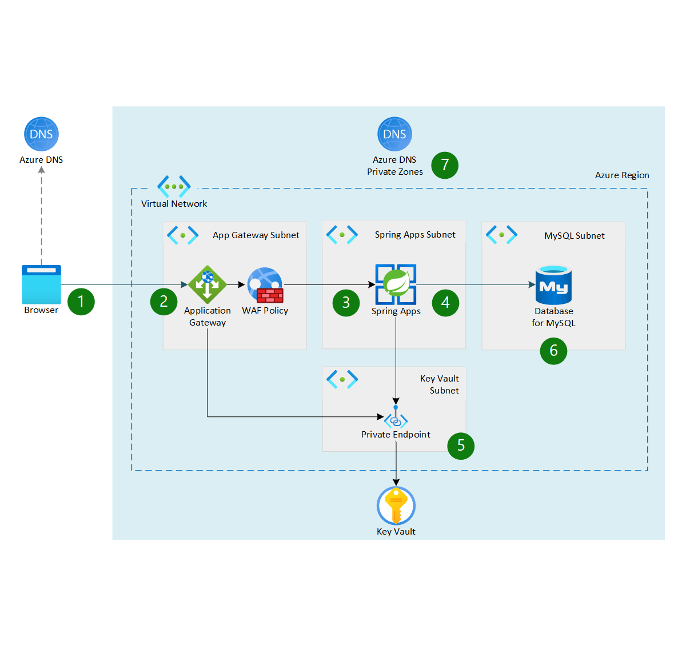

This reference architecture shows how to run application workloads on Azure Spring Apps using a zone-redundant configuration. [Zone-redundant services](https://learn.microsoft.com/azure/reliability/availability-zones-service-support#highly-available-services) provide high availability by replicating your services and data across availability zones to protect against single points of failure. For a deployment of this architecture using Terraform templates, see [Deploy this scenario](#deploy-this-scenario).

## Architecture

*Download a [Visio file](https://arch-center.azureedge.net/ha-zone-redundant-spring-apps-reference-architecture.vsdx) that contains this architecture diagram.*

### Workflow

1. The user accesses the application via browser by using the HTTP host name of the application, for example `www.contoso.com`. [Azure DNS](/azure/dns/dns-overview) or another public DNS service resolves the request for this host name to the public endpoint of the Application Gateway.

1. Application Gateway deploys with [Azure Web Application Firewall](/azure/web-application-firewall/overview). The Application Gateway is configured with a custom domain name and TLS certificate name. Web Application Firewall will add checking for OWASP vulnerabilities.

1. Application Gateway forwards allowed traffic to the Azure Spring Apps load balancers, which allow incoming calls only from the Application Gateway.

1. Azure Spring Apps runs the application workload inside a virtual network in a zone redundant setup.

1. The components inside the virtual networks use [private endpoints](/azure/private-link/private-endpoint-overview) to connect privately and securely to other Azure services. This solution uses private endpoints to connect to the key vault.

   - [Azure Key Vault](/azure/key-vault/general/overview) stores application secrets and certificates. The microservices running in Azure Spring Apps use the application secrets. Azure Spring Apps, Application Gateway, and Azure Front Door use the certificates for host name preservation.

1. An [Azure Flexible Database for MySQL](/azure/mysql/flexible-server/overview) is being used for data storage, but you can use any database. For alternatives, see [Backend database](#backend-database). The database server is deployed within the virtual network.

1. The private endpoint and network integrated connections use an [Azure Private DNS Zone](https://learn.microsoft.comazure/dns/private-dns-getstarted-cli).

### Components

- [Azure DNS](https://azure.microsoft.com/products/dns) is a hosting service for Domain Name System (DNS) domains that provides name resolution by using Azure infrastructure. This solution uses Azure DNS for DNS resolution from your custom domain to your Azure Application Gateway.
- [Application Gateway](https://azure.microsoft.com/products/application-gateway) is a web traffic load balancer that enables you to manage traffic to your web applications. Application Gateway acts as a local reverse proxy in a region where your application runs in. For alternative reverse proxy setups, see [Reverse proxy setup](#reverse-proxy-setup). The Application Gateway is also set up to use multiple availability zones.
- [Azure Web Application Firewall](https://azure.microsoft.com/products/web-application-firewall) provides centralized protection of your web applications from common exploits and vulnerabilities. Web Application Firewall on the Application Gateway tracks Open Web Application Security Project (OWASP) exploits.
- [Azure Spring Apps](https://azure.microsoft.com/products/spring-apps) makes it easy to deploy Java Spring Boot applications to Azure without any code changes. It can easily be made zone redundant by adding setting the `zone redundant` option for it. When doing so, all underlying infrastructure of the service will be spread across multiple availability zones. This zone spreading allows for an overall higher availability of your applications using the service.
- [Azure Flexible Database for MySQL](https://azure.microsoft.com/products/mysql) is a relational database service in the Azure cloud that's based on the MySQL Community Edition.
- [Key Vault](https://azure.microsoft.com/products/key-vault) is one of several key management solutions in Azure that help manage keys, secrets, and certificates. This solution uses Key Vault for storing application secrets and the certificates that Application Gateway, and Azure Spring Apps use.
- [Azure resource groups](https://azure.microsoft.com/get-started/azure-portal/resource-manager) are logical containers for Azure resources. In this solution, resource groups organize components within a region. As a naming convention, the setup includes a short string for the component's region, so it's easy to identify which region the component is running in.
- [Azure Virtual Network](https://azure.microsoft.com/products/virtual-network) is the fundamental building block for a private network in Azure. This solution uses a virtual network for each region you deploy to.
- [Azure Private Link](https://azure.microsoft.com/products/private-link) provides private endpoints that connect privately and securely to services. These network interfaces use private IP addresses to bring the services into the virtual networks. This solution uses private endpoints for the key vault.
- [Managed identities](/azure/active-directory/managed-identities-azure-resources/overview) in [Azure Active Directory (Azure AD)](https://azure.microsoft.com/products/active-directory) provide automatically managed identities that applications can use to connect to resources that support Azure AD authentication. Applications can use managed identities to get Azure AD tokens without having to manage any credentials. This architecture uses managed identities for several interactions, for example between Azure Spring Apps and the key vault.

## Alternatives

The following sections discuss alternatives for several aspects of this architecture.

### Multi region deployment

To increase application resilience and reliability, you can alternatively deploy the application to multiple regions. In case you do so you'll add an additional [Azure Front Door](/azure/frontdoor/front-door-overview) or [Azure Traffic Manager](/azure/traffic-manager/traffic-manager-overview) service to load balance requests to your applications across regions.

A multi region deployment will however double the costs of your setup, since you'll duplicate the full setup to a secondary region. For this reason, the choice is often made to provide an active-passive setup, where only one region is active and deployed. A global load balancer is already added to the setup to provide an easy way of failing over your workloads once a secondary region becomes active. Whether active-active or active-passive is the best choice for your workload depends on the availability requirements you have for your application.

The biggest challenge with a multi region setup is also replicating the data for your application between multiple regions. This challenge isn't there in the multi-zone setup. Azure availability zones are connected by a high-performance network with a roundtrip latency of less than 2 ms. This latency is ok for the most of applications.

You can also combine a multizone solution with a multiregion solution.

### Backend database

This architecture uses a MySQL database for the backend database. You can also use other database technologies, like [Azure SQL Database](/azure/azure-sql/azure-sql-iaas-vs-paas-what-is-overview), [Azure Database for PostgreSQL](/azure/postgresql/single-server/overview), [Azure Database for MariaDB](/azure/mariadb/overview), or [Azure Cosmos DB](/azure/cosmos-db/introduction).

Some of these databases you'll also be able to connect to your virtual network through [Azure Private Link](https://azure.microsoft.com/products/private-link). Azure Private Link isn't available for [Azure Flexible Database for MySQL](https://azure.microsoft.com/products/mysql), which needs a dedicated subnet to be deployed in.

### Reverse proxy setup

The current solution uses Application Gateway as a reverse proxy. You can however use different reverse proxies in front of Azure Spring Apps. You could combine Azure Application Gateway with Azure Front Door. Or you could use Azure Front Door instead of Azure Application Gateway. 

For information about different reverse proxy scenarios, how to set them up, and their security considerations, see [Expose Azure Spring Apps through a reverse proxy](spring-cloud-reverse-proxy.yml).

### Key vault

This solution stores the application secrets and certificates in a single key vault. However, because application secrets and the certificates for host name preservation are different concerns, you might want to store them in separate key vaults. This alternative adds another key vault to your architecture.

## Solution details

This architecture describes a multi zone design for Azure Spring Apps. This architecture is useful when you want to:

- Increase the availability of your applications.
- Increase the overall resilience and service level objective (SLO) of your application.

### Potential use cases

- Public website hosting
- Intranet portal
- Mobile app hosting
- E-commerce
- Media streaming
- Machine learning workloads

> [!IMPORTANT]
> For mission-critical workloads it is recommended to combine zone-redundancy and regional-redundancy to achieve maximum reliability and availability, with zone-redundant services deployed across multiple Azure regions.
> For more information please refer to the [global distribution](/azure/architecture/framework/mission-critical/mission-critical-application-design#video---global-distribution ) section of the mission-critical design methodology, and the [mission-critical baseline architecture](/azure/architecture/reference-architectures/containers/aks-mission-critical/mission-critical-intro).
> You can also use the [Deploy Azure Spring Apps to multiple regions](/azure/architecture/reference-architectures/microservices/spring-apps-multi-region) guidance for an automated setup across regions.

## Recommendations

The following recommendations apply for most scenarios. Follow these recommendations unless you have specific requirements that override them.

### Front And IP Addresses

[Availability Zone](/azure/virtual-network/ip-services/public-ip-addresses#availability-zone) support is available for Public IP addresses with a standard SKU. When using availability zones in your architecture, you should make sure you use availability zones for all the components in your setup. So also for the public IP address used by the Application Gateway.

### Application Gateway

[Application Gateway v2](/azure/application-gateway/overview-v2) can be spread across multiple availability zones. When using availability zones in your architecture, you should make sure you use availability zones for all the components in your setup. So also for the Application Gateway.

Enable [Web Application Firewall](/azure/web-application-firewall/) on your Application Gateway with OWASP enabled.

### Key Vault

Key Vault is automatically zone-redundant in any region where availability zones are available. The Key Vault used in this architecture is deployed with a private endpoint enabled and public disabled for backend services to access secrets. For more information about private endpoints for Azure Key Vault, see [Integrate Key Vault with Azure Private Link](/azure/key-vault/general/private-link-service?tabs=cli).

### MySQL Flexible Server

[MySQL Flexible Server](/azure/mysql/flexible-server/concepts-high-availability) deployed in a virtual network allows configuring high availability with automatic failover. The high availability solution is designed to ensure that committed data is never lost because of failures and that the database won't be a single point of failure in your software architecture. When high availability is configured, flexible server automatically provisions and manages a standby replica. When using availability zones in your architecture, you should make sure you use availability zones for all the components in your setup. So also for the database.

When configuring high availability concepts in Azure Database for MySQL Flexible Server, you can choose between `Zone-redundant HA` and `same-zone HA`. What option you choose will depend on your latency requirements.

### Automated deployment

Automate your deployments as much as possible. You can automate infrastructure deployment, and also automate application code deployments.

Automating infrastructure deployments guarantees that infrastructure is configured the same, avoiding configuration drift, for instance between environments. Infrastructure automation can also help you test failover and quickly bringing up a secondary region.

For application deployment, make sure your deployment systems target all the components in your setup. You can also use a [blue-green](../../example-scenario/blue-green-spring/blue-green-spring.yml) or canary deployment strategy. 

## Considerations

These considerations implement the pillars of the Azure Well-Architected Framework, which is a set of guiding tenets that can be used to improve the quality of a workload. For more information, see [Microsoft Azure Well-Architected Framework](/azure/architecture/framework).

### Reliability

Reliability ensures your application can meet the commitments you make to your customers. For more information, see [Overview of the reliability pillar](/azure/architecture/framework/resiliency/overview).

This architecture explicitly increases the availability of your application over a single-zone deployment.

### Security

Security provides assurances against deliberate attacks and the abuse of your valuable data and systems. For more information, see [Overview of the security pillar](/azure/architecture/framework/security/overview).

From a networking perspective, this architecture is locked down to allow incoming calls only through the public endpoint exposed by Application Gateway. From the Application Gateway, the calls route to the backend Azure Spring Apps service. Communication from Azure Spring Apps to supporting services, like the backend database and the key vault, is also locked down by using either private endpoints or network integration.

This architecture provides extra security by using a managed identity to connect between different components. For example, Azure Spring Apps uses a managed identity to connect to Key Vault. Key Vault allows Azure Spring Apps only minimal access to read the needed secrets, certificates, and keys.

You should also protect your virtual networks with [Azure DDoS Protection](/azure/ddos-protection/ddos-protection-overview). DDoS Protection, combined with application design best practices, provides enhanced mitigations to defend against distributed denial-of-service (DDoS) attacks.

### Cost optimization

Cost optimization is about looking at ways to reduce unnecessary expenses and improve operational efficiencies. For more information, see [Overview of the cost optimization pillar](/azure/architecture/framework/cost/overview).

This solution will have a higher cost than a single-zone version. This higher cost is because some components in the setup will be deployed in multiple zones, instead of one instance, they'll run two or even three instances. [Azure Spring Apps](/azure/spring-apps/how-to-enable-redundancy-and-disaster-recovery?tabs=azure-cli#pricing) however won't have any extra cost associated with it when you enable zone redundancy on the service.

To address costs:
- You can deploy different applications and application types to a single instance of Azure Spring Apps. By deploying multiple applications, the cost of the underlying infrastructure will be shared across applications.
- Azure Spring Apps supports application autoscaling triggered by metrics or schedules, which can improve utilization and cost efficiency.
- You can use Application Insights in [Azure Monitor](/azure/azure-monitor/overview) to lower operational costs. A comprehensive logging solution provides visibility for automation to scale components in real time. Analyzing log data can also reveal inefficiencies in application code that you can address to improve costs and performance.
- The alternative setup that uses a Front Door instead of an Application Gateway will allow for cost on a per request basis. With Front Door, you won't have to provision multiple Application Gateway instances and cost will be calculated per actual request to your application.

All the services this architecture describes are pre-configured in an [Azure pricing calculator estimate](https://azure.com/e/414c5e0b15494e5081cc9f008d82fdaa) with reasonable default values for a small scale application. You can update this estimate based on the throughput values you expect for your application.

### Operational excellence

Operational excellence covers the operations processes that deploy an application and keep it running in production. For more information, see [Overview of the operational excellence pillar](/azure/architecture/framework/devops/overview).

This architecture addresses the same aspects of operational excellence as the [single-region reference architecture for Azure Spring Apps](/azure/spring-cloud/reference-architecture). You can automate the full architecture rollout.

For operational excellence, integrate all components of this solution with Azure Monitor Logs to provide end-to-end insight into your application.

### Performance efficiency

Performance efficiency is the ability of your workload to scale to meet the demands placed on it by users in an efficient manner. For more information, see [Performance efficiency pillar overview](/azure/architecture/framework/scalability/overview).

This multi zone architecture is better suited than a single-zone deployment to meet application demands, because it spreads the load across availability zones.

Depending on your database setup, you might incur extra latency when data needs to be synchronized between zones.

This architecture has several components that can autoscale based on metrics:

- Application Gateway supports autoscaling. For more information, see [Scale Application Gateway v2 and WAF v2](/azure/application-gateway/application-gateway-autoscaling-zone-redundant).
- Azure Spring Apps also supports autoscaling. For more information, see [Set up autoscale for applications](/azure/spring-apps/how-to-setup-autoscale).

## Deploy this scenario

A deployment for this reference architecture is available at [Azure Spring Apps multi zone reference architecture](https://github.com/Azure-Samples/azure-spring-apps-multi-zone) on GitHub. The deployment uses Terraform templates. To deploy the architecture, [follow the step-by-step instructions](https://github.com/Azure-Samples/azure-spring-apps-multi-zone#getting-started).

## Contributors

*This article is maintained by Microsoft. It was originally written by the following contributors.*

Principal author:

 - [Gitte Vermeiren](https://www.linkedin.com/in/gitte-vermeiren-b1b2221) | FastTrack for Azure Engineer

*To see non-public LinkedIn profiles, sign in to LinkedIn.*

## Next steps

- [What are Azure regions and availability zones?](/azure/reliability/availability-zones-overview)
- [Azure Spring Apps reference architecture](/azure/spring-cloud/reference-architecture)
- [What is Azure Web Application Firewall on Azure Application Gateway?](/azure/web-application-firewall/ag/ag-overview)

## Related resources

- [Deploy Azure Spring Apps to multiple regions](spring-apps-multi-region.yml)
- [Expose Azure Spring Apps through a reverse proxy](spring-cloud-reverse-proxy.yml)
- [High-availability blue/green deployment](../../example-scenario/blue-green-spring/blue-green-spring.yml)
- [Preserve the original HTTP host name between a reverse proxy and its back-end web application](../../best-practices/host-name-preservation.yml)
- [Multiregion web app with private connectivity to a database](../../example-scenario/sql-failover/app-service-private-sql-multi-region.yml)
