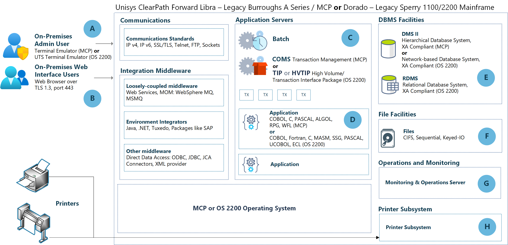
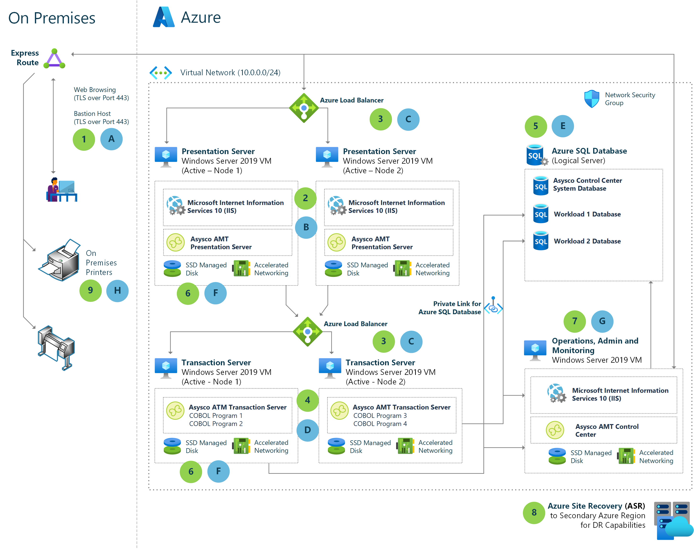

This article describes the conversion technologies that Microsoft partner [Avanade](https://www.avanade.com/) uses to migrate Unisys mainframe workflows to Azure.

## Legacy architecture

The following diagram shows the typical components of Unisys Burroughs MCP or Unisys Sperry OS 1100/2200 mainframe systems.

### Workflow

- On-premises admin users interact with the mainframe through Terminal Emulator (MCP systems) or UTS Terminal Emulator (OS 1100/2200 systems) (**A**). On-premises web interface users can interact via a web browser over TLS 1.3 port 443 (**B**). Mainframes use communication standards like IPv4, IPv6, SSL/TLS, Telnet, FTP, and Sockets.

- Loosely coupled integrated middleware includes web services, MOM, WebSphere MQ, and MSMQ. Environment integrators include Java, .NET, Tuxedo, and packages like SAP. Other middleware includes direct data access via ODBC, JDBC, and JCA connectors, and XML providers.

- Application servers (**C**) do batch processing, and handle transactions through COMS Transaction Management server for MCP, or High Volume/Transaction Interface Packages (TIP/HVTIP) for OS 2200.

- Applications (**D**) for MCP are written in COBOL, C, PASCAL, ALGOL, RPG, or WFL. For OS 2200, applications are in COBOL, Fortran, C, MASM, SSG, PASCAL, UCOBOL, or ECL.

- Database management systems (**E**) are XA-compliant. MCP uses hierarchical DMS II database systems, and OS 2200 uses network-based DMS II or relational database systems.

- File facilities (**F**) include CIFS, sequential, flat files, keyed IO, and virtual tape files.

- A dedicated server handles operations and monitoring (**G**).

- A printer subsystem (**H**) manages on-premises printers.

## Azure Architecture

The second diagram shows how the Unisys mainframe components can map and migrate to Azure capabilities.

### Workflow

1. A web browser to access Azure system resources replaces terminal emulation for demand and online users (**A**). Users access web-based applications over TLS port 443. For admin access to the Azure Virtual Machines (VMs), [Azure Bastion](/azure/bastion/bastion-overview) hosts maximize security by minimizing open ports.

2. Presentation layer code runs in IIS and uses ASP.NET to maintain the Unisys mainframe user-interface screens (**B**). The applications' presentation layers can remain virtually unchanged, to minimize end user retraining. Or you can update the web application presentation layer with modern user experience frameworks.

3. The AMT Framework converts mainframe presentation, batch, and transaction loads (**C**) to sufficient server farms to handle the work. The solution uses two sets of two VMs running the web and application layers, fronted by Azure Load Balancers in *active-active* arrangements to spread query and transaction traffic.

   Batch-only workflows may have other transaction server sets behind load balancers, rather than presentation servers.

4. The AMT Framework converts legacy application code (**D**) to C#/.NET. If code needs changing or editing, AMT can maintain and reprocess the original code. Or you can edit the converted C# code directly to advance the code base to new standards.

5. Legacy database structures (**E**) can migrate to [Azure SQL Database](/azure/azure-sql/database/sql-database-paas-overview), with the high availability (HA) and disaster recovery (DR) capabilities that Azure provides. Avanade data migration tools can convert DMS and RDMS schemas to SQL. [Azure Private Link](/azure/azure-sql/database/private-endpoint-overview) provides a private, direct connection from the Azure VMs to Azure SQL Database.

6. File structures (**F**) map easily to Azure structured file or blob storage data constructs. Features like Azure autofailover group replication can provide data protection.

7. Workload automation, scheduling, reporting, and system monitoring systems (**G**) that are Azure-capable can keep their current platforms. These platforms include Unisys Operations Sentinel and SMA OpCon. Avanade AMT Control Center can also serve these functions.

8. Azure Site Recovery HA/DR capabilities mirror the Azure VMs to a secondary Azure region for quick failover if there's Azure datacenter failure.

9. The system can support printers (**H**) and other legacy system output devices if they have IP addresses connected to the Azure network.

### Components

- [Azure Virtual Machines](https://azure.microsoft.com/services/virtual-machines) are on-demand, scalable computing resources. Azure Virtual Machines give you the flexibility of virtualization without having to buy and maintain physical hardware.

- [Azure Virtual Networks](https://azure.microsoft.com/products/virtual-network) are the fundamental building blocks for Azure private networks. Virtual networks let Azure resources like VMs securely communicate with each other, the internet, and on-premises networks. Although an Azure Virtual Network is similar to a traditional network on premises, it offers the extra benefits of Azure's infrastructure, such as scalability, availability, and isolation.

  Virtual network interfaces let Azure VMs communicate with internet, Azure, and on-premises resources. As in this architecture, you can add several network interface cards to one Azure VM. Then child VMs can have their own dedicated network interface devices and IP addresses.

- [Azure managed disks](https://azure.microsoft.com/products/storage/disks) are block-level storage volumes that Azure manages on Azure VMs. The available types of disks are ultra disks, premium solid-state drives (SSDs), standard SSDs, and standard hard disk drives (HDDs). This architecture works best with Premium SSDs or Ultra Disk SSDs.

- [Azure Files](https://azure.microsoft.com/products/storage/files) offers fully managed file shares in your Azure Storage Account that are accessible from the cloud or on-premises. Windows, Linux, and macOS deployments can mount Azure file shares concurrently, and access files via the industry standard Server Message Block (SMB) protocol.

- [Azure ExpressRoute](https://azure.microsoft.com/products/expressroute) lets you extend your on-premises networks into the Microsoft cloud over a private connection facilitated by a connectivity provider. With ExpressRoute, you can establish connections to cloud services like Azure and Office 365.

- [Azure Bastion](https://azure.microsoft.com/products/azure-bastion) is a fully managed platform as a service (PaaS) that you provision inside your virtual network. Bastion provides secure and seamless RDP and SSH connectivity to the VMs in your virtual network directly from the Azure portal over TLS.

- [Azure SQL Database](https://azure.microsoft.com/products/azure-sql/database) is a fully managed PaaS database engine that is always running on the latest stable version of SQL Server and patched OS, with 99.99% availability. SQL Database handles most database management functions like upgrading, patching, backups, and monitoring without user involvement. These PaaS capabilities let you focus on business critical, domain-specific database administration and optimization.

- [Azure Private Link](https://azure.microsoft.com/products/private-link) for Azure SQL Database provides a private, direct connection that's isolated to the Azure networking backbone from the Azure VMs to Azure SQL Database.

## Scenario details

Unisys ClearPath mainframe systems are full-featured operating environments that can scale up vertically to handle mission critical workloads. ClearPath mainframe models include Dorado, running Legacy Sperry 1100/2200, and Libra, running Legacy Burroughs A Series/MCP. Emulating, converting, or modernizing these systems into Azure can provide similar or better performance and SLA guarantees, while taking advantage of Azure flexibility, reliability, and future capabilities.

The Automated Migration Technology (AMT) Framework allows an accelerated move into Azure without rewriting application code or redesigning data architecture. The framework converts legacy code to C#, while maintaining the source code in its original form. Application user interfaces and interactions can be virtually unchanged, minimizing the need for end user retraining.

Avanade AMT Transform automates the migration of the complete mainframe ecosystem to Azure, by converting:

- Transaction application code to AMT COBOL or directly to C# and .NET. AMT maintains the original code structure to use as a baseline or to enable future edits.
- All databases, whether hierarchical, network, or relational, to Azure SQL Database.
- WFL/ECL scripts to Windows PowerShell or to open-source Visual Basic scripts.
- All binary or indexed flat files.

### Potential use cases

The AMT Framework supports several options to move client workloads to Azure:

- One method is to convert and move the entire mainframe system to Azure at once, saving interim mainframe maintenance and facility support costs. This approach carries some risk: All processes, like application conversion, data migration, and testing, must align to allow a smooth transition.

- A second methodology is to move applications from the mainframe to Azure gradually, with complete transition as the ultimate goal. This tactic provides savings per application, and lessons learned to convert each application can help with subsequent conversions. Modernizing each application on its own schedule can be more relaxed than converting everything at once.

This stepped method can also provide more processing cycles on the mainframe as applications convert to Azure. Eventually, starvation of the mainframe as applications convert to Azure can highlight the need to retire the mainframe.

## Considerations

These considerations implement the pillars of the Azure Well-Architected Framework, which is a set of guiding tenets that can be used to improve the quality of a workload. For more information, see [Microsoft Azure Well-Architected Framework](/azure/architecture/framework).

### Availability

- This architecture uses [Azure Site Recovery](https://azure.microsoft.com/services/site-recovery) to mirror the Azure VMs to a secondary Azure region for quick failover and DR if there's Azure datacenter failure.

- [Azure autofailover group replication](/azure/azure-sql/database/auto-failover-group-overview) provides data protection by managing database replication and failover to another region.

### Resiliency

Resiliency is built into this solution because of the Load Balancers. If one presentation or transaction server fails, the other server behind the Load Balancer shoulders the workload.

### Scalability

You can scale out the server sets to provide more throughput. For more information, see [Virtual machine scale sets](/azure/virtual-machine-scale-sets/overview).

### Security

Security provides assurances against deliberate attacks and the abuse of your valuable data and systems. For more information, see [Overview of the security pillar](/azure/architecture/framework/security/overview).

- This solution uses an Azure network security group (NSG) to manage traffic between Azure resources. For more information, see [Network security groups](/azure/virtual-network/network-security-groups-overview).

- [Private Link for Azure SQL Database](/azure/azure-sql/database/private-endpoint-overview) provides a private, direct connection isolated to the Azure networking backbone from the Azure VMs to Azure SQL Database.

[Azure Bastion](/azure/bastion/bastion-overview) maximizes admin access security by minimizing open ports. Bastion provides secure and seamless secure RDP and SSH connectivity over TLS from the Azure portal to VMs in the virtual network.

### Cost optimization

Cost optimization is about looking at ways to reduce unnecessary expenses and improve operational efficiencies. For more information, see [Overview of the cost optimization pillar](/azure/architecture/framework/cost/overview).

- Azure SQL Database should use [Hyperscale or Business Critical](/azure/azure-sql/database/service-tiers-general-purpose-business-critical) SQL Database tiers for high input/output operations per second (IOPS) and high uptime SLA.

- This architecture works best with Premium SSDs or Ultra Disk SSDs. For more information, see [Managed Disks pricing](https://azure.microsoft.com/pricing/details/managed-disks).

## Contributors

*This article is maintained by Microsoft. It was originally written by the following contributors.* 

Principal author: 

 - [Philip Brooks](https://www.linkedin.com/in/philipbbrooks) | Senior Technical Program Manager

*To see non-public LinkedIn profiles, sign in to LinkedIn.*

## Next Steps

- [Cloud Adoption Framework](/azure/cloud-adoption-framework/overview)
- [Create, change, or delete a network interface](/azure/virtual-network/virtual-network-network-interface)
- [Azure ExpressRoute](/azure/expressroute/expressroute-introduction)
- [Azure Files](/azure/storage/files/storage-files-introduction)
- [Azure managed disks](/azure/virtual-machines/windows/managed-disks-overview)
- [Azure Setup Guide](/azure/cloud-adoption-framework/ready/azure-setup-guide)
- [Azure Virtual Networks](/azure/virtual-network/virtual-networks-overview)
- [Migration Best Practices](/azure/cloud-adoption-framework/migrate/azure-best-practices)
- [Avanade](https://avanade.com)

For more information, please contact [legacy2azure@microsoft.com](mailto:legacy2azure@microsoft.com).

## Related resources

Explore related resources:

- [Unisys ClearPath Forward MCP mainframe rehost to Azure using Unisys virtualization](../../example-scenario/mainframe/unisys-clearpath-forward-mainframe-rehost.yml)
- [High-volume batch transaction processing](../../example-scenario/mainframe/process-batch-transactions.yml)
- [Mainframe file replication and sync on Azure](../../solution-ideas/articles/mainframe-azure-file-replication.yml)
- [Mainframe access to Azure databases](../../solution-ideas/articles/mainframe-access-azure-databases.yml)
- [Replicate and sync mainframe data in Azure](./sync-mainframe-data-with-azure.yml)
- [Unlock legacy data with Azure Stack](../../solution-ideas/articles/unlock-legacy-data.yml)
- [Modernize mainframe & midrange data](/azure/architecture/example-scenario/mainframe/modernize-mainframe-data-to-azure)