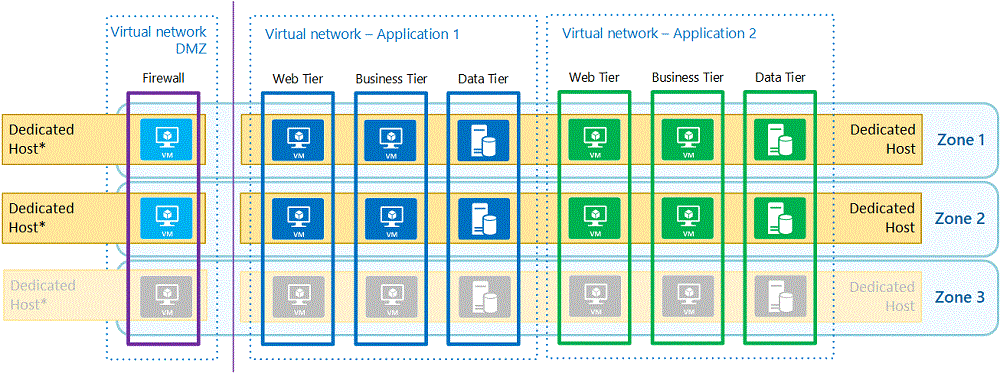
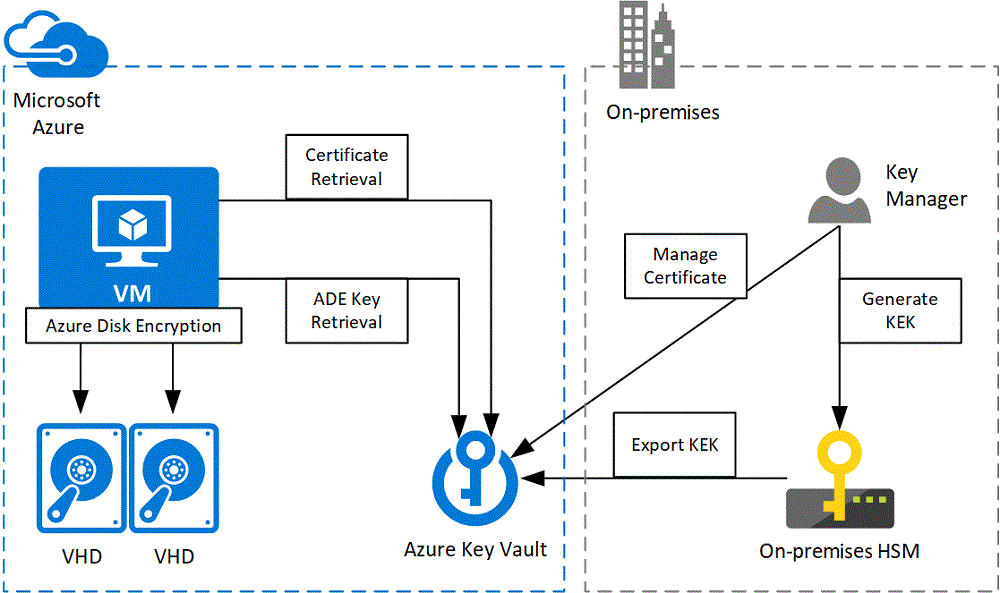
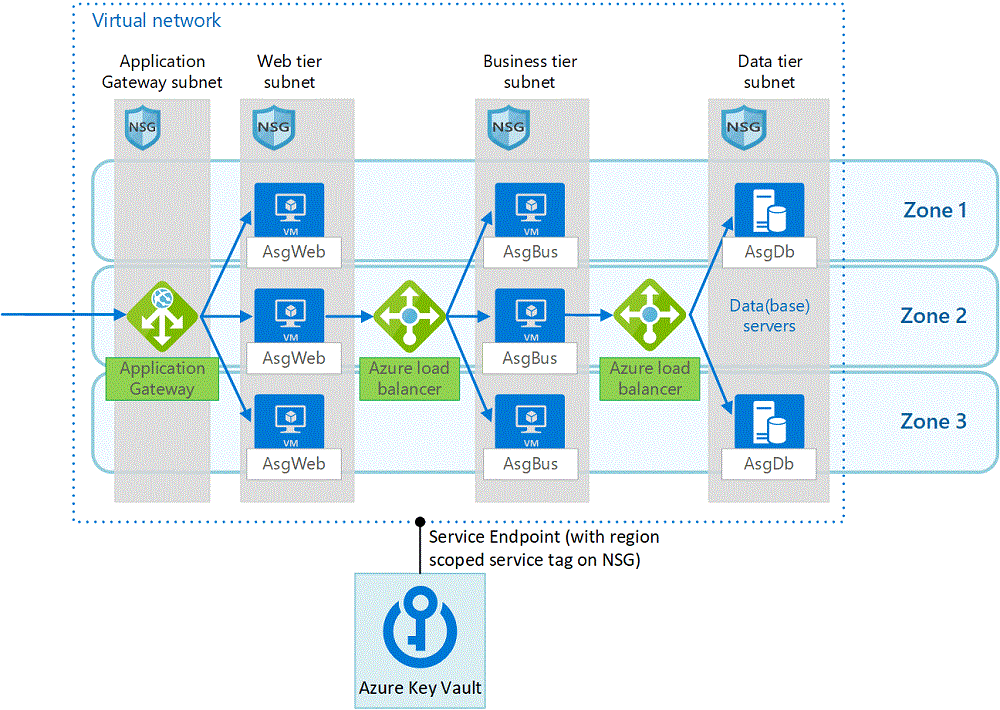

There are many security considerations for deploying *infrastructure-as-a-service (IaaS)* apps to Azure. This article builds on reference architectures for virtual machine-based workloads and hybrid network infrastructures to focus on security for highly sensitive IaaS workloads in Azure, based on [Azure security fundamentals](/azure/security/fundamentals/).

Also see [Azure virtual machines security overview](/azure/security/fundamentals/virtual-machines-overview) and [Security best practices for IaaS workloads in Azure](/azure/security/fundamentals/iaas).

## Azure VMs

Azure's compute platform is based on machine virtualization. A *hypervisor* runs on the physical hardware of each Azure node or network endpoint, and creates a variable number of guest [Hyper-V virtual machines](/virtualization/hyper-v-on-windows/about/) (VMs) in the node. All user code executes on the VMs. For basic Azure VM deployment instructions, see [Run a Linux VM on Azure](./linux-vm.yml) or [Run a Windows VM on Azure](./windows-vm.yml). Most deployment processes are the same for the two operating systems (OSs), but OS-specific tools like disk encryption may differ.

You can use [Microsoft Defender for Cloud](https://azure.microsoft.com/services/security-center/) for VM patch management and to deploy and monitor [antimalware tools](/azure/security-center/security-center-install-endpoint-protection). Alternatively, you can manage your own or third-party patching and antimalware tools, which is common when extending or migrating existing infrastructures to Azure.

Microsoft provides Basic *distributed denial of service (DDoS)* protection as part of the Azure platform. Apps that have public endpoints can use Standard [Azure DDoS Protection](/azure/virtual-network/ddos-protection-overview) for additional protection. However, highly sensitive workloads don't usually have public endpoints, and can only be accessed from specific locations over a *virtual private network (VPN)* or leased line.

### N-tier architectures

Many IaaS applications consist of multiple tiers, such as a web tier, business tier, and data tier, which are hosted across multiple VMs. Key aspects of deploying *n-tier* app architectures on Azure VMs include:

- **High availability** (HA). HA apps must be available more than 99.9% of the time. Placing in-tier VMs in different Azure [availability zones](/azure/availability-zones/az-overview) (AZs) ensures HA, because AZs span one or more datacenters, providing resiliency through resistance to datacenter failure. Regions that don't support AZs can use [availability sets](/azure/virtual-machines/windows/manage-availability#configure-multiple-virtual-machines-in-an-availability-set-for-redundancy) (ASs), which distribute VMs across multiple isolated hardware nodes.
- **Load balancing**. [Load balancers](/azure/load-balancer/load-balancer-get-started-internet-arm-cli) distribute traffic among VMs, to balance load and for resiliency when a VM fails. You don't need load balancers if the application manages load balancing and the individual VMs are known to the caller.
- **Virtual networks**. [Virtual networks](/azure/virtual-network/) and subnets segment your network, enabling easier security management and advanced routing.
- **Domain Name System (DNS)**. [Azure DNS](/azure/dns/) provides a highly available and secure DNS service. A [private zone](/azure/dns/private-dns-overview) in Azure DNS lets you use custom domains inside your virtual networks.

### Backup and restore

To protect against human error, malicious data deletion, and ransomware, you should back up at least your data-tier VMs. [Azure Backup](/azure/backup/backup-overview) can [back up and restore encrypted VMs](/azure/backup/backup-azure-vms-encryption) if it can access the encryption keys in Azure Key Vault.

For the web and business tiers, you can use [virtual machine scale set](/azure/virtual-machine-scale-sets/overview) autoscaling rules to automatically [destroy compromised VMs](/azure/virtual-machine-scale-sets/virtual-machine-scale-sets-manage-cli#remove-vms-from-a-scale-set) and deploy fresh VM instances from a base image.

### Compute isolation

On each Azure node or network endpoint, the hypervisor and a special root OS ensure guest VMs can't access the physical host server, and user code executes only on guest VMs. This isolation prevents users from obtaining raw read, write, or execute access to the system, and mitigates the risk of sharing resources. Azure protects against all known *side-channel attacks* and *noisy neighbors* through the hypervisor and an advanced VM placement algorithm. For more information, see [Compute isolation](/azure/security/fundamentals/isolation-choices#compute-isolation).

For highly sensitive workloads, you can add additional protection against side-channel attacks with [isolated VMs](/azure/security/fundamentals/isolation-choices#isolated-virtual-machine-sizes) or [dedicated hosts](/azure/virtual-machines/windows/dedicated-hosts).

#### Isolated VMs

Isolated VMs are large VM sizes that are isolated to a specific hardware type and dedicated to a single customer. Using an isolated VM size guarantees that your VM is the only one running on a specific server instance. You can further subdivide the resources of isolated VMs by using [Azure support for nested virtual machines](https://azure.microsoft.com/blog/nested-virtualization-in-azure/).

The minimum size of an isolated VM is 64 virtual CPU cores and 256 GiB of memory. These VMs are far larger than most n-tier applications require, and can create a large cost overhead. To reduce the overhead, you can run multiple app tiers on a single VM with nested virtualization, or in different processes or containers. You still need to deploy different VMs in AZs for resiliency, and run [demilitarized zone (DMZ) appliances](#deploy-a-dmz) on separate VMs. Combining multiple apps on one infrastructure for economic reasons might also conflict with organizational app segregation policies.

As Azure region capabilities expand over time, Azure may also remove isolation guarantees from certain VM sizes, with one year's notice.

#### Azure Dedicated Hosts

[Azure Dedicated Host](https://azure.microsoft.com/services/virtual-machines/dedicated-host/) is the preferred compute isolation solution for highly sensitive workloads. A dedicated host is a physical server dedicated to one customer for hosting multiple VMs. Besides isolating VMs, dedicated hosts let you control [maintenance](/azure/virtual-machines/maintenance-control-powershell) and VM placement to avoid noisy neighbors.

Dedicated hosts have the same minimum size and many of the same sizing considerations as isolated VMs. However, a dedicated host can host VMs located in different virtual networks, to satisfy application segregation policies. You should still run [DMZ](#deploy-a-dmz) VMs on a different host, to prevent any side-channel attack from a compromised VM in the DMZ.

## Encryption

Data encryption is an important component of securing workloads. Encryption encodes information so only authorized receivers can decode it by using a key or certificate. Encryption includes *disk encryption*, for data encryption-at-rest, and *Transport Level Security (TLS)*, for encryption-in-transit over networks.

### Azure Key Vault

You can protect encryption keys and certificates by storing them in [Azure Key Vault](https://azure.microsoft.com/services/key-vault/), a cloud *Hardware Security Module (HSM)* solution validated for Federal Information Processing Standards (FIPS) 140-2 Level 2. For best practices to allow only authorized applications and users to access Key Vault, see [Secure access to a key vault](/azure/key-vault/key-vault-secure-your-key-vault).

To protect keys in Key Vault, you can enable [soft delete](/azure/key-vault/key-vault-ovw-soft-delete), which ensures that deleted keys are recoverable. For additional protection, you can [back up individual keys](/powershell/module/azurerm.keyvault/backup-azurekeyvaultkey) to an encrypted file that you can use to [restore the keys](/powershell/module/azurerm.keyvault/restore-azurekeyvaultkey), potentially to another Azure region in the same geography.

When hosting SQL Server on a VM, you can use the [SQL Server Connector for Microsoft Azure Key Vault](/sql/relational-databases/security/encryption/extensible-key-management-using-azure-key-vault-sql-server) to get keys for *transparent data encryption (TDE)*, *column level encryption (CLE)*, and backup encryption. For details, see [Configure Azure Key Vault integration for SQL Server on Azure virtual machines](/azure/azure-sql/virtual-machines/windows/azure-key-vault-integration-configure).

### Azure Disk Encryption

Azure Disk Encryption uses a BitLocker external key protector to provide volume encryption for the OS and data disks of Azure VMs, and can be integrated with Azure Key Vault to help you control and manage disk encryption keys and secrets. Each VM generates its own encryption keys and stores them in Azure Key Vault. To configure Azure Key Vault to enable Azure Disk Encryption, see [Create and configure a key vault for Azure Disk Encryption](/azure/virtual-machines/windows/disk-encryption-key-vault).

For highly sensitive workloads, you should also use a *key encryption key (KEK)* for an additional layer of security. When you specify a KEK, Azure Disk Encryption uses that key to wrap the encryption secrets before writing to Key Vault. You can generate a KEK in Azure Key Vault, but a more secure method is to generate a key in your on-premises HSM and import it to Azure Key Vault. This scenario is often referred to as *bring your own key*, or BYOK. Because the imported keys can't leave the HSM boundary, generating the key in your HSM ensures you're in full control of the encryption keys.

For more information about HSM-protected keys, see [How to generate and transfer HSM-protected keys for Azure Key Vault](/azure/key-vault/key-vault-hsm-protected-keys).

### Network traffic encryption

Network protocols like HTTPS encrypt data in transit with certificates. Client-to-application traffic usually uses a certificate from a trusted *certificate authority (CA)*. Internal apps can use a certificate from an internal CA or a public CA like DigiCert or GlobalSign. Tier-to-tier communication typically uses a certificate issued by an internal CA, or a self-signed certificate. Azure Key Vault can accommodate any of these certificate types. For more information about creating different certificate types, see [Certificate creation methods](/azure/key-vault/create-certificate).

Azure Key Vault can act as a self-signed certificate CA for tier-to-tier traffic. The *Key Vault VM extension* provides monitoring and automatic refresh of specified certificates on VMs, with or without the private key depending on use case. To use the Key Vault VM extension, see [Key Vault virtual machine extension for Linux](/azure/virtual-machines/extensions/key-vault-linux) or [Key Vault virtual machine extension for Windows](/azure/virtual-machines/extensions/key-vault-windows).

Key Vault can also store keys for network protocols that don't use certificates. Custom workloads could require scripting a [custom script extension](/azure/virtual-machines/windows/tutorial-automate-vm-deployment) that retrieves a key from Key Vault and stores it for applications to use. Apps can also use a VM's [managed identity](/azure/active-directory/managed-identities-azure-resources/tutorial-windows-vm-access-nonaad) to retrieve secrets directly from Key Vault.

## Network security

[Network security groups](/azure/virtual-network/security-overview) (NSGs) filter traffic between resources in Azure virtual networks. NSG security rules allow or deny network traffic to or from Azure resources based on IP addresses and ports. By default, NSGs block inbound traffic from the internet, but allow outbound connections from VMs to the internet. To prevent accidental outbound traffic, add a custom rule with the lowest possible priority, 4096, to block all inbound and outbound traffic. You can then add higher-priority rules to allow specific traffic.

NSGs create flow records for existing connections, and allow or deny communication based on the flow record's connection state. The flow record allows an NSG to be stateful. For example, if you specify an outbound security rule to any address over port 443, it's not necessary to also specify an inbound security rule for the response. You only need to specify an inbound security rule if the communication is initiated externally.

Most Azure services allow you to use a [virtual network service tag](/azure/virtual-network/service-tags-overview) instead of an NSG. A service tag represents a group of IP address prefixes from an  Azure service, and helps minimize complexity from frequent network security rule updates. An Azure Key Vault service tag can allow a VM to retrieve certificates, keys, and secrets from Azure Key Vault.

Another way to control network security is through [virtual network traffic routing](/azure/virtual-network/virtual-networks-udr-overview) and *forced tunneling*. Azure automatically creates system routes and assigns the routes to each subnet in a virtual network. You can't create or remove system routes, but you can override some system routes with custom routes. Custom routing lets you route traffic over a *network virtual appliance (NVA)* like a firewall or proxy, or drop unwanted traffic, which has a similar effect to blocking the traffic with an NSG.

You can use NVAs like [Azure Firewall](/azure/firewall/overview) to allow, block, and inspect network traffic. Azure Firewall is a managed, highly available platform firewall service. You can also deploy third-party NVAs from the [Azure Marketplace](https://azuremarketplace.microsoft.com). To make these NVAs highly available, see [Deploy highly available network virtual appliances](../../reference-architectures/dmz/nva-ha.yml).

### Application security groups

To filter traffic between application tiers within a virtual network, use [Application security groups](/azure/virtual-network/application-security-groups) (ASGs). ASGs let you configure network security as an extension of an application's structure, letting you group VMs and define network security policies based on the groups. You can reuse your security policy at scale without manually maintaining explicit IP addresses.

Since ASGs are applied to a network interface instead of a subnet, they enable micro-segmentation. You can tightly control which VMs can talk to each other, even blocking traffic between VMs in the same tier, and making it easy to quarantine a VM by removing ASGs from that VM.

## Hybrid networks

Hybrid architectures connect on-premises networks with public clouds like Azure. There are several ways to connect on-premises networks to applications running in Azure:

- **Public endpoint over the internet**. You can rely on identity, transport level security (HTTPS), and the application gateway to protect the application, potentially in combination with a firewall. However, for highly sensitive workloads, exposing a public endpoint over the internet isn't recommended.
- **Azure or third-party VPN gateway**. You can connect an on-premises network to Azure by using an [Azure VPN gateway](/azure/expressroute/expressroute-howto-coexist-resource-manager). Traffic still travels over the internet, but over an encrypted tunnel that uses TLS. You can also run a third-party gateway in a VM, if you have specific requirements not supported by the Azure VPN gateway.
- **ExpressRoute**. [ExpressRoute](../hybrid-networking/expressroute.yml) connections use a private, dedicated connection through a third-party connectivity provider. The private connection extends your on-premises network into Azure, and provides scalability and a reliable service-level agreement (SLA).
  - [ExpressRoute with VPN failover](../hybrid-networking/expressroute-vpn-failover.yml). This option uses ExpressRoute in normal conditions, but fails over to a VPN connection if there's a loss of connectivity in the ExpressRoute circuit, providing higher availability.
  - [VPN over ExpressRoute](/azure/expressroute/site-to-site-vpn-over-microsoft-peering). This option is the best for highly sensitive workloads. ExpressRoute provides a private circuit with scalability and reliability, and VPN provides an additional layer of protection that terminates the encrypted connection in a specific Azure virtual network.

For more guidance on choosing between different types of hybrid connectivity, see [Choose a solution for connecting an on-premises network to Azure](../hybrid-networking/index.yml).

### Deploy a DMZ

Connecting on-premises and Azure environments gives on-premises users access to Azure applications. A perimeter network or *demilitarized zone (DMZ)* provides additional protection for highly sensitive workloads.

An architecture like the one in [Network DMZ between Azure and an on-premises datacenter](../dmz/secure-vnet-dmz.yml) deploys all DMZ and application services in the same virtual network, with NSG rules and user-defined routes to isolate the DMZ and application subnets. This architecture can make the management subnet available via public internet, to manage apps even if the on-premises gateway isn't available. However, for highly sensitive workloads, you should only allow bypassing the gateway in a [break glass scenario](/azure/active-directory/users-groups-roles/directory-emergency-access). A better solution is to use [Azure Bastion](https://azure.microsoft.com/services/azure-bastion/), which enables access directly from the Azure portal while limiting exposure of public IP addresses.

You can also use [Just-In-Time (JIT) VM access](/azure/security-center/security-center-just-in-time) for remote management while limiting exposure of public IP addresses. With JIT VM access, an NSG blocks remote management ports like *remote desktop protocol (RDP)* and *secure shell (SSH)* by default. Upon request, JIT VM access enables the port only for a specified time window, and potentially for a specific IP address or range. JIT access also works for VMs that have only private IP addresses. You can use Azure Bastion to block traffic to a VM until JIT VM access is enabled.

To deploy more applications, you can use a [hub-spoke network topology](../hybrid-networking/hub-spoke.yml) in Azure, with the DMZ in the hub virtual network and the applications in spoke virtual networks. The hub virtual network can contain a VPN and/or ExpressRoute gateway, firewall NVA, management hosts, identity infrastructure, and other shared services. The spoke virtual networks are connected to the hub with [virtual network peering](/azure/virtual-network/virtual-network-peering-overview). An Azure virtual network doesn't allow transitive routing over the hub from one spoke to another. Spoke-to-spoke traffic is only possible via the firewall appliances in the hub. This architecture effectively isolates applications from one another.

## Multi-region deployment

Business continuity and disaster recovery might require deploying your application across multiple Azure regions, which can impact data residency and security. For a reference architecture for multi-region deployments, see [Run an N-tier application in multiple Azure regions for high availability](../../reference-architectures/n-tier/multi-region-sql-server.yml).

### Regional pairs

An Azure geography is a defined area of the world that contains at least one Azure region, each with one or more datacenters. Each Azure region is paired with another region in the same geography in a *regional pair*. Regional pairs aren't both updated at the same time, and if a disaster hits both regions, one of the regions is prioritized to come back online first. For business continuity, you should deploy highly sensitive apps at least to regional pairs if you deploy in multiple regions.

For more details, see [Business continuity and disaster recovery (BCDR): Azure Paired Regions](/azure/best-practices-availability-paired-regions). The whitepaper [Achieve compliant data residency and security with Azure](https://azure.microsoft.com/resources/achieving-compliant-data-residency-and-security-with-azure/) discusses data residency, and what to do to meet data residency requirements.

### Replication between regions

In IaaS architectures, replicating data between regions is the responsibility of the application. The most common replication scenario uses database replication technologies built into the database server product, such as [SQL Server Always On Availability Groups](/sql/database-engine/availability-groups/windows/overview-of-always-on-availability-groups-sql-server), [Oracle Data Guard](https://www.oracle.com/database/technologies/high-availability/dataguard.html), or [MySQL Replication](https://dev.mysql.com/doc/refman/8.0/en/replication.html).

Setting up replication between IaaS database servers isn't straightforward, and you need to take business continuity requirements into account. Azure database services such as [Azure SQL Database](/azure/sql-database/sql-database-designing-cloud-solutions-for-disaster-recovery), Azure Database for MySQL, and [Azure Cosmos DB](/azure/cosmos-db/distribute-data-globally) make replication between regions easier, but may not meet security requirements for highly sensitive workloads.

For more information and guidance for multi-region SQL Server and Oracle deployments, see:

- [Configure an availability group on Azure virtual machines running SQL Server in different regions](/azure/azure-sql/virtual-machines/windows/availability-group-manually-configure-multiple-regions)
- [Disaster recovery for an Oracle Database 12c database in an Azure environment](/azure/virtual-machines/workloads/oracle/oracle-disaster-recovery)

### Cross-region peering

You can enable secure communication between virtual networks in different regions by using global [virtual network peering](/azure/virtual-network/virtual-network-peering-overview). Global peering works the same as within-region peering. The traffic between regions runs over the Microsoft backbone, doesn't traverse the internet, and is isolated from other traffic. For more security, you can deploy VPN NVAs in both regions, and use *user-defined routes* to force traffic between regions over the NVAs, similar to [deploying a DMZ](#deploy-a-dmz).

### Failover traffic routing

With public endpoints, you can use [Traffic Manager](/azure/traffic-manager/) or [Azure Front Door](/azure/frontdoor/) to direct traffic to the active region or closest region in an *active-active* failover configuration. However, Traffic Manager and Azure Front Door both require public endpoints to monitor availability, and their corresponding DNS entries are public. For highly sensitive workloads, the alternative solution is to deploy DNS on-premises, and change the entries to the active region for failover.

## Management and governance

Securing your highly sensitive IaaS apps requires more than just deploying the correct architectures and implementing network security rules. Because cloud environments are easily changed, it's especially important to ensure changes can be made only with certain permissions, and within the boundaries of security policies. For example, you must prevent a malicious actor from being able to change a network security rule to allow traffic from the internet.

To deploy workloads in Azure, you need one or more *management accounts*. Securing management accounts is critical to securing your workloads. For more information, see [Secure privileged access for hybrid and cloud deployments in Azure AD](/azure/active-directory/users-groups-roles/directory-admin-roles-secure).

Use the resources in your management subnet to grant app tier access only to people who need to manage that tier. For example, you can use [Microsoft Identity Manager](/microsoft-identity-manager/microsoft-identity-manager-2016) with Azure Active Directory (Azure AD). However, for cloud-native scenarios, Azure AD [Privileged Identity Management](/azure/active-directory/privileged-identity-management/pim-configure) (PIM) is preferred.

There are several other ways to control Azure roles and policies:

- [Azure role-based access control (Azure RBAC)](/azure/role-based-access-control/overview) for Azure resources lets you assign built-in or custom roles to users, so they have only the privileges they need. You can combine Azure RBAC with PIM to implement an audited approval workflow that elevates privileges for a limited time period.
- Policies enforce corporate rules, standards, and SLAs. [Azure Policy](/azure/governance/policy/) is an Azure service that creates, assigns, and manages policies, and evaluates your resources for policy compliance.
- [Azure Blueprints](/azure/governance/blueprints/overview) combine role assignments, policy assignments, and deployment templates to define a set of replicable Azure resources that implement and follow an organization's standards, patterns, and requirements. Blueprints are a declarative way to orchestrate the deployment of resource templates and other artifacts. You can create blueprints yourself, or leverage existing blueprints. For example, the [ISO 27001 Shared Services blueprint](/azure/governance/blueprints/samples/iso27001-shared/) deploys a shared services hub that you can modify and extend to your organization's requirements.

## Monitoring

[Microsoft Defender for Cloud](/azure/security-center/security-center-intro) provides monitoring and alerts that help you maintain security of your environment. The free service automatically checks for vulnerabilities such as missing OS patches, security misconfiguration, and basic network security. The Standard paid version gives you additional features, such as [behavioral analytics](/azure/security-center/threat-protection), [Adaptive Network Hardening](/azure/security-center/security-center-adaptive-network-hardening), and [JIT VM access](/azure/security-center/security-center-just-in-time). For a full list of features, see [Feature coverage for machines](/azure/security-center/security-center-services). Defender for Cloud also provides [threat protection](/azure/security-center/security-center-services) for other resources like Azure Key Vault.

You can use [Azure Monitor](/azure/azure-monitor/overview) for further monitoring and analysis. To monitor identity and access, you can [route Azure AD activity logs to Azure Monitor](/azure/active-directory/reports-monitoring/concept-activity-logs-azure-monitor). You can also monitor [VMs](/azure/azure-monitor/insights/vminsights-overview), [networks](/azure/azure-monitor/insights/network-insights-overview), and [Azure Firewall](/azure/firewall/tutorial-diagnostics), and analyze imported logs with powerful [log query](/azure/azure-monitor/log-query/log-query-overview) capability. You can integrate Azure Monitor with your *Security Information and Event Manager (SIEM)*, which can be a [third-party SIEM](https://azure.microsoft.com/blog/use-azure-monitor-to-integrate-with-siem-tools/) or [Microsoft Sentinel](/azure/sentinel/overview).

## Related resources

- For more information about n-tier architectures, see [Linux n-tier application in Azure with Apache Cassandra](./n-tier-cassandra.yml) and [Windows n-tier application on Azure with SQL Server](./n-tier-sql-server.yml).
- For an end-to-end tutorial on using the Azure Key Vault virtual machine extension, see [Secure a web server on a Windows virtual machine in Azure with SSL certificates stored in Key Vault](/azure/virtual-machines/windows/tutorial-secure-web-server).
- For more information about Azure Disk Encryption, see [Azure Disk Encryption for Linux VMs](/azure/virtual-machines/linux/disk-encryption-overview) or [Azure Disk Encryption for Windows VMs](/azure/virtual-machines/windows/disk-encryption-overview).
- For more information about Azure network security, see [Azure network security overview](/azure/security/fundamentals/network-overview).
