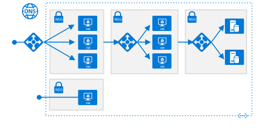
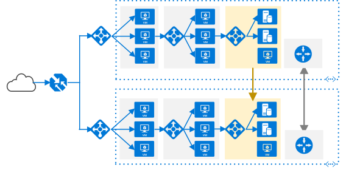

<!-- This file is generated! -->
<!-- See the templates in ./build/reference-architectures  -->
<!-- See data in index.json -->

# N-tier application

<section class="series">
    <ul class="panelContent">
    <!-- Single VM -->
<li style="display: flex; flex-direction: column;">
    <a href="./windows-vm.md" style="display: flex; flex-direction: column; flex: 1 0 auto;">
        

            

                

                    

                        

                            
                        

                    

                    

                        <h3>Windows VM</h3>
                        
Baseline recommendations for running a Windows VM in Azure.

                    

                

            

        

    </a>
</li>

<li style="display: flex; flex-direction: column;">
    <a href="./linux-vm.md" style="display: flex; flex-direction: column; flex: 1 0 auto;">
        

            

                

                    

                        

                            
                        

                    

                    

                        <h3>Linux VM</h3>
                        
Baseline recommendations for running a Linux VM in Azure.

                    

                

            

        

    </a>
</li>

    <!-- N-tier application -->
<li style="display: flex; flex-direction: column;">
    <a href="./n-tier.md" style="display: flex; flex-direction: column; flex: 1 0 auto;">
        

            

                

                    

                        

                            
                        

                    

                    

                        <h3>N-tier application</h3>
                        
VMs configured for an N-tier application with SQL Server.

                    

                

            

        

    </a>
</li>

    <!-- N-tier application -->
<li style="display: flex; flex-direction: column;">
    <a href="./n-tier.md" style="display: flex; flex-direction: column; flex: 1 0 auto;">
        

            

                

                    

                        

                            
                        

                    

                    

                        <h3>N-tier application with Availability Zones</h3>
                        
An N-tier architecture that uses Availability Zones to achieve higher availability.

                    

                

            

        

    </a>
</li>

    <!-- Multi-region application -->
<li style="display: flex; flex-direction: column;">
    <a href="./multi-region-application.md" style="display: flex; flex-direction: column; flex: 1 0 auto;">
        

            

                

                    

                        

                            
                        

                    

                    

                        <h3>Multi-region application</h3>
                        
N-tier application deployed to two regions for high availability.

                    

                

            

        

    </a>
</li>
    </ul>
</section>

<ul class="panelContent cardsI">
</ul>