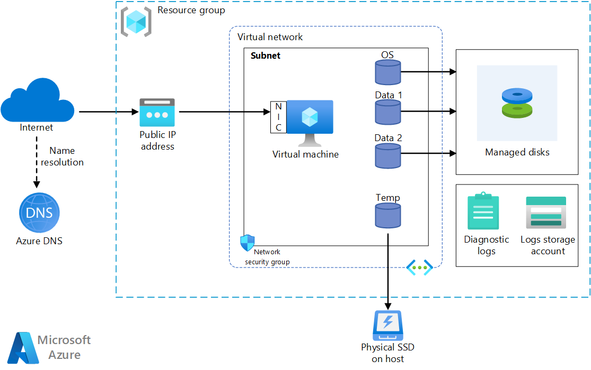

Provisioning a virtual machine (VM) in Azure requires some additional components besides the VM itself, including networking and storage resources. This article shows best practices for running a Linux VM on Azure.

## Architecture



## Workflow

### Resource group

A [resource group][resource-manager-overview] is a logical container that holds related Azure resources. In general, group resources based on their lifetime and who will manage them.

Put closely associated resources that share the same lifecycle into the same [resource group][resource-manager-overview]. Resource groups allow you to deploy and monitor resources as a group and track billing costs by resource group. You can also delete resources as a set, which is useful for test deployments. Assign meaningful resource names to simplify locating a specific resource and understanding its role. For more information, see [Recommended Naming Conventions for Azure Resources][naming-conventions].

### Virtual machine

You can provision a VM from a list of published images, or from a custom managed image or virtual hard disk (VHD) file uploaded to Azure Blob storage.  Azure supports running various popular Linux distributions, including CentOS, Debian, Red Hat Enterprise, Ubuntu, and FreeBSD. For more information, see [Azure and Linux][azure-linux].

Azure offers many different virtual machine sizes. For more information, see [Sizes for virtual machines in Azure][virtual-machine-sizes]. If you are moving an existing workload to Azure, start with the VM size that's the closest match to your on-premises servers. Then measure the performance of your actual workload in terms of CPU, memory, and disk input/output operations per second (IOPS), and adjust the size as needed.

Generally, choose an Azure region that is closest to your internal users or customers. Not all VM sizes are available in all regions. For more information, see [Services by region][services-by-region]. For a list of the VM sizes available in a specific region, run the following command from the Azure CLI:

```azurecli
az vm list-sizes --location <location>
```

For information about choosing a published VM image, see [Find Linux VM images][select-vm-image].

### Disks

For best disk I/O performance, we recommend [Premium Storage][premium-storage], which stores data on solid-state drives (SSDs). Cost is based on the capacity of the provisioned disk. IOPS and throughput (that is, data transfer rate) also depend on disk size, so when you provision a disk, consider all three factors (capacity, IOPS, and throughput).

We also recommend using [Managed Disks][managed-disks]. Managed disks simplify disk management by handling the storage for you. Managed disks do not require a storage account. You simply specify the size and type of disk and it is deployed as a highly available resource. Managed disks also offer cost optimization by providing desired performance without the need for over-provisioning, accounting for fluctuating workload patterns, and minimizing unused provisioned capacity.

The OS disk is a VHD stored in [Azure Storage][azure-storage], so it persists even when the host machine is down.  For Linux VMs, the OS disk is `/dev/sda1`. We also recommend creating one or more [data disks][data-disk], which are persistent VHDs used for application data.

When you create a VHD, it is unformatted. Log into the VM to format the disk. In the Linux shell, data disks are displayed as `/dev/sdc`, `/dev/sdd`, and so on. You can run `lsblk` to list the block devices, including the disks. To use a data disk, create a partition and file system, and mount the disk. For example:

```bash
# Create a partition.

sudo fdisk /dev/sdc     # Enter 'n' to partition, 'w' to write the change.

# Create a file system.

sudo mkfs -t ext3 /dev/sdc1

# Mount the drive.

sudo mkdir /data1
sudo mount /dev/sdc1 /data1
```

When you add a data disk, a logical unit number (LUN) ID is assigned to the disk. Optionally, you can specify the LUN ID &mdash; for example, if you're replacing a disk and want to retain the same LUN ID, or you have an application that looks for a specific LUN ID. However, remember that LUN IDs must be unique for each disk.

You may want to change the I/O scheduler to optimize for performance on SSDs because the disks for VMs with premium storage accounts are SSDs. A common recommendation is to use the NOOP scheduler for SSDs, but you should use a tool such as [iostat] to monitor disk I/O performance for your workload.

The VM is created with a temporary disk. This disk is stored on a physical drive on the host machine. It is *not* saved in Azure Storage and may be deleted during reboots and other VM lifecycle events. Use this disk only for temporary data, such as page or swap files. For Linux VMs, the temporary disk is `/dev/sdb1` and is mounted at `/mnt/resource` or `/mnt`.

### Network

The networking components include the following resources:

- **Virtual network**. Every VM is deployed into a virtual network that can be segmented into multiple subnets.

- **Network interface (NIC)**. The NIC enables the VM to communicate with the virtual network. If you need multiple NICs for your VM, be aware that a maximum number of NICs is defined for each [VM size][vm-size-tables].

- **Public IP address**. A public IP address is needed to communicate with the VM &mdash; for example, via remote desktop (RDP). The public IP address can be dynamic or static. The default is dynamic.

- Reserve a [static IP address][static-ip] if you need a fixed IP address that won't change &mdash; for example, if you need to create a DNS 'A' record or add the IP address to a safe list.
- You can also create a fully qualified domain name (FQDN) for the IP address. You can then register a [CNAME record][cname-record] in DNS that points to the FQDN. For more information, see [Create a fully qualified domain name in the Azure portal][fqdn].

- **Network security group (NSG)**. [Network security groups][nsg] are used to allow or deny network traffic to VMs. NSGs can be associated either with subnets or with individual VM instances.

All NSGs contain a set of [default rules][nsg-default-rules], including a rule that blocks all inbound Internet traffic. The default rules cannot be deleted, but other rules can override them. To enable Internet traffic, create rules that allow inbound traffic to specific ports &mdash; for example, port 80 for HTTP. To enable SSH, add an NSG rule that allows inbound traffic to TCP port 22.

### Operations

**SSH**. Before you create a Linux VM, generate a 2048-bit RSA public-private key pair. Use the public key file when you create the VM. For more information, see [How to Use SSH with Linux and Mac on Azure][ssh-linux].

**Diagnostics**. Enable monitoring and diagnostics, including basic health metrics, diagnostics infrastructure logs, and [boot diagnostics][boot-diagnostics]. Boot diagnostics can help you diagnose boot failure if your VM gets into a non-bootable state. Create an Azure Storage account to store the logs. A standard locally redundant storage (LRS) account is sufficient for diagnostic logs. For more information, see [Enable monitoring and diagnostics][enable-monitoring].

**Availability**. Your VM may be affected by [planned maintenance][planned-maintenance] or [unplanned downtime][manage-vm-availability]. You can use [VM reboot logs][reboot-logs] to determine whether a VM reboot was caused by planned maintenance. For higher availability, deploy multiple VMs in an [availability set](/azure/virtual-machines/linux/manage-availability#configure-multiple-virtual-machines-in-an-availability-set-for-redundancy). This configuration provides a higher [service level agreement (SLA)][vm-sla].

**Backups** To protect against accidental data loss, use the [Azure Backup](/azure/backup/) service to back up your VMs to geo-redundant storage. Azure Backup provides application-consistent backups.

**Stopping a VM**. Azure makes a distinction between "stopped" and "deallocated" states. You are charged when the VM status is stopped, but not when the VM is deallocated. In the Azure portal, the **Stop** button deallocates the VM. If you shut down through the OS while logged in, the VM is stopped but **not** deallocated, so you will still be charged.

**Deleting a VM**. If you delete a VM, the VHDs are not deleted. That means you can safely delete the VM without losing data. However, you will still be charged for storage. To delete the VHD, delete the file from [Blob storage][blob-storage]. To prevent accidental deletion, use a [resource lock][resource-lock] to lock the entire resource group or lock individual resources, such as a VM.

## Considerations

These considerations implement the pillars of the Azure Well-Architected Framework, which is a set of guiding tenets that can be used to improve the quality of a workload. For more information, see [Microsoft Azure Well-Architected Framework](/azure/architecture/framework).

### Cost optimization

Cost optimization is about looking at ways to reduce unnecessary expenses and improve operational efficiencies. For more information, see [Overview of the cost optimization pillar](/azure/architecture/framework/cost/overview).

There are various options for VM sizes depending on the usage and workload. The range includes most economical option of the Bs-series to the newest GPU VMs optimized for machine learning. For information about the available options, see [Azure Linux VM pricing][linux-vms-pricing].

For predictable workloads, use [Azure Reservations](/azure/cost-management-billing/reservations/save-compute-costs-reservations) and [Azure savings plan for compute](https://azure.microsoft.com/pricing/offers/savings-plan-compute/#benefits-and-features) with a one-year or three-year contract and receive significant savings off pay-as-you-go prices. For workloads with no predictable time of completion or resource consumption, consider the **Pay as you go** option.

Use [Azure Spot VMs](/azure/virtual-machines/windows/spot-vms) to run workloads the can be interrupted and do not require completion within a predetermined timeframe or an SLA. Azure deploys Spot VMs if there is available capacity and evicts when it needs the capacity back. Costs associated with Spot virtual machines are significantly lower.  Consider Spot VMs for these workloads:

- High-performance computing scenarios, batch processing jobs, or visual rendering applications.
- Test environments, including continuous integration and continuous delivery workloads.
- Large-scale stateless applications.

Use the [Azure Pricing Calculator][azure-pricing-calculator] to estimates costs.

For more information, see the cost section in [Microsoft Azure Well-Architected Framework][WAF-cost].

### Security

Security provides assurances against deliberate attacks and the abuse of your valuable data and systems. For more information, see [Overview of the security pillar](/azure/architecture/framework/security/overview).

Use [Microsoft Defender for Cloud][security-center] to get a central view of the security state of your Azure resources. Defender for Cloud monitors potential security issues and provides a comprehensive picture of the security health of your deployment. Defender for Cloud is configured per Azure subscription. Enable security data collection as described in [Onboard your Azure subscription to Defender for Cloud Standard][security-center-get-started]. When data collection is enabled, Defender for Cloud automatically scans any VMs created under that subscription.

**Patch management**. If enabled, Defender for Cloud checks whether any security and critical updates are missing.

**Antimalware**. If enabled, Defender for Cloud checks whether antimalware software is installed. You can also use Defender for Cloud to install antimalware software from inside the Azure portal.

**Access control**. Use [Azure role-based access control (Azure RBAC)][rbac] to control access to Azure resources. Azure RBAC lets you assign authorization roles to members of your DevOps team. For example, the Reader role can view Azure resources but not create, manage, or delete them. Some permissions are specific to an Azure resource type. For example, the Virtual Machine Contributor role can restart or deallocate a VM, reset the administrator password, create a new VM, and so on. Other [built-in roles][rbac-roles] that may be useful for this architecture include [DevTest Labs User][rbac-devtest] and [Network Contributor][rbac-network].

> [!NOTE]
> Azure RBAC does not limit the actions that a user logged into a VM can perform. Those permissions are determined by the account type on the guest OS.

**Audit logs**. Use [audit logs][audit-logs] to see provisioning actions and other VM events.

**Data encryption**. Use [Azure Disk Encryption][disk-encryption] if you need to encrypt the OS and data disks.

### Operational excellence

Operational excellence covers the operations processes that deploy an application and keep it running in production. For more information, see [Overview of the operational excellence pillar](/azure/architecture/framework/devops/overview).

Use a single [Azure Resource Manager template][arm-template] for provisioning the Azure resources and its dependencies. Since all the resources are in the same virtual network, they are isolated in the same basic workload, that makes it easier to associate the workload's specific resources to a DevOps team, so that the team can independently manage all aspects of those resources. This isolation enables the DevOps Team to perform continuous integration and continuous delivery (CI/CD).

Also, you can use different [Azure Resource Manager templates][arm-template] and integrate them with [Azure DevOps Services][az-devops] to provision different environments in minutes, for example to replicate production like scenarios or load testing environments only when needed, saving cost.

For higher availability architecture see [Linux N-tier application in Azure with Apache Cassandra](./n-tier-cassandra.yml), the reference architecture includes more than one VM and each VM is included in an availability set.

Consider using the [Azure Monitor][azure-monitor] to Analyze and optimize the performance of your infrastructure, Monitor and diagnose networking issues without logging into your virtual machines.

## Next steps

- To create a Linux VM, see [Quickstart: Create a Linux virtual machine in the Azure portal](/azure/virtual-machines/linux/quick-create-portal)
- To install an NVIDIA driver on a Linux VM, see [Install NVIDIA GPU drivers on N-series VMs running Linux](/azure/virtual-machines/linux/n-series-driver-setup)
- To provision a Linux VM, see [Create and Manage Linux VMs with the Azure CLI](/azure/virtual-machines/linux/tutorial-manage-vm)

## Related resources

- [Linux N-tier application in Azure with Apache Cassandra](./n-tier-cassandra.yml)
- [Linux virtual desktops with Citrix](/azure/architecture/example-scenario/infrastructure/linux-vdi-citrix)
- [Run a Windows VM on Azure](windows-vm.yml)

<!-- links -->

[arm-template]: /azure/azure-resource-manager/resource-group-overview#resource-groups
[audit-logs]: https://azure.microsoft.com/blog/analyze-azure-audit-logs-in-powerbi-more/
[az-devops]: /azure/virtual-machines/windows/infrastructure-automation#azure-devops-services
[azure-linux]: /azure/virtual-machines/linux/overview
[azure-monitor]: https://azure.microsoft.com/services/monitor/
[azure-storage]: /azure/storage/common/storage-introduction
[blob-storage]: /azure/storage/common/storage-introduction
[boot-diagnostics]: https://azure.microsoft.com/blog/boot-diagnostics-for-virtual-machines-v2/
[azure-pricing-calculator]: https://azure.microsoft.com/pricing/calculator/
[cname-record]: https://en.wikipedia.org/wiki/CNAME_record
[data-disk]: /azure/virtual-machines/windows/disks-types
[disk-encryption]: /azure/security/fundamentals/azure-disk-encryption-vms-vmss
[enable-monitoring]: /azure/monitoring-and-diagnostics/insights-how-to-use-diagnostics
[fqdn]: /azure/virtual-machines/linux/quick-create-portal
[group-policy]: /windows-server/administration/windows-server-update-services/deploy/4-configure-group-policy-settings-for-automatic-updates
[iostat]: https://en.wikipedia.org/wiki/Iostat
[linux-vms-pricing]: https://azure.microsoft.com/pricing/details/virtual-machines/linux
[manage-vm-availability]: /azure/virtual-machines/linux/manage-availability
[managed-disks]: /azure/storage/storage-managed-disks-overview
[naming-conventions]: /azure/cloud-adoption-framework/ready/azure-best-practices/naming-and-tagging
[nsg]: /azure/virtual-network/virtual-networks-nsg
[nsg-default-rules]: /azure/virtual-network/security-overview#default-security-rules
[planned-maintenance]: /azure/virtual-machines/maintenance-and-updates
[premium-storage]: /azure/virtual-machines/linux/premium-storage
[rbac]: /azure/role-based-access-control/overview
[rbac-roles]: /azure/role-based-access-control/built-in-roles
[rbac-devtest]: /azure/role-based-access-control/built-in-roles#devtest-labs-user
[rbac-network]: /azure/role-based-access-control/built-in-roles#network-contributor
[reboot-logs]: https://azure.microsoft.com/blog/viewing-vm-reboot-logs
[resource-lock]: /azure/resource-group-lock-resources
[resource-manager-overview]: /azure/azure-resource-manager/resource-group-overview
[security-center]: /azure/security-center/security-center-intro
[security-center-get-started]: /azure/security-center/security-center-get-started
[select-vm-image]: /azure/virtual-machines/linux/cli-ps-findimage
[services-by-region]: https://azure.microsoft.com/regions/#services
[ssh-linux]: /azure/virtual-machines/linux/mac-create-ssh-keys
[static-ip]: /azure/virtual-network/virtual-networks-reserved-public-ip
[virtual-machine-sizes]: /azure/virtual-machines/sizes
[vm-size-tables]: /azure/virtual-machines/sizes
[vm-sla]: https://azure.microsoft.com/support/legal/sla/virtual-machines
[WAF-devops]: /azure/architecture/framework/devops/overview
[WAF-cost]: /azure/architecture/framework/cost/overview
