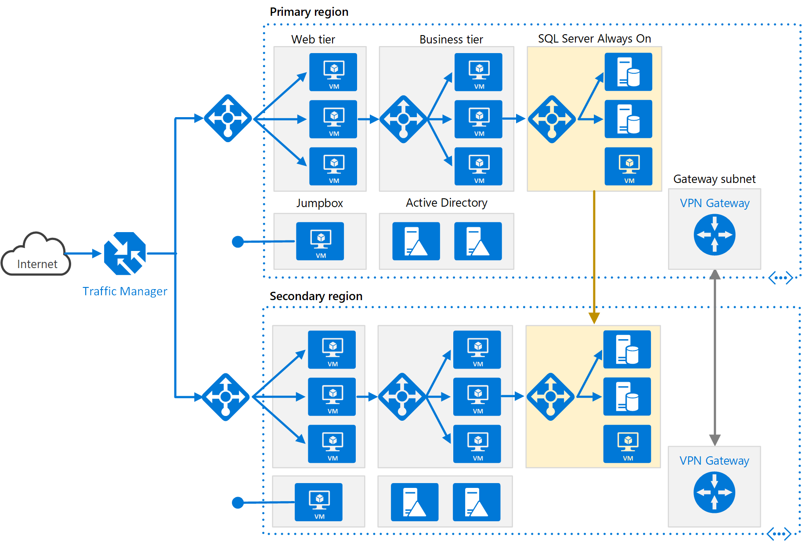

This reference architecture shows a set of proven practices for running an N-tier application in multiple Azure regions, in order to achieve availability and a robust disaster recovery infrastructure.

## Architecture



*Download a [Visio file][visio-download] of this architecture.*

### Workflow

This architecture builds on the one shown in [N-tier application with SQL Server](n-tier-sql-server.yml).

- **Primary and secondary regions**. Use two regions to achieve higher availability. One is the primary region. The other region is for failover.

- **Azure Traffic Manager**. [Traffic Manager][traffic-manager] routes incoming requests to one of the regions. During normal operations, it routes requests to the primary region. If that region becomes unavailable, Traffic Manager fails over to the secondary region. For more information, see the section [Traffic Manager configuration](#traffic-manager-configuration).

- **Resource groups**. Create separate [resource groups][resource groups] for the primary region, the secondary region, and for Traffic Manager. This method gives you the flexibility to manage each region as a single collection of resources. For example, you could redeploy one region, without taking down the other one. [Link the resource groups][resource-group-links], so that you can run a query to list all the resources for the application.

- **Virtual networks**. Create a separate virtual network for each region. Make sure the address spaces don't overlap.

- **SQL Server Always On Availability Group**. If you use SQL Server, we recommend [SQL Always On Availability Groups][sql-always-on] for high availability. Create a single availability group that includes the SQL Server instances in both regions.

    > [!NOTE]
    > Also consider [Azure SQL Database][azure-sql-db], which provides a relational database as a cloud service. With SQL Database, you don't need to configure an availability group or manage failover.
    >

- **Virtual network peering**. Peer the two virtual networks to allow data replication from the primary region to the secondary region. For more information, see [Virtual network peering](/azure/virtual-network/virtual-network-peering-overview).

### Components

- [Availability sets](/azure/virtual-machines/windows/manage-availability) ensure that the VMs you deploy on Azure are distributed across multiple isolated hardware nodes in a cluster. If a hardware or software failure occurs within Azure, only a subset of your VMs are affected, and your entire solution remains available and operational.
- [Availability zones](/azure/availability-zones/az-overview) protect your applications and data from datacenter failures. Availability zones are separate physical locations within an Azure region. Each zone consists of one or more datacenters equipped with independent power, cooling, and networking.
- [Azure Traffic Manager](/azure/traffic-manager) is a DNS-based traffic load balancer that distributes traffic optimally. It provides services across global Azure regions, with high availability and responsiveness.
- [Azure Load Balancer](/azure/load-balancer/load-balancer-overview) distributes inbound traffic, according to defined rules and health probes. A load balancer provides low latency and high throughput, scaling up to millions of flows for all TCP and UDP applications. A public load balancer is used in this scenario, to distribute incoming client traffic to the web tier. An internal load balancer is used in this scenario, to distribute traffic from the business tier to the back-end SQL Server cluster.
- [Azure Bastion](/azure/bastion/bastion-overview) provides secure RDP and SSH connectivity to all of the VMs, in the virtual network in which it's provisioned. Use Azure Bastion to protect your virtual machines from exposing RDP/SSH ports to the outside world, while still providing secure access using RDP/SSH.

## Recommendations

A multi-region architecture can provide higher availability than deploying to a single region. If a regional outage affects the primary region, you can use [Traffic Manager][traffic-manager] to fail over to the secondary region. This architecture can also help if an individual subsystem of the application fails.

There are several general approaches to achieving high availability across regions:

- Active/passive with hot standby. Traffic goes to one region, while the other waits on hot standby. Hot standby means the VMs in the secondary region are allocated and are always running.
- Active/passive with cold standby. Traffic goes to one region, while the other waits on cold standby. Cold standby means the VMs in the secondary region aren't allocated until needed for failover. This approach costs less to run, but will generally take longer to come online during a failure.
- Active/active. Both regions are active, and requests are load balanced between them. If one region becomes unavailable, it's taken out of rotation.

This reference architecture focuses on active/passive with hot standby, using Traffic Manager for failover. You could deploy a few VMs for hot standby and then scale out as needed.

### Regional pairing

Each Azure region is paired with another region within the same geography. In general, choose regions from the same regional pair (for example, East US 2 and US Central). Benefits of doing so include:

- If there's a broad outage, recovery of at least one region out of every pair is prioritized.
- Planned Azure system updates are rolled out to paired regions sequentially, to minimize possible downtime.
- Pairs reside within the same geography, to meet data residency requirements.

However, make sure that both regions support all of the Azure services needed for your application (see [Services by region][services-by-region]). For more information about regional pairs, see [Business continuity and disaster recovery (BCDR): Azure Paired Regions][regional-pairs].

### Traffic Manager configuration

Consider the following points when configuring Traffic Manager:

- **Routing**. Traffic Manager supports several [routing algorithms][tm-routing]. For the scenario described in this article, use *priority* routing (formerly called *failover* routing). With this setting, Traffic Manager sends all requests to the primary region, unless the primary region becomes unreachable. At that point, it automatically fails over to the secondary region. See [Configure Failover routing method][tm-configure-failover].
- **Health probe**. Traffic Manager uses an HTTP (or HTTPS) [probe][tm-monitoring] to monitor the availability of each region. The probe checks for an HTTP 200 response for a specified URL path. As a best practice, create an endpoint that reports the overall health of the application, and use this endpoint for the health probe. Otherwise, the probe might report a healthy endpoint when critical parts of the application are actually failing. For more information, see [Health Endpoint Monitoring pattern][health-endpoint-monitoring-pattern].

When Traffic Manager fails over, there's a period of time when clients can't reach the application. The duration is affected by the following factors:

- The health probe must detect that the primary region has become unreachable.
- DNS servers must update the cached DNS records for the IP address, which depends on the DNS time-to-live (TTL). The default TTL is 300 seconds (5 minutes), but you can configure this value when you create the Traffic Manager profile.

For details, see [About Traffic Manager Monitoring][tm-monitoring].

If Traffic Manager fails over, we recommend performing a manual failback rather than implementing an automatic failback. Otherwise, you can create a situation where the application flips back and forth between regions. Verify that all application subsystems are healthy before failing back.

Traffic Manager automatically fails back by default. To prevent this issue, manually lower the priority of the primary region after a failover event. For example, suppose the primary region is priority 1 and the secondary is priority 2. After a failover, set the primary region to priority 3, to prevent automatic failback. When you're ready to switch back, update the priority to 1.

The following [Azure CLI][azure-cli] command updates the priority:

```azurecli
az network traffic-manager endpoint update --resource-group <resource-group> --profile-name <profile>
    --name <endpoint-name> --type azureEndpoints --priority 3
```

Another approach is to temporarily disable the endpoint until you're ready to fail back:

```azurecli
az network traffic-manager endpoint update --resource-group <resource-group> --profile-name <profile>
    --name <endpoint-name> --type azureEndpoints --endpoint-status Disabled
```

Depending on the cause of a failover, you might need to redeploy the resources within a region. Before failing back, perform an operational readiness test. The test should verify things like:

- VMs are configured correctly. (All required software is installed, IIS is running, and so on.)
- Application subsystems are healthy.
- Functional testing. (For example, the database tier is reachable from the web tier.)

### Configure SQL Server Always On Availability Groups

Prior to Windows Server 2016, SQL Server Always On Availability Groups require a domain controller, and all nodes in the availability group must be in the same Active Directory (AD) domain.

To configure the availability group:

- At a minimum, place two domain controllers in each region.
- Give each domain controller a static IP address.
- Peer the two virtual networks to enable communication between them.
- For each virtual network, add the IP addresses of the domain controllers (from both regions) to the DNS server list. You can use the following CLI command. For more information, see [Change DNS servers][vnet-dns].

    ```azurecli
    az network vnet update --resource-group <resource-group> --name <vnet-name> --dns-servers "10.0.0.4,10.0.0.6,172.16.0.4,172.16.0.6"
    ```

- Create a [Windows Server Failover Clustering][wsfc] (WSFC) cluster that includes the SQL Server instances in both regions.
- Create a SQL Server Always On Availability Group that includes the SQL Server instances in both the primary and secondary regions. See [Extending Always On Availability Group to Remote Azure Datacenter (PowerShell)](https://techcommunity.microsoft.com/t5/DataCAT/Extending-AlwaysOn-Availability-Group-to-Remote-Azure-Datacenter/ba-p/305217) for the steps.

  - Put the primary replica in the primary region.
  - Put one or more secondary replicas in the primary region. Configure these replicas to use synchronous commit with automatic failover.
  - Put one or more secondary replicas in the secondary region. Configure these replicas to use *asynchronous* commit, for performance reasons. (Otherwise, all T-SQL transactions have to wait on a round trip over the network to the secondary region.)

    > [!NOTE]
    > Asynchronous commit replicas don't support automatic failover.

## Considerations

These considerations implement the pillars of the Azure Well-Architected Framework, which is a set of guiding tenets that can be used to improve the quality of a workload. For more information, see [Microsoft Azure Well-Architected Framework](/azure/architecture/framework).

### Availability

With a complex N-tier app, you may not need to replicate the entire application in the secondary region. Instead, you might just replicate a critical subsystem that is needed to support business continuity.

Traffic Manager is a possible failure point in the system. If the Traffic Manager service fails, clients can't access your application during the downtime. Review the [Traffic Manager SLA][tm-sla], and determine whether using Traffic Manager alone meets your business requirements for high availability. If not, consider adding another traffic management solution as a failback. If the Azure Traffic Manager service fails, change your CNAME records in DNS to point to the other traffic management service. (This step must be performed manually, and your application will be unavailable until the DNS changes are propagated.)

For the SQL Server cluster, there are two failover scenarios to consider:

- All of the SQL Server database replicas in the primary region fail. For example, this failure could happen during a regional outage. In that case, you must manually fail over the availability group, even though Traffic Manager automatically fails over on the front end. Follow the steps in [Perform a Forced Manual Failover of a SQL Server Availability Group](/sql/database-engine/availability-groups/windows/perform-a-forced-manual-failover-of-an-availability-group-sql-server?view=sql-server-ver15&preserve-view=true), which describes how to perform a forced failover by using SQL Server Management Studio, Transact-SQL, or PowerShell in SQL Server 2016.

   > [!WARNING]
   > With forced failover, there's a risk of data loss. Once the primary region is back online, take a snapshot of the database and use [tablediff] to find the differences.

- Traffic Manager fails over to the secondary region, but the primary SQL Server database replica is still available. For example, the front-end tier might fail, without affecting the SQL Server VMs. In that case, Internet traffic is routed to the secondary region, and that region can still connect to the primary replica. However, there will be increased latency, because the SQL Server connections are going across regions. In this situation, you should perform a manual failover as follows:

   1. Temporarily switch a SQL Server database replica in the secondary region to *synchronous* commit. This step ensures there won't be data loss during the failover.
   2. Fail over to that replica.
   3. When you fail back to the primary region, restore the asynchronous commit setting.

### Manageability

When you update your deployment, update one region at a time to reduce the chance of a global failure from an incorrect configuration or an error in the application.

Test the resiliency of the system to failures. Here are some common failure scenarios to test:

- Shut down VM instances.
- Pressure resources such as CPU and memory.
- Disconnect/delay network.
- Crash processes.
- Expire certificates.
- Simulate hardware faults.
- Shut down the DNS service on the domain controllers.

Measure the recovery times and verify they meet your business requirements. Test combinations of failure modes, as well.

### Cost optimization

Cost optimization is about looking at ways to reduce unnecessary expenses and improve operational efficiencies. For more information, see [Overview of the cost optimization pillar](/azure/architecture/framework/cost/overview).

Use the [Azure Pricing Calculator][azure-pricing-calculator] to estimates costs. Here are some other considerations.

#### Virtual Machine Scale Sets

Virtual Machine Scale Sets are available on all Windows VM sizes. You're only charged for the Azure VMs you deploy and any added underlying infrastructure resources that are consumed, such as storage and networking. There are no incremental charges for the Virtual Machine Scale Sets service.

For single VMs pricing options, see [Windows VMs pricing][Windows-vm-pricing].

#### SQL server

If you choose Azure SQL DBaas, you can save on cost because don't need to configure an Always On Availability Group and domain controller machines. There are several deployment options starting from single database up to managed instance, or elastic pools. For more information, see [Azure SQL pricing](https://azure.microsoft.com/pricing/details/sql-database/managed).

For SQL server VMs pricing options, see [SQL VMs pricing][Managed-Sql-pricing].

#### Load balancers

You're only charged for the number of configured load-balancing and outbound rules. Inbound NAT rules are free. There's no hourly charge for the Standard Load Balancer when no rules are configured.

#### Traffic Manager pricing

Traffic Manager billing is based on the number of DNS queries received, with a discount for services receiving more than 1 billion monthly queries. You're also charged for each monitored endpoint.

For more information, see the cost section in [Microsoft Azure Well-Architected Framework][WAF-cost].

#### VNET-Peering pricing

A high-availability deployment that uses multiple Azure Regions will make use of VNET-Peering. There are different charges for VNET-Peering within the same region and for Global VNET-Peering.

For more information, see [Virtual Network Pricing](https://azure.microsoft.com/pricing/details/virtual-network/).

### DevOps

Use a single [Azure Resource Manager template][arm-template] for provisioning the Azure resources and its dependencies. Use the same template to deploy the resources to both primary and secondary regions. Include all the resources in the same virtual network so they're isolated in the same basic workload. By including all the resources, you make it easier to associate the workload's specific resources to a DevOps team, so that the team can independently manage all aspects of those resources. This isolation enables DevOps Team and Services to perform continuous integration and continuous delivery (CI/CD).

Also, you can use different [Azure Resource Manager templates][arm-template] and integrate them with [Azure DevOps Services][az-devops] to provision different environments in minutes, for example to replicate production like scenarios or load testing environments only when needed, saving cost.

Consider using the [Azure Monitor][azure-monitor] to Analyze and optimize the performance of your infrastructure, Monitor and diagnose networking issues without logging into your virtual machines. Application Insights is actually one of the components of Azure Monitor, which gives you rich metrics and logs to verify the state of your complete Azure landscape. Azure Monitor will help you to follow the state of your infrastructure.

Make sure not only to monitor your compute elements supporting your application code, but your data platform as well, in particular your databases, since a low performance of the data tier of an application could have serious consequences.

In order to test the Azure environment where the applications are running, it should be version-controlled and deployed through the same mechanisms as application code, then it can be tested and validated using DevOps testing paradigms too.

For more information, see the Operational Excellence section in [Microsoft Azure Well-Architected Framework][WAF-devops].

## Contributors

*This article is maintained by Microsoft. It was originally written by the following contributors.* 

Principal author: 

 - [Donnie Trumpower](https://www.linkedin.com/in/dtrumpower) | Senior Cloud Solution Architect

*To see non-public LinkedIn profiles, sign in to LinkedIn.*

## Next steps

- [Deploy Traffic Manager in Azure](/azure/traffic-manager/quickstart-create-traffic-manager-profile)
- [Deploy Azure Load Balancer](/azure/load-balancer/load-balancer-overview)

## Related resources

The following architecture uses some of the same technologies:

- [Multitier web application built for high availability and disaster recovery on Azure](../../example-scenario/infrastructure/multi-tier-app-disaster-recovery.yml)
- [Multi-region load balancing](../../high-availability/reference-architecture-traffic-manager-application-gateway.yml)
- [SQL Server failover cluster in Azure](../../example-scenario/sql-failover/sql-failover-2008r2.yml)

<!-- links -->

[arm-template]: /azure/azure-resource-manager/resource-group-overview#resource-groups
[azure-monitor]: https://azure.microsoft.com/services/monitor/
[az-devops]: /azure/virtual-machines/windows/infrastructure-automation#azure-devops-services
[Sql-vm-pricing]: https://azure.microsoft.com/pricing/details/virtual-machines/sql-server-enterprise/
[Windows-vm-pricing]: https://azure.microsoft.com/pricing/details/virtual-machines/windows
[Managed-Sql-pricing]: https://azure.microsoft.com/pricing/details/sql-database/managed
[azure-sql-db]: /azure/sql-database
[health-endpoint-monitoring-pattern]: ../../patterns/health-endpoint-monitoring.yml
[azure-cli]: /cli/azure
[azure-pricing-calculator]: https://azure.microsoft.com/pricing/calculator
[regional-pairs]: /azure/best-practices-availability-paired-regions
[resource groups]: /azure/azure-resource-manager/resource-group-overview
[resource-group-links]: /azure/resource-group-link-resources
[services-by-region]: https://azure.microsoft.com/regions/#services
[sql-always-on]: /sql/database-engine/availability-groups/windows/always-on-availability-groups-sql-server?view=sql-server-ver15&preserve-view=true
[tablediff]: /sql/tools/tablediff-utility?view=sql-server-ver15
[tm-configure-failover]: /azure/traffic-manager/traffic-manager-configure-failover-routing-method
[tm-monitoring]: /azure/traffic-manager/traffic-manager-monitoring
[tm-routing]: /azure/traffic-manager/traffic-manager-routing-methods
[tm-sla]: https://azure.microsoft.com/support/legal/sla/traffic-manager
[traffic-manager]: https://azure.microsoft.com/services/traffic-manager
[visio-download]: https://arch-center.azureedge.net/vm-reference-architectures.vsdx
[vnet-dns]: /azure/virtual-network/manage-virtual-network#change-dns-servers
[wsfc]: /sql/sql-server/failover-clusters/windows/windows-server-failover-clustering-wsfc-with-sql-server?view=sql-server-ver15
[WAF-cost]: /azure/architecture/framework/cost/overview
[WAF-devops]: /azure/architecture/framework/devops/overview
