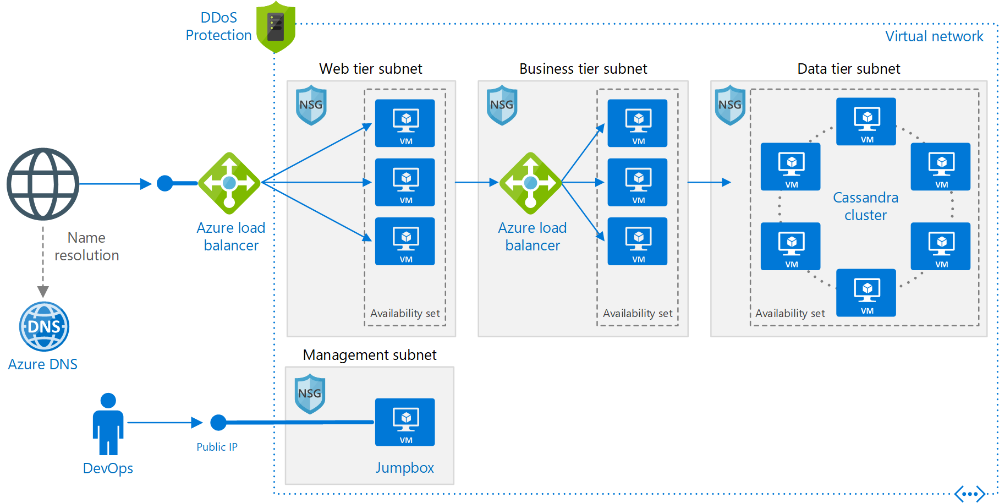

# Linux N-tier application in Azure with Apache Cassandra

This reference architecture shows how to deploy virtual machines (VMs) and a virtual network configured for an [N-tier](../../guide/architecture-styles/n-tier.md) application, using Apache Cassandra on Linux for the data tier. [**Deploy this solution**](#deploy-the-solution).

[](./images/n-tier-cassandra.png)

*Download a [Visio file][visio-download] of this architecture.*

## Architecture

The architecture has the following components.

### General

- **Resource group**. [Resource groups][resource-manager-overview] are used to group Azure resources so they can be managed by lifetime, owner, or other criteria.

- **Availability zones**. [Availability zones](/azure/availability-zones/az-overview) are physical locations within an Azure region. Each zone consists of one or more datacenters with independent power, cooling, and networking. By placing VMs across zones, the application becomes resilient to failures within a zone.

### Networking and load balancing

- **Virtual network and subnets**. Every Azure VM is deployed into a virtual network that can be segmented into subnets. Create a separate subnet for each tier.

- **Application gateway**. [Application Gateway](/azure/application-gateway/) is a layer 7 load balancer. In this architecture, it routes HTTP requests to the web front end. Application Gateway also provides a [web application firewall](/azure/application-gateway/waf-overview) (WAF) that protects the application from common exploits and vulnerabilities.

- **Load balancers**. Use [Azure Standard Load Balancer][load-balancer] to distribute network traffic from the web tier to the business tier, and from the business tier to SQL Server.

- **Network security groups** (NSGs). Use [NSGs][nsg] to restrict network traffic within the virtual network. For example, in the three-tier architecture shown here, the database tier does not accept traffic from the web front end, only from the business tier and the management subnet.

- **DDoS Protection**. Although the Azure platform provides basic protection against distributed denial of service (DDoS) attacks, we recommend using [DDoS Protection Standard][ddos], which has enhanced DDoS mitigation features. See [Security considerations](#security-considerations).

- **Azure DNS**. [Azure DNS][azure-dns] is a hosting service for DNS domains. It provides name resolution using Microsoft Azure infrastructure. By hosting your domains in Azure, you can manage your DNS records using the same credentials, APIs, tools, and billing as your other Azure services.

### Virtual machines

- **Apache Cassandra database**. Provides high availability at the data tier, by enabling replication and failover.

- **OpsCenter**. Deploy a monitoring solution such as [DataStax OpsCenter](https://docs.datastax.com/en/opscenter/6.1/opsc/about_c.html) to monitor the Cassandra cluster.

- **Jumpbox**. Also called a [bastion host]. A secure VM on the network that administrators use to connect to the other VMs. The jumpbox has an NSG that allows remote traffic only from public IP addresses on a safe list. The NSG should permit remote desktop (RDP) traffic.

## Recommendations

Your requirements might differ from the architecture described here. Use these recommendations as a starting point.

### Virtual machines

For recommendations on configuring the VMs, see [Run a Linux VM on Azure](./linux-vm.md).

### Virtual network

When you create the virtual network, determine how many IP addresses your resources in each subnet require. Specify a subnet mask and a network address range large enough for the required IP addresses, using [CIDR] notation. Use an address space that falls within the standard [private IP address blocks][private-ip-space], which are 10.0.0.0/8, 172.16.0.0/12, and 192.168.0.0/16.

Choose an address range that doesn't overlap with your on-premises network, in case you need to set up a gateway between the VNet and your on-premises network later. Once you create the VNet, you can't change the address range.

Design subnets with functionality and security requirements in mind. All VMs within the same tier or role should go into the same subnet, which can be a security boundary. For more information about designing VNets and subnets, see [Plan and design Azure Virtual Networks][plan-network].

### Application Gateway

For information about configuring Application Gateway, see [Application Gateway configuration overview](/azure/application-gateway/configuration-overview).

### Load balancers

Do not expose the VMs directly to the Internet. Instead, give each VM a private IP address. Clients connect using the IP address associated with the Application Gateway.

Define load balancer rules to direct network traffic to the VMs. For example, to enable HTTP traffic, create a rule that maps port 80 from the front-end configuration to port 80 on the back-end address pool. When a client sends an HTTP request to port 80, the load balancer selects a back-end IP address by using a [hashing algorithm][load-balancer-hashing] that includes the source IP address. Client requests are distributed across all the VMs.

### Network security groups

Use NSG rules to restrict traffic between tiers. For example, in the three-tier architecture shown above, the web tier does not communicate directly with the database tier. To enforce this, the database tier should block incoming traffic from the web tier subnet.

1. Deny all inbound traffic from the VNet. (Use the `VIRTUAL_NETWORK` tag in the rule.)
2. Allow inbound traffic from the business tier subnet.
3. Allow inbound traffic from the database tier subnet itself. This rule allows communication between the database VMs, which is needed for database replication and failover.
4. Allow ssh traffic (port 22) from the jumpbox subnet. This rule lets administrators connect to the database tier from the jumpbox.

Create rules 2 &ndash; 4 with higher priority than the first rule, so they override it.

### Cassandra

We recommend [DataStax Enterprise][datastax] for production use, but these recommendations apply to any Cassandra edition. For more information on running DataStax in Azure, see [DataStax Enterprise Deployment Guide for Azure][cassandra-in-azure].

Configure nodes in rack-aware mode. Map fault domains to racks in the `cassandra-rackdc.properties` file. 

You don't need a load balancer in front of the cluster. The client connects directly to a node in the cluster.

The deployment scripts for this architecture use name resolution to initialize the seed node for intra-cluster communication (gossip). To enable name resolution, the deployment creates an Azure Private DNS zone with A records for the Cassandra nodes. Depending on your initialization scripts, you might be able to use the static IP address instead.

> [!NOTE]
> Azure Private DNS is currently in public preview.

### Jumpbox

Don't allow ssh access from the public Internet to the VMs that run the application workload. Instead, all ssh access to these VMs must come through the jumpbox. An administrator logs into the jumpbox, and then logs into the other VM from the jumpbox. The jumpbox allows ssh traffic from the Internet, but only from known, safe IP addresses.

The jumpbox has minimal performance requirements, so select a small VM size. Create a [public IP address] for the jumpbox. Place the jumpbox in the same VNet as the other VMs, but in a separate management subnet.

To secure the jumpbox, add an NSG rule that allows ssh connections only from a safe set of public IP addresses. Configure the NSGs for the other subnets to allow ssh traffic from the management subnet.

## Scalability considerations

### Scale sets

For the web and business tiers, consider using [virtual machine scale sets][vmss], instead of deploying separate VMs into an availability set. A scale set makes it easy to deploy and manage a set of identical VMs, and autoscale the VMs based on performance metrics. As the load on the VMs increases, additional VMs are automatically added to the load balancer. 

There are two basic ways to configure VMs deployed in a scale set:

- Use extensions to configure the VM after it's deployed. With this approach, new VM instances may take longer to start up than a VM with no extensions.

- Deploy a [managed disk](/azure/storage/storage-managed-disks-overview) with a custom disk image. This option may be quicker to deploy. However, it requires you to keep the image up-to-date.

For more information, see [Design considerations for scale sets][vmss-design].

> [!TIP]
> When using any autoscale solution, test it with production-level workloads well in advance.

### Subscription limits

Each Azure subscription has default limits in place, including a maximum number of VMs per region. You can increase the limit by filing a support request. For more information, see [Azure subscription and service limits, quotas, and constraints][subscription-limits].

### Application Gateway

Application Gateway supports fixed capacity mode or autoscaling mode. Fixed capacity mode is useful for scenarios with consistent and predictable workloads. Consider using autoscaling mode for workloads with variable traffic. For more information, see [Autoscaling and Zone-redundant Application Gateway v2][app-gw-scaling].

## Performance considerations

To get the best performance from Cassandra on Azure VMs, see the recommendations in [Run Apache Cassandra on Azure VMs](../../best-practices/cassandra.md).

## Availability considerations

Availability zones provide the best resiliency within a single region. If you need even higher availability, consider replicating the application across two regions.

Not all regions support availability zones, and not all VM sizes are supported in all zones. Run the following Azure CLI command to find the supported zones for each VM size within a region:

```bash
az vm list-skus --resource-type virtualMachines --zone false --location <location> \
    --query "[].{Name:name, Zones:locationInfo[].zones[] | join(','@)}" -o table  
```

If you deploy this architecture to a region that does not support availability zones, put the VMs for each tier inside an *availability set*. VMs within the same availability are deployed across multiple physical servers, compute racks, storage units, and network switches for redundancy. Scale sets automatically use *placement groups*, which act as an implicit availability set.

When deploying to availability zones, use the Standard SKU of Azure Load Balancer and the v2 SKU of Application Gateway. These SKUs support cross-zone redundancy. For more information, see:

- [Standard Load Balancer and Availability Zones](/azure/load-balancer/load-balancer-standard-availability-zones)
- [Autoscaling and Zone-redundant Application Gateway v2][app-gw-scaling]
- [How does Application Gateway support high availability and scalability?](/azure/application-gateway/application-gateway-faq#how-does-application-gateway-support-high-availability-and-scalability)

A single Application Gateway deployment can run multiple instances of the gateway. For production workloads, run at least two instances.

### Cassandra cluster

For the Cassandra cluster, the failover scenarios depend on the consistency levels used by the application and the number of replicas. For consistency levels and usage in Cassandra, see [Configuring data consistency][cassandra-consistency] and [Cassandra: How many nodes are talked to with Quorum?][cassandra-consistency-usage] Data availability in Cassandra is determined by the consistency level used by the application and the replication mechanism. For replication in Cassandra, see [Data Replication in NoSQL Databases Explained][cassandra-replication].

### Health probes

Application Gateway and Load Balancer both use health probes to monitor the availability of VM instances.

- Application Gateway always uses an HTTP probe.
- Load Balancer can test either HTTP or TCP. Generally, if a VM runs an HTTP server, use an HTTP probe. Otherwise, use TCP.

If a probe can't reach an instance within a timeout period, the gateway or load balancer stops sending traffic to that VM. The probe continues to check and will return the VM to the back-end pool if the VM becomes available again.

HTTP probes send an HTTP GET request to a specified path and listen for an HTTP 200 response. This path can be the root path ("/"), or a health-monitoring endpoint that implements some custom logic to check the health of the application. The endpoint must allow anonymous HTTP requests.

For more information about health probes, see:

- [Load Balancer health probes](/azure/load-balancer/load-balancer-custom-probe-overview)
- [Application Gateway health monitoring overview](/azure/application-gateway/application-gateway-probe-overview)

For considerations about designing a health probe endpoint, see [Health Endpoint Monitoring pattern](../../patterns/health-endpoint-monitoring.md).

## Security considerations

Virtual networks are a traffic isolation boundary in Azure. VMs in one VNet can't communicate directly with VMs in a different VNet. VMs within the same VNet can communicate, unless you create [network security groups][nsg] (NSGs) to restrict traffic. For more information, see [Microsoft cloud services and network security][network-security].

For incoming Internet traffic, the load balancer rules define which traffic can reach the back end. However, load balancer rules don't support IP safe lists, so if you want to add certain public IP addresses to a safe list, add an NSG to the subnet.

**DMZ**. Consider adding a network virtual appliance (NVA) to create a DMZ between the Internet and the Azure virtual network. NVA is a generic term for a virtual appliance that can perform network-related tasks, such as firewall, packet inspection, auditing, and custom routing. For more information, see [Implementing a DMZ between Azure and the Internet][dmz].

**Encryption**. Encrypt sensitive data at rest and use [Azure Key Vault][azure-key-vault] to manage the database encryption keys. Key Vault can store encryption keys in hardware security modules (HSMs). It's also recommended to store application secrets, such as database connection strings, in Key Vault.

**DDoS protection**. The Azure platform provides basic DDoS protection by default. This basic protection is targeted at protecting the Azure infrastructure as a whole. Although basic DDoS protection is automatically enabled, we recommend using [DDoS Protection Standard][ddos]. Standard protection uses adaptive tuning, based on your application's network traffic patterns, to detect threats. This allows it to apply mitigations against DDoS attacks that might go unnoticed by the infrastructure-wide DDoS policies. Standard protection also provides alerting, telemetry, and analytics through Azure Monitor. For more information, see [Azure DDoS Protection: Best practices and reference architectures][ddos-best-practices].

## Deploy the solution

A deployment for this reference architecture is available on [GitHub][github-folder].

If you specify a region that supports availability zones, the VMs are deployed into availability zones. Otherwise, the VMs are deployed into availability sets. For a list of regions that support availability zones, see [Services support by region](/azure/availability-zones/az-overview#services-support-by-region).

### Prerequisites

[!INCLUDE [ref-arch-prerequisites.md](../../../includes/ref-arch-prerequisites.md)]

### Deploy the solution using azbb

To deploy the Linux VMs for an N-tier application reference architecture, follow these steps:

1. Navigate to the `virtual-machines\n-tier-linux` folder for the repository you cloned in step 1 of the prerequisites above.

2. The parameter file specifies a default administrator user name and password for each VM in the deployment. Change these before you deploy the reference architecture. Open the `n-tier-linux.json` file and replace each **adminUsername** and **adminPassword** field with your new settings.   Save the file.

3. Deploy the reference architecture using the **azbb** tool as shown below.

   ```azurecli
   azbb -s <your subscription_id> -g <your resource_group_name> -l <azure region> -p n-tier-linux.json --deploy
   ```

## Next steps

- [Microsoft Learn module: Tour the N-tier architecture style](/learn/modules/n-tier-architecture/)

<!-- links -->

[app-gw-scaling]: /azure/application-gateway/
[azure-dns]: /azure/dns/dns-overview
[azure-key-vault]: https://azure.microsoft.com/services/key-vault
[bastion host]: https://en.wikipedia.org/wiki/Bastion_host
[cassandra-in-azure]: https://academy.datastax.com/resources/deployment-guide-azure
[cassandra-consistency]: https://docs.datastax.com/en/cassandra/2.0/cassandra/dml/dml_config_consistency_c.html
[cassandra-replication]: https://academy.datastax.com/planet-cassandra/data-replication-in-nosql-databases-explained
[cassandra-consistency-usage]: https://medium.com/@foundev/cassandra-how-many-nodes-are-talked-to-with-quorum-also-should-i-use-it-98074e75d7d5#.b4pb4alb2
[cidr]: https://en.wikipedia.org/wiki/Classless_Inter-Domain_Routing
[datastax]: https://www.datastax.com/products/datastax-enterprise
[ddos-best-practices]: /azure/security/azure-ddos-best-practices
[ddos]: /azure/virtual-network/ddos-protection-overview
[dmz]: ../dmz/secure-vnet-dmz.md
[github-folder]: https://github.com/mspnp/reference-architectures/tree/master/virtual-machines/n-tier-linux
[load-balancer-hashing]: /azure/load-balancer/load-balancer-overview#load-balancer-concepts
[load-balancer]: /azure/load-balancer/load-balancer-get-started-internet-arm-cli
[network-security]: /azure/best-practices-network-security
[nsg]: /azure/virtual-network/virtual-networks-nsg
[plan-network]: /azure/virtual-network/virtual-network-vnet-plan-design-arm
[private-ip-space]: https://en.wikipedia.org/wiki/Private_network#Private_IPv4_address_spaces
[public IP address]: /azure/virtual-network/virtual-network-ip-addresses-overview-arm
[resource-manager-overview]: /azure/azure-resource-manager/resource-group-overview
[subscription-limits]: /azure/azure-subscription-service-limits
[visio-download]: https://archcenter.blob.core.windows.net/cdn/vm-reference-architectures.vsdx
[vmss-design]: /azure/virtual-machine-scale-sets/virtual-machine-scale-sets-design-overview
[vmss]: /azure/virtual-machine-scale-sets/virtual-machine-scale-sets-overview
