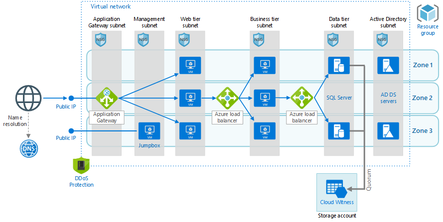

This reference architecture shows how to deploy virtual machines (VMs) and a virtual network configured for an [N-tier](../../guide/architecture-styles/n-tier.yml) application, using SQL Server on Windows for the data tier.

## Architecture

[](./images/n-tier-sql-server.png)

*Download a [Visio file][visio-download] of this architecture.*

### Workflow

The architecture has the following components.

#### General

- **Resource group**. [Resource groups][resource-manager-overview] are used to group Azure resources so they can be managed by lifetime, owner, or other criteria.

- **Availability zones**. [Availability zones](/azure/availability-zones/az-overview) are physical locations within an Azure region. Each zone consists of one or more datacenters with independent power, cooling, and networking. By placing VMs across zones, the application becomes resilient to failures within a zone.

#### Networking and load balancing

- **Virtual network and subnets**. Every Azure VM is deployed into a virtual network that can be segmented into subnets. Create a separate subnet for each tier.

- **Application gateway**. [Application Gateway](/azure/application-gateway/) is a layer 7 load balancer. In this architecture, it routes HTTP requests to the web front end. Application Gateway also provides a [web application firewall](/azure/application-gateway/waf-overview) (WAF) that protects the application from common exploits and vulnerabilities.

- **Load balancers**. Use [Azure Standard Load Balancer][load-balancer] to distribute network traffic from the web tier to the business tier, and from the business tier to SQL Server.

- **Network security groups** (NSGs). Use [NSGs][nsg] to restrict network traffic within the virtual network. For example, in the three-tier architecture shown here, the database tier does not accept traffic from the web front end, only from the business tier and the management subnet.

- **DDoS Protection**. Although the Azure platform provides basic protection against distributed denial of service (DDoS) attacks, we recommend using [Azure DDoS Network Protection][ddos], which has enhanced DDoS mitigation features. See the [Security considerations](#security).

- **Azure DNS**. [Azure DNS][azure-dns] is a hosting service for DNS domains. It provides name resolution using Microsoft Azure infrastructure. By hosting your domains in Azure, you can manage your DNS records using the same credentials, APIs, tools, and billing as your other Azure services.

#### Virtual machines

- **SQL Server Always On Availability Group**. Provides high availability at the data tier, by enabling replication and failover. It uses Windows Server Failover Cluster (WSFC) technology for failover.

- **Active Directory Domain Services (AD DS) Servers**. The computer objects for the failover cluster and its associated clustered roles are created in Active Directory Domain Services (AD DS).

- **Cloud Witness**. A failover cluster requires more than half of its nodes to be running, which is known as having quorum. If the cluster has just two nodes, a network partition could cause each node to think it's the primary node. In that case, you need a *witness* to break ties and establish quorum. A witness is a resource such as a shared disk that can act as a tie breaker to establish quorum. Cloud Witness is a type of witness that uses Azure Blob Storage. To learn more about the concept of quorum, see [Understanding cluster and pool quorum](/windows-server/storage/storage-spaces/understand-quorum). For more information about Cloud Witness, see [Deploy a Cloud Witness for a Failover Cluster](/windows-server/failover-clustering/deploy-cloud-witness).

- **Jumpbox**. Also called a [bastion host]. Traditionally, a secure VM on the network that administrators use to connect to the other VMs. The jumpbox has an NSG that allows remote traffic only from public IP addresses on a safe list. The NSG should permit Remote Desktop Protocol (RDP) traffic. Azure offers the managed solution [Azure Bastion](/azure/bastion/bastion-overview) to meet this need.

## Recommendations

Your requirements might differ from the architecture described here. Use these recommendations as a starting point.

<!-- markdownlint-disable MD024 -->

### Virtual machines

For recommendations on configuring the VMs, see [Run a Windows VM on Azure](./windows-vm.yml).

### Virtual network

When you create the virtual network, determine how many IP addresses your resources in each subnet require. Specify a subnet mask and a network address range large enough for the required IP addresses, using [CIDR] notation. Use an address space that falls within the standard [private IP address blocks][private-ip-space], which are 10.0.0.0/8, 172.16.0.0/12, and 192.168.0.0/16.

Choose an address range that does not overlap with your on-premises network, in case you need to set up a gateway between the virtual network and your on-premises network later. Once you create the virtual network, you can't change the address range.

Design subnets with functionality and security requirements in mind. All VMs within the same tier or role should go into the same subnet, which can be a security boundary. For more information about designing virtual networks and subnets, see [Plan and design Azure Virtual Networks][plan-network].

### Application Gateway

For information about configuring Application Gateway, see [Application Gateway configuration overview](/azure/application-gateway/configuration-overview).

### Load balancers

Don't expose the VMs directly to the Internet, but instead give each VM a private IP address. Clients connect using the public IP address associated with the Application Gateway.

Define load balancer rules to direct network traffic to the VMs. For example, to enable HTTP traffic, map port 80 from the front-end configuration to port 80 on the back-end address pool. When a client sends an HTTP request to port 80, the load balancer selects a back-end IP address by using a [hashing algorithm][load-balancer-hashing] that includes the source IP address. Client requests are distributed across all the VMs in the back-end address pool.

### Network security groups

Use NSG rules to restrict traffic between tiers. In the three-tier architecture shown above, the web tier does not communicate directly with the database tier. To enforce this rule, the database tier should block incoming traffic from the web tier subnet.

1. Deny all inbound traffic from the virtual network. (Use the `VIRTUAL_NETWORK` tag in the rule.)
2. Allow inbound traffic from the business tier subnet.
3. Allow inbound traffic from the database tier subnet itself. This rule allows communication between the database VMs, which is needed for database replication and failover.
4. Allow RDP traffic (port 3389) from the jumpbox subnet. This rule lets administrators connect to the database tier from the jumpbox.

Create rules 2 &ndash; 4 with higher priority than the first rule, so they override it.

### SQL Server Always On Availability Groups

We recommend [Always On Availability Groups][sql-alwayson] for SQL Server high availability. Prior to Windows Server 2016, Always On Availability Groups require a domain controller, and all nodes in the availability group must be in the same AD domain.

Other tiers connect to the database through an [availability group listener][sql-alwayson-listeners]. The listener enables a SQL client to connect without knowing the name of the physical instance of SQL Server. VMs that access the database must be joined to the domain. The client (in this case, another tier) uses DNS to resolve the listener's virtual network name into IP addresses.

Configure the SQL Server Always On Availability Group as follows:

1. Create a Windows Server Failover Clustering (WSFC) cluster, a SQL Server Always On Availability Group, and a primary replica. For more information, see [Getting Started with Always On Availability Groups][sql-alwayson-getting-started].
2. Create an internal load balancer with a static private IP address.
3. Create an availability group listener, and map the listener's DNS name to the IP address of an internal load balancer.
4. Create a load balancer rule for the SQL Server listening port (TCP port 1433 by default). The load balancer rule must enable *floating IP*, also called Direct Server Return. This causes the VM to reply directly to the client, which enables a direct connection to the primary replica.

   > [!NOTE]
   > When floating IP is enabled, the front-end port number must be the same as the back-end port number in the load balancer rule.
   >

When a SQL client tries to connect, the load balancer routes the connection request to the primary replica. If there is a failover to another replica, the load balancer automatically routes new requests to a new primary replica. For more information, see [Configure an ILB listener for SQL Server Always On Availability Groups][sql-alwayson-ilb].

During a failover, existing client connections are closed. After the failover completes, new connections will be routed to the new primary replica.

If your application makes significantly more reads than writes, you can offload some of the read-only queries to a secondary replica. See [Using a Listener to Connect to a Read-Only Secondary Replica (Read-Only Routing)][sql-alwayson-read-only-routing].

Test your deployment by [forcing a manual failover][sql-alwayson-force-failover] of the availability group.

### Jumpbox

When you run virtual machines in a private virtual network, as in this architecture, there's a need to access virtual machines for software installation, patching, and so on. But, making these machines accessible to the public internet isn't a good idea because it increases the attack surface significantly. Instead, a jumpbox is used as a middle access layer.

In the past, a VM that's managed by the customer might be used as a jumpbox. In that scenario, the following recommendations apply:

- Don't allow RDP access from the public internet to the VMs that run the application workload. Instead, all RDP access to these VMs should go through the jumpbox. An administrator logs in to the jumpbox and then logs in to the other VM from the jumpbox. The jumpbox allows RDP traffic from the internet, but only from known, safe IP addresses.
- The jumpbox has minimal performance requirements, so select a small VM size. Create a [public IP address] for the jumpbox. Place the jumpbox in the same virtual network as the other VMs, but in a separate management subnet.
- To secure the jumpbox, add an NSG rule that allows RDP connections only from a safe set of public IP addresses. Configure the NSGs for the other subnets to allow RDP traffic from the management subnet.

For a customer-managed VM, all these rules apply. However, the current recommendation is to use [Azure Bastion](/azure/bastion/bastion-overview), a managed jumpbox solution that allows for HTML5 access to RDP or SSH behind Azure AD protection. This is a much simpler solution that ultimately has a lower total cost of ownership (TCO) for the customer.

## Considerations

### Scalability

#### Scale sets

For the web and business tiers, consider using [Virtual Machine Scale Sets][vmss] instead of deploying separate VMs. A scale set makes it easy to deploy and manage a set of identical VMs, and autoscale the VMs based on performance metrics. As the load on the VMs increases, additional VMs are automatically added to the load balancer. Consider scale sets if you need to quickly scale out VMs, or need to autoscale.

There are two basic ways to configure VMs deployed in a scale set:

- Use extensions to configure the VM after it's deployed. With this approach, new VM instances may take longer to start up than a VM with no extensions.

- Deploy a [managed disk](/azure/storage/storage-managed-disks-overview) with a custom disk image. This option may be quicker to deploy. However, it requires you to keep the image up-to-date.

For more information, see [Design considerations for scale sets][vmss-design].

> [!TIP]
> When using any autoscale solution, test it with production-level workloads well in advance.

#### Subscription limits

Each Azure subscription has default limits in place, including a maximum number of VMs per region. You can increase the limit by filing a support request. For more information, see [Azure subscription and service limits, quotas, and constraints][subscription-limits].

#### Application Gateway

Application Gateway supports fixed capacity mode or autoscaling mode. Fixed capacity mode is useful for scenarios with consistent and predictable workloads. Consider using autoscaling mode for workloads with variable traffic. For more information, see [Autoscaling and Zone-redundant Application Gateway v2][app-gw-scaling]

### Availability

Availability zones provide the best resiliency within a single region. If you need even higher availability, consider replicating the application across two regions, using Azure Traffic Manager for failover. For more information, see [Multi-region N-tier application for high availability][multi-dc].

Not all regions support availability zones, and not all VM sizes are supported in all zones. Run the following Azure CLI command to find the supported zones for each VM size within a region:

```bash
az vm list-skus --resource-type virtualMachines --zone false --location <location> \
    --query "[].{Name:name, Zones:locationInfo[].zones[] | join(','@)}" -o table
```

If you deploy this architecture to a region that does not support availability zones, put the VMs for each tier inside an *availability set*. VMs within the same availability set are deployed across multiple physical servers, compute racks, storage units, and network switches for redundancy. Scale sets automatically use *placement groups*, which act as an implicit availability set.

When deploying to availability zones, use the Standard SKU of Azure Load Balancer and the v2 SKU of Application Gateway. These SKUs support cross-zone redundancy. For more information, see:

- [Standard Load Balancer and Availability Zones](/azure/load-balancer/load-balancer-standard-availability-zones)
- [Autoscaling and Zone-redundant Application Gateway v2][app-gw-scaling]
- [How does Application Gateway support high availability and scalability?](/azure/application-gateway/application-gateway-faq#how-does-application-gateway-support-high-availability-and-scalability)

A single Application Gateway deployment can run multiple instances of the gateway. For production workloads, run at least two instances.

#### Health probes

Application Gateway and Load Balancer both use health probes to monitor the availability of VM instances.

- Application Gateway always uses an HTTP probe.
- Load Balancer can test either HTTP or TCP. Generally, if a VM runs an HTTP server, use an HTTP probe. Otherwise, use TCP.

If a probe can't reach an instance within a timeout period, the gateway or load balancer stops sending traffic to that VM. The probe continues to check and will return the VM to the back-end pool if the VM becomes available again.

HTTP probes send an HTTP GET request to a specified path and listen for an HTTP 200 response. This path can be the root path ("/"), or a health-monitoring endpoint that implements some custom logic to check the health of the application. The endpoint must allow anonymous HTTP requests.

For more information about health probes, see:

- [Load Balancer health probes](/azure/load-balancer/load-balancer-custom-probe-overview)
- [Application Gateway health monitoring overview](/azure/application-gateway/application-gateway-probe-overview)

For considerations about designing a health probe endpoint, see [Health Endpoint Monitoring pattern](../../patterns/health-endpoint-monitoring.yml).

### Cost optimization

Use the [Azure Pricing Calculator][azure-pricing-calculator] to estimates costs. Here are some other considerations.

#### Virtual machine scale sets

Virtual machine scale sets are available on all Windows VM sizes. You are only charged for the Azure VMs you deploy and any additional underlying infrastructure resources consumed such as storage and networking. There are no incremental charges for the Virtual Machine Scale Sets service.

For single VMs pricing options See [Windows VMs pricing][Windows-vm-pricing]

#### SQL server

If you choose Azure SQL DBaas, you can save on cost because don't need to configure an Always On Availability Group and domain controller machines. There are several deployment options starting from single database up to managed instance, or elastic pools. For more information see [Azure SQL pricing](https://azure.microsoft.com/pricing/details/sql-database/managed/).

For SQL server VMs pricing options see [SQL VMs pricing][Managed-Sql-pricing].

#### Load balancers

You are charged only for the number of configured load-balancing and outbound rules. Inbound NAT rules are free. There is no hourly charge for the Standard Load Balancer when no rules are configured.

For more information, see the cost section in [Microsoft Azure Well-Architected Framework][WAF-cost].

### Security

Virtual networks are a traffic isolation boundary in Azure. By default, VMs in one virtual network can't communicate directly with VMs in a different virtual network. However, you can explicitly connect virtual networks by using [virtual network peering](/azure/virtual-network/virtual-network-peering-overview).

**NSGs**. Use [network security groups][nsg] (NSGs) to restrict traffic to and from the internet. For more information, see [Microsoft cloud services and network security][network-security].

**DMZ**. Consider adding a network virtual appliance (NVA) to create a DMZ between the Internet and the Azure virtual network. NVA is a generic term for a virtual appliance that can perform network-related tasks, such as firewall, packet inspection, auditing, and custom routing. For more information, see [Implementing a DMZ between Azure and the Internet][dmz].

**Encryption**. Encrypt sensitive data at rest and use [Azure Key Vault][azure-key-vault] to manage the database encryption keys. Key Vault can store encryption keys in hardware security modules (HSMs). For more information, see [Configure Azure Key Vault Integration for SQL Server on Azure VMs][sql-keyvault]. It's also recommended to store application secrets, such as database connection strings, in Key Vault.

**DDoS protection**. The Azure platform provides basic DDoS protection by default. This basic protection is targeted at protecting the Azure infrastructure as a whole. Although basic DDoS protection is automatically enabled, we recommend using [Azure DDoS Network Protection][ddos]. Network Protection uses adaptive tuning, based on your application's network traffic patterns, to detect threats. This allows it to apply mitigations against DDoS attacks that might go unnoticed by the infrastructure-wide DDoS policies. Network Protection also provides alerting, telemetry, and analytics through Azure Monitor. For more information, see [Azure DDoS Protection: Best practices and reference architectures][ddos-best-practices].

### Operational excellence

Since all the main resources and their dependencies are in the same virtual network in this architecture, they are isolated in the same basic workload. That fact makes it easier to associate the workload's specific resources to a team, so that the team can independently manage all aspects of those resources. This isolation enables DevOps to perform continuous integration and continuous delivery (CI/CD).

Also, you can use different deployment templates and integrate them with [Azure DevOps Services][az-devops] to provision different environments in minutes, for example to replicate production like scenarios or load testing environments only when needed, saving cost.

In this scenario, your virtual machines are configured by using Virtual Machine Extensions, since they offer the possibility of installing certain additional software, such as anti malware and security agents. VM Extensions are installed and executed only at VM creation time. That means if the Operating System gets configured incorrectly at a later stage, it will require a manual intervention to move it back to its correct state.

Configuration Management Tools, in particular Desired State Configuration (DSC), are used in this architecture to configure Active Directory and a SQL Server Always On Availability Group.

Consider using the [Azure Monitor][azure-monitor] to Analyze and optimize the performance of your infrastructure, Monitor and diagnose networking issues without logging into your virtual machines. Application Insights is actually one of the components of Azure Monitor, which gives you rich metrics and logs to verify the state of your complete Azure landscape. Azure Monitor will help you to follow the state of your infrastructure.

Make sure not only to monitor your compute elements supporting your application code, but your data platform as well, in particular your databases, since a low performance of the data tier of an application could have serious consequences.

In order to test the Azure environment where the applications are running, it should be version-controlled and deployed through the same mechanisms as application code, then it can be tested and validated using DevOps testing paradigms too.

For more information, see the Operational Excellence section in [Azure Well-Architected Framework][WAF-devops].

## Next steps

- [Microsoft Learn module: Tour the N-tier architecture style](/training/modules/n-tier-architecture/)

<!-- links -->

[az-devops]: /azure/virtual-machines/windows/infrastructure-automation#azure-devops-services
[azure-monitor]: https://azure.microsoft.com/services/monitor/
[Azure-SQl-Pricing]: https://azure.microsoft.com/pricing/details/sql-database/managed/
[app-gw-scaling]: /azure/application-gateway/application-gateway-autoscaling-zone-redundant
[azure-dns]: /azure/dns/dns-overview
[azure-key-vault]: https://azure.microsoft.com/services/key-vault
[bastion host]: https://en.wikipedia.org/wiki/Bastion_host
[cidr]: https://en.wikipedia.org/wiki/Classless_Inter-Domain_Routing
[azure-pricing-calculator]: https://azure.microsoft.com/pricing/calculator
[ddos-best-practices]: /azure/security/fundamentals/ddos-best-practices
[ddos]: /azure/virtual-network/ddos-protection-overview
[dmz]: ../dmz/secure-vnet-dmz.yml
[load-balancer-hashing]: /azure/load-balancer/components#load-balancing-rules
[load-balancer]: /azure/load-balancer/load-balancer-standard-overview
[multi-dc]: ./multi-region-sql-server.yml
[n-tier]: ../../guide/architecture-styles/n-tier.yml
[network-security]: /azure/best-practices-network-security
[nsg]: /azure/virtual-network/virtual-networks-nsg
[plan-network]: /azure/virtual-network/virtual-network-vnet-plan-design-arm
[private-ip-space]: https://en.wikipedia.org/wiki/Private_network#Private_IPv4_address_spaces
[public IP address]: /azure/virtual-network/virtual-network-ip-addresses-overview-arm
[resource-manager-overview]: /azure/azure-resource-manager/resource-group-overview
[sql-alwayson-force-failover]: /sql/database-engine/availability-groups/windows/perform-a-forced-manual-failover-of-an-availability-group-sql-server?view=sql-server-ver15&preserve-view=true
[sql-alwayson-getting-started]: /sql/database-engine/availability-groups/windows/getting-started-with-always-on-availability-groups-sql-server?view=sql-server-ver15&preserve-view=true
[sql-alwayson-ilb]: /azure/azure-sql/virtual-machines/windows/availability-group-load-balancer-portal-configure
[sql-alwayson-listeners]: /sql/database-engine/availability-groups/windows/listeners-client-connectivity-application-failover?view=sql-server-ver15&preserve-view=true
[sql-alwayson-read-only-routing]: /sql/database-engine/availability-groups/windows/listeners-client-connectivity-application-failover?view=sql-server-ver15&preserve-view=true#ConnectToSecondary
[sql-alwayson]: /sql/database-engine/availability-groups/windows/always-on-availability-groups-sql-server?view=sql-server-ver15&preserve-view=true
[sql-keyvault]: /azure/azure-sql/virtual-machines/windows/azure-key-vault-integration-configure
[Managed-Sql-pricing]: https://azure.microsoft.com/pricing/details/sql-database/managed
[subscription-limits]: /azure/azure-subscription-service-limits
[visio-download]: https://arch-center.azureedge.net/vm-reference-architectures.vsdx
[vmss-design]: /azure/virtual-machine-scale-sets/virtual-machine-scale-sets-design-overview
[vmss]: /azure/virtual-machine-scale-sets/virtual-machine-scale-sets-overview
[Windows-vm-pricing]: https://azure.microsoft.com/pricing/details/virtual-machines/windows
[WAF-devops]: /azure/architecture/framework/devops/overview
[WAF-cost]: /azure/architecture/framework/cost/overview
