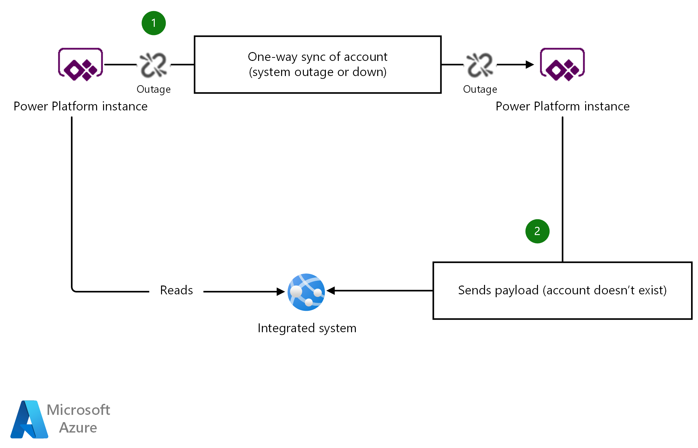

This article outlines a scenario in which a hypothetical US-based customer, Contoso, has recently acquired another company based in Europe and is in the process of integrating business systems between the two companies.  As part of this integration, the two CRM/ERP systems must keep their Dynamics 365 Dataverse entities in sync until they can be fully integrated.  A Conotso propietary line-of-business (LOB) app consumes data from both systems and must be able to accept requests when the data is awaiting sychronization or when it is missing. The following design shows how an upsert can be used to build eventual consistency between Power Platform instances.

## Potential use cases

This pattern can be useful in the following situations:

- The system that sends reference data is down.
- The synchronization of data takes a long time or the process is delayed.
- Consuming systems have no logic on the creation of the entity being created.

## Scenario details

In order for Contoso's new European subsidiary to be integrated into Conotos's business structure,they must synchronize accounts and contacts from one instance of Power Platform to another. In this scenario, the US instance of Power Platform synchronizes data via a Logic App to the European instance. It then sends a payload with unique identifiers or alternate keys to the European instance. A propietary Contoso LOB app reads user data from the US instance and then sends a payload with unique identifiers or alternate keys to the Europe instance. When the Europe instance does not have the data due to downtime, maintenance or another communications issue, the user receives a bad request because the entity with that record does not exist.

The following examples show the potential journeys for a record submission.

**Example 1 - Successful path with no outage or transient errors**

*Download a [Visio file](https://arch-center.azureedge.net/data-dependent-example.vsdx) of this architecture.*

1. The **US Instance** synchronizes a new account to the **Europe Instance** via a Logic App. All are working because no transient faults or outages have occurred.
2. The Contoso LOB app reads the master accounts from the **US Instance** and intends to submit an API call that references an account that was replicated to the **Europe Instance**. It works because everything was up and no outages or transient faults occurred. An HTTP status of 204 is returned.

**Example 2 - Unsuccessful path where sync is down or delayed**

*Download a [Visio file](https://arch-center.azureedge.net/data-dependent-example-fails.vsdx) of this architecture.*

1. The **US Instance** attempts to synchronize a new account to the **Europe Instance** via a Logic App. The **Europe Instance** is unreachable, due to downtime or upgrade.
2. The Contoso LOB app reads the master accounts from the **US Instance** and intends to submit an API call that references an account that was not replicated to the **Europe Instance**. The API call fails because the account with the given identifier was not created in the **Europe Instance**.

## Solution

### Plugin/flow to always upsert based on the GUID or alternate key

This can be performed in a number of plugin steps, within the plugin lifecycle. When the entity that you are creating is mandatory, use the PreValidation step. PreValidation happens before any database transactions are started. It is the preferred option, if the field is mandatory. However, in some scenarios, a PreCreate plugin step will suffice.

*Download a [Visio file](https://arch-center.azureedge.net/solution.vsdx) of this architecture.*

1. The **US Instance** attempts to synchronize a new account to the **Europe Instance** via a Logic App. The **Europe Instance** is unreachable, due to downtime or upgrade.
2. The Contoso LOB app reads the master accounts from the **US Instance**. It intends to submit an API call that references an account that was not replicated to the **Europe Instance**. As it stands, the API call will fail because the record does not exist, due to the sync not working.
3. A PreValidation/PreCreate plugin performs an upsert on the GUID (updating only the ID and setting the name, if it does not exist). If it exists already, then nothing is changed. If it does not exist, a new account is created (with most of the fields blank).
4. The API call succeeds because the account with the given ID exists in the system. The plugin intercepted the operation and handled the missing record gracefully.

>[!NOTE]
> Microsoft recommends introducing a circuit breaker pattern to back off and retry as part of this solution. For more information about using a circuit breaker, see [Circuit Breaker Pattern](/azure/architecture/patterns/circuit-breaker).

## Replication technologies

The scenario described above utilizes a Logic App as a replication method, but there are multiple ways to replicate data between Dataverse instances, which include but are not limited to:

- Logic Apps
- Function apps in Azure Functions
- Azure Data Factory
- Azure Synapse Analytics
- Power Automate

## Issues and considerations

Consider the impact of any business logic on an entity that is not hydrated yet. Consider a scenario where the entity is not fully hydrated and synchronized yet. Some of the properties will be null, so you need to ensure that any decisions on the data are factored in when using this approach. You may receive a `NullReferenceException` error. 

## When to use this approach

Use this approach in the following scenarios:

- You want to guarantee a record with a given key exists and do not care that the record is not fully hydrated.
- You must accept creation, even if the data is still not synchronized.

This pattern may not be suitable in the following scenario:

- Logic is applied when the record is created. Because the data won't be hydrated, it's not safe to rely on certain properties being available.

## Next steps

- [Power Platform](/power-platform)
- [What is Power Apps?](/powerapps/powerapps-overview)
- [App Service overview](/rest/api/appservice/web-apps)
- [What is Azure Logic Apps?](/azure/logic-apps)
- [Get started with Power Automate](/power-automate/getting-started)

## Related resources

Related architectures:

- [CI/CD for Microsoft Power Platform](/azure/architecture/solution-ideas/articles/azure-devops-continuous-integration-for-power-platform)
- [Citizen AI with the Power Platform](/azure/architecture/example-scenario/ai/citizen-ai-power-platform)
- [Power Automate deployment at scale](/azure/architecture/example-scenario/power-automate/power-automate)

Guidance for Web development:

- [Ten design principles for Azure applications](/azure/architecture/guide/design-principles)
- [Design and implementation patterns](/azure/architecture/patterns/category/design-implementation)
- [App Service deployment best practices](/azure/app-service/deploy-best-practices?toc=/azure/architecture/toc.json&bc=/azure/architecture/_bread/toc.json) 
- [Microsoft Azure Well-Architected Framework](/azure/architecture/framework)
