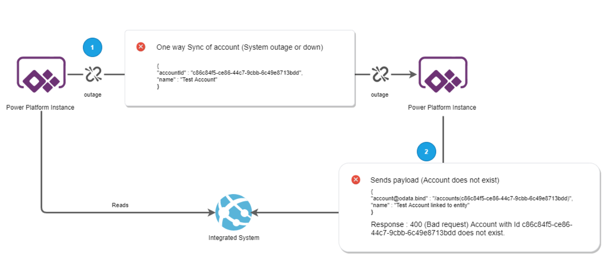

# Eventual Consistency in Power Platform

Strategically create data using an upsert to allow systems to synchronise data. Guarantee that the consuming application will be able to accept requests when the data is awaiting synchronisation or missing.

This pattern can be useful in situations when:
- The system that sends reference data is down.
- The synchronisation of data takes a long time or the process is delayed.
- Consuming systems have no logic on the creation of the entity being created. 

## Context and problem

In many modern applications it is vital to consider and implement fault tolerance. In certain situations you may synchronise accounts and contacts for example from one instance of power platform to another. Suppose you have two instances of Dynamics 365 and "Instance A" synchronises data to "Instance B", and another system which reads data from "Instance A" and sends a payload with unique identifiers or alternate keys to "Instance B". When "Instance B" does not have the data, the user will receive a bad request as the entity with that record does not exist.

The following examples show the potential journies for a record submission. 

**Example 1** - Happy path and all working as expected.

**Example 2** - Unhappy path where sync is down or delayed

## Solution

There are a number of possible solutions to this, but not limited to:
- Pre-Validation Plugin to always Upsert based on the Guid or Alternate key. Pre-Validation happens before any database transactions are started.
- Custom Process to integrate and pre-create the record before hitting Dynamics 365.

## Issues and considerations

- Consider the impact of any business logic on an entity that is not hydrated yet.
- Consider when the data synchronisation is controlled by another team.

## When to use this approach

Use this pattern when you:

- You want to guarantee a record with a given key exists and do not care that the record is not fully hydrated.
- You must accept creation even if the data is still not synchronised.

This pattern may not be suitable:

- When logic is applied on creation of the record being created. As the data will not be hydrated, it is not safe to rely on certain properties being available.

