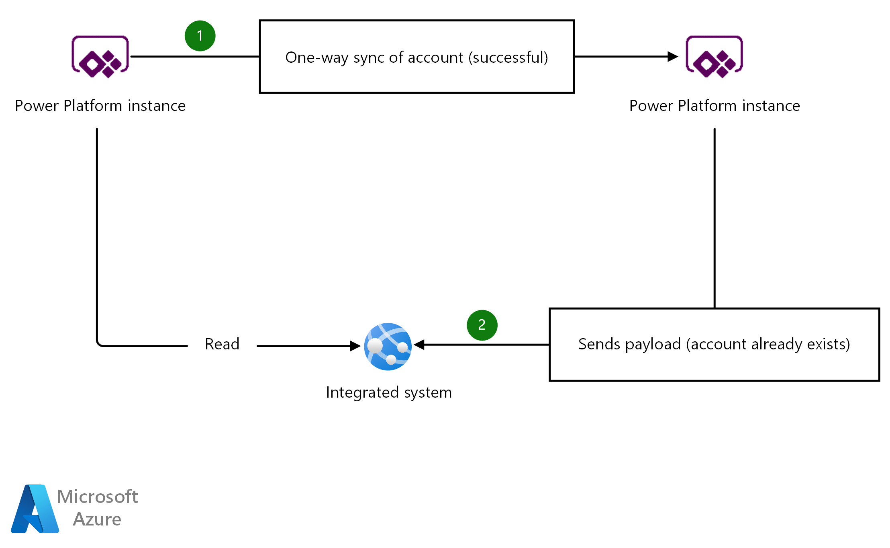
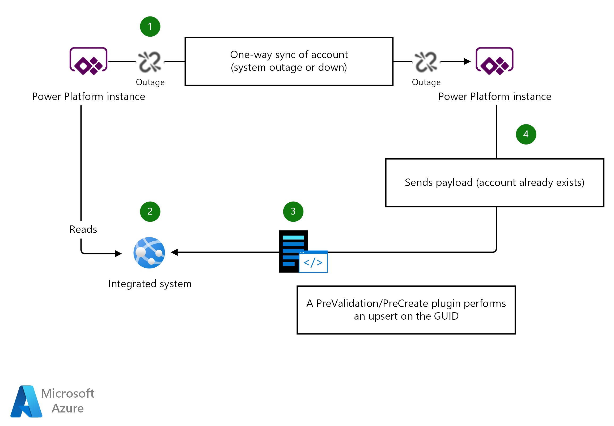

# Eventual Consistency in Power Platform

Strategically create data using an upsert to allow systems to synchronise data. Guarantee that the consuming application will be able to accept requests when the data is awaiting synchronisation or missing.

This pattern can be useful in situations when:
- The system that sends reference data is down.
- The synchronisation of data takes a long time or the process is delayed.
- Consuming systems have no logic on the creation of the entity being created. 

## Context and problem

In many modern applications it is vital to consider and implement fault tolerance. In certain situations you may synchronise accounts and contacts for example from one instance of power platform to another. Suppose you have two instances of Power Platform and "Instance A" synchronises data to "Instance B", and another system which reads data from "Instance A" and sends a payload with unique identifiers or alternate keys to "Instance B". When "Instance B" does not have the data, the user will receive a bad request as the entity with that record does not exist.

The following examples show the potential journeys for a record submission. 

**Example 1 - Successful path with no outage or transient errors.**

1. **Instance A** synchronises a new account to **Instance B**. All is working as no transient faults or outages have occured.
2. An integrated system reads the master accounts from **Instance A** and intends to submit an api call that references an account that was replicated to **Instance B**. It works because everything was up and no outages or transient faults occurred. A HTTP status of 204 is returned.

**Example 2 - Unsuccessful path where sync is down or delayed**

1. **Instance A** attempts to synchronise a new account to **Instance B**. **Instance B** is unreachable due to downtime or upgrade
2. An integrated system reads the master accounts from **Instance A** and intends to submit an api call that references an account that was not replicated to **Instance B**. The API call fails because the account with the given identifier was not created in **Instance B**. 

## Solutions

#### Plugin / Flow to always Upsert based on the Guid or Alternate key. 
This can be performed in a number of plugin steps within the plugin lifecycle. When the entity that you are creating is mandatory then using the Pre Validation step is advised. Pre-Validation happens before any database transactions are started so it is the preferred option if the field is mandatory. However in some scenarios a pre creation plugin step will suffice.

1. **Instance A** attempts to synchronise a new account to **Instance B**. **Instance B** is unreachable due to downtime or upgrade
2. An integrated system reads the master accounts from **Instance A** and intends to submit an api call that references an account that was not replicated to **Instance B**. As it stands the API call will fail because the record does not exist due to the Sync not working.
3. A Pre Validation / Pre Create Plugin performs an upsert on the guid (Updating only the Id and setting the name if it does not exist) if it exists already nothing is changed, if it does not exist a new account will be created (With most of the fields blank)
4. The API call succeeds as the Account with the given Id exists in the system as the plugin intercepted the operation and handled the missing record gracefully.

#### Circuit Breaker
Introduce a circuit breaker pattern (Out of scope for this document) to back off and retry. For more information on circuit breaker, please refer to [Circuit Breaker Pattern](https://docs.microsoft.com/en-us/azure/architecture/patterns/circuit-breaker)

## Issues and considerations

Consider the impact of any business logic on an entity that is not hydrated yet. Consider a scenario where the entity is not fully hydrated and sychronised yet, some of the properties will be null so you need to ensure any decisions on the data are factored in when using this approach, You may receive a NullReferenceException. 

## When to use this approach

Use this approach when you:

- You want to guarantee a record with a given key exists and do not care that the record is not fully hydrated.
- You must accept creation even if the data is still not synchronised.

This pattern may not be suitable:

- When logic is applied on creation of the record being created. As the data will not be hydrated, it is not safe to rely on certain properties being available.

