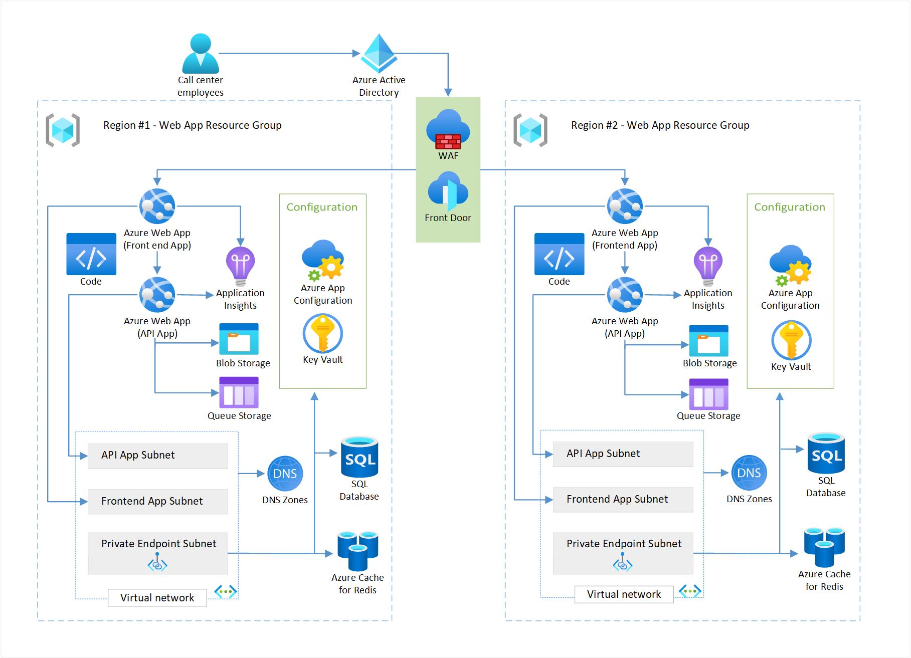
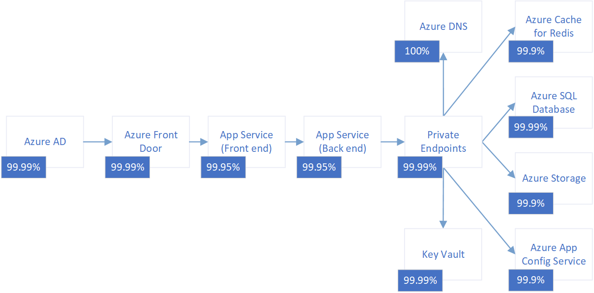

---
ms.custom:
  - devx-track-dotnet
---

The reliable web app pattern is how you should update web apps moving to the cloud. The reliable web app pattern defines the implementation guidance you need to re-platform web apps the right way.

There are two articles on the reliable web app pattern for .NET. This article explains important decisions to plan the implementation of the pattern. The companion provides code and architecture guidance to [apply the pattern](apply-pattern.yml). There's a [reference implementation](https://aka.ms/eap/rwa/dotnet) (sample web app) of the pattern that you can deploy.

## Architecture

Your business context, existing web app, and service level objective (SLO) affect the architecture of your web app. The reference implementation needed a multi-region deployment to meet stated objectives (*see figure 1*).

*Figure 1. Target reference implementation architecture. Download a [Visio file](https://arch-center.azureedge.net/reliable-web-app-dotnet.vsdx) of this architecture. See [Production environment](https://azure.com/e/26f1165c5e9344a4bf814cfe6c85ed8d) and [Nonproduction environment](https://azure.com/e/8a574d4811a74928b55956838db71093) for an estimated cost.*

The following table lists the principles of the reliable web app pattern and implementation details.

| Reliable web app pattern principles | Implementation details |
| --- | --- |
| *Reliable web app pattern principles:* ▪ Minimal code changes ▪ Reliability design patterns ▪ Managed services  *Well Architected Framework principles:* ▪ Cost optimized ▪ Observable ▪ Ingress secure ▪ Infrastructure as code ▪ Identity-centric security|▪ Retry pattern   ▪ Circuit-breaker pattern  ▪ Cache-aside pattern  ▪ Rightsized resources  ▪ Managed identities  ▪ Private endpoints  ▪ Secrets management  ▪ Bicep deployment  ▪ Telemetry, logging, monitoring |

## Business context

The implementation guidance mirrors the cloud journey of a fictional company called Relecloud. The goal is to meet increasing business demand with minimal investments in the existing monolithic app. Traffic to the on-premises application has increased due to increased sales. Relecloud expects the demand to continue to increase.

The on-premises infrastructure doesn't provide a cost-efficient means to scale. The company decided that a migration to the cloud offered the best return on investment to meet their short and long-term goals.

| Short-term app goals | Long-term app goals |
| --- | --- |
| ▪ Apply low-cost, high-value code changes ▪ Reach a service level objective of 99.9% ▪ Adopt DevOps practices ▪ Create cost-optimized environments  ▪ Improve reliability and security|▪ Expose the application customers ▪ Develop web and mobile experiences ▪ Improve availability  ▪ Expedite new feature delivery ▪ Scale components based on traffic.

## On-premises context

The on-premises starting point is an ASP.NET monolithic web app. It's an eCommerce, line-of-business web application that runs on two virtual machines. It also has a Microsoft SQL Server database. The web application is employee-facing. The only application users are Relecloud's call center employees. Relecloud employees use the application to buy tickets on behalf of Relecloud customers. The on-premises web application suffers from common challenges. These challenges include extended timelines to build and ship new features difficulty scaling different components of the application under a higher load.

## Service level objective

A service level objective (SLO) for availability defines how available you want a web app to be for users. Relecloud has a target SLO of 99.9% for availability. You need to define what it means to be available for your web application. For Relecloud, the web app is available when call center employees can purchase tickets 99.9% of the time. When you have a definition of *available*, list all the dependencies on the critical path of availability. Dependencies should include Azure services and third-party solutions.

For each dependency in the critical path, you need to assign an availability goal. Service level agreements (SLAs) from Azure provide a good starting point. SLAs don't factor in (1) downtime that's associated with the application code running on the services (2) deployment and operation methodologies, (3) architecture choices to connect the services. The availability metric you assign to a dependency shouldn't exceed the SLA.

Relecloud used Azure SLAs for Azure services. The following diagram illustrates Relecloud's dependency list with availability goals for each dependency.

*Azure SLAs are subject to change. The SLAs shown here are examples used to illustrate the process of estimating composite availability. For information, see [SLAs for Online Services](https://www.microsoft.com/licensing/docs/view/Service-Level-Agreements-SLA-for-Online-Services).*

Finally, use the formulas for composite SLAs and multi-region availability to estimate the composite availability of the dependencies on the critical path. This number should meet or exceed your SLO. Relecloud needed a multi-region architecture to meet the 99.9% SLO. For more information, see:

- [Composite SLA formula](/azure/architecture/framework/resiliency/business-metrics#composite-slas)
- [Multiregional SLA formula](/azure/architecture/framework/resiliency/business-metrics#slas-for-multiregion-deployments)

## Choose the right services

The Azure services you choose should support your short-term objectives while preparing your application to meet any long-term goals. You should pick services that (1) meet the SLO for the production environment, (2) require minimal migration effort, and (3) support planned modernization efforts.

At this phase, it's important to select Azure services that mirror key on-premises choices to minimize the migration effort. For example, you should keep the same database engine (SQL Server -> Azure Database for PostgreSQL - Flexible Server) and app hosting platform (IIS on Windows Server -> Web Apps). Containerization of your application typically doesn't meet the short-term objectives of the reliable web app pattern, but the application platform you choose now should support containerization if that's a long-term goal.

### Application platform

[Azure App Service](/azure/app-service/overview) is an HTTP-based, managed service for hosting web applications, REST APIs, and mobile back ends. Azure has many viable compute options. For more information, see the [compute decision tree](/azure/architecture/guide/technology-choices/compute-decision-tree). The web app uses Azure App Service because it meets the following requirements:

- **High SLA.** It has a high SLA that meets the production environment SLO.
- **Reduced management overhead.** It's a fully managed solution that handles scaling, health checks, and load balancing.
- **.NET support.** It supports the version of .NET that the application is written in.
- **Containerization capability.** The web app can converge on the cloud without containerizing, but the application platform also supports containerization without changing Azure services.
- **Autoscaling.** The web app can automatically scale up, down, in, and out based on user traffic and settings.

### Identity management

[Azure Active Directory (Azure AD)](/azure/active-directory/fundamentals/active-directory-whatis) is a cloud-based identity and access management service. It authenticates and authorizes users based on roles that integrate with our application. Azure AD provides the application with the following abilities:

- **Authentication and authorization.** The application needs to authenticate and authorize call center employees.
- **Scalable.** It scales to support larger scenarios.
- **User-identity control.** Call center employees can use their existing enterprise identities.
- **Support authorization protocols.** It supports OAuth 2.0 for managed identities and OpenID Connect for future B2C support.

### Database

[Azure SQL Database](/azure/azure-sql/azure-sql-iaas-vs-paas-what-is-overview?view=azuresql) is a general-purpose relational database and managed service in that supports relational and spatial data, JSON, spatial, and XML. The web app used SQL Server on-premises, and the team wants to use the existing database schema, stored procedures, and functions. Several SQL products are available on Azure, but the web app uses Azure SQL Database because it meets the following requirements:

- **Reliability.** The general-purpose tier provides a high SLA and multi-region redundancy. It can support a high user load.
- **Reduced management overhead.** It provides a managed SQL database instance.
- **Migration support.** It supports database migration from on-premises SQL Server.
- **Consistency with on-premises configurations.** It supports the existing stored procedures, functions, and views.
- **Resiliency.** It supports backups and point-in-time restore.
- **Expertise and minimal rework.** SQL Database takes advantage of in-house expertise and requires minimal rework.

### Application performance monitoring

[Application Insights](/azure/azure-monitor/app/app-insights-overview) is a feature of Azure Monitor that provides extensible application performance management (APM) and monitoring for live web apps. The web app uses Application Insights for the following reasons:

- **Anomaly detection.** It automatically detects performance anomalies.
- **Troubleshooting.** It helps you diagnose problems in the running app.
- **Telemetry.** It collects information about how users are using the app and allows you to easily track custom events.
- **Solving an on-premises visibility gap.** The on-premises solution didn't have APM. Application Insights provides easy integration with the application platform and code.

Azure Monitor is a comprehensive suite of monitoring tools that collect data from various Azure services. For more information, see:

- [Smart detection in Application Insights](/azure/azure-monitor/alerts/proactive-diagnostics)
- [Application Map: Triage distributed applications](/azure/azure-monitor/app/app-map?tabs=net)
- [Profile live App Service apps with Application Insights](/azure/azure-monitor/profiler/profiler)
- [Usage analysis with Application Insights](/azure/azure-monitor/app/usage-overview)
- [Get started with metrics explorer](/azure/azure-monitor/essentials/metrics-getting-started)
- [Application Insights Overview dashboard](/azure/azure-monitor/app/overview-dashboard)
- [Log queries in Azure Monitor](/azure/azure-monitor/logs/log-query-overview)

### Cache

[Azure Cache for Redis](/azure/azure-cache-for-redis/cache-overview) is a managed in-memory data store based on the Redis software. The web app's load is heavily skewed toward viewing concerts and venue details. It needs a cache that provides the following benefits:

- **Reduced management overhead.** It's a fully managed service.
- **Speed and volume.** It has high-data throughput and low latency reads for commonly accessed, slow changing data.
- **Diverse supportability.** It's a unified cache location for all instances of the web app to use.
- **Externalized.** The on-premises application servers performed VM-local caching. This setup didn't offload highly frequented data, and it couldn't invalidate data.
- **Non-sticky sessions.** Externalizing session state supports nonsticky sessions.

### Global load balancer

[Azure Front Door](/azure/frontdoor/front-door-overview) is a layer-7 global load balancer that uses the Azure backbone network to route traffic between regions. Relecloud needed to a multi-region architecture to meet their 99.9% SLO. They needed Front Door to provide layer-7 routing between regions. Front Door also provides extra features, such as Web Application Firewall, and positions Relecloud to use a content delivery network. The content delivery network provides site acceleration as the traffic to the web app increases. The web app uses Azure Front Door because it provides the following benefits:

- **Routing flexibility.** It allows the application team to configure ingress needs to support future changes in the application.
- **Traffic acceleration.** It uses anycast to reach the nearest Azure point of presence and find the fastest route to the web app.
- **Custom domains.** It supports custom domain names with flexible domain validation.
- **Health probes.** The application needs intelligent health probe monitoring. Azure Front Door uses responses from the probe to determine the best origin for routing client requests.
- **Monitoring support.** It supports built-in reports with an all-in-one dashboard for both Front Door and security patterns. You can configure alerts that integrate with Azure Monitor. It lets the application log each request and failed health probes.
- **DDoS protection.** It has built-in layer 3-4 DDoS protection.

Azure has several load balancers. Evaluate your current system capabilities and the requirements for the new app running on Azure, and then [choose the best load balancer for your app](/azure/architecture/guide/technology-choices/load-balancing-overview).

### Web Application Firewall

[Azure Web Application Firewall](/azure/web-application-firewall/overview) helps provide centralized protection of your web applications from common exploits and vulnerabilities. It's built into Azure Front Door and helps prevent malicious attacks close to the attack sources before they enter your virtual network. Web Application Firewall provides the following benefits:

- **Global protection.** It provides improved global web app protection without sacrificing performance.
- **Botnet protection.** The team can monitor and configure to address security concerns from botnets.
- **Parity with on-premises.** The service allows the team to maintain parity with the on-premises solution, which was running behind a web application firewall managed by IT.

### Configuration storage

[Azure App Configuration](/azure/azure-app-configuration/overview) is a service for centrally managing application settings and feature flags. The goal is to replace the file-based configuration with a central configuration store that integrates with the application platform and code. App Config provides the following benefits:

- **Flexibility.** It supports feature flags. Feature flags allow users to opt in and out of early preview features in a production environment without redeploying the app.
- **Supports Git pipeline.** The source of truth for configuration data needed to be a Git repository. The pipeline needed to update the data in the central configuration store.
- **Supports managed identities.** It supports managed identities to simplify and help secure the connection to the configuration store.

Review [App Configuration best practices](/azure/azure-app-configuration/howto-best-practices#app-configuration-bootstrap) to decide whether this service is a good fit for your app.

### Secrets manager

[Azure Key Vault](/azure/key-vault/general/overview) provides centralized storage of application secrets to control their distribution. It supports X.509 certificates, connection strings, and API keys to integrate with third-party services. Managed identities are the preferred solution for intra-Azure service communication, but the application still has secrets to manage. The on-premises web app stored secrets on-premises in code configuration files, but it's a better security practice to externalize secrets. The web app uses Key Vault because it provides the following features:

- **Encryption.** It supports encryption at rest and in transit.
- **Managed identities.** The application services can use managed identities to access the secret store.
- **Monitoring and logging.** It facilitates audit access and generates alerts when stored secrets change.
- **Certificate support.** It supports importing PFX and PEM certificates.
- **Integration.** It provides native integration with the Azure configuration store (App Configuration) and web hosting platform (App Service).

You can incorporate Key Vault in .NET apps by using the [ConfigurationBuilder object](/azure/azure-app-configuration/quickstart-dotnet-core-app).

### Object storage

[Azure Storage](/azure/storage/common/storage-introduction) provides file storage. Azure Blob Storage stores the resulting ticket images. On-premises, the web app had disk storage mounted to each web server, and the team wanted to use an external data storage solution.

For Blob Storage, the web app uses zone-redundant storage (ZRS). Zone-redundant storage replicates data synchronously across three Azure availability zones in the primary region. Each availability zone is in a separate physical location that has independent power, cooling, and networking. The app uses Blob Storage to meet the following requirements:

- **Eliminate anonymous access.** The web app can eliminate endpoints for accessing storage exposed to the public internet with anonymous access.
- **Encryption.** It encrypts data at rest and in transit.
- **Resiliency.** Blob Storage should make the ticketing images resilient against loss.

### Endpoint security

[Azure Private Link](/azure/private-link/private-link-overview) provides access to PaaS services (such as Azure Cache for Redis and SQL Database) over a private endpoint in your virtual network. Traffic between your virtual network and the service travels across the Microsoft backbone network. Azure DNS with Azure Private Link enables your solution to communicate via an enhanced security link with Azure services like SQL Database. The web app uses Private Link for these reasons:

- **Enhanced security communication.** It lets the application privately access services on the Azure platform and reduces the network footprint of data stores to help protect against data leakage.
- **Minimal effort.** The private endpoints support the web application platform and database platform the web app uses. Both platforms mirror existing on-premises configurations for minimal change.

## Deploy the reference implementation

You can deploy the reference implementation by following the instructions in the [reliable web app pattern for .NET repository](https://aka.ms/eap/rwa/dotnet). Use the deployment guide to set up a local development environment and deploy the solution to Azure.

## Next steps

This article covers the architecture and planning details for the reliable web app pattern for .NET. The following article shows you how to apply the reliable web app pattern with specific design patterns structured around the Well-Architected Framework pillars.

>[!div class="nextstepaction"]
> [Apply the reliable web app pattern for .NET](apply-pattern.yml)
