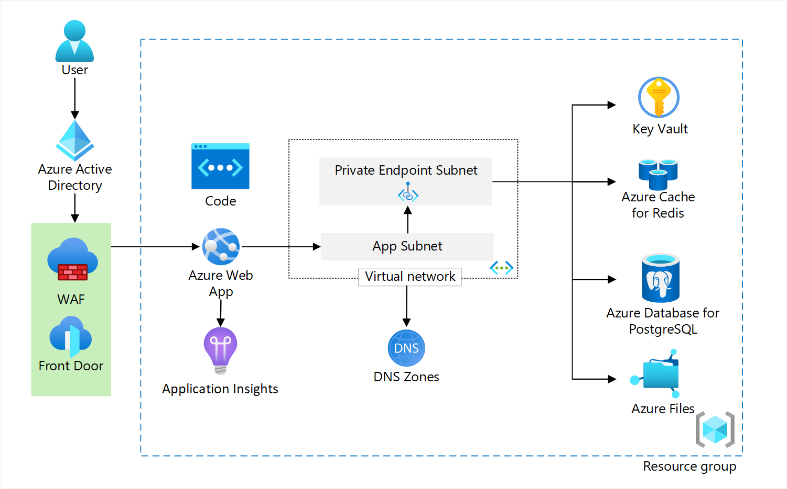

The reliable web app pattern is a set of principles that helps developers successfully migrate web applications to the cloud. It provides implementation guidance built on the [Azure Well-Architected Framework](/azure/architecture/framework/). The pattern focuses on the minimal changes you need to make to ensure the success of your web app in the cloud. This article shows you how to apply the reliable web app pattern for Java. The companion article shows you how to [plan the implementation](plan-implementation.yml).

 There's also a [reference implementation](https://github.com/Azure/reliable-web-app-pattern-java#reliable-web-app-pattern-for-java) of the reliable web app pattern for Java that you can deploy. The reference implementation applies the reliable web app pattern to an employee-facing, line of business (LOB) web application.

## Architecture and code

Architecture and code are symbiotic. A well-architected web application needs quality code, and quality code needs a well-architected solution. The reliable web app pattern situates code changes within the pillars of the Well-Architected Framework to reinforce the interdependence of code and architecture. The following diagram illustrates how the reference implementation should look in your environment.

[](images/java-architecture.png)
*Download a [Visio file](https://arch-center.azureedge.net/reliable-web-app-java.vsdx) of this architecture. For the estimated cost, see:*

- [Production environment estimated cost](https://azure.com/e/c530c133f36c423e9774de286f7dd28a)
- [Non-production environment estimated cost](https://azure.com/e/48201e05118243e089ded6855839594a)

The following table lists the principles of the reliable web app pattern and how the reference implementation applied these principles.

| Reliable web app principles | Implementation for Java |
| --- | --- |
|▪ Low-cost, high-value wins<br>▪ Minimal code changes to:<ol>▫ Meet security best practices<br>▫ Apply reliability design patterns<br>▫ Improve operational excellence</ol>▪ Cost-optimized environment(s)<br>▪ Follow Azure Well-Architected Framework principles<br>▪ Business-driven service level objective |▪ Retry pattern <br> ▪ Circuit-breaker pattern <br>▪ Cache-aside pattern <br>▪ Right-size resource <br>▪ Managed identities <br>▪ Private endpoints <br>▪ Secrets management <br>▪ Repeatable infrastructure <br>▪ Telemetry, logging, monitoring |

## Reliability

A reliable web application is one that is both resilient and available. Resiliency is the ability of the system to recover from failures and continue to function. The goal of resiliency is to return the application to a fully functioning state after a failure occurs. Availability is whether your users can access your web application when they need to. We recommend using the retry and circuit-breaker patterns as a critical first step toward improving application reliability. These design patterns introduce self-healing qualities and help your application maximize the reliability features of the cloud. Here are our reliability recommendations.

### Use the Retry pattern

The Retry pattern is a technique for handling temporary service interruptions. These temporary service interruptions are known as *transient faults* and typically resolve themselves in a few seconds. In the cloud, the leading causes of transient faults are service throttling, dynamic load distribution, and network connectivity. The Retry pattern handles transient faults by resending failed requests to the service. You can configure the amount of time between retries and how many retries to attempt before throwing an exception. If your code already uses the Retry pattern, you should update your code to use the [retry mechanisms](/azure/architecture/best-practices/retry-service-specific) available in Azure services and client SDKs. If your application doesn't have a Retry pattern, you should add one based on the following guidance. For more information, see:

- [Transient fault handling](/azure/architecture/best-practices/transient-faults)
- [Retry pattern](/azure/architecture/patterns/retry)

You should use [Resilience4j](https://github.com/resilience4j/resilience4j) to implement the Retry pattern in Java. Resilience4j is a lightweight fault tolerance library. It provides higher-order functions (decorators) to enhance any functional interface, lambda expression or method reference with a Circuit Breaker, Rate Limiter, Retry, or Bulkhead.

*Reference implementation.* The reference implementation adds the Retry pattern by decorating a lambda expression with the Retry annotations. The code retries the call to get the media file from disk. The following code demonstrates how to use Resilience4j to retry a filesystem call to Azure Files to get the last modified time.

```java
private MediaFile checkLastModified(MediaFile mediaFile, MusicFolder folder, boolean minimizeDiskAccess) {
        Retry retry = retryRegistry.retry("media");
        CheckedFunction0<MediaFile> supplier = () -> doCheckLastModified(mediaFile, folder, minimizeDiskAccess);
        CheckedFunction0<MediaFile> retryableSupplier = Retry.decorateCheckedSupplier(retry, supplier);
        Try<MediaFile> result = Try.of(retryableSupplier).recover((IOException) -> mediaFile);
        return result.get();
    }
```

[See code in context](https://github.com/airsonic-advanced/airsonic-advanced/blob/master/airsonic-main/src/main/java/org/airsonic/player/service/MediaFileService.java#L173)

The code uses the retry registry to get a `Retry` object. It also uses `Try` from the Vavr library. `Try` is a monad that performs error handling and recovery in Java applications. In the code, `Try` recovers from an exception and invokes another lambda expression as a fallback. The code returns the original `MediaFile` after reaching the maximum amount of retries. The reference implementation configures the retry properties in the `application.properties` ([See code in context](https://github.com/Azure/reliable-web-app-pattern-java/blob/main/src/airsonic-advanced/airsonic-main/src/main/resources/application.properties)).

For more ways to configure Resiliency4J, see [Spring Retry](https://docs.spring.io/spring-batch/docs/current/reference/html/retry.html) and [Resilliency4J documentation](https://resilience4j.readme.io/v1.7.0/docs/getting-started-3)
  
### Use the circuit-breaker pattern

You should pair the Retry pattern with the Circuit Breaker pattern. The Circuit Breaker pattern handles faults that aren't transient. The goal is to prevent an application from repeatedly invoking a service that is clearly faulted. It releases the application and avoids wasting CPU cycles so the application retains its performance integrity for end users. For more information, see the [Circuit Breaker pattern](/azure/architecture/patterns/circuit-breaker). For more ways to configure Resiliency4J, see [Spring Circuit Breaker](https://docs.spring.io/spring-cloud-circuitbreaker/docs/current/reference/html/#usage-documentation) and [Resilliency4J documentation](https://resilience4j.readme.io/v1.7.0/docs/getting-started-3).

*Simulate the Circuit Breaker pattern:* You can simulate the Circuit Breaker pattern in the reference implementation. For instructions, see [Simulate the Circuit Breaker pattern](https://github.com/Azure/reliable-web-app-pattern-java/blob/main/simulate-patterns.md#retry-and-circuit-break-pattern).

### Use multiple availability zones

Azure availability zones are physically separate datacenters within an Azure region that have independent power, networking, and cooling. Availability zones increase resiliency for reduced risk of data loss or downtime. If you can use multiple availability zones and performance or cost factors don't create a risk, you should use them for production workloads. You can use a single availability zone in your development environment to save money.

*Reference implementation.* The reference implementation uses PostgreSQL flexible server with zone redundancy for the production environment only. The development environment uses a single availability zone to save money. The reference implementation also uses Azure Storage with [zone redundant storage](/azure/storage/common/storage-redundancy#zone-redundant-storage) for improved data redundancy.

## Security

Cloud applications often comprise multiple Azure services. Communication between those services needs to be secure. Enforcing secure authentication, authorization, and accounting practices in your application is essential to your security posture. At this phase in the cloud journey, you should use managed identities, secrets management, and private endpoints. Here are the security recommendations for the reliable web app pattern.

### Authentication and authorization
#### Configure web app authentication and authorization

**Use managed identities.** Managed identities create an identity in Azure Active Directory (Azure AD) that eliminates the need for developers to manage credentials. receive a workload identity (service principal) in Azure AD and Azure manages the access tokens behind the scenes. Managed identities make identity management easier and more secure. They provide benefits for authentication, authorization, and accounting. For example, you can use a managed identity to grant the web app access to other Azure resources (Azure Key Vault, Azure database). You can you a managed identity so a CI/CD pipeline can deploy a web app to App Service.

You should use managed identities where possible because of the security and operational benefits. However, there are cases where keeping your on-premises authentication and authorization configuration improves your migration experience. In these cases, you should keep the on-premises setup and plan to modernize your identity solution later.  For more information, see:

- [Developer introduction and guidelines for credentials](/azure/active-directory/managed-identities-azure-resources/overview-for-developers)
- [Managed identities for Azure resources](/azure/active-directory/managed-identities-azure-resources/overview)
- [Azure services supporting managed identities](/azure/active-directory/managed-identities-azure-resources/managed-identities-status)
- [Web app managed identity](/azure/active-directory/develop/multi-service-web-app-access-storage)

*Reference implementation:* The reference implementation demonstrates a scenario where the developer kept the on-premises authentication mechanism rather than switching to a managed identity. The web app in the reference implementation keeps the database local user and authenticates with a username and password. The reference implementation stores the database secret in Key Vault. The web app doesn't use a managed identity to access the database, but it does use a managed identity (system-assigned) to retrieve secrets from Key Vault. The developer plans on switching to a managed identity in the future.

### Configure user authentication and authorization

**Use MSAL.** When migrating web apps to Azure, it's important to consider the authentication and authorization mechanisms you will sue to secure the app and its resources. The Microsoft Authentication Library (MSAL) is a powerful tool that can help with this task.

MSAL enables developers to acquire tokens from the Microsoft identity platform, which can be used to access protected resources such as web APIs. MSAL supports a variety of authentication scenarios, including authentication of individual users, authentication of a client application, and authentication of users and applications in hybrid environments. 

You need to pick a supported authentication flow with MSAL because different application types and scenarios require different ways of acquiring tokens for authentication and authorization purposes. Each authorization flow has its own set of requirements, benefits, and security considerations. For example, the OAuth 2.0 authorization code grant flow is a widely used flow for web apps that require user interaction for authentication. It involves exchanging an authorization code for an access token and a refresh token. On the other hand, the OAuth 2.0 client credentials grant flow is used by confidential client applications that can authenticate themselves without user interaction. For more information, see [Authorization flow](/azure/active-directory/develop/msal-authentication-flows).

*Reference implementation.* The reference implementation uses the Microsoft identity platform as the identity provider and the OAuth 2.0 authorization code grant to log in a user with an Azure AD account. The following XML snippet defines the two required dependencies of the OAuth 2.0 authorization code grant flow. The dependency `com.azure.spring : spring-cloud-azure-starter-active-directory` enables Azure Active Directory authentication and authorization in a Spring Boot application. The `org.springframework.boot : spring-boot-starter-oauth2-client` supports OAuth 2.0 authentication and authorization in a Spring Boot application.

```xml
    <dependency>
        <groupId>com.azure.spring</groupId>
        <artifactId>spring-cloud-azure-starter-active-directory</artifactId>
    </dependency>
    <dependency>
        <groupId>org.springframework.boot</groupId>
        <artifactId>spring-boot-starter-oauth2-client</artifactId>
    </dependency>
```

By adding these dependencies to the project, you can integrate Azure Active Directory and OAuth 2.0 authentication and authorization into the Spring Boot application without manually configuring the required libraries and settings. For more information, see [Spring Security with Azure Active Directory](https://learn.microsoft.com/azure/developer/java/spring-framework/spring-security-support).

**Use Easy Auth.** App Service has a built-in authentication feature that provides an out-of-the-box authentication with federated identity providers. You should use this feature to reduce the application code's responsibility to handle authentication and authorization. For information, see [Authentication and authorization in Azure App Service](/azure/app-service/overview-authentication-authorization).

*Reference implementation.* The reference implementation uses the built-in authentication and authorization feature of App Service. It uses Azure Active Directory as the identity platform.

**Use role-based access controls (RBACs).**

A role is a set of permissions. Role-based access control (RBAC) allows you to grant fine-grained permissions to different roles. You should use RBAC and grant roles the least privilege to start. You can always add more permissions later based on need. Align roles to application needs and provide clear guidance to your technical teams that implement permissions.

*Reference implementation.* The reference implementation creates two app roles (*User* and *Creator*). Roles translate into permissions during authorization. The *Creator* role has permissions to configure the Airsonic application settings, upload videos, and create playlists. The *User* Role can view the videos. The following code from the reference implementation demonstrates how to configure App Roles.

```terraform
  app_role {
    allowed_member_types = ["User"]
    description          = "ReadOnly roles have limited query access"
    display_name         = "ReadOnly"
    enabled              = true
    id                   = random_uuid.user_role_id.result
    value                = "User"
  }

  app_role {
    allowed_member_types = ["User"]
    description          = "Creator role allows users to create content"
    display_name         = "Creator"
    enabled              = true
    id                   = random_uuid.creator_role_id.result
    value                = "Creator"
  }
```

[See code in context](https://github.com/Azure/reliable-web-app-pattern-java/blob/eb73a37be3d011112286df4e5853228f55cb377f/terraform/modules/app-service/main.tf#L98) For more information, see [Add app roles to your application and receive them in the token](https://learn.microsoft.com/azure/active-directory/develop/howto-add-app-roles-in-azure-ad-apps).

The reference implementation uses an app registration to assign AD users an app role ("User" or "Creator"). The app roles allows them to log in to the application. The reference implementation uses the following code to configure the app registration.

[See code in context](https://github.com/Azure/reliable-web-app-pattern-java/blob/eb73a37be3d011112286df4e5853228f55cb377f/terraform/modules/app-service/main.tf#L80). For more information, see [Register an application with the Microsoft identity platform](/azure/active-directory/develop/quickstart-register-app).

The `appRoles` attribute in Azure AD defines the roles that an app can declare in the application manifest. The `appRoles` attribute allows applications to define their own roles. When a user signs in to the application, Azure AD generates an ID token that contains various claims. This token includes a `roles` claim that lists the roles assigned to the user. In the following code, the `WebSecurityConfiguration` class extends the `AadWebSecurityConfigurerAdapter` class to add authentication. It only grants access to the two roles configured in Azure AD, and it adds the `APPROLE_` as a prefix each role.

```java
    @Configuration
public class WebSecurityConfiguration extends AadWebSecurityConfigurerAdapter {

    @Override
    protected void configure(HttpSecurity http) throws Exception {
        // use required configuration from AADWebSecurityAdapter.configure:
        super.configure(http);
        // add custom configuration:

         http
                .authorizeRequests()
                .antMatchers("/recover*", "/accessDenied*", "/style/**", "/icons/**", "/flash/**", "/script/**", "/error")
                .permitAll()
                .antMatchers("/personalSettings*",
                            "/playerSettings*", "/shareSettings*", "/credentialsSettings*")
                .hasAnyAuthority("APPROLE_User", "APPROLE_Creator")
                .antMatchers("/**")
                .hasAnyAuthority("APPROLE_User", "APPROLE_Creator")
                .anyRequest().authenticated()
                .and()
                .addFilterBefore(aadAddAuthorizedUsersFilter UsernamePasswordAuthenticationFilter.class)
                .logout(logout -> logout
                        .deleteCookies("JSESSIONID", "XSRF-TOKEN")
                        .clearAuthentication(true)
                        .invalidateHttpSession(true)
                        .logoutSuccessUrl("/index"))
                    ;
        }
```

[See code in context](https://github.com/Azure/reliable-web-app-pattern-java/blob/d02b02aa2572f2bae651dede77fbc5051a313003/src/airsonic-advanced/airsonic-main/src/main/java/org/airsonic/player/security/GlobalSecurityConfig.java#L162). For more information, see:

- [AppRoles attribute](https://learn.microsoft.com/azure/active-directory/develop/reference-app-manifest#approles-attribute)
- [Spring Boot Starter for Azure Active Directory developer's guide](/azure/developer/java/spring-framework/spring-boot-starter-for-azure-active-directory-developer-guide)
- [Add sign-in with Azure Active Directory account to a Spring web app](/azure/developer/java/spring-framework/configure-spring-boot-starter-java-app-with-azure-active-directory)
- [Add app roles to your application and receive them in the token](/azure/active-directory/develop/howto-add-app-roles-in-azure-ad-apps)
- [Configurable token lifetimes in the Microsoft identity platform](/azure/active-directory/develop/active-directory-configurable-token-lifetimes)

### Configure database security

Administrator-level authentication to the database is important because it grants elevated permissions that can be used to perform privileged operations (creating and deleting databases, modifying table schemas, or changing user permissions). Without administrator-level access, a developer might not be able to perform certain tasks required to maintain the database or troubleshoot issues.

However, it's not recommended to use administrator-level authentication for day-to-day operations in the application. Instead, you should configure least-privileged access for the application to the database. This helps to minimize the risk of unauthorized access and limit the damage that can be done in the event of a security breach.

You have two primary methods to access the Azure PostgreSQL database. You can use Azure AD authentication or PostgreSQL authentication. For more information, see [JDBC with Azure PostgreSQL](/azure/developer/java/spring-framework/configure-spring-data-jdbc-with-azure-postgresql).

### Validate user information (WHAT IS THE GUIDANCE HERE?)

You application needs to store user data in the database, but it should only add the user to the database if they have a valid role. You need to implement a mechanism to add valid users to the database.

*Reference implementation.* The reference implementation uses a Spring Filter to add the authenticated users to the Airsonic database. The `doFilterInternal()` method checks whether the incoming request is from a valid Airsonic user. If the user is valid, the filter adds the user to the database by calling the addUserToDatabase() method. Finally, the filter calls doFilter() method on the FilterChain object to continue processing the request. The `LOG.debug()` method provides information about the execution status of the filter.

```java
public class AADAddAuthorizedUsersFilter extends OncePerRequestFilter {
    @Override
    protected void doFilterInternal(HttpServletRequest request, HttpServletResponse response, FilterChain filterChain) throws ServletException, IOException {

        LOG.debug("In the AADAddAuthorizedUsersFilter filter");

        // Add the user to the User database table if and only if they have a valid app role.
        if (isAirsonicUser(request)) {
            LOG.debug("user is an airsonic user");
            addUserToDatabase(request);
        }

        LOG.debug("AADAddAuthorizedUsersFilter calling doFilter");
        filterChain.doFilter(request, response);
    }
}
```

### Use a central secrets store (Azure Key Vault)

Many on-premises environments don't have a central secrets store. Key rotation is uncommon and auditing who has access to a secret is difficult. In Azure, the central secret store is Key Vault. With Key Vault, you can store, keys, manage, audit, and monitor secrets access in Key Vault.

**Use Key Vault to manage remaining secrets.** The terms "secrets" refers to anything that you don't want exposed in plain text (passwords, keys, and certificates). After migrating to the cloud, you still have secrets, key, and certificates you need to manage. You might not be able adopt managed identity for every Azure either because the Azure services doesn't support managed identities or you needed to postpone the adoption. For any remaining secrets, you should store them in Key Vault.

*Reference implementation:* (**WHAT DO WE STORE IN AZURE KEY VAULT?**)

**Use one way to access secrets in Key Vault.** You can configure your web app to access secrets in Key Vault via App Service or your application code. You can use an Application setting in App Service and inject the secret as an environment variable. To reference it in your application code, you add a reference to the app properties file so the app can reach out to Key Vault.

*Reference implementation.* The reference implementation uses the application code to access the secret in Key Vault.

**Use temporary permissions to access storage account.** Granting permanent access to a storage account poses a security risk. A compromised or unused account with permanent access compromised or if the user no longer needs access to the storage account. Temporary permissions, on the other hand, allow you to grant access to a user or application for a specific period of time. This ensures that access is only granted when needed and reduces the risk of unauthorized access or data breaches.

For access to files in storage account, you should use Shared access signatures (SASs) for authentication. SASs are uniform resource locators (URIs) that grant restricted access to Azure Storage resources for a specified period of time.

*Reference implementation.* The reference implementation uses [account access keys](/azure/storage/common/storage-account-keys-manage) to upload videos in the playlist. It is required to deploy the demo and populate the data, but you should use SASs in production.

### Secure communication with private endpoints

Private endpoints provide a private connection between resources within an Azure virtual network and Azure services. By default, communication to most Azure services traverses the public internet, including Azure Database for PostgreSQL and Azure App Service in the reference implementation. You should use private endpoints in all production environments for all supported Azure services. Private endpoints don't require any code changes, app configurations, or connection strings.

- [How to create a private endpoint](/azure/architecture/example-scenario/private-web-app/private-web-app#deploy-this-scenario)
- [Best practices for endpoint security](/azure/architecture/framework/security/design-network-endpoints)

*Reference implementation.* The reference implementation uses private endpoints for Key Vault, Azure Cache for Redis, and Azure Database for PostgreSQL. To make the deployment possible, it doesn't use a private endpoint for Azure Files. The web app loads the user interface with playlists and videos from the local client IP address, and it was most efficient not to use a private endpoint for Azure. ou do not need to populate data in production and should always use a private endpoint to limit the attack surface. To add a layer of security, Azure Files only accepts traffic from the virtual network and the local client IP of the user executing the deployment.

### Use a web application firewall

You should protect web applications with a web application firewall. The web application firewall provides a level protection against common security attacks and botnets. To take advantage of the value of the web application firewall, you have to prevent traffic from bypassing the web application firewall. In Azure, you should restrict access on the application platform (App Service) to only accept inbound communication from Azure Front Door.

*Reference implementation:* The reference implementation uses Front Door as the host name URL. In production, you should use your own host name and follow the guidance in [Preserve the original HTTP host name](/azure/architecture/best-practices/host-name-preservation).

## Cost optimization

Cost optimization principles balance business goals with budget justification to create a cost-effective web application. Cost optimization is about reducing unnecessary expenses and improving operational efficiencies. For a web app converging on the cloud, here are our recommendations for cost optimization.

**Reference architecture:** Our app uses Azure Files integrated with App Service to save training videos that users upload. Refactoring this to use Azure Storage Blobs would reduce hosting costs and should be evaluated as part of future modernizations.

### Rightsize resources for each environment

Production environments need SKUs that meet the service level agreements (SLA), features, and scale needed for production. But non-production environments don't normally need the same capabilities. You can optimize costs in non-production environments by using cheaper SKUs that have lower capacity and SLAs. You should consider Azure Dev/Test pricing and Azure reservations. How or whether you use these cost-saving methods depends on your environment.

**Consider Azure Dev/Test pricing.** Azure Dev/Test pricing gives you access to select Azure services for non-production environments at discounted pricing under the Microsoft Customer Agreement. The plan reduces the costs of running and managing applications in development and testing environments, across a range of Microsoft products. For more information, see [Dev/Test pricing options](https://azure.microsoft.com/pricing/dev-test/#overview).

**Consider Azure reservations or an Azure savings plan.** You can combine an Azure savings plan with Azure reservations to optimize compute cost and flexibility. Azure reservations help you save by committing to one-year or three-year plans for multiple products. The Azure savings plan for compute is the most flexible savings plan. It generates savings on pay-as-you-go prices. Pick a one-year or three-year commitment for compute services, regardless of region, instance size, or operating system. Eligible compute services include virtual machines, dedicated hosts, container instances, Azure Functions Premium, and Azure app services. For more information, see:

- [Azure Reservations](https://learn.microsoft.com/azure/cost-management-billing/reservations/save-compute-costs-reservations)
- [Azure savings plans for compute](https://learn.microsoft.com/azure/cost-management-billing/savings-plan/savings-plan-compute-overview)

*Reference implementation:* The reference implementation has an optional parameter to deploy different SKUs. It uses cheaper SKUs for Azure Cache for Redis, App Service, and Azure PostgreSQL Flexible Server when deploying to the development environment. You can choose any SKUs that meet your needs, but the reference implementation uses the following SKUs:

| Service | Dev SKU | Prod SKU | SKU options |
| --- | --- | --- | --- |
| Cache for Redis | Basic | Standard | [Redis Cache SKU options](https://azure.microsoft.com/pricing/details/cache/)
| App Service | P1v2 | P2v2 | [App Service SKU options](https://azure.microsoft.com/pricing/details/app-service/linux/)
| PostgreSQL Flexible Server | Burstable B1ms (B_Standard_B1ms) | General Purpose D4s_v3 (GP_Standard_D4s_v3) | [PostgreSQL SKU options](https://learn.microsoft.com/azure/postgresql/flexible-server/concepts-compute-storage)

The following parameter tells the Terraform template the SKUs to select development SKUs. In `scripts/setup-initial-env.sh`, you can set `APP_ENVIRONMENT` to either be prod or dev.

```bash
# APP_ENVIRONMENT can either be prod or dev
export APP_ENVIRONMENT=dev
```

[See code in context](https://github.com/Azure/reliable-web-app-pattern-java/blob/main/scripts/setup-initial-env.sh)

The Terraform uses the `APP_ENVIRONMENT` as the `environment` value when deploying.

```shell
terraform -chdir=./terraform plan -var application_name=${APP_NAME} -var environment=${APP_ENVIRONMENT} -out airsonic.tfplan
```

### Automate scaling the environment

You should use autoscale to automate horizontal scaling for production environments. Autoscaling adapts to user demand to save you money. Horizontal scaling automatically increases compute capacity to meet user demand and decreases compute capacity when demand drops. Don't increase the size of your application platform (vertical scaling) to meet frequent changes in demand. It's less cost efficient. For more information, see:

- [Scale up an app in Azure App Service](https://learn.microsoft.com/azure/app-service/manage-scale-up)
- [Overview of autoscale in Microsoft Azure](https://learn.microsoft.com/azure/azure-monitor/autoscale/autoscale-overview)

*Reference implementation:* The reference implementation uses the following configuration in Terraform. It creates an autoscale rule for the Azure App Service. The rule scales up to 10 instances and defaults to one instance. The code sets up two rules for scaling the resource up or down based on the average CPU usage over a period of time. The rules define a metric trigger that checks the CPU usage against a threshold value, and a scale action that increases or decreases the number of instances in response to the trigger.

```terraform
resource "azurerm_monitor_autoscale_setting" "airsonicscaling" {
  name                = "airsonicscaling"
  resource_group_name = var.resource_group
  location            = var.location
  target_resource_id  = azurerm_service_plan.application.id
  profile {
    name = "default"
    capacity {
      default = 1
      minimum = 1
      maximum = 10
    }
    rule {
      metric_trigger {
        metric_name         = "CpuPercentage"
        metric_resource_id  = azurerm_service_plan.application.id
        time_grain          = "PT1M"
        statistic           = "Average"
        time_window         = "PT5M"
        time_aggregation    = "Average"
        operator            = "GreaterThan"
        threshold           = 85
      }
      scale_action {
        direction = "Increase"
        type      = "ChangeCount"
        value     = "1"
        cooldown  = "PT1M"
      }
    }
    rule {
      metric_trigger {
        metric_name         = "CpuPercentage"
        metric_resource_id  = azurerm_service_plan.application.id
        time_grain          = "PT1M"
        statistic           = "Average"
        time_window         = "PT5M"
        time_aggregation    = "Average"
        operator            = "LessThan"
        threshold           = 65
      }
      scale_action {
        direction = "Decrease"
        type      = "ChangeCount"
        value     = "1"
        cooldown  = "PT1M"
      }
    }
  }
}
```

[See this code in context](https://github.com/Azure/reliable-web-app-pattern-java/blob/08b00043f26a580fc6a37d665b173aca4f346c03/terraform/modules/app-service/main.tf#L278)

### Delete non-production environments

IaC is often considered an operational best practice, but it's also a way to manage costs. IaC can create and delete entire environments. You should delete non-production environments after hours or during holidays to optimize cost.

## Operational excellence

Organizations that move to cloud and apply a DevOps methodology see greater returns on investment. Infrastructure-as-code (IaC) is a key tenant of DevOps, and the reliable web app pattern uses IaC (Terraform) to deploy application infrastructure, configure services, and setup application telemetry. Monitoring operational health requires telemetry to measure security, cost, reliability, and performance gains. The cloud offers built-in features to capture telemetry, and when fed into a DevOps framework, they help rapidly improve your application. Here are the recommendations for operational excellence with the reliable web app pattern.

### Logging and application telemetry

You should enable logging to diagnose when any request fails for tracing and debugging. The telemetry you gather on your application should cater to the operational needs of the web application. At a minimum, you must collect telemetry on baseline metrics. Gather information on user behavior that can help you apply targeted improvements. Here are our recommendations for collecting application telemetry:

**Monitor baseline metrics.** The workload should monitor baseline metrics. Important metrics to measure include request throughput, average request duration, errors, and monitoring dependencies. We recommend using application Insights to gather this telemetry.

*Reference implementation:* The reference implementation uses the following code to enable Application Insights Java programmatically.

1. Maven dependency

   ```xml
   <dependency>
      <groupId>com.microsoft.azure</groupId>
      <artifactId>applicationinsights-runtime-attach</artifactId>
      <version>3.4.7</version>
   </dependency>
   ```

1. Invoke the ApplicationInsights.attach() method in Application.java.

   ```java
   public static void main(String[] args) {
       ApplicationInsights.attach();
       SpringApplicationBuilder builder = new SpringApplicationBuilder();
       doConfigure(builder).run(args);
   }
   ```

To enable the Java application to capture telemetry, see [Java in process agent](https://learn.microsoft.com/azure/azure-monitor/app/java-in-process-agent). For more information on configuring Application Insights in apps like our sample, see [Using Azure Monitor Application Insights with Spring Boot](https://learn.microsoft.com/azure/azure-monitor/app/java-spring-boot).

**Create custom telemetry as needed.** You should augment baseline metrics with information that helps you understand your users. You can use Application Insights to gather custom telemetry.

**Gather log-based metrics.** You should track log-based metrics to gain more visibility into essential application health and metrics. You can use [Kusto Query Language (KQL)](https://learn.microsoft.com/azure/data-explorer/kusto/query/) queries in Application Insights to find and organize data. You can run these queries in the portal. Under **Monitoring**, select **Logs** to run your queries. For more information, see:

- [Azure Application Insights log-based metrics](https://learn.microsoft.com/azure/azure-monitor/essentials/app-insights-metrics)
- [Log-based and pre-aggregated metrics in Application Insights](https://learn.microsoft.com/azure/azure-monitor/app/pre-aggregated-metrics-log-metrics)

## Performance efficiency

Performance efficiency is the ability of a workload to scale and meet the demands placed on it by users in an efficient manner. In cloud environments, a workload should anticipate increases in demand to meet business requirements. You should use the cache-aside pattern to manage application data while improving performance and optimizing costs.

### Use the cache-aside pattern

The cache-aside pattern is a technique that's used to manage in-memory data caching. The cache-aside pattern makes the application responsible for managing data requests and data consistency between the cache and a persistent data store, like a database. When a data request reaches the application, the application first checks the cache to see if the cache has the data in memory. If it doesn't, the application queries the database, replies to the requester, and stores that data in the cache. For more information, see [Cache-aside pattern overview](https://learn.microsoft.com/azure/architecture/patterns/cache-aside).

The cache-aside pattern introduces a few benefits to the web application. It reduces the request response time and can lead to increased response throughput. This efficiency reduces the number of horizontal scaling events, making the app more capable of handling traffic bursts. It also improves service availability by reducing the load on the primary data store and decreasing the likelihood of service outages.

**Cache high-need data.** Most applications have pages that get more viewers than other pages. You should cache data that supports the most-viewed pages of your application to improve responsiveness for the end user and reduce demand on the database. You should use Azure Monitor and Azure SQL Analytics to track the CPU, memory, and storage of the database. You can use these metrics to determine whether you can use a smaller database SKU.

**Keep cache data fresh.** You should periodically refresh the data in the cache to keep it relevant. The process involves getting the latest version of the data from the database to ensure that the cache has the most requested data and the most current information. The goal is to ensure that users get current data fast. The frequency of the refreshes depends on the application.

**Ensure data consistency.** You need to change cached data whenever a user makes an update. An event-driven system can make these updates. Another option is to ensure that cached data is only accessed directly from the repository class that's responsible for handling the create and edit events.

### Deploy the reference implementation

You can deploy the reference implementation by following the instructions in the [reliable web app pattern for Java repository](https://github.com/Azure/reliable-web-app-pattern-java#reliable-web-app-pattern-for-java). Follow the deployment guide to set up a local development environment and deploy the solution to Azure.

## Next Steps

The following resources provide cloud best practices and migration guidance.

### Cloud best practices

For Azure adoption and architectural guidance, see:

- [Cloud Adoption Framework](/azure/cloud-adoption-framework/overview). Can help your organization prepare and execute a strategy to build solutions on Azure.
- [Well-Architected Framework](/azure/architecture/framework/). A set of guiding tenets that can be used to improve the quality of a workload.

For applications that require a higher SLO than the reliable web app pattern, see the guidance for architecting and operating [mission-critical workloads](/azure/architecture/framework/mission-critical/mission-critical-overview).

### Migration guidance

The following tools and resources can help you migrate on-premises resources to Azure.

- [Azure Migrate](/azure/migrate/migrate-services-overview) provides a simplified migration, modernization, and optimization service for Azure that handles assessment and migration of web apps, SQL Server, and virtual machines.
- [Azure Database Migration Guides](/data-migration/) provides resources for different database types, and different tools designed for your migration scenario.
- [Azure App Service landing zone accelerator](/azure/cloud-adoption-framework/scenarios/app-platform/app-services/landing-zone-accelerator) provides guidance for hardening and scaling App Service deployments.
