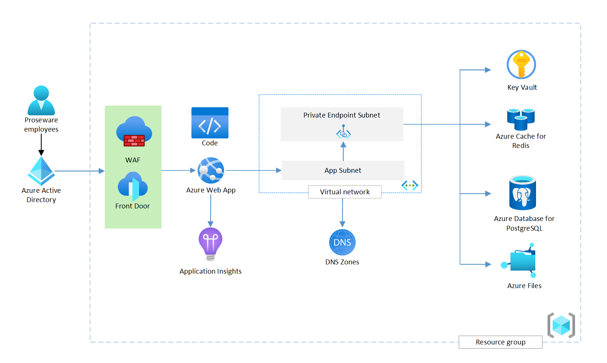

This article describes how to plan the implementation of the reliable web app pattern for Java. The companion article describes how to [apply the pattern](apply-pattern.yml). The reliable web app pattern helps developers modify web applications that have recently migrated to the cloud. The pattern focuses on the minimal, essential changes you should make to ensure the success of your web app in the cloud. For more information, see [Overview of the reliable web app pattern](../overview.md).

A [reference implementation](https://github.com/Azure/reliable-web-app-pattern-java#reliable-web-app-pattern-for-java) is available for you to deploy. It applies the reliable web app pattern to an employee-facing line-of-business (LOB) web application.

## Architecture and pattern

The business context, existing web app, service level objective (SLO), and coding language determine (1) how you apply the reliable web app pattern and (2) the architecture of the web app. The following diagram illustrates how the reference implementation should look in your environment.

*Download a [Visio file](https://arch-center.azureedge.net/reliable-web-app-java.vsdx) of this architecture. For the estimated cost, see:*

- [Production environment estimated cost](https://azure.com/e/c530c133f36c423e9774de286f7dd28a)
- [Non-production environment estimated cost](https://azure.com/e/48201e05118243e089ded6855839594a)

The following table lists the principles of the reliable web app pattern and how the reference implementation applies these principles.

| Reliable web app principles | Implementation for Java |
| --- | --- |
|▪ Low-cost, high-value updates ▪ Minimal code changes to:<ol>▫ Meet security best practices ▫ Apply reliability design patterns ▫ Improve operational excellence</ol>▪ Cost-optimized environments ▪ Follow Azure Well-Architected Framework principles ▪ Business-driven service level objective |▪ Retry pattern   ▪ Circuit-breaker pattern  ▪ Cache-aside pattern  ▪ Rightsize resources  ▪ Managed identities  ▪ Private endpoints  ▪ Secrets management  ▪ Repeatable infrastructure  ▪ Telemetry, logging, monitoring |

## Business context

The implementation guidance mirrors the cloud journey of a fictional company, Proseware, Inc. Proseware wants to migrate its on-premises LOB web application to the cloud. It's a customized version of the open-source monolithic Airsonic web-based media streamer. In this scenario, we imagine that Proseware developed the application and owns all the code. 

Company leadership wants to expand business into the EdTech application market. After their initial technical research, they conclude that they can use their existing internal training platform as a starting point and modernize it into a B2C EdTech app. To expand Proseware's business into a highly competitive EdTech market, the on-premises infrastructure needs to provide a cost-efficient means to scale. A migration to the cloud offers the best return on investment. The migration of the application should meet the increasing business demand with minimal investments in the existing monolithic app. Here are some short-term and long-term goals for the application:

| Short-term goals | Long-term goals |
| --- | --- |
| ▪ Apply low-cost, high-value code changes to the LOB web application   ▪ Mature development team practices for cloud development and operations   ▪ Create cost-optimized production and development environments   ▪ Implement reliability and security best practices in the cloud   ▪ Service level objective of 99.86%| ▪ Open the application directly to online customers through multiple web and mobile experiences   ▪ Improve availability   ▪ Reduce time required to deliver new features   ▪ Independently scale different components of the system, based on traffic

## Web application starting point

The on-premises starting point is a monolithic Java web application that runs on an Apache Tomcat web server with a PostgreSQL database. It’s an employee-facing LOB training application. Proseware employees use the application to complete required HR training. The web application suffers from common legacy challenges, including extended timelines to build and ship new features and difficulty scaling different application components under higher load.

## Service level objective

A service level objective (SLO) for availability defines how available you want a web app to be for users. Proseware has a target SLO of 99.86% for availability. You need to define what availability means for your web application. For Proseware, the web app is considered available when employees can watch training videos 99.86% of the time. When you have a definition of *available*, list all the dependencies on the critical path of availability. Dependencies should include Azure services and third-party solutions.

For each dependency in the critical path, you need to assign an availability goal. Service Level Agreements (SLAs) from Azure provide a good starting point. SLAs don't factor in (1) downtime associated with the application code run on those services, (2) deployment and operations methodologies, or (3) architecture choices to connect the services. The availability metric you assign to a dependency shouldn't exceed the SLA.

For example, Proseware used Azure SLAs for Azure services. The following diagram illustrates Proseware's dependency list and shows availability goals for each dependency.

> [!NOTE] 
> Azure SLAs are subject to change. The SLAs shown here are examples used to illustrate the process of estimating composite availability. For information about current Azure SLAs, see [SLAs for Online Services](https://www.microsoft.com/licensing/docs/view/Service-Level-Agreements-SLA-for-Online-Services).

Finally, use the formulas for composite SLAs to estimate the composite availability of the dependencies on the critical path. This number should meet or exceed your SLO. For more information, see:

- [Composite SLA formula](/azure/architecture/framework/resiliency/business-metrics#composite-slas)
- [Multiregional SLA formula](/azure/architecture/framework/resiliency/business-metrics#slas-for-multiregion-deployments)

## Choose the right services

The Azure services you choose should support your short-term objectives while preparing your application to meet any long-term goals. You should pick services that (1) meet the SLO for the production environment, (2) require minimal migration effort, and (3) support planned modernization efforts. At this phase, it's important to select Azure services that mirror key on-premises choices to minimize the migration effort. For example, you should keep the same database engine (PostgreSQL -> Azure Database for PostgreSQL Flexible Server). Containerization of your application typically doesn't meet the short-term objectives of the reliable web app pattern, but the application platform you choose now should support containerization if it's a long-term goal. The two main requirements Proseware used when choosing Azure services were (1) an SLA of 99.9% for the production environment and (2) an average load of 1,000 users daily.

### Application platform

[Azure App Service](/azure/app-service/overview) is an HTTP-based managed service for hosting web applications, REST APIs, and mobile back ends. Azure has many viable [compute options](/azure/architecture/guide/technology-choices/compute-decision-tree). The web app uses Azure App Service because it meets the following requirements:

- **Broad Java support.** App Service supports Java Platform Standard Edition (SE), Apache Tomcat, and JBoss Enterprise Application Platform (EAP) web apps. You can deploy Maven plug-ins from the command line or in editors (IntelliJ, Eclipse, or Visual Studio Code).
- **High SLA.** It has a high SLA that meets the requirements for the production environment.
- **Reduced management overhead.** It's a fully managed hosting solution.
- **Containerization capability.** App Service works with private container image registries like Azure Container Registry. Proseware can use these registries to containerize the web app in the future.
- **Autoscaling.** The web app can rapidly scale up, down, in, and out based on user traffic.

Azure has a fully managed service specifically for Spring Boot apps (Azure Spring Apps), but Proseware concluded that the App Service platform introduces key hosting benefits of Spring Apps. Spring Apps introduces a larger disparity between the on-premises Tomcat servers than App Service. App Service also aligns better with the team's current level of cloud experience.

### Identity management

[Azure Active Directory (Azure AD)](/azure/active-directory/fundamentals/active-directory-whatis) is a cloud-based identity and access management service. It authenticates and authorizes users based on roles that integrate with applications. Azure AD provides the following abilities:

- **Authentication and authorization.** It handles authentication and authorization of employees.
- **Scalability.** It scales to support larger scenarios.
- **User-identity control.** Employees can use their existing enterprise identities.
- **Support for authorization protocols.** It supports OAuth 2.0 for managed identities and OpenID Connect for future B2C support.

### Database

[Azure Database for PostgreSQL](/azure/postgresql/flexible-server/overview) is a fully managed database service that provides single-server and flexible-server options. Proseware chose Azure Database for PostgreSQL and the flexible-server option to get the following benefits:

- **Reliability.** The flexible-server deployment model supports high availability within a single availability zone and across multiple availability zones. For a high SLO, choose the zone redundant high availability configuration. This configuration and maintains a warm standby server across availability zone within the same Azure region. Data replicates synchronously to the standby server to improve reliability.
- **Performance.** It provides predictable performance and intelligent tuning to improve your database performance by using real usage data.
- **Reduced management overhead.** It's a fully managed Azure service that reduces management obligations.
- **Migration support.** It supports database migration from on-premises single-server PostgreSQL databases. You can use the [migration tool](/azure/postgresql/migrate/concepts-single-to-flexible) to simplify the migration process.
- **Consistency with on-premises configurations.** It supports [different community versions of PostgreSQL](/azure/postgresql/flexible-server/concepts-supported-versions), including the version that Proseware currently uses.
- **Resiliency.** It automatically creates [server backups](/azure/postgresql/flexible-server/concepts-backup-restore) and stores them on zone-redundant storage (ZRS) within the same region. You can restore your database to any point-in-time within the backup retention period. The backup and restoration capability creates a better RPO (acceptable amount of data loss) than Proseware could create on-premises.

### Application performance monitoring

[Application Insights](/azure/azure-monitor/app/app-insights-overview) is a feature of Azure Monitor that provides extensible application performance management (APM) and monitoring for live web apps. The web app uses Application Insights for the following reasons:

- **Anomaly detection.** It automatically detects performance anomalies.
- **Troubleshooting.** It helps diagnose problems in the running app.
- **Telemetry.** It collects information about how users are using the app and allows you to easily send custom events that you want to track in your app.
- **Solving an on-premises visibility gap.** The on-premises solution didn't have APM. Application Insights provides easy integration with the application platform and code.

Azure Monitor is a comprehensive suite of monitoring tools for collecting data from various Azure services. For more information, see:

- [Application Monitoring for Azure App Service and Java](/azure/azure-monitor/app/azure-web-apps-java)
- [Smart detection in Application Insights](/azure/azure-monitor/alerts/proactive-diagnostics)
- [Application Map: Triage distributed applications](/azure/azure-monitor/app/app-map?tabs=java)
- [Usage analysis with Application Insights](/azure/azure-monitor/app/usage-overview)
- [Getting started with metrics explorer](/azure/azure-monitor/essentials/metrics-getting-started)
- [Application Insights Overview dashboard](/azure/azure-monitor/app/overview-dashboard)
- [Log queries in Azure Monitor](/azure/azure-monitor/logs/log-query-overview)

### Cache

[Azure Cache for Redis](/azure-cache-for-redis/cache-overview) is a managed in-memory data store that's based on Redis software. The web app needs a cache that provides the following benefits:

- **Speed and volume.** It has high-data throughput and low latency reads for commonly accessed, slow-changing data.
- **Diverse supportability.** It's a unified cache location that all instances of the web app can use.
- **Externalized.** The on-premises application servers performed VM-local caching. This setup didn't offload highly frequented data, and it couldn't invalidate data.

### Global ingress gateway

[Azure Front Door](/azure/frontdoor/front-door-overview) is a content delivery network that uses the Azure backbone network to route traffic between regions. This choice sets up features like Azure Web Application Firewall and positions you to use a content delivery network to provide site acceleration as traffic to the web app increases. The web app uses Azure Front Door because it provides the following benefits:

- **Internet-facing security.** It provides built-in layer 3-4 DDoS protection and integrates with Azure Web Application Firewall to help protect web apps against common web attacks.
- **Traffic acceleration.** It uses AnyCast to reach the nearest Azure point of presence and find the fastest route to the web app.
- **Custom domains.** It supports custom domain names with flexible domain validation.
- **Health probes.** The application needs intelligent health probe monitoring. Azure Front Door uses responses from the probe to determine the best origin for routing your client requests.
- **Monitoring support.** It supports built-in reports with an all-in-one dashboard for both Azure Front Door and security patterns. You can configure alerts that integrate with Azure Monitor. It enables the application to log each request and failed health probes.

### Web Application Firewall

[Azure Web Application Firewall](/azure/web-application-firewall/overview) helps provide centralized protection of your web applications from common exploits and vulnerabilities. It's built into Azure Front Door and helps prevent malicious attacks close to the attack sources before they enter your virtual network. Web Application Firewall provides the following benefits:

- **Global protection.** It provides increased global web app protection without sacrificing performance.
- **Botnet protection.** You can configure bot protection rules to monitor for botnet attacks.
- **Parity with on-premises.** It allows Proseware to maintain parity with its on-premises solution, which was running behind a web application firewall managed by IT.

### Secrets manager

[Azure Key Vault](/azure/key-vault/general/overview) provides centralized storage of application secrets so that you can control their distribution. It supports X.509 certificates, connection strings, and API keys to integrate with third-party services. Managed identities are the preferred solution for intra-Azure service communication, but the application still has secrets to manage. The on-premises web app stored secrets on-premises in code configuration files, but it's a better security practice to externalize secrets. The web app uses Key Vault because it provides the following features:

- **Encryption.** It supports encryption at rest and in transit.
- **Supports managed identities.** The application services can use managed identities to access the secret store.
- **Monitoring and logging.** It facilitates audit access and generates alerts when stored secrets change.
- **Integration.** It provides native integration with the web hosting platform (App Service).

### Object storage

Azure Files offers fully managed file shares in the cloud that are accessible via Server Message Block (SMB) protocol, Network File System (NFS) protocol, and Azure Files REST API. Proseware needs a file system for saving uploaded training videos. Proseware chose Azure Files for the following reasons:

- **Replaces existing file server.** Azure Files allows Proseware to replace the existing file server without needing to modify code if they wanted to add blob storage. Azure Files good simplifies the process of getting the app running on the cloud.
- **Fully managed service.** It enables Proseware to maintain compatibility without needing to manage hardware or an operating system for a file server.
- **Resiliency:** It's built to be highly available.
- **Durability.** It has zone-redundant storage to improve data redundancy and application resiliency. For more information, see [Data redundancy](/azure/storage/common/storage-redundancy#redundancy-in-the-primary-region) and [Zone-redundant storage](/azure/storage/common/storage-redundancy#zone-redundant-storage).

### Endpoint security

[Azure Private Link](/azure/private-link/private-link-overview) provides access to PaaS services (like Azure Cache for Redis and Azure Database for PostgreSQL) over a private endpoint in your virtual network. Traffic between your virtual network and the service travels across the Microsoft backbone network. Azure Private DNS with Azure Private Link enables your solution to communicate with Azure services without requiring application changes. The web app uses Private Link for the following reasons:

- **Enhanced security.** It lets the application privately access services on Azure and reduces the network footprint of data stores to help protect against data leakage.
- **Minimal effort.** Private endpoints support the web application platform and the database platform that the web app uses. Both platforms mirror the existing on-premises setup, so minimal changes are required.

## Deploy the reference implementation

You can deploy the reference implementation by following the instructions in the [Reliable web app pattern for Java repository](https://github.com/Azure/reliable-web-app-pattern-java#reliable-web-app-pattern-for-java). Use the deployment guide to set up a local development environment and deploy the solution to Azure.

## Next step

This article describes how to plan the implementation for the reliable web app pattern. The next step is to apply the reliable web app pattern.

>[!div class="nextstepaction"]
>[Apply the pattern](plan-implementation.yml)
