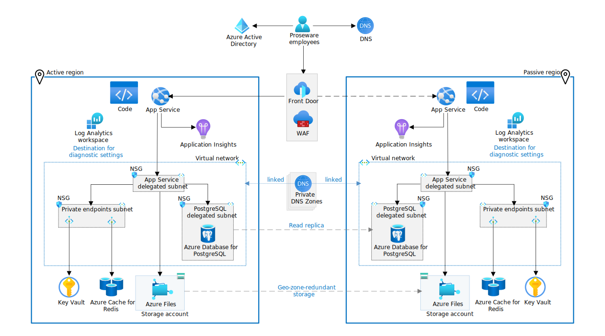
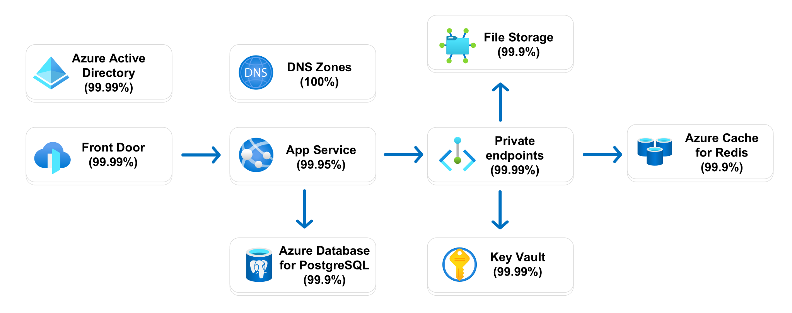

The reliable web app pattern is how you should update web apps moving to the cloud. It defines the implementation guidance to re-platform web apps the right way. There are two articles on the reliable web app pattern for Java. This article explains important decisions to plan the implementation of the pattern. The companion provides code and architecture guidance to [apply the pattern](apply-pattern.yml). There's a [reference implementation](https://github.com/Azure/reliable-web-app-pattern-java#reliable-web-app-pattern-for-java) (sample web app) of the pattern that you can deploy.

## Architecture

Your business context, existing web app, and service level objective (SLO) should determine the architecture of your web app. This guidance uses the reference implementation architecture to illustrate the principles of the reliable web app pattern (*see figure 1*). It's important that your web app adheres to the principles of the pattern, not necessarily this specific architecture.

*Figure 1. Target reference implementation architecture. Download a [Visio file](https://arch-center.azureedge.net/reliable-web-app-java.vsdx) of this architecture. See [Production environment](https://azure.com/e/65354031bc084e539b6c8ccfc1a7b097) and [Nonproduction environment](https://azure.com/e/af7d105ce24340dab93dfe666909a3e0) for an estimated cost.*

The following table lists the principles of the reliable web app pattern and how the pattern implements those principles in the web app.

| Reliable web app pattern principles | Implementation details |
| --- | --- |
| *Reliable web app pattern principles:* ▪ Minimal code changes ▪ Reliability design patterns ▪ Managed services  *Well Architected Framework principles:* ▪ Cost optimized ▪ Observable ▪ Ingress secure ▪ Infrastructure as code ▪ Identity-centric security|▪ Retry pattern   ▪ Circuit-breaker pattern  ▪ Cache-aside pattern  ▪ Rightsized resources  ▪ Managed identities  ▪ Private endpoints  ▪ Secrets management  ▪ Terraform deployment  ▪ Telemetry, logging, monitoring |

## Business context

For business context, we follow the cloud journey of a fictional company called Proseware. Company leadership at Proseware wants to expand their business into the education technology application market. After their initial technical research, they concluded that they can use their existing internal training web application as a starting point. The long term plan is to make the web app a customer facing application. Proseware needs to update the application to handle that increase in user load.

To reach these long term goals, Proseware calculated that moving the web app to the cloud offered the best return on investment. The cloud offered them a way to meet the increased business demand with minimal investments in the existing web app.

| Short-term app goals | Long-term app goals |
| --- | --- |
| ▪ Apply low-cost, high-value code changes ▪ Reach a service level objective of 99.9% ▪ Adopt DevOps practices ▪ Create cost-optimized environments  ▪ Improve reliability and security|▪ Expose the application customers ▪ Develop web and mobile experiences ▪ Improve availability  ▪ Expedite new feature delivery ▪ Scale components based on traffic.

## On-premises context

The on-premises starting point is a monolithic Java web application that runs a web based media stream called Airsonic. Airsonic is a well-known open-source project. For this guidance though, we act as if Proseware developed Airsonic in-house and owns all the code. Code ownership is more common scenario than an upstream dependency. The on-premises web app runs on an Apache Tomcat web server with a PostgreSQL database.

The web app is an employee-facing, LOB, training application. Proseware employees use the application to complete required HR training. The on-premises web application suffers from common challenges. These challenges include extended timelines to build and ship new features and difficulty scaling different application components under higher load.

## Service level objective

A service level objective (SLO) for availability defines how available you want a web app to be for users. Proseware has a target SLO of 99.9% for availability, about 8.77 hours of downtime per year. You need to define what availability means for your web application. For Proseware, the web app is considered available when employees can watch training videos 99.9% of the time. When you have a definition of *available*, list all the dependencies on the critical path of availability. Dependencies should include Azure services and third-party solutions.

For each dependency in the critical path, you need to assign an availability goal. Service Level Agreements (SLAs) from Azure provide a good starting point.

Keep in mind that SLAs don't factor in (1) downtime associated with the application code run on those services, (2) deployment and operations methodologies, or (3) architecture choices to connect the services. The availability metric you assign to a dependency shouldn't exceed the SLA. Proseware used Azure SLAs for Azure services (*see figure 2*).

*Figure 2. SLA dependency map. Azure SLAs are subject to change. The SLAs shown here are examples used to illustrate the process of estimating composite availability. For information, see [SLAs for Online Services](https://www.microsoft.com/licensing/docs/view/Service-Level-Agreements-SLA-for-Online-Services).*

Finally, you need to use the formulas for composite SLAs to estimate the composite availability of the dependencies on the critical path. This number should meet or exceed your SLO. Proseware needed a multi-region architecture to meet the 99.9% SLO. For more information, see:

- [Composite SLA formula](/azure/architecture/framework/resiliency/business-metrics#composite-slas)
- [Multiregional SLA formula](/azure/architecture/framework/resiliency/business-metrics#slas-for-multiregion-deployments)

## Choose the right services

The Azure services you choose should support your short-term objectives while preparing your application to meet any long-term goals. You should pick services that (1) meet the SLO for the production environment, (2) require minimal migration effort, and (3) support planned modernization efforts.

At this phase, it's important to select Azure services that mirror key on-premises choices to minimize the migration effort. For example, you should keep the same database engine (PostgreSQL -> Azure Database for PostgreSQL Flexible Server). Containerization of your application typically doesn't meet the short-term objectives of the reliable web app pattern, but the application platform you choose now should support containerization if it's a long-term goal. The two main requirements Proseware used when choosing Azure services were (1) an SLO of 99.9% for the production environment and (2) an average load of 1,000 users daily.

### Application platform

[Azure App Service](/azure/app-service/overview) is an HTTP-based managed service for hosting web applications, REST APIs, and mobile back ends. Azure has many viable [compute options](/azure/architecture/guide/technology-choices/compute-decision-tree). The web app uses Azure App Service because it meets the following requirements:

- **Natural progression.** On-premises, Proseware deployed a `war` file to a Tomcat server and wanted to minimize the amount of rearchitecting for that deployment model. App Service was a natural progression for Proseware, but Azure Spring Apps is an alternative.
- **High SLA.** It has a high SLA that meets the requirements for the production environment.
- **Reduced management overhead.** It's a fully managed hosting solution.
- **Containerization capability.** App Service works with private container image registries like Azure Container Registry. Proseware can use these registries to containerize the web app in the future.
- **Autoscaling.** The web app can rapidly scale up, down, in, and out based on user traffic.

Azure has a fully managed service specifically for Spring Boot apps (Azure Spring Apps), but Proseware concluded that the App Service platform introduces key hosting benefits of Spring Apps. Spring Apps introduces a larger disparity between the on-premises Tomcat servers than App Service. App Service also aligns better with the team's current level of cloud experience.

### Identity management

[Azure Active Directory (Azure AD)](/azure/active-directory/fundamentals/active-directory-whatis) is a cloud-based identity and access management service. It authenticates and authorizes users based on roles that integrate with applications. Azure AD provides the following abilities:

- **Authentication and authorization.** It handles authentication and authorization of employees.
- **Scalability.** It scales to support larger scenarios.
- **User-identity control.** Employees can use their existing enterprise identities.
- **Support for authorization protocols.** It supports OAuth 2.0 for managed identities and OpenID Connect for future B2C support.

### Database

[Azure Database for PostgreSQL](/azure/postgresql/flexible-server/overview) is a fully managed database service that provides single-server and flexible-server options. Proseware chose Azure Database for PostgreSQL and the flexible-server option to get the following benefits:

- **Reliability.** The flexible-server deployment model supports zone-redundant high availability across multiple availability zones. This configuration and maintains a warm standby server in a different availability zone within the same Azure region. The configuration replicates data synchronously to the standby server.
- **Cross-region replication.** It has a read replica feature that allows you to asynchronously replicate data to a [read-only replica database in another region](/azure/postgresql/flexible-server/concepts-read-replicas).
- **Performance.** It provides predictable performance and intelligent tuning to improve your database performance by using real usage data.
- **Reduced management overhead.** It's a fully managed Azure service that reduces management obligations.
- **Migration support.** It supports database migration from on-premises single-server PostgreSQL databases. You can use the [migration tool](/azure/postgresql/migrate/concepts-single-to-flexible) to simplify the migration process.
- **Consistency with on-premises configurations.** It supports [different community versions of PostgreSQL](/azure/postgresql/flexible-server/concepts-supported-versions), including the version that Proseware currently uses.
- **Resiliency.** The flexible server deployment automatically creates [server backups](/azure/postgresql/flexible-server/concepts-backup-restore) and stores them using zone-redundant storage (ZRS) within the same region. You can restore your database to any point-in-time within the backup retention period. The backup and restoration capability creates a better RPO (acceptable amount of data loss) than Proseware could create on-premises.

### Application performance monitoring

[Application Insights](/azure/azure-monitor/app/app-insights-overview) is a feature of Azure Monitor that provides extensible application performance management (APM) and monitoring for live web apps. The web app uses Application Insights for the following reasons:

- **Anomaly detection.** It automatically detects performance anomalies.
- **Troubleshooting.** It helps diagnose problems in the running app.
- **Telemetry.** It collects information about how users are using the app and allows you to easily send custom events that you want to track in your app.
- **Solving an on-premises visibility gap.** The on-premises solution didn't have APM. Application Insights provides easy integration with the application platform and code.

Azure Monitor is a comprehensive suite of monitoring tools for collecting data from various Azure services. For more information, see:

- [Application Monitoring for Azure App Service and Java](/azure/azure-monitor/app/azure-web-apps-java)
- [Smart detection in Application Insights](/azure/azure-monitor/alerts/proactive-diagnostics)
- [Application Map: Triage distributed applications](/azure/azure-monitor/app/app-map?tabs=java)
- [Usage analysis with Application Insights](/azure/azure-monitor/app/usage-overview)
- [Getting started with metrics explorer](/azure/azure-monitor/essentials/metrics-getting-started)
- [Application Insights Overview dashboard](/azure/azure-monitor/app/overview-dashboard)
- [Log queries in Azure Monitor](/azure/azure-monitor/logs/log-query-overview)

### Cache

[Azure Cache for Redis](/azure/azure-cache-for-redis/cache-overview) is a managed in-memory data store that's based on Redis software. The web app needs a cache that provides the following benefits:

- **Speed and volume.** It has high-data throughput and low latency reads for commonly accessed, slow-changing data.
- **Diverse supportability.** It's a unified cache location that all instances of the web app can use.
- **Externalized.** The on-premises application servers performed VM-local caching. This setup didn't offload highly frequented data, and it couldn't invalidate data.
- **Enabling non-sticky sessions:** The cache allows the web app to externalize session state use nonsticky sessions. Most Java web app running on premises use in-memory, client-side caching. In-memory, client-side caching doesn't scale well and increases the memory footprint on the host. By using Azure Cache for Redis, Proseware has a fully managed, scalable cache service to improve scalability and performance of their applications. Proseware was using a cache abstraction framework (Spring Cache) and only needed minimal configuration changes to swap out the cache provider. It allowed them to switch from an Ehcache provider to the Redis provider.

### External load balancer

Azure has three external load balancing services. Azure Application Gateway is a regional load balancer and can only route HTTP traffic within a region, not between regions. Azure Traffic Manager is a global load balancer that uses DNS to route traffic. Global load balancers can route traffic between regions. Azure Front Door is a modern content delivery network and global load balancer that routes HTTP traffic.

Single region web apps should use an Application Gateway v2 SKU with WAF policies. Multi-region web apps should use a different architecture. Multi-region web apps with WebSockets need to use Traffic Manager and Application Gateway. Traffic manager uses DNS to route traffic across regions and Application Gateway handles the HTTP and WebSockets connections within each region. All other web multi-region web apps should try [Azure Front Door](/azure/frontdoor/front-door-overview) first. Front Door can route HTTP traffic across multiple regions and provides performance acceleration.

Proseware needed a multi-region architecture to meet their 99.9% SLO. They chose an active-passive configuration to avoid code changes needed for an active-active configuration. The AirSonic web app uses WebSockets. To support WebSockets, Proseware needed to use Traffic Manager to load balance traffic between regions and Application Gateway in both regions for HTTP routing and WebSocket support. This architecture provides the following benefits:

- **WebSockets support.** Application Gateway natively [supports WebSockets](/azure/application-gateway/application-gateway-websocket) and requires no application code changes.
- **Security.** Application Gateway integrates with Azure Web Application Firewall.
- **Custom domains.** Application Gateway supports custom domain names.
- **Health probes.** Traffic Manager and Application Gateway both have built-in health probes.
- **Monitoring support.** You can configure alerts that integrate with Azure Monitor.
- **DDoS protection.** Application Gateway integrates with [Azure DDoS Protection](/azure/application-gateway/tutorial-protect-application-gateway-ddos).

### Web application firewall

[Azure Web Application Firewall](/azure/web-application-firewall/overview) helps provide centralized protection of your web applications from common exploits and vulnerabilities. WAF integrates with Application Gateway and Front Door. It helps prevent malicious attacks close to the attack sources before they enter your virtual network. Web Application Firewall provides the following benefits:

- **Global protection.** It provides increased global web app protection without sacrificing performance.
- **Botnet protection.** You can configure bot protection rules to monitor for botnet attacks.
- **Parity with on-premises.** It allows Proseware to maintain parity with its on-premises solution, which was running behind a web application firewall managed by IT.

### Secrets manager

[Azure Key Vault](/azure/key-vault/general/overview) provides centralized storage of application secrets so that you can control their distribution. It supports X.509 certificates, connection strings, and API keys to integrate with third-party services. Managed identities are the preferred solution for intra-Azure service communication, but the application still has secrets to manage. The on-premises web app stored secrets on-premises in code configuration files, but it's a better security practice to externalize secrets. The web app uses Key Vault because it provides the following features:

- **Encryption.** It supports encryption at rest and in transit.
- **Supports managed identities.** The application services can use managed identities to access the secret store.
- **Monitoring and logging.** It facilitates audit access and generates alerts when stored secrets change.
- **Integration.** It supports two methods for the web app to access secrets. You can use app settings in the hosting platform (App Service), or you can reference the secret in your application code (app properties file).

### File storage

Azure Files offers fully managed file shares in the cloud that are accessible via Server Message Block (SMB) protocol, Network File System (NFS) protocol, and Azure Files REST API. Proseware needs a file system for saving uploaded training videos. Proseware chose Azure Files for the following reasons:

- **Replaces existing file server.** Azure Files is a drop-in replacement for our on-premises network attached storage (NAS) solution. Azure Files allows Proseware to replace the existing file server without needing to modify code if they wanted to add blob storage. Azure Files simplifies the process of getting the app running on the cloud.
- **Fully managed service.** It enables Proseware to maintain compatibility without needing to manage hardware or an operating system for a file server.
- **Resiliency:** It has a geo-zone-redundant storage (GZRS) option that supports Proseware's disaster recovery plan. In the primary region, the GZRS option copies data synchronously across three Azure availability zones. In the secondary region, GZRS copies your data asynchronously to a single physical location in the secondary region. Within the secondary region, your data is copied synchronously three times.
- **Durability.** It has zone-redundant storage to improve data redundancy and application resiliency. For more information, see [Data redundancy](/azure/storage/common/storage-redundancy#redundancy-in-the-primary-region) and [Zone-redundant storage](/azure/storage/common/storage-redundancy#zone-redundant-storage).

### Endpoint security

[Azure Private Link](/azure/private-link/private-link-overview) provides access to PaaS services (like Azure Cache for Redis and Azure Database for PostgreSQL) over a private endpoint in your virtual network. Traffic between your virtual network and the service travels across the Microsoft backbone network. Azure Private DNS with Azure Private Link enables your solution to communicate with Azure services without requiring application changes. The web app uses Private Link for the following reasons:

- **Enhanced security.** It lets the application privately access services on Azure and reduces the network footprint of data stores to help protect against data leakage.
- **Minimal effort.** Private endpoints support the web application platform and the database platform that the web app uses. Both platforms mirror the existing on-premises setup, so minimal changes are required.

## Deploy the reference implementation

You can deploy the reference implementation by following the instructions in the [Reliable web app pattern for Java repository](https://github.com/Azure/reliable-web-app-pattern-java#reliable-web-app-pattern-for-java). Use the deployment guide to set up a local development environment and deploy the solution to Azure.

## Next step

This article describes how to plan the implementation for the reliable web app pattern. The next step is to apply the reliable web app pattern.

>[!div class="nextstepaction"]
>[Apply the reliable web app pattern for Java](plan-implementation.yml)
