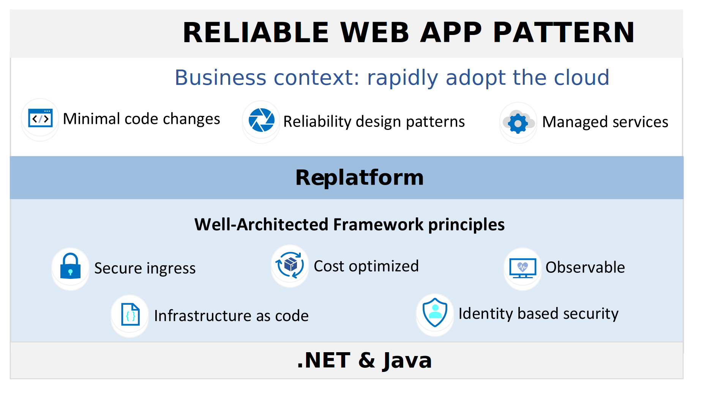

# Reliable web app pattern

The reliable web app pattern provides prescriptive implementation guidance for web apps moving to the cloud. The pattern shows you how to re-platform web apps with the minimal changes to need to make to be successful in the cloud. It focuses on adopting reliability design patterns and managed services so that you can rapidly adopt the cloud to meet your short and long term business goals (*see Figure 1*).

*Figure 1. Overview of the reliable web app pattern.*

The reliable web app pattern builds on the pillars of the Azure Well-Architected Framework. The enterprise app patterns adheres to Azure Well-Architected principles and highlights several that are essential for the cloud adoption journey. These essential principles are secure ingress, cost optimized, observable, infrastructure as code, and identity based security

## Next steps

There's implementation guidance for for .NET and Java web apps. Both have a reference implementation (sample web app) that you should deploy. Use the following buttons to find the guidance and reference implementation.

>[!div class="nextstepaction"]
>[Reliable web app pattern for .NET](./dotnet/plan-implementation.yml)

>[!div class="nextstepaction"]
>[Reliable web app pattern for Java](./java/plan-implementation.yml)
