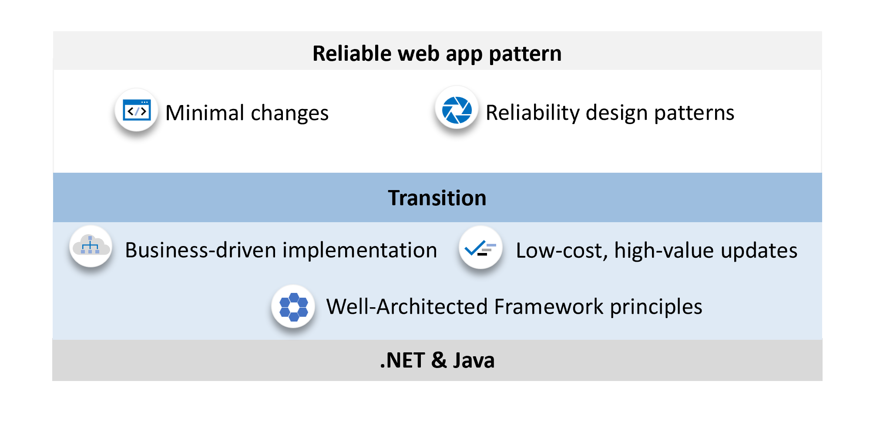

# Reliable web app pattern

The reliable web app pattern details essential implementation guidance for migrating on-premises .NET and Java web apps to the cloud. It builds on the overarching principles of the enterprise app patterns. and focuses on the minimal changes you need to make to ensure your web app is successful in the cloud. Three code-level design patterns are central. The implementation guidance shows you how to apply the Retry, Circuit breaker, and Cache aside patterns.

## Why the reliable web app pattern?

It's not always clear how to migrate a web app to the cloud or you might not be aware of the implementation changes you could and should make. The reliable web app pattern resolves this ambiguity. It tells you what you should to migrate web apps to the cloud successfully and how to do it with code examples.

 The code examples come from a companion sample application (reference implementations) that you can deploy. There's one for .NET and Java. These reference implementations apply the reliable web app pattern. For more information, see:

- [.NET reference implementation](https://aka.ms/eap/rwa/dotnet)
- [Java reference implementation](https://github.com/Azure/reliable-web-app-pattern-java#reliable-web-app-pattern-for-java)

**Minimal code changes** The reliable web app focuses on the fewest changes you need to make to implement WAF guidance. The minimal code changes the pattern outlines help webs take advantage of the cloud faster. This approach helps business meet objectives, reduce development costs, and shorten the time to market.

**Business-driven implementation.** The reliable web app pattern outline how you should approach the service level objective (SLO) for availability. An SLO for availability defines how available you want a web app to be for users. There's no universal SLO. Rather, your business needs should drive the SLO your web app needs to have.

## Next steps

The following reliable web app articles provide the implementation guidance you need to migrate .NET and Java web apps to the cloud.

>[!div class="nextstepaction"]
>[Reliable web app for .NET](./dotnet/pattern-overview.yml)
>[!div class="nextstepaction"]
>[Reliable web app for Java](./java/plan-implementation.yml)
