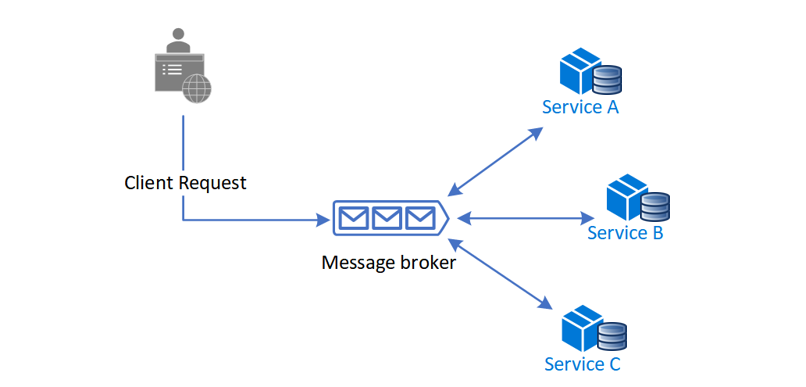
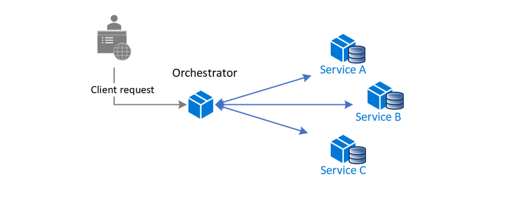

The Saga design pattern is a way to manage data consistency across microservices in distributed transaction scenarios. A saga is a sequence of transactions that updates each service and publishes a message or event to trigger the next transaction step. If a step fails, the saga executes compensating transactions that counteract the preceding transactions.

## Context and problem

A *transaction* is a single unit of logic or work, sometimes made up of multiple operations. Within a transaction, an *event* is a state change that occurs to an entity, and a *command* encapsulates all information needed to perform an action or trigger a later event.

Transactions must be *atomic, consistent, isolated, and durable (ACID)*. Transactions within a single service are ACID, but cross-service data consistency requires a cross-service transaction management strategy.

In multiservices architectures:
- *Atomicity* is an indivisible and irreducible set of operations that must all occur or none occur.
- *Consistency* means the transaction brings the data only from one valid state to another valid state.
- *Isolation* guarantees that concurrent transactions produce the same data state that sequentially executed transactions would have produced.
- *Durability* ensures that committed transactions remain committed even in case of system failure or power outage.

A [database-per-microservice](/dotnet/architecture/cloud-native/distributed-data#database-per-microservice-why) model provides many benefits for microservices architectures. Encapsulating domain data lets each service use its best data store type and schema, scale its own data store as necessary, and be insulated from other services' failures. However, ensuring data consistency across service-specific databases poses challenges.

Distributed transactions like the [two-phase commit (2PC)](https://en.wikipedia.org/wiki/Two-phase_commit_protocol) protocol require all participants in a transaction to commit or roll back before the transaction can proceed. However some participant implementations, such as NoSQL databases and message brokering, don't support this model.

Another distributed transaction limitation is [interprocess communication (IPC)](https://en.wikipedia.org/wiki/Inter-process_communication) synchronicity and availability. Operating system-provided IPC allows separate processes to share data. For distributed transactions to commit, all participating services must be available, potentially reducing overall system availability. Architectural implementations with IPC or transaction limitations are candidates for the Saga pattern.

## Solution

The Saga pattern provides transaction management using a sequence of *local transactions*. A local transaction is the atomic work effort performed by a saga participant. Each local transaction updates the database and publishes a message or event to trigger the next local transaction in the saga. If a local transaction fails, the saga executes a series of *compensating transactions* that undo the changes that were made by the preceding local transactions.

In Saga patterns:
- *Compensable transactions* are transactions that can potentially be reversed by processing another transaction with the opposite effect.
- A *pivot transaction* is the go/no-go point in a saga. If the pivot transaction commits, the saga runs until completion. A pivot transaction can be a transaction that is neither compensable nor retryable, or it can be the last compensable transaction or the first retryable transaction in the saga.
- *Retryable transactions* are transactions that follow the pivot transaction and are guaranteed to succeed.

There are two common saga implementation approaches, *choreography* and *orchestration*. Each approach has its own set of challenges and technologies to coordinate the workflow.

### Choreography

Choreography is a way to coordinate sagas where participants exchange events without a centralized point of control. With choreography, each local transaction publishes domain events that trigger local transactions in other services.

#### Benefits

- Good for simple workflows that require few participants and don't need a coordination logic.
- Doesn't require additional service implementation and maintenance.
- Doesn't introduce a single point of failure, since the responsibilities are distributed across the saga participants.

#### Drawbacks

- Workflow can become confusing when adding new steps, as it's difficult to track which saga participants listen to which commands.
- There's a risk of cyclic dependency between saga participants because they have to consume each other's commands.
- Integration testing is difficult because all services must be running to simulate a transaction.

### Orchestration

Orchestration is a way to coordinate sagas where a centralized controller tells the saga participants what local transactions to execute. The saga orchestrator handles all the transactions and tells the participants which operation to perform based on events. The orchestrator executes saga requests, stores and interprets the states of each task, and handles failure recovery with compensating transactions.

#### Benefits

- Good for complex workflows involving many participants or new participants added over time.
- Suitable when there is control over every participant in the process, and control over the flow of activities.
- Doesn't introduce cyclical dependencies, because the orchestrator unilaterally depends on the saga participants.
- Saga participants don't need to know about commands for other participants. Clear separation of concerns simplifies business logic.

#### Drawbacks

- Additional design complexity requires an implementation of a coordination logic.
- There's an additional point of failure, because the orchestrator manages the complete workflow.

## Issues and considerations

Consider the following points when implementing the Saga pattern:

- The Saga pattern may initially be challenging, as it requires a new way of thinking on how to coordinate a transaction and maintain data consistency for a business process spanning multiple microservices.
- The Saga pattern is particularly hard to debug, and the complexity grows as participants increase.
- Data can't be rolled back, because saga participants commit changes to their local databases.
- The implementation must be capable of handling a set of potential transient failures, and provide *idempotence* for reducing side-effects and ensuring data consistency. Idempotence means that the same operation can be repeated multiple times without changing the initial result. For more information, see the [guidance on ensuring idempotence when processing messages and updating state together](/azure/architecture/reference-architectures/containers/aks-mission-critical/mission-critical-data-platform#idempotent-message-processing).
- It's best to implement observability to monitor and track the saga workflow.
- The lack of participant data isolation imposes durability challenges. The saga implementation must include countermeasures to reduce anomalies.

The following anomalies can happen without proper measures:
- *Lost updates*, when one saga writes without reading changes made by another saga.
- *Dirty reads*, when a transaction or a saga reads updates made by a saga that has not yet completed those updates.
- *Fuzzy/nonrepeatable reads*, when different saga steps read different data because a data update occurs between the reads.

Suggested countermeasures to reduce or prevent anomalies include:
- *Semantic lock*, an application-level lock where a saga's compensable transaction uses a semaphore to indicate an update is in progress.
- *Commutative updates* that can be executed in any order and produce the same result.
- *Pessimistic view:* It's possible for one saga to read dirty data, while another saga is running a compensable transaction to roll back the operation. Pessimistic view reorders the saga so the underlying data updates in a retryable transaction, which eliminates the possibility of a dirty read.
- *Reread value* verifies that data is unchanged, and then updates the record. If the record has changed, the steps abort and the saga may restart.
- A *version file* records the operations on a record as they arrive, and then executes them in the correct order.
- *By value* uses each request's business risk to dynamically select the concurrency mechanism. Low-risk requests favor sagas, while high-risk requests favor distributed transactions.

## When to use this pattern

Use the Saga pattern when you need to:

- Ensure data consistency in a distributed system without tight coupling.
- Roll back or compensate if one of the operations in the sequence fails.

The Saga pattern is less suitable for:

- Tightly coupled transactions.
- Compensating transactions that occur in earlier participants.
- Cyclic dependencies.

## Example

[Orchestration-based Saga on Serverless](https://github.com/Azure-Samples/saga-orchestration-serverless) is a saga implementation reference using the orchestration approach that simulates a money transfer scenario with successful and failed workflows.

## Next steps

- [Distributed data](/dotnet/architecture/cloud-native/distributed-data)
- Richardson, Chris. 2018: *Microservices Patterns*. Manning Publications.

## Related resources

The following patterns might also be useful when implementing this pattern:

- [Choreography](../../patterns/choreography.yml) has each component of the system participate in the decision-making process about the workflow of a business transaction, instead of relying on a central point of control.
- [Compensating transactions](../../patterns/compensating-transaction.yml) undo work performed by a series of steps, and eventually define a consistent operation if one or more steps fail. Cloud-hosted applications that implement complex business processes and workflows often follow this *eventual consistency model*.
- [Retry](../../patterns/retry.yml) lets an application handle transient failures when it tries to connect to a service or network resource, by transparently retrying the failed operation. Retry can improve the stability of the application.
- [Circuit breaker](../../patterns/circuit-breaker.yml) handles faults that take a variable amount of time to recover from, when connecting to a remote service or resource. Circuit breaker can improve the stability and resiliency of an application.
- [Health endpoint monitoring](../../patterns/health-endpoint-monitoring.yml) implements functional checks in an application that external tools can access through exposed endpoints at regular intervals. Health endpoint monitoring can help verify that applications and services are performing correctly.
