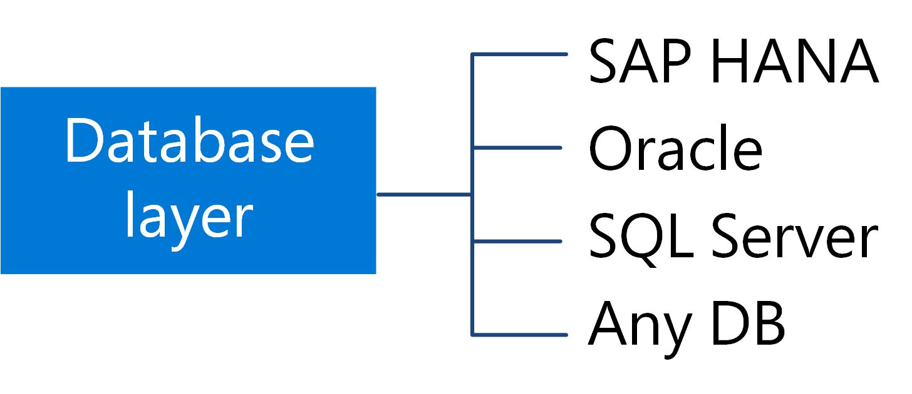
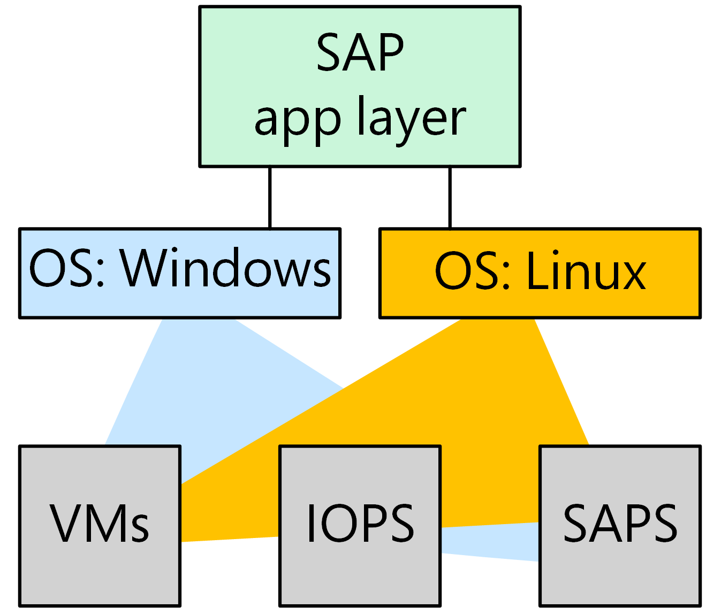

# Considerations for hosting and running SAP workloads on Azure
[!INCLUDE [header](../../_includes/header.md)]

This article compares options for running SAP application and data layers on Azure. We provide a reference architecture and a deployable solution for each option.

## Database considerations

Text here.

The choices:

- **Aaaa**.  Lorem ipsum dolor set amet.

- **Bbbbb**. Lorem ipsum dolor set amet.

- **Cccc**.  Lorem ipsum dolor set amet.

    > [!NOTE]
    > [ExpressRoute][expressroute] is the recommended Azure service for creating private connections that do not go over the  public Internet.
 

## Operating system considerations

Text here about Windows and Linux considerations.

## Taka's table goes here

SAPS, VMs, IOPs details.

## Learn more

* [SAP Web Dispatcher][swd] in the SAP Documentation.

* [Clustering SAP ASCS on Azure][clustering].

* “Networking” in  [Building High Availability for SAP NetWeaver and SAP HANA][sap-ha].

* [Multiple VM NICs and Network Virtual Appliances in Azure][multiple-vm-nics].

* [SAP note 1943937 - Hardware Configuration Check Tool][sap-1943937].

* [SAP note 1928533 - SAP Applications on Azure: Supported Products and Azure VM Types][sap-1928533].

* [Azure Large Instances][azure-large-instances] 

* [Backup guide for SAP HANA on Azure Virtual Machines][hana-backup] and the [Azure Backup service FAQ][backup-faq].

* [SAP HANA Security - An Overview][sap-security]. (A SAP Service Marketplace account is required for access.)

## Communities
Communities can answer questions and help you set up a successful deployment. Consider the following:

* [Running SAP Applications on the Microsoft Platform Blog][running-sap-blog]
* [Azure Forum][azure-forum]
* [SAP Community][sap-community]
* [Stack Overflow SAP][stack-overflow]

To estimate the cost of deployment, see the [Azure Pricing Calculator][azure-pricing]. 

> [!NOTE]
> For SAP installation instructions, you must have a SAP Support Portal username and password to download the [SAP installation guides][sap-guide].

[azure-cli]: https://docs.microsoft.com/en-us/cli/azure/install-azure-cli
[azure-forum]: https://azure.microsoft.com/en-us/support/forums/
[azure-large-instances]: /azure/virtual-machines/workloads/sap/hana-overview-architecture
[azure-lb]: /azure/load-balancer/load-balancer-overview
[azure-storage]: /azure/storage/storage-standard-storage
[azure-trust-center]: https://azure.microsoft.com/en-us/support/trust-center/
[backup-faq]: /azure/backup/backup-azure-backup-faq
[clustering]: https://blogs.msdn.microsoft.com/saponsqlserver/2015/05/20/clustering-sap-ascs-instance-using-windows-server-failover-cluster-on-microsoft-azure-with-sios-datakeeper-and-azure-internal-load-balancer/
[cool-blob-storage]: /azure/storage/storage-blob-storage-tiers
[disk-encryption]: /azure/security/azure-security-disk-encryption
[expressroute]: /azure/architecture/reference-architectures/hybrid-networking/expressroute
[filter-network]: https://azure.microsoft.com/en-us/blog/multiple-vm-nics-and-network-virtual-appliances-in-azure/
[github]: https://github.com/mspnp/reference-architectures/tree/master/sap/sap-hana
[hana-backup]: /azure/virtual-machines/workloads/sap/sap-hana-backup-guide
[hana-guide]: https://help.sap.com/viewer/2c1988d620e04368aa4103bf26f17727/2.0.01/en-US/7eb0167eb35e4e2885415205b8383584.html
[ilb]: /azure/load-balancer/load-balancer-internal-overview
[logon-groups]: https://wiki.scn.sap.com/wiki/display/SI/ABAP+Logon+Group+based+Load+Balancing
[managed-disks]: /azure/storage/storage-managed-disks-overview
[monitoring]: /azure/architecture/best-practices/monitoring
[multiple-vm-nics]: https://azure.microsoft.com/en-us/blog/multiple-vm-nics-and-network-virtual-appliances-in-azure/
[netweaver-on-azure]: /azure/virtual-machines/workloads/sap/planning-guide
[nsg]: /azure/virtual-network/virtual-networks-n
[planning]: /azure/vpn-gateway/vpn-gateway-plan-design
[protecting-sap]: https://blogs.msdn.microsoft.com/saponsqlserver/2016/05/06/protecting-sap-systems-running-on-vmware-with-azure-site-recovery/
[ref-arch]: /azure/architecture/reference-architectures/
[running-SAP]: https://blogs.msdn.microsoft.com/saponsqlserver/2016/06/07/sap-on-sql-general-update-for-customers-partners-june-2016/
[running-sap-blog]: https://blogs.msdn.microsoft.com/saponsqlserver/2017/05/04/sap-on-azure-general-update-for-customers-partners-april-2017/
[sap-1943937]: https://launchpad.support.sap.com/#/notes/1943937
[sap-1928533]: https://launchpad.support.sap.com/#/notes/1928533
[sap-community]: https://www.sap.com/community.html
[sap-dispatcher]: https://help.sap.com/doc/saphelp_nw73ehp1/7.31.19/en-US/48/8fe37933114e6fe10000000a421937/frameset.htm
[sap-dispatcher-ha]: https://help.sap.com/doc/saphelp_nw73ehp1/7.31.19/en-US/48/9a9a6b48c673e8e10000000a42189b/frameset.htm
[sap-dispatcher-install]: https://wiki.scn.sap.com/wiki/display/SI/Web+Dispatcher+Installation
[sap-guide]: https://service.sap.com/instguides
[sap-ha]: https://support.sap.com/content/dam/SAAP/SAP_Activate/AGS_70.pdf
[sap-hana-on-azure]: https://azure.microsoft.com/en-us/services/virtual-machines/sap-hana/
[sap-netweaver-dr]: http://download.microsoft.com/download/9/5/6/956FEDC3-702D-4EFB-A7D3-2DB7505566B6/SAP%20NetWeaver%20-%20Building%20an%20Azure%20based%20Disaster%20Recovery%20Solution%20V1_5%20.docx
[sap-security]: https://archive.sap.com/documents/docs/DOC-62943
[sla]: https://azure.microsoft.com/support/legal/sla/virtual-machines
[stack-overflow]: http://stackoverflow.com/tags/sap/info
[swd]: https://help.sap.com/doc/saphelp_nw70ehp2/7.02.16/en-us/48/8fe37933114e6fe10000000a421937/frameset.htm
[template-bb]: https://github.com/mspnp/template-building-blocks/wiki
[white-papers]: https://azure.microsoft.com/en-us/blog/azure-compliance-white-paper-o-rama/

