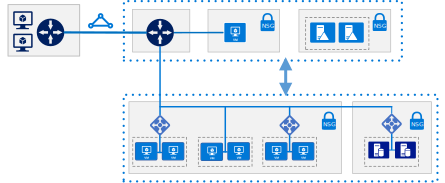
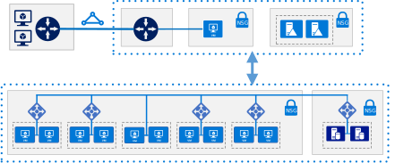
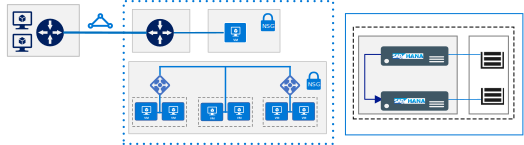

# SAP on Azure reference architectures

These reference architectures show proven practices for running a production SAP deployment on Azure. The architectures are configured for high availability and disaster recovery (HADR).

<ul class="panelContent">
<li style="display: flex; flex-direction: column;">
    <a href="./sap-netweaver.md" style="display: flex; flex-direction: column; flex: 1 0 auto;">
        

            

                

                    

                        

                            
                        

                    

                    

                        <h3>SAP NetWeaver for AnyDB</h3>
                        
Run SAP NetWeaver in a Windows environment.

This reference architecture targets AnyDB, the SAP term for any supported DBMS besides SAP HANA.

                    

                

            

        

    </a>
</li>
<li style="display: flex; flex-direction: column;">
    <a href="./sap-s4hana.md" style="display: flex; flex-direction: column; flex: 1 0 auto;">
        

            

                

                    

                        

                            
                        

                    

                    

                        <h3>SAP S/4HANA</h3>
                        
Run SAP S/4HANA in a Linux environment.

                    

                

            

        

    </a>
</li>
<li style="display: flex; flex-direction: column;">
    <a href="./hana-large-instances.md" style="display: flex; flex-direction: column; flex: 1 0 auto;">
        

            

                

                    

                        

                            
                        

                    

                    

                        <h3>SAP HANA on Azure Large Instances</h3>
                        
HANA Large Instances are deployed on physical servers in Azure regions.

                    

                

            

        

    </a>
</li>
</ul>
