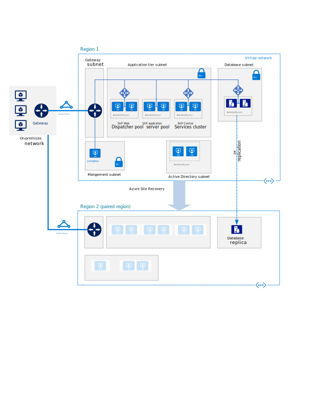
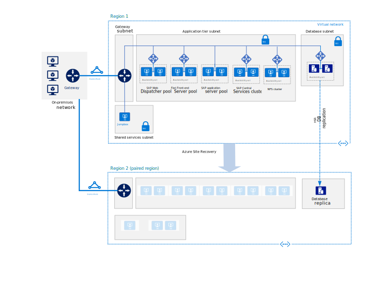
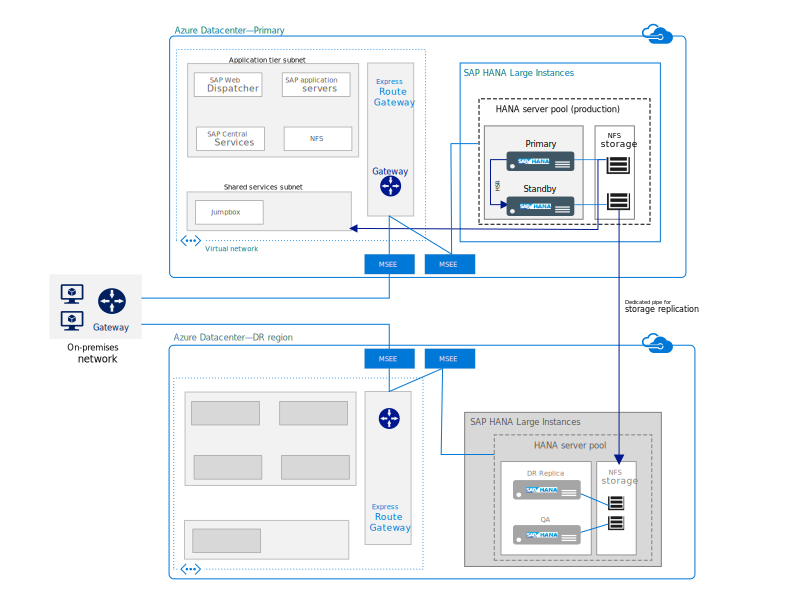

<!-- This file is generated! -->
<!-- See the templates in ./build/reference-architectures  -->
<!-- See data in index.json -->

# SAP Reference Architectures on Azure

These reference architectures show proven pratices for reliably hosting and running SAP application and data layers on Azure. [For more SAP on Azure](https://docs.microsoft.com/en-us/azure/virtual-machines/workloads/sap/get-started)

<section class="series">
    <ul class="panelContent">
    <!-- Deploy SAP NetWeaver (Windows) for AnyDB on Azure Virtual Machines -->
<li style="display: flex; flex-direction: column;">
    <a href="./SAP-NetWeaver-Windows-anydb.md" style="display: flex; flex-direction: column; flex: 1 0 auto;">
        

            

                

                    

                        

                            
                        

                    

                    

                        <h3>Deploy SAP NetWeaver (Windows) for AnyDB on Azure Virtual Machines</h3>
                        
Baseline recommendations for running SAP Netweaver in a high availability environment.

                    

                

            

        

    </a>
</li>
    <!-- Deploy SAP S/4HANA for Linux Virtual Machines on Azure -->
<li style="display: flex; flex-direction: column;">
    <a href="./s4HANA-linux.md" style="display: flex; flex-direction: column; flex: 1 0 auto;">
        

            

                

                    

                        

                            
                        

                    

                    

                        <h3>Deploy SAP S/4HANA for Linux Virtual Machines on Azure</h3>
                        
Recommendations for running S/4HANA with Fiori in a high availability environment.

                    

                

            

        

    </a>
</li>
    <!-- Run SAP HANA (Large Instances) on Azure -->
<li style="display: flex; flex-direction: column;">
    <a href="./SAP-HANA-Large-Instances-HADR.md" style="display: flex; flex-direction: column; flex: 1 0 auto;">
        

            

                

                    

                        

                            
                        

                    

                    

                        <h3>Run SAP HANA (Large Instances) on Azure</h3>
                        
Deployment of SAP HANA on physical servers in Azure datacenters with high availability and disaster recovery.

                    

                

            

        

    </a>
</li>
    </ul>
</section>

<ul class="panelContent cardsI">
</ul>