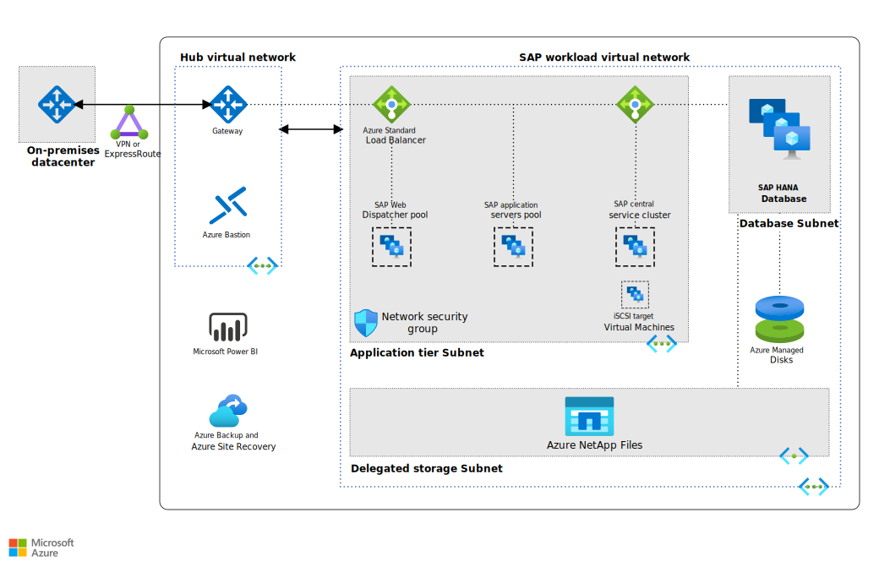

The following example focuses specifically on the SAP BW/4HANA application tier. It's suitable for a small-scale production environment of SAP BW/4HANA on Azure, where high availability is a priority.

## Architecture

*Download a [Visio file](https://arch-center.azureedge.net/sap-bw4hana.vsdx) of this architecture.*

### Components

This architecture makes use of the following technologies:

- [Azure Virtual Network](https://azure.microsoft.com/products/virtual-network) (VNet) securely connects Azure resources to each other and to an on-premises environment. In this architecture, multiple VNets are [peered together](/azure/virtual-network/virtual-network-peering-overview).

- [Linux virtual machines](https://azure.microsoft.com/products/virtual-machines/linux) are used for the application tier, including:
  - The SAP BusinessObjects (BOBJ) server pool.
  - The SAP Web Dispatcher pool.
  - The application servers pool.
  - The SAP Central Services cluster.

- [Load balancers](https://azure.microsoft.com/solutions/load-balancing-with-azure) direct traffic to virtual machines in the application subnet. For high availability, this example uses [SAP Web Dispatcher](https://help.sap.com/saphelp_nwce72/helpdata/en/48/8fe37933114e6fe10000000a421937/content.htm?no_cache=true) and [Azure Standard Load Balancer](/azure/load-balancer/load-balancer-overview). These two services also support capacity extension by scaling out, or you can use Azure Application Gateway or other partner products, depending on the traffic type and required functionality you need, such as Secure Sockets Layer (SSL) termination and forwarding.

- [Network security groups](/azure/virtual-network/security-overview) (NSGs) attach to a subnet or to the network interface cards (NICs) on a virtual machine. NSGs are used to restrict incoming, outgoing, and intra-subnet traffic in the virtual network.

- [Azure Bastion](https://azure.microsoft.com/products/azure-bastion) provides secure access through the Azure portal to virtual machines that run in Azure, without using a jumpbox and its associated public IP address. This mechanism limits internet-facing exposure.

- [Azure Managed Disks.](https://azure.microsoft.com/products/storage/disks) Premium or Ultra storage disks are recommended. These storage types provide data persistence for virtual machines with the SAP workload.

- [Azure NetApp Files](https://azure.microsoft.com/products/netapp) supports shared storage when using a cluster. It also supports shared storage when you need high-performance storage that can host SAP HANA data and log files. Azure NetApp Files is fully managed and scalable enough to meet the demands of most applications. It gives bare-metal performance, submillisecond latency, and integrated data management for your complex enterprise workloads on:
  - SAP HANA.
  - High-performance computing.
  - LOB applications.
  - High-performance file shares.
  - Virtual desktop infrastructure.

- [Power BI](https://azure.microsoft.com/products/power-bi-embedded) enables users to access and visualize SAP BW/4HANA data from their Windows desktop. Installation requires the [SAP BW Connector](/power-bi/desktop-sap-bw-connector) (implementation 2.0).

  Microsoft Power BI Desktop imports data from various SAP sources, such as SAP BW/4HANA, for analysis and visualization. Power BI also complements SAP BusinessObjects Universe by offering a business context or a semantics layer over the raw information.

- [Azure Backup](https://azure.microsoft.com/products/backup) is an SAP Backint-certified data protection solution for SAP HANA in single-instance and scale-up deployments. Azure Backup also protects Azure Virtual Machines with general workloads.

- [Azure Site Recovery](https://azure.microsoft.com/products/site-recovery) is recommended as part of an automated disaster recovery solution for a multitier SAP NetWeaver application deployment. The [support matrix](/azure/site-recovery/azure-to-azure-support-matrix) details the capabilities and restrictions of this solution.

### Alternatives

- To help protect SAP global host files for SAP Central Services and the SAP transport directory, you can deploy [Network File System](/azure/virtual-machines/workloads/sap/high-availability-guide-suse-nfs) (NFS) servers in a failover cluster configuration.

- [SIOS Protection Suite](https://us.sios.com/solutions/cloud-high-availability/azure), available in Azure Marketplace, can be used to protect the global host files for Central Services instead of NFS or Azure NetApp Files.

- [Azure Application Gateway](/azure/application-gateway/features) is a web traffic load balancer. In one service, it provides SSL termination, a Web Application Firewall (WAF) service, and other handy high-availability and scalability features. Some SAP deployments have used it as a [gateway for the SAP Fiori front end](https://www.linkedin.com/pulse/internet-facing-sap-fiori-access-azure-firewall-gateway-apparao-sanam) in their production landscape.

## Scenario details

SAP BW/4HANA is an enterprise data warehouse solution designed for the cloud and optimized for the SAP HANA platform. The following example focuses specifically on the SAP BW/4HANA application tier. It's suitable for a small-scale production environment of SAP BW/4HANA on Azure, where high availability is a priority.

This example workload also draws on the foundation of a pair of SAP on Azure reference architectures: [SAP NetWeaver (Windows) for AnyDB on virtual machines](/azure/architecture/guide/sap/sap-netweaver) and [SAP S/4HANA for Linux virtual machines on Azure](/azure/architecture/guide/sap/sap-s4hana). A similar deployment approach is used for SAP BW/4HANA workloads. The application layer is deployed using virtual machines that can be changed in size to accommodate your organization's needs.

The network layout has been simplified to demonstrate recommended architectural principles for an Azure enterprise deployment based on a [hub-spoke topology](../hybrid-networking/hub-spoke.yml).

> [!NOTE]
> Many deployment considerations apply when deploying SAP workloads on Azure. For more ideas and further information, see the [SAP on Azure planning and deployment checklist](/azure/virtual-machines/workloads/sap/sap-deployment-checklist).

For details about the data persistence layer, see:

- [Run SAP HANA on Azure (Large Instances)](./hana-large-instances.yml)

- [Run SAP HANA on Linux virtual machines](./run-sap-hana-for-linux-virtual-machines.yml)

### Potential use cases

This scenario is relevant to the following use cases:

- Deployment of the SAP application layer separate from the DBMS layer

- Disaster recovery (DR) scenarios

- Deployments of the SAP application tier

## Recommendations

This architecture is designed for high availability, scalability, and resilience. For the best results on Azure, consider the recommendations in this section. Also, many of the recommendations for running SAP S/4HANA on Azure also apply to SAP BW/4HANA deployments. For details about SAP S/4HANA on Azure, see the [reference architecture](/azure/architecture/guide/sap/sap-s4hana).

### Virtual machines

For details about SAP support for Azure virtual machine types and throughput metrics (SAPS), see [SAP Note 1928533](https://launchpad.support.sap.com/#/notes/1928533), &quot;SAP Applications on Azure: Supported Products and Azure Virtual Machine Types.&quot; (To access this and other SAP notes, an SAP Service Marketplace account is required.)

For information about whether a virtual machine type has been certified for scale-out deployments of SAP HANA, see the &quot;Scale-out&quot; column in the [SAP HANA Hardware Directory](https://www.sap.com/dmc/exp/2014-09-02-hana-hardware/enEN/iaas.html#categories=Microsoft%20Azure).

### Application servers pool

In application servers pool, you can adjust the number of virtual machines based on your requirements. [Azure is certified](/azure/virtual-machines/workloads/sap/sap-certifications) to run SAP BW/4HANA on Red Hat Enterprise Linux and SUSE Linux Enterprise.

To manage logon groups for ABAP application servers, it's common to use the SMLG transaction to load-balance different groups, such as:

- Logon users.
- SM61 for batch server groups.
- RZ12 for RFC groups.

These transactions use the load-balancing capability within the message server of Central Services to distribute incoming sessions or workload among SAP application servers pool for SAP GUIs and RFC traffic.

### SAP Central Services cluster

This example shows a highly available cluster that uses Azure NetApp Files as a shared file storage solution. High availability for the Central Services cluster requires shared storage. Azure NetApp Files provides a simple highly available option so you don't have to deploy a Linux cluster infrastructure. An alternative is to set up a highly available [NFS service](/azure/virtual-machines/workloads/sap/high-availability-guide-suse#setting-up-a-highly-available-nfs-server).

You can also deploy Central Services to a single virtual machine with Premium-managed disks and get a 99.9-percent availability [SLA](https://azure.microsoft.com/support/legal/sla/virtual-machines/v1_9).

The virtual machines used for the application servers support multiple IP addresses per NIC. This feature supports the SAP recommended practice of using virtual host names for installations as outlined in [SAP Note 962955](https://launchpad.support.sap.com/#/notes/962955). Virtual host names decouple the SAP services from the physical host names and make it easier to migrate services from one physical host to another. This principle also applies to cloud virtual machines.

Application servers are connected to the highly available Central Services on Azure through the virtual host names of the Central Services or ERS services. These host names are assigned to the cluster front-end IP configuration of the load balancer. A load balancer supports many front-end IPs. Both the Central Services and ERS virtual IPs (VIPs) can be bound to one load balancer.

#### Multi-SID installation

Azure also supports high availability in a [multi-SID installation](/azure/virtual-machines/workloads/sap/sap-ascs-ha-multi-sid-wsfc-shared-disk) of the Linux and Windows clusters that host Central Services (ASCS/SCS). For details about deploying to a Pacemaker cluster, see the Azure multi-SID documentation for:

- [Windows](/azure/virtual-machines/workloads/sap/sap-ascs-ha-multi-sid-wsfc-shared-disk).
- [Red Hat Linux](/azure/virtual-machines/workloads/sap/high-availability-guide-rhel-multi-sid).
- [SUSE Linux](/azure/virtual-machines/workloads/sap/high-availability-guide-suse-multi-sid).

#### Proximity placement groups

This example architecture also uses a [proximity placement group](/azure/virtual-machines/workloads/sap/sap-proximity-placement-scenarios) to reduce network latency between virtual machines. This type of group places a location constraint on virtual machine deployments and minimizes the physical distance between them. The group's placement varies as follows:

- In a single SID installation, you should place all Central Services and application servers in the proximity placement group anchored by the SAP HANA database.

- In a multi-SID installation, you have the freedom to associate the Central Services and application servers with any single proximity placement group that's anchored by SAP HANA containers of different SIDs.

### Database

SAP BW/4HANA is designed for the SAP HANA database platform. Azure provides three scalability and deployment options:

- [In a scale-up SAP HANA deployment](./run-sap-hana-for-linux-virtual-machines.yml), the database tier uses two or more Linux virtual machines in a cluster to achieve high availability.

- A [scale-out deployment of SAP HANA](/azure/virtual-machines/workloads/sap/sap-planning-supported-configurations#sap-hana-scale-out-scenarios) is supported for some virtual machine types.

### Storage

This example uses [Premium managed disks](/azure/virtual-machines/windows/disks-types#premium-ssd) for the non-shared storage of the application servers. It also uses [Azure NetApp Files](/azure/virtual-machines/workloads/sap/high-availability-guide-suse-nfs) for cluster shared storage.

[Azure Premium SSD v2](https://azure.microsoft.com/en-us/updates/general-availability-azure-premium-ssd-v2-disk-storage/) is generally available now.  Premium SSD v2 Disk Storage is the most advanced general purpose block storage solution available, designed for performance-critical workloads like SAP. Refer to the [Deploy a Premium SSD v2](/azure/virtual-machines/disks-deploy-premium-v2?tabs=azure-cli) article for the storage solution's benefits and its current limitation.

[Ultra Disk Storage](/azure/virtual-machines/linux/disks-enable-ultra-ssd) greatly reduces disk latency. As a result, it benefits performance-critical applications like the SAP database servers. To compare block storage options in Azure, see [Azure managed disk types](/azure/virtual-machines/windows/disks-types).

Standard managed disks aren't supported, as stated in [SAP Note 1928533](https://launchpad.support.sap.com/#/notes/1928533). The use of standard storage isn't recommended for any SAP installations.

For the backup data store, we recommend using Azure [cool and archive access tiers](/azure/storage/blobs/access-tiers-overview). These storage tiers are cost-effective ways to store long-lived data that is infrequently accessed.

### Networking

Although not required, a [hub-spoke topology](../hybrid-networking/hub-spoke.yml) is commonly deployed to provide logical isolation and security boundaries for an SAP landscape. For other networking details, see the [SAP S/4HANA reference architecture](/azure/architecture/guide/sap/sap-s4hana).

The hub VNet acts as a central point of connectivity to an on-premises network. The spokes are VNets that [peer](/azure/virtual-network/virtual-network-peering-overview) with the hub, and they can be used to isolate workloads. Traffic flows between the on-premises datacenter and the hub through a gateway connection.

Most customer implementations include one or more ExpressRoute circuits connecting on-premises networks to Azure. For less network bandwidth demand, VPN is a lower-cost alternative.

## Considerations

These considerations implement the pillars of the Azure Well-Architected Framework, which is a set of guiding tenets that can be used to improve the quality of a workload. For more information, see [Microsoft Azure Well-Architected Framework](/azure/architecture/framework).

### Performance efficiency

Performance efficiency is the ability of your workload to scale to meet the demands placed on it by users in an efficient manner. For more information, see [Performance efficiency pillar overview](/azure/architecture/framework/scalability/overview).

SAP BW/4HANA is designed for real-time data warehousing tasks. SAP application servers carry on constant communications with the database servers, so minimizing latency from the application virtual machines to the database contributes to better application performance. Disk caching and server placement are two strategies that help reduce latency between these two components.

For performance-critical applications running on any database platforms, including SAP HANA, use [Premium managed disks](/azure/virtual-machines/windows/disks-types#premium-ssd) and enable [Write Accelerator](/azure/virtual-machines/windows/how-to-enable-write-accelerator) for the log volume. Write Accelerator is available for M-series virtual machines and improves write latency. However, when available, use [Ultra managed disks](/azure/virtual-machines/linux/disks-enable-ultra-ssd) in place of Premium disks without Write Accelerator. Ultra disk capabilities continue to evolve. To see if these disks meet your requirements, review the latest information about the service scope of [ultra disks](/azure/virtual-machines/linux/disks-enable-ultra-ssd). Do this review especially if your implementation includes Azure resiliency features such as availability sets, Availability Zones, and cross-region replication.

To help performance by reducing the physical distance between the applications and database, use a proximity placement group, as mentioned earlier. [Scripts and utilities](https://github.com/msftphleiten/proximity-placement-groups) are available on GitHub.

To optimize inter-server communications, use [Accelerated Networking](https://azure.microsoft.com/blog/linux-and-windows-networking-performance-enhancements-accelerated-networking), which is available for supported virtual machines, including D/DSv2, D/DSv3, E/ESv3, F/FS, FSv2, and Ms/Mms. In all SAP implementations, Accelerated Networking is required—especially when Azure NetApp Files is used.

To achieve high IO per second and disk bandwidth throughput, the common practices in storage volume [performance optimization](/azure/virtual-machines/linux/premium-storage-performance) apply to Azure storage layout. For example, combining multiple disks together to create a striped disk volume improves IO performance. Enabling the read cache on storage content that changes infrequently enhances the speed of data retrieval.

### Scalability

This example architecture describes a small, production-level deployment with the flexibility to scale based on your requirements.

At the SAP application layer, Azure offers a wide range of virtual machine sizes for scaling up and scaling out. For an inclusive list, see [SAP Note 1928533](https://launchpad.support.sap.com/#/notes/1928533). As we continue to certify more virtual machines types, you can scale up or down in the same cloud deployment.

### Availability

Resource redundancy is the general theme in highly available infrastructure solutions. If your organization has a less stringent SLA, use single-instance virtual machines with Premium disks, which offer an [uptime SLA](https://build5nines.com/single-instance-vms-now-with-99-9-sla).

To maximize application availability, you can deploy redundant resources in an availability set or across [Availability Zones](/azure/virtual-machines/workloads/sap/sap-ha-availability-zones). For more information, see the [SAP S/4HANA reference architecture](/azure/architecture/guide/sap/sap-s4hana#availability-considerations).

This architecture places virtual machines that do the same role into an availability set. This configuration helps meet [SLAs](https://azure.microsoft.com/support/legal/sla/virtual-machines) by guarding against downtime caused by Azure infrastructure maintenance and unplanned outages. Two or more virtual machines per availability set are required to get a higher SLA.

#### Azure Load Balancer

[Azure Load Balancer](https://azure.microsoft.com/blog/azure-load-balancer-new-distribution-mode) is a network transmission layer service (layer 4). In cluster setups, Azure Load Balancer directs traffic to the primary service instance or the healthy node if there's a fault. We recommend using [Azure Standard Load Balancer](/azure/load-balancer/load-balancer-standard-overview) for all SAP scenarios. It offers by-design security implementation and blocks outgoing traffic from the back-end pool unless you enable [outbound connectivity to public endpoints](/azure/virtual-machines/workloads/sap/high-availability-guide-standard-load-balancer-outbound-connections).  In addition, you can also use an [Azure NAT gateway](/azure/nat-gateway/nat-overview) to get outbound connectivity.

Also, if you decide to deploy SAP workloads in [Azure Availability Zones](/azure/virtual-machines/workloads/sap/sap-ha-availability-zones), the Standard Load Balancer is zone-aware.

#### Web Dispatcher

In this sample design, the SAP Web Dispatcher is used simply as an HTTP(s) load-balancing mechanism, for SAP traffic among the SAP application servers. To achieve [high availability](https://help.sap.com/viewer/683d6a1797a34730a6e005d1e8de6f22/7.5.4/489a9a6b48c673e8e10000000a42189b.html?q=parallel%20web%20dispatcher) for the Web Dispatcher component, Azure Load Balancer implements either the failover cluster or the parallel Web Dispatcher setup. See [SAP Web Dispatcher](https://help.sap.com/viewer/683d6a1797a34730a6e005d1e8de6f22/7.5.7/en-US/488fe37933114e6fe10000000a421937.html) in the SAP documentation.

As a software load balancer, Web Dispatcher offers extra layer services that can do SSL termination and other offloading functions. These layer services are known  as *layer 7* in the ISO networking model.

 No other load balancer is needed for traffic from SAP GUI clients that connect an SAP server via DIAG protocol or Remote Function Calls (RFC). The Central Services message server balances the load through [logon groups](https://wiki.scn.sap.com/wiki/display/SI/ABAP+Logon+Group+based+Load+Balancing) in the SAP application server.

The Web Dispatcher component is used as a load balancer for SAP traffic among the SAP application servers. To achieve [high availability of the SAP Web Dispatcher](https://help.sap.com/viewer/683d6a1797a34730a6e005d1e8de6f22/201909.002/en-US/489a9a6b48c673e8e10000000a42189b.html), Azure Load Balancer implements either the failover cluster or the parallel Web Dispatcher setup.

For internet-facing communications, a stand-alone solution in DMZ would be the recommended architecture to satisfy security concerns.

[Embedded Web Dispatcher](https://help.sap.com/viewer/00b4e4853ef3494da20ebcaceb181d5e/LATEST/en-US/2e708e2d42134b4baabdfeae953b24c5.html) on ASCS is a special option, and proper sizing because of extra workload on ASCS should be taken into account.

#### Central Services

To protect the [availability of SAP Central Services](/azure/virtual-machines/workloads/sap/sap-planning-supported-configurations#high-availability-for-sap-central-service) (ASCS) on Azure Linux virtual machines, you must use the appropriate high availability extension (HAE) for your selected Linux distribution. HAE delivers Linux clustering software and OS-specific integration components for implementation.

To avoid a cluster split-brain problem, you can set up cluster node fencing using an iSCSI STONITH Block Device (SBD), as this example shows. Or you can instead use the [Azure Fence Agent](/azure/virtual-machines/workloads/sap/high-availability-guide-rhel-pacemaker). The improved Azure Fence Agent provides much faster service failover compared to the previous version of the agent for Red Hat and SUSE environments.

#### Other application servers in the application servers tier

To achieve high availability for the SAP primary application servers and other application servers, load-balance traffic within the pool of application servers.

### Disaster recovery

Azure supports various [disaster recovery options](/azure/virtual-machines/workloads/sap/sap-planning-supported-configurations#disaster-recovery-scenario) depending on your requirements. SAP application servers don't contain business data, so you can create SAP application servers in a secondary region before shutting them down. SAP application server software updates and configuration changes should be replicated to the disaster recovery side either manually or on a schedule. You can build a virtual machine in the disaster recovery region to run the Central Services role, which also doesn't persist business data. For details, see the [SAP S/4HANA reference architecture](/azure/architecture/guide/sap/sap-s4hana).

### Monitoring

To maximize the availability and performance of applications and services, use [Azure Monitor](/azure/azure-monitor/overview), which includes Azure Log Analytics and Azure Application Insights and provides sophisticated tools for collecting and analyzing telemetry. It lets you maximize the performance and availability of your cloud and on-premises resources and applications. Azure Monitor can be used to monitor and alert administrators of infrastructure and application anomalies and to automate reactions to predefined conditions.

For the SAP applications running on SAP HANA and other major database solutions, refer to the article [Azure Monitor for SAP solutions](/azure/sap/monitor/about-azure-monitor-sap-solutions) to learn how Azure Monitor for SAP helps in managing SAP services availability and performance. Azure Monitor for SAP provides a comprehensive initial set of metrics and telemetry for monitoring. The metric definitions are stored as SQL queries in JSON and can be modified to meet your requirements. The starting set of metrics is available on GitHub [here](https://github.com/Azure/AzureMonitorForSAPSolutions/blob/master/sapmon/content/SapHana.json).

### Backup

For the SAP ASCS and application servers, we recommend using Azure Backup to protect the virtual machine contents. Azure Backup provides independent, isolated backups to help guard against accidental destruction of original data. Backups are stored in a [Recovery Services vault](/azure/backup/backup-azure-recovery-services-vault-overview) that offers built-in management of recovery points. Configuration and scalability are simple, backups are optimized, and you can easily restore as needed.

Backup of the database tier varies depending on whether SAP HANA is deployed on [virtual machines](./run-sap-hana-for-linux-virtual-machines.yml) or [Azure Large Instances](./hana-large-instances.yml). See the [management and operations considerations](./run-sap-hana-for-linux-virtual-machines.yml) for SAP HANA on Linux virtual machines.

### Security

Security provides assurances against deliberate attacks and the abuse of your valuable data and systems. For more information, see [Overview of the security pillar](/azure/architecture/framework/security/overview).

SAP has its own User Management Engine (UME) to control role-based access and authorization within the SAP application and databases. For details, see the
[Security Guide SAP BW∕4HANA](https://help.sap.com/viewer/d3b558c9e49d4eb495c99c63a0ae549a/1.0.4/en-US).

The [SAP S/4HANA reference architecture](/azure/architecture/guide/sap/sap-s4hana#security-considerations) provides other infrastructure security considerations that apply to SAP BW/4HANA.

## Contributors

*This article is maintained by Microsoft. It was originally written by the following contributors.* 

Principal author:

 - [Ben Trinh](https://www.linkedin.com/in/bentrinh) | Principal Architect
 
*To see non-public LinkedIn profiles, sign in to LinkedIn.*

## Next steps

Learn more about the component technologies:

- [About SAP HANA database backup in Azure VMs](/azure/virtual-machines/workloads/sap/sap-hana-backup-guide)
- [Azure managed disks](/azure/virtual-machines/windows/managed-disks-overview)
- [Create and deploy virtual machines in an availability set](/azure/virtual-machines/windows/tutorial-availability-sets)
- [High availability for SAP NetWeaver on Azure VMs](/azure/virtual-machines/workloads/sap/high-availability-guide-suse-netapp-files)
- [Installation of SAP HANA on Azure virtual machines](/azure/virtual-machines/workloads/sap/hana-get-started)
- [Linux virtual machines in Azure](/azure/virtual-machines/linux/overview)
- [Load Balancer documentation](/azure/load-balancer)
- [Network security groups](/azure/virtual-network/security-overview)
- [SAP workload configurations with Azure Availability Zones](/azure/virtual-machines/workloads/sap/sap-ha-availability-zones)
- [Set up disaster recovery for a multi-tier SAP NetWeaver app deployment](/azure/site-recovery/site-recovery-sap)
- [Use Azure to host and run SAP workload scenarios](/azure/virtual-machines/workloads/sap/get-started)
- [Use the SAP Business Warehouse connector in Power BI Desktop](/power-bi/connect-data/desktop-sap-bw-connector)
- [What is Azure Bastion?](/azure/bastion/bastion-overview)
- [What is Azure Load Balancer?](/azure/load-balancer/load-balancer-overview)
- [What is Azure Virtual Network?](/azure/virtual-network/virtual-networks-overview)
- [What is Power BI?](/power-bi/fundamentals/power-bi-overview)

## Related resources

Explore related architectures:

- [Run a Linux VM on Azure](../n-tier/linux-vm.yml)
- [Run SAP HANA for Linux virtual machines in a scale-up architecture on Azure](./run-sap-hana-for-linux-virtual-machines.yml)
- [Run SAP HANA on Azure (large instances)](./hana-large-instances.yml)
- [SAP S/4HANA in Linux on Azure](/azure/architecture/guide/sap/sap-s4hana)
- [SAP S/4 HANA for large instances](../../solution-ideas/articles/sap-s4-hana-on-hli-with-ha-and-dr.yml)
- [SAP on Azure Architecture Guide](./sap-overview.yml)
