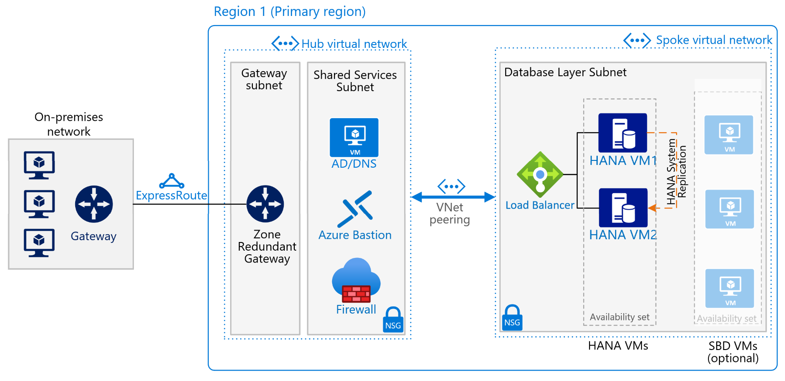
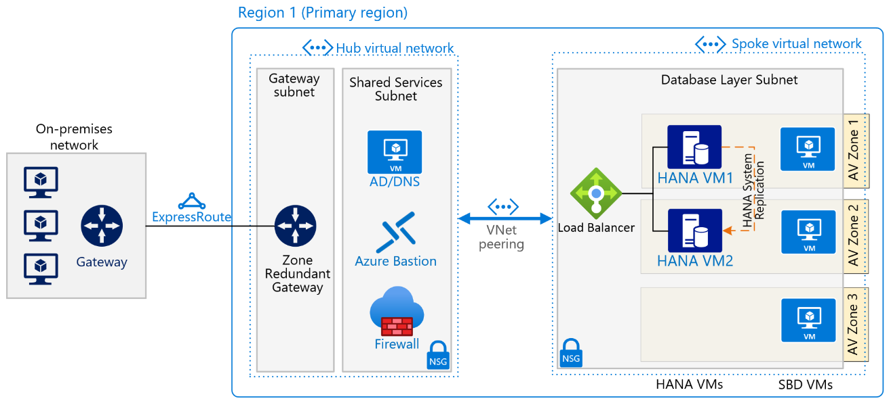
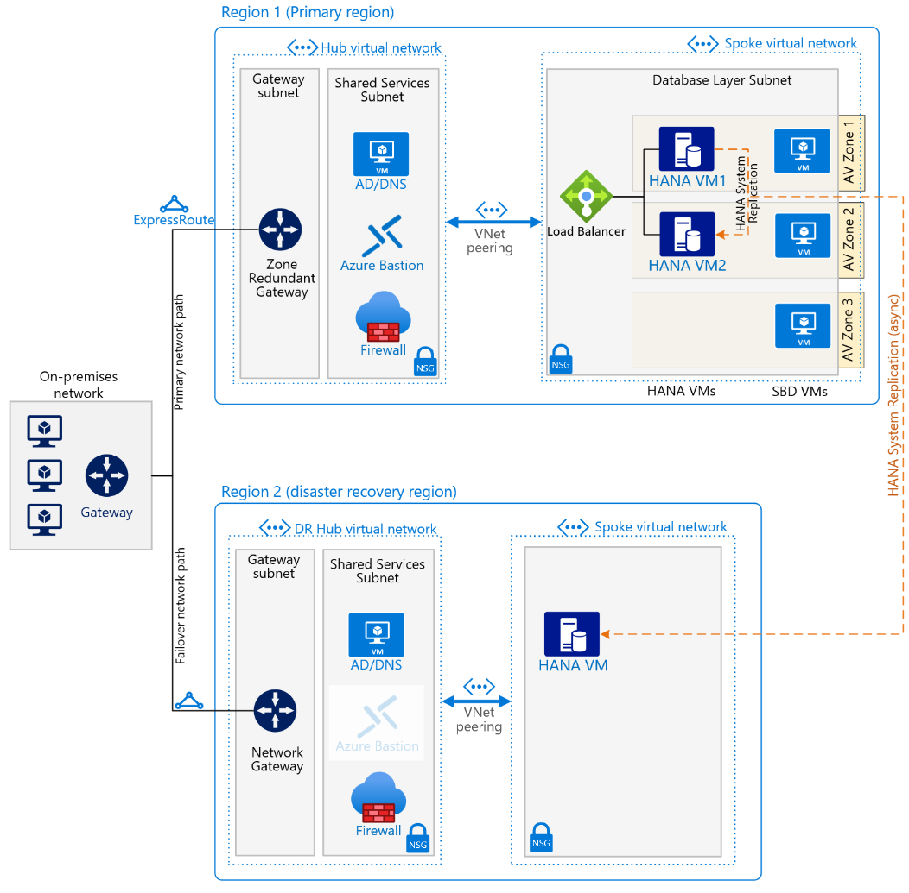

This reference architecture shows a set of proven practices for running SAP HANA in a highly available, scale-up environment that supports disaster recovery on Azure. This implementation focuses on the database layer only.

## Architecture

This reference architecture describes a common production system. You can choose the virtual machine sizes to accommodate your organization's needs. This configuration can also be reduced to one virtual machine, depending on business requirements.

The first diagram shows a reference architecture for SAP HANA in Azure, which utilizes availability sets.

*Figure - The architecture of a production HANA environment, in Azure with availability set.*

The second diagram shows a reference architecture for SAP HANA in Azure, which utilizes availability zones.

*Figure - The architecture of a production HANA environment, in Azure with availability zone.*

_Download a [Visio file](https://arch-center.azureedge.net/sap-hana-architecture.vsdx) of this architecture, containing all versions including disaster recovery._

> [!NOTE]
> To deploy this reference architecture, you need the appropriate licensing of SAP products and other non-Microsoft technologies.

### Workflow

This reference architecture describes a typical SAP HANA database running in Azure, in a highly available deployment to maximize system availability. The architecture and its components can be customized based on business requirements (RTO, RPO, uptime expectations, system role) and potentially reduced to a single VM. The network layout is simplified to demonstrate the architectural principals of such SAP environment and not intended to describe a full enterprise network.

#### Networking

**Virtual networks (VNet)** The [Azure Virtual Network](/azure/virtual-network/virtual-networks-overview) service connects Azure resources to each other with enhanced security. In this architecture, the virtual network connects to an on-premises environment via an ExpressRoute gateway deployed in the hub of a [hub-spoke topology](../../reference-architectures/hybrid-networking/hub-spoke.yml). SAP HANA database is contained in own spoke virtual network. The spoke virtual networks contains one subnet for the database virtual machines (VMs).

If applications connecting to SAP HANA are running on VMs, the application VMs should be located in same VNet but within a dedicated application subnet. Alternatively, if SAP HANA connection isn't the primary database, the application VMs can be located in other VNets. Separating into subnets by workload allows easier enablement of network security groups (NSG) to set security rules applicable to SAP HANA VMs only.

**Zone-redundant gateway** A gateway connects distinct networks, extending your on-premises network to the Azure virtual network. We recommend that you use [ExpressRoute](../../reference-architectures/hybrid-networking/expressroute.yml) to create private connections that don't go over the public internet. You can also use a [site-to-site](../../reference-architectures/hybrid-networking/expressroute.yml) connection. Azure ExpressRoute or VPN gateways can be deployed across zones to guard against zone failures. See [Zone-redundant virtual network gateways](/azure/vpn-gateway/about-zone-redundant-vnet-gateways) to understand the differences between a zonal deployment and a zone-redundant deployment.  The IP addresses used need to be of Standard SKU for a zone deployment of the gateways.

**Network security groups (NSG)**  To restrict incoming and outgoing network traffic of the virtual network, create [network security groups](/azure/virtual-network/tutorial-filter-network-traffic-cli) which are in turn assigned to specific subnets. DB and application subnets are secured with workload specific NSGs.

**Application security groups (ASG)** To define fine-grained network security policies inside your NSGs based on workloads that are centered on applications, use [application security groups](/azure/virtual-network/security-overview) instead of explicit IP addresses. They let you group network interfaces of VMs by name and help you secure applications by filtering traffic from trusted segments of your network.

**Network interface cards (NICs)** Network interface cards enable all communication among virtual machines on a virtual network. Traditional on-premises SAP deployments implement multiple NICs per machine to segregate administrative traffic from business traffic.

On Azure it's not necessary to use multiple NICs for performance reasons. Multiple NICs share the same network throughput limit of a VM. But if your organization needs to segregate traffic, you can deploy multiple NICs per VM and connect each NIC to a different subnet. You can then use network security groups to enforce different access control policies on each subnet.

Azure NICs support multiple IPs. This support conforms with the SAP recommended practice of using virtual host names for installations. For a complete outline, see [SAP note 962955](https://launchpad.support.sap.com/#/notes/962955). (To access SAP notes, you need an SAP Service Marketplace account.)

> [!NOTE]
> As specified in [SAP Note 2731110](https://launchpad.support.sap.com/#/notes/2731110), do not place any network virtual appliance (NVA) in between the application and the database layers for any SAP application stack. Doing so introduces significant data packets processing time and unacceptably slows application performance.

#### Virtual Machines

This architecture uses virtual machines (VM). Azure offers single-node scale up to 23.5 Tebibyte (TiB) memory on virtual machines. The [SAP Certified and Supported SAP HANA Hardware Directory](https://www.sap.com/dmc/exp/2014-09-02-hana-hardware/enEN/#/solutions?id=s:2494&filters=ve:24) lists the virtual machines that are certified for the SAP HANA database. For details about SAP support for virtual machine types and throughput metrics (SAPS), see [SAP Note 1928533 - SAP Applications on Microsoft Azure: Supported Products and Azure VM types](https://launchpad.support.sap.com/#/notes/1928533). (To access this and other SAP notes, an SAP Service Marketplace account is required.)

Microsoft and SAP jointly certify a range of virtual machine sizes for SAP HANA workloads. For example, smaller deployments can run on an [Edsv4](/azure/virtual-machines/edv4-edsv4-series) and [E(d)sv5](/azure/virtual-machines/edv5-edsv5-series) virtual machine starting with 160 GiB of RAM. To support the largest SAP HANA memory sizes on virtual machines—up to 11.5 TB—you can use the [Azure M-series v2](/azure/virtual-machines/mv2-series) (Mv2) virtual machines. The M208 virtual machine types achieve approximately 260,000 SAPS, and the M416 virtual machine types achieve approximately 488,000 SAPS.

**Generation 2 (Gen2) virtual machines** Azure offers the choice when deploying VMs if they should be generation 1 or 2. [Generation 2 VMs](/azure/virtual-machines/generation-2) support key features that aren't available for generation 1 VMs. Particularly for SAP HANA this is of importance since some VM families such as [Mv2](/azure/virtual-machines/mv2-series) or [Mdsv2](/azure/virtual-machines/msv2-mdsv2-series) are **only** supported as Gen2 VMs. Similarly, SAP on Azure certification for some newer VMs might require them to be only Gen2 for full support, even if Azure allows both on them. See details in [SAP Note 1928533 - SAP Applications on Microsoft Azure: Supported Products and Azure VM types](https://launchpad.support.sap.com/#/notes/1928533).

Since all other VMs supporting SAP HANA allow the choice of either Gen2 only or Gen1+2 selectively, it's recommended to deploy all SAP VMs as Gen2 only. This applies also to VMs with low memory requirements. Even the smallest 160 GiB SAP HANA VM can run as Gen2 VM and can be, when deallocated, be resized to the largest VM available in your region and subscription.

**Proximity Placement Groups (PPG)** To optimize network latency, you can use [proximity placement groups](/azure/virtual-machines/workloads/sap/sap-proximity-placement-scenarios), which favor collocation, meaning that virtual machines are in the same datacenter to minimize latency between SAP HANA and connecting application VMs. For SAP HANA architecture itself, no PPGs are needed, they're only an option colocating SAP HANA with application tier VMs. Due to potential restrictions with PPGs, adding the database AvSet to the SAP system's PPG should be done sparsely and **only when required** for latency between SAP application and database traffic. For more information on the usage scenarios of PPGs, see the linked documentation. As PPGs restrict workloads to a single datacenter, a PPG can't span multiple availability zones.

### Components

* [Azure Virtual Network](https://azure.microsoft.com/services/virtual-network)
* [Azure ExpressRoute](https://azure.microsoft.com/services/expressroute)
* [Azure Virtual Machines](https://azure.microsoft.com/en-us/services/virtual-machines)
* [Azure NetApp Files](https://azure.microsoft.com/en-us/services/netapp)
* [Azure Load Balancer](https://azure.microsoft.com/services/load-balancer)
* [Azure Disk Storage](https://azure.microsoft.com/services/storage/disks)

## Considerations

### Scalability

This architecture runs SAP HANA on virtual machines that can scale up to 11.5 TiB in one instance.

If your workload exceeds the maximum virtual machine size, Microsoft offers [Azure Large Instances](/azure/virtual-machines/workloads/sap/hana-overview-architecture) for SAP HANA. Rev. 4 of these physical servers is located in an Azure datacenter. Currently, it provides up to 24 TB of memory capacity for a single instance.

A multi-node configuration is also possible. For online transaction processing (OLTP) applications, it has a total memory capacity of up to 48 TB. With online analytical processing (OLAP) applications, the memory capacity is 96 TB. For example, you can deploy SAP HANA in a scale-out configuration with standby on virtual machines—running either [Red Hat Enterprise Linux](/azure/virtual-machines/workloads/sap/sap-hana-scale-out-standby-netapp-files-rhel) or [SUSE Linux Enterprise Server](/azure/virtual-machines/workloads/sap/sap-hana-scale-out-standby-netapp-files-suse)—using [Azure NetApp Files](/azure/azure-netapp-files/azure-netapp-files-introduction/) for the shared storage volumes.

### Storage

This architecture uses [Azure managed disks](/azure/virtual-machines/windows/managed-disks-overview) for storage on the virtual machines or Azure NetApp Files. Guidelines for storage deployment with managed disks are in detail within the [SAP HANA Azure virtual machine storage configurations document](/azure/virtual-machines/workloads/sap/hana-vm-operations-storage). Alternatively to managed disks, [Azure NetApp Files NFS](/azure/virtual-machines/workloads/sap/hana-vm-operations-netapp) volumes can be used as storage solution for SAP HANA.

To achieve high input/output operations per second (IOPS) and disk storage throughput, the common practices in storage volume [performance optimization](/azure/virtual-machines/linux/premium-storage-performance) also apply to Azure storage layout. For example, combining multiple disks together with LVM to create a striped disk volume improves IO performance. Azure disk caching also plays a large role in achieving required IO performance. For SAP HANA log disks, [write-accelerated disks](/azure/virtual-machines/how-to-enable-write-accelerator) (on M-series VMs) or [ultra-disks](/azure/virtual-machines/disks-enable-ultra-ssd) (on either M/E-series VMs) or [Azure NetApp Files](/azure/azure-netapp-files/) (on either M/E-series VMs) are required for areas holding /hana/log for production usage, in order to consistently achieve the required less than 1 ms storage latency.

For details about SAP HANA performance requirements, see [SAP Note 1943937 - Hardware Configuration Check Tool](https://launchpad.support.sap.com/#/notes/1943937).

- **Cost-conscious storage design for non-productive systems** SAP HANA environments, which do not require maximum storage performance in all situations, can use a storage architecture more optimized on cost. This can apply to little used production systems or some non-productive SAP HANA environments. The cost optimized storage uses a combination of Standard SSDs instead of all Premium or Ultra SSDs used for production, and also combining /hana/data and /hana/log filesystems onto same set of disks. [Guideline and best practices](/azure/virtual-machines/workloads/sap/hana-vm-operations-storage#cost-conscious-solution-with-azure-premium-storage) for most VM sizes are available. If using Azure NetApp Files for SAP HANA, size-reduced volumes could be used to achieve the same goal.
- **Resizing storage when scaling-up** When resizing the virtual machine due to changed business demands, or due to a growing database size, the storage configuration can change. Azure supports online disk expansion, without any interruption to service. With a striped disk setup, as used for SAP HANA, a resize operation should be done equally to all disks in the volume group. The addition of more disks to a volume group can potentially unbalance the striped data. If adding more disks to a storage configuration, it's far preferable to create a new storage volume on new disks. Next copy the contents during downtime and modify mountpoints. Lastly discard the no longer needed old volume group and underlying disks.
- **NetApp application volume group (preview)** For deployments with SAP HANA files contained on Azure NetApp Files NFS volumes, application volume groups enable you to deploy all volumes according to best practices. This process also ensures optimal performance for your SAP HANA database. [Details are available](/azure/azure-netapp-files/application-volume-group-introduction) about how to proceed with this process as it does require manual intervention allow some time for the creation.

### High Availability

The above architecture depicts a highly available deployment, with SAP HANA contained on 2 or more virtual machines. Following components are used.

**Load Balancers**  [Azure Load Balancer](/azure/load-balancer/load-balancer-overview) is used to distribute traffic to SAP HANA virtual machine. When you incorporate Azure Load Balancer in a zonal deployment of SAP, make sure you select the Standard SKU load balancer because the Basic SKU balancer doesn't come with zonal redundancy. Load Balancer in this architecture acts as the virtual IP address for the SAP HANA and network traffic is sent to the active VM where the primary database instance runs. SAP HANA active/read-enabled architecture is available ([SLES](/azure/virtual-machines/workloads/sap/sap-hana-high-availability#configure-hana-activeread-enabled-system-replication-in-pacemaker-cluster)/[RHEL](/azure/virtual-machines/workloads/sap/sap-hana-high-availability-rhel#configure-hana-activeread-enabled-system-replication-in-pacemaker-cluster)) where a second virtual IP addressed on the load balancer is used to direct network traffic to the secondary SAP HANA instance on other VM for read-intense workloads.

The Standard Load Balancer is secure by default, and no virtual machines behind the Standard Load Balancer will have outbound internet connectivity. To enable outbound internet in the virtual machines, you must consider your [Standard Load Balancer](/azure/virtual-machines/workloads/sap/high-availability-guide-standard-load-balancer-outbound-connections) configuration. 

For SAP HANA database clusters, you must enable Direct Server Return (DSR), also known as Floating IP. This feature allows the server to respond to the IP address of the load balancer front end. This direct connection keeps the load balancer from becoming the bottleneck in the path of data transmission.

**Availability sets** Availability sets distribute servers through the Azure physical infrastructure, to spread them through different failure and update domains to improve service availability. To meet service-level agreements ([SLAs](https://azure.microsoft.com/support/legal/sla/virtual-machines)), put virtual machines that perform the same role into an availability set. Doing so helps guard against both planned and unplanned downtime by Azure infrastructure maintenance or caused by hardware faults. To get a higher SLA, you need to have 2 or more virtual machines per availability set.

All virtual machines in a set must perform the same role. Don't mix servers of different roles in the same availability set. 

You can deploy Azure availability sets in [Azure Availability Zones](/azure/virtual-machines/workloads/sap/sap-ha-availability-zones) when you use a [proximity placement group](/azure/virtual-machines/workloads/sap/sap-proximity-placement-scenarios).

**Availability zones** [Availability zones](/azure/availability-zones/az-overview) are physically separated locations within a specific Azure region. Their purpose is to further enhance service availability. Due to their potential geographic and network placement, administrators need a clear network latency profile between all zones of a target region before they can determine the resource placement with minimum inter-zone latency. To create this profile, deploy small virtual machines in each zone for testing. Recommended tools for these tests include [PsPing](/sysinternals/downloads/psping) and [Iperf](https://sourceforge.net/projects/iperf). When the tests are done, remove the virtual machines that you used for testing. As an alternative, there's also an [Azure inter-zone latency check tool](https://github.com/Azure/SAP-on-Azure-Scripts-and-Utilities/tree/main/AvZone-Latency-Test) available for your convenience.

Consider the [decision factors](/azure/virtual-machines/workloads/sap/sap-ha-availability-zones#considerations-for-deploying-across-availability-zones) when deploying VMs between availability zones for SAP. 

**SAP HANA** For high availability, SAP HANA runs on two or more Linux virtual machines. SAP HANA System Replication (HSR) is used to replicate data between the primary and secondary (replica) SAP HANA systems. HSR is also used for cross-region or cross-zone disaster recovery. Depending on latency in the communication between your virtual machines, synchronous replication can be used within a region. HSR between regions for disaster recovery will in most cases be running in asynchronous manner.

For the Linux Pacemaker cluster, a choice is required which cluster fencing mechanism is used. Cluster fencing is a process of isolating a failed VM from the cluster and restarting it. For RedHat Enterprise Linux (RHEL), the only supported fencing mechanism for Pacemaker on Azure is Azure fence agent. For SUSE Linux Enterprise Server (SLES), either Azure fence agent or STONITH block device (SBD) can be used. Compare the failover times for each solution and choose based on your business requirements for recovery time objective (RTO) if there's a  difference.

**Azure fence agent** This fencing method relies on the Azure ARM API, with Pacemaker querying ARM api about the status of both SAP HANA VMs in the cluster. Should one VM fail, for example OS unresponsive or VM crash, the cluster manager uses again the ARM api to restart the VM and if needed fails the SAP HANA database to the other, active node. For this purpose, a service name principal ([SPN](/azure/virtual-machines/workloads/sap/high-availability-guide-suse-pacemaker#create-an-azure-fence-agent-stonith-device)) with a custom role to query and restart VMs is used to authorize against the ARM api. No other infrastructure is needed, the SBD VMs in the architecture drawings aren't deployed in case Azure fence agent is used.

**SBD** STONITH block device (SBD) uses a disk that is accessed as block device (raw, without filesystem) by the cluster manager. This disk, or disks if multiple, acts as a vote. Each of the two cluster nodes running SAP HANA accesses the SDB disks and reads/writes periodically to them small bits of information about status. Thus each cluster node knows the status about the other without depending only on networking between the VMs.

Preferably three small VMs are deployed in either an availability set or availability zone setup. Each VM exporting small parts of a disk as a block device which is accessed by the two SAP HANA cluster nodes. Three SBD VMs ensure sufficient voting members are available in case of planned or unplanned downtime for either SBD VM.

Alternatively to using SBD VMs, [Azure shared disk](/azure/virtual-machines/disks-shared) can be used instead. The SAP HANA cluster nodes then [access the single shared disk](/azure/virtual-machines/workloads/sap/high-availability-guide-suse-pacemaker#use-an-sbd-device). The shared disk can be locally ([LRS](/azure/storage/common/storage-redundancy#locally-redundant-storage)) or zonally ([ZRS](/azure/storage/common/storage-redundancy#zone-redundant-storage)) redundant, if ZRS is available in your Azure region.

### Disaster recovery

*Figure - The architecture of a production HANA environment, in Azure with availability zone, with disaster recovery.*

In this architecture, HSR is used for database replication to a database instance in the secondary region. It's optional to use a cluster in the secondary region, but doing so can improve SAP HANA availability after a disaster recovery failover.

In addition to a local, two-node high availability implementation, HSR supports [multi-tier](https://help.sap.com/viewer/6b94445c94ae495c83a19646e7c3fd56/2.0.05/en-US/ca6f4c62c45b4c85a109c7faf62881fc.html) and [multitarget](https://help.sap.com/viewer/6b94445c94ae495c83a19646e7c3fd56/2.0.05/en-US/ba457510958241889a459e606bbcf3d3.html) replication. HSR thus allows for inter-zone and inter-region replication. Multitarget replication is available for SAP HANA 2.0 SPS 03 and later.

Triggering a disaster recovery failover is a manual process. However you can utilize recovery plans with customized [deployment scripts](/azure/site-recovery/site-recovery-runbook-automation) to automate many steps of the failover.

**Azure Site Recovery** You can use [Azure Site Recovery](/azure/site-recovery/site-recovery-sap) to automatically replicate your production configuration in a secondary location. While this wouldn't be your database VM since they're protected by HSR, any other VMs of your application tier can be handled by Azure Site Recovery. To extend your recovery plans, you can use customized [deployment scripts](/azure/site-recovery/site-recovery-runbook-automation). An example of the custom Site Recovery Automation Runbooks script is available on [GitHub](https://github.com/Azure/azure-quickstart-templates/tree/master/demos/asr-automation-recovery).

Make sure to verify your target region's [resource capacity](/azure/site-recovery/azure-to-azure-common-questions#capacity).

**Azure NetApp Files** As an option, [Azure NetApp Files](/azure/virtual-machines/workloads/sap/hana-vm-operations-storage) can be used to provide a scalable and high-performance storage solution for SAP HANA data and log files. Azure NetApp Files supports snapshots for fast backup, recovery, and local replication. For cross-region content replication, Azure NetApp Files Cross-Region Replication can be used to replicate the snapshot data between two regions. [Details](/azure/azure-netapp-files/cross-region-replication-introduction) about cross-region replication and a [whitepaper](https://docs.netapp.com/us-en/netapp-solutions-sap/pdfs/sidebar/SAP_HANA_Disaster_Recovery_with_Azure_NetApp_Files.pdf) describing all aspects for disaster recovery with Azure NetApp Files are available.

### Backup

SAP HANA data can be backed up in many ways. After migrating to Azure, you can continue to use any existing partner backup solutions you already have. Azure provides two native approaches: [SAP HANA file-level backup](/azure/virtual-machines/workloads/sap/sap-hana-backup-file-level) and Azure Backup for SAP HANA over the Backint interface.

For SAP HANA file-level backup, you can use your tool of choice, such as hdbsql or SAP HANA Studio, and store the backup files on a local disk volume. A common mount point for this backup volume is /hana/backup. Your backup policies will define the data retention period on the volume. As soon as the backup is taken, a scheduled task should copy the backup files to Azure Blob storage for safekeeping. The local backup files are kept for expedient recovery.

Azure Backup offers a simple, enterprise-grade solution for workloads running on virtual machines. [Azure Backup for SAP HANA](/azure/virtual-machines/workloads/sap/sap-hana-backup-guide) provides full integration with the SAP HANA backup catalog and guarantees database-consistent, full, or point-in-time recoveries. Azure Backup is [BackInt-certified](https://launchpad.support.sap.com/#/notes/2031547) by SAP. See also the [Azure Backup FAQ](/azure/backup/backup-azure-backup-faq) and [support matrix](/azure/backup/sap-hana-backup-support-matrix).

**Azure NetApp Files** brings support for snapshot based backups. Integrating with SAP HANA for application consistent snapshots is through the Azure Application Consistent Snapshot tool ([AzAcSnap](/azure/azure-netapp-files/azacsnap-introduction)). The snapshots created can be used for restore to a new volume for system restore or copying the SAP HANA database. Snapshots created can be used for disaster recovery, where it acts as restore point with SAP HANA logs saved on a different NFS volume.

### Monitoring

To monitor your workloads on Azure, [Azure Monitor](/azure/azure-monitor/overview) lets you comprehensively collect, analyze, and act on telemetry from your cloud and on-premises environments.

To provide SAP-based monitoring of supported Azure infrastructure and databases, Azure Monitor for SAP Solutions (preview) is being used. [Azure Monitor for SAP Solutions](/azure/virtual-machines/workloads/sap/azure-monitor-overview) provides a simple setup experience. The customer can collect telemetry data from Azure resources. They can then correlate data to various monitoring KPIs and use data to help with troubleshooting.

To provide SAP-based monitoring of resources and service performance of the SAP infrastructure, the [Azure SAP Enhanced Monitoring](/azure/virtual-machines/workloads/sap/vm-extension-for-sap) Extension is used. This extension feeds Azure monitoring statistics into the SAP application for operating system monitoring and DBA Cockpit functions. SAP enhanced monitoring is a mandatory prerequisite for running SAP on Azure. For details, see [SAP Note 2191498](https://launchpad.support.sap.com/#/notes/2191498), "SAP on Linux with Azure: Enhanced Monitoring."

### Security

Many security measures are used to protect the confidentiality, integrity, and availability of an SAP landscape. To secure user access, for example, SAP has its own User Management Engine (UME) to control role-based access and authorization within the SAP application and databases. For more information, see [SAP HANA Security—An Overview](https://www.tutorialspoint.com/sap_hana/sap_hana_security_overview.htm).

For data at rest, different encryption functionalities provide security as follows:

- Along with the SAP HANA native encryption technology, consider using an encryption solution from a partner that supports customer-managed keys.

- To encrypt virtual machine disks, you can use functionalities described in [Disk Encryption Overview](/azure/virtual-machines/disk-encryption-overview). 
- SAP Database servers: Use Transparent Data Encryption offered by the DBMS provider (for example, *SAP HANA native encryption technology*) to secure your data and log files and to ensure the backups are also encrypted.
- Data in Azure physical storage (Server-Side Encryption) is automatically encrypted at rest with an Azure managed key. You also can choose a customer managed key (CMK) instead of the Azure managed key.
- For support of Azure Disk Encryption on particular Linux distros/version/images check [Azure Disk Encryption for Linux VMs](/azure/virtual-machines/linux/disk-encryption-overview).

> [!NOTE]
> Do not combine SAP HANA native encryption technology with Azure Disk Encryption or Host Based Encryption on the same storage volume. Also, operating system boot disks for Linux virtual machines do not support Azure Disk Encryption. Instead when using SAP HANA native encryption combine it with Server-Side Encryption which is automatically enabled. Be aware that the usage of customer managed keys might impact storage throughput.

For network security, use network security groups (NSGs) and Azure Firewall or a network virtual appliance as follows:

- Use [NSGs](/azure/virtual-network/network-security-groups-overview) to protect and control traffic between subnets and application/database layers. Only apply NSGs to subnets. NSGs applied to both NIC and subnet very often lead to problems during troubleshooting and should be used rarely if ever.

- Use [Azure Firewall](/azure/firewall/overview) or Azure network virtual appliance to inspect and control the routing of traffic from the hub virtual network to the spoke virtual network where your SAP applications are, and also to control your outbound internet connectivity.

For User and Authorization, implement role-based access control (RBAC) and resource locks as follows:

- Follow the least privilege principle, using [RBAC](/azure/role-based-access-control/overview) for assigning administrative privileges at IaaS-level resources that host your SAP solution on Azure. Basically, the main purpose of RBAC is segregation and control of duties for your users/group. RBAC is designed to grant only the amount of access to resources that's needed for users to do their jobs.

- Use [resource locks](/azure/azure-resource-manager/management/lock-resources) to avoid risk that's accidental or which might be caused by malicious intention. Resource locks prevent scenarios in which an administrator may delete or modify critical Azure resources where your SAP solution is.

More security recommendations can be found at theses [Microsoft](https://azure.microsoft.com/blog/sap-on-azure-architecture-designing-for-security/) and [SAP](https://blogs.sap.com/2019/07/21/sap-security-operations-on-azure/) articles.

## Communities

Communities can answer questions and help you set up a successful deployment. Consider the following communities:

- [Azure Community Support](https://azure.microsoft.com/support/forums/)
- [SAP Community](https://www.sap.com/community.html)
- [Stack Overflow SAP](http://stackoverflow.com/tags/sap/info)

## Contributors

*This article is maintained by Microsoft. It was originally written by the following contributors.* 

Principal author:

 - [Robert Biro](https://www.linkedin.com/in/robert-biro-38991927/) | Senior Architect
 
*To see non-public LinkedIn profiles, sign in to LinkedIn.*

## Next steps

Learn more about the component technologies:

- [What is Azure ExpressRoute?](/azure/expressroute/expressroute-introduction)
- [What is Azure Bastion?](/azure/bastion/bastion-overview)
- [What is Power BI?](/power-bi/fundamentals/power-bi-overview)
- [Use the SAP Business Warehouse connector in Power BI Desktop](/power-bi/connect-data/desktop-sap-bw-connector)
- [SAP workload configurations with Azure Availability Zones](/azure/virtual-machines/workloads/sap/sap-ha-availability-zones)
- [What is the Azure Backup service?](/azure/backup/backup-overview)
- [About Site Recovery](/azure/site-recovery/site-recovery-overview)
- [What is Azure Load Balancer?](/azure/load-balancer/load-balancer-overview)
- [Connect to SAP HANA databases in Power BI](/power-bi/connect-data/desktop-sap-hana)
- [What is Azure NetApp Files](/azure/azure-netapp-files/azure-netapp-files-introduction)
- [Introduction to Azure managed disks](/azure/virtual-machines/managed-disks-overview)
- [Linux virtual machines in Azure](/azure/virtual-machines/linux/overview)
- [Installation of SAP HANA on Azure virtual machines](/azure/virtual-machines/workloads/sap/hana-get-started)
- [What is Azure Virtual Network?](/azure/virtual-network/virtual-networks-overview)
- [Network security groups](/azure/virtual-network/network-security-groups-overview)
- [SAP HANA Disaster Recovery with Azure NetApp Files](https://docs.netapp.com/us-en/netapp-solutions-sap/pdfs/sidebar/SAP_HANA_Disaster_Recovery_with_Azure_NetApp_Files.pdf)

## Related resources

Explore related architectures:

- [Run a Linux VM on Azure](../n-tier/linux-vm.yml)
- [Run SAP BW/4HANA with Linux virtual machines on Azure](./run-sap-bw4hana-with-linux-virtual-machines.yml)
- [SAP S/4HANA in Linux on Azure](/azure/architecture/guide/sap/sap-s4hana)
- [SAP on Azure Architecture Guide](./sap-overview.yml)
